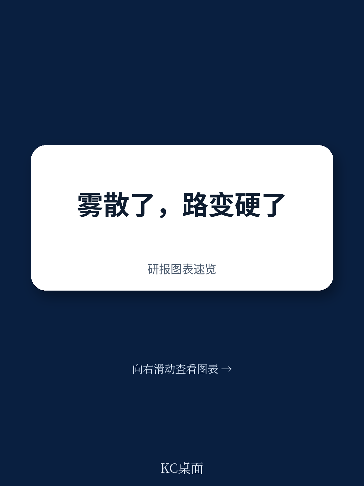

# 麦肯锡：私募股权已经驶入更硬的地面，不是所有车都能开过去

2025年，全球私募股权市场的交易总价值突破1万亿美元，创下历史新高。单笔超过5亿美元的大型交易激增44%，史上最大一笔PE私有化交易——550亿美元收购Electronic Arts——在这一年落地。退出端同样火爆，IPO退出交易量几乎翻倍。

但这份麦肯锡《2026全球私募市场报告》给出的核心判断，与这些数字传递的乐观情绪截然不同：**雾散了，但地面变硬了。** 过去几年被视作“周期性调整”的种种困难——交易数量下降、持有期拉长、回报率低迷、LP流动性枯竭——正在成为这个行业的结构性特征。2025年的交易额反弹，更像是暴风雨后的一次集中释放，而非趋势反转。

对于GP和LP而言，真正的考验才刚刚开始。当廉价杠杆和多重扩张不再提供免费推力，当超过16000家公司被持有超过四年、历史最高，当DPI占AUM的比例跌至10%的历史最低点——私募股权已经从一个靠“上车”就能赚钱的行业，变成了一个需要真正驾驶技术的赛场。

这份报告的价值，不在于它描述了2025年发生了什么，而在于它提供了一个清晰的判断框架：什么样的GP能在新地形上继续前进，什么样的GP注定要掉队。

> **KC评论：** 麦肯锡的这份报告是2026年全球私募市场最值得精读的年度文件之一。它不只是数据堆砌，而是提供了一个完整的分析框架：从交易、运营、融资到LP分配，每个环节都给出了可操作的方向。但单篇报告只能覆盖顶层逻辑，每天的国际信源汇编会把当天全球投行、咨询公司和国际机构的报告整理成中文摘要、KC评论和图表合集，适合喂给AI追问，也适合人工快速扫描市场变化。扫码加入知识星球，每天获取一手国际信源。

## 1. 2025年的交易狂欢掩盖了一个事实：交易数量在下降，竞争在加剧

2025年全球PE交易总额增长17%，其中大型交易（超过5亿美元）增长44%，达到1万亿美元以上。这是表面最亮眼的数据。

但报告揭示了一个被忽视的真相：**所有规模的并购交易数量下降了5%**，北美下降7%，欧洲下降4%，亚太下降3%。交易额增长而数量下降，意味着单笔交易规模在扩大，头部交易在集中，但中尾部交易在萎缩。

更值得警惕的是，2025年的交易额增长很大程度上是由“存量释放”驱动的——那些被压抑了三年的交易在利率预期稳定后集中落地。这不是新需求的爆发，而是旧积压的释放。报告指出，超过16000家公司被持有超过四年，占总库存的52%，创历史新高。这意味着GP手中的“待售资产”从未如此庞大，但买方的意愿和承接能力并未同步增长。

**对GP的含义：** 交易竞争正在从“谁能找到好标的”转向“谁能在高倍数下依然做出正确的定价判断”。2025年PE收购中位数倍数从11.3倍升至11.8倍，资产从未如此昂贵。在这个环境下，买贵了的代价将比以往任何时候都更大。

## 2. 回报率的分化已经不可逆转：只有真正的“运营阿尔法”能拉开差距

报告给出了一个令人警醒的数字：2025年，全球PE前四分位基金的平均IRR为8%，而同期标普500总回报为18%，MSCI全球指数为22%。PE的绝对回报已经被公开市场大幅超越。

更关键的是，这个差距不是2025年才出现的。报告追溯了2015-2025年的数据：2015-2017年份的基金平均IRR仅约2%，拉低了整个十年的平均回报至6%左右。新年份基金虽然账面IRR达到15%，但大部分尚未实现退出。

**这意味着什么？** 过去十年，PE的超额回报主要来自三个因素：多重扩张、廉价杠杆和低利率环境。麦肯锡的测算显示，2010-2022年间，59%的PE回报来自这些“外部推力”。当利率环境不再友好、公开市场估值已经高企，这些推力正在消失。

报告的判断很清晰：**运营价值创造（operational alpha）正在从“营销叙事”变成“唯一可依赖的回报来源”。** 那些能够通过运营改善、数字化改造、管理层更替等方式真正提升企业价值的GP，将在这个周期中胜出。而那些仍然依赖“买了等着涨”模式的GP，将被迅速淘汰。

> **KC评论：** 这个判断对LP的启示非常直接——过去十年“选赛道”比“选GP”重要，因为大水漫灌，谁都能赚钱。但未来十年，“选GP”的重要性将远超“选赛道”。报告中有一个关键图表显示了LP最关注的指标变化：DPI（已分配收益占实缴资本比）已经和MOIC（投资回报倍数）并列成为第二重要的指标，仅次于IRR。这意味着LP不再只看账面回报，而是更关心“你到底能不能把钱还给我”。这个转变本身，就是行业成熟度的标志。

## 3. 流动性枯竭正在重塑行业格局：第二市场不是补充，而是主战场

报告中最令人不安的一个数字：**DPI占PE总AUM的比例，在截至2025年6月的12个月里仅为6%，而2015-2019年的平均水平是16%。** 五年滚动DPI占AUM的比例跌至约10%，创历史新低。

用更直白的话说：PE行业历史上从未像现在这样，持有这么多资产却返还给LP这么少现金。LP的资金被“锁住”了。

这个流动性困境正在催生一系列结构性变化。2025年，PE二级市场交易量增长48%，融资额增长5%。延续基金（continuation vehicles）和NAV贷款正在从“小众工具”变成“主流配置”。麦肯锡明确表示，这些曾经被认为是“临时解决方案”的工具，现在已经成为PE地形的永久特征。

**对LP的含义：** 过去LP投资PE的逻辑是“用流动性换取超额回报”。但现在，流动性损失可能远超预期，而超额回报却不再确定。LP需要重新评估：你愿意为多长时间的锁定期支付多少溢价？当DPI持续低迷，你的资产配置模型是否还能承受？

**对GP的含义：** 二级市场和延续基金的兴起，意味着GP必须同时管理两种不同的“退出路径”——传统IPO/并购退出的“快车道”，以及通过二级市场/延续基金实现的“慢车道”。后者对GP的资产定价能力、投资者沟通能力和运营管理能力提出了更高要求。

## 4. 报告尚未完全回答的关键问题：AI到底能改变多少？

麦肯锡在报告中多次提及AI，但给出的数据本身就是一个巨大的悬念：**目前只有6%的GP认为AI在内部运营和投资流程中产生了高影响，但70%的GP预计3-5年内AI将产生高影响。**

这个差距本身就是一个信号。报告没有展开的是：AI到底会在哪些环节产生实质性影响？是提高尽调效率、优化投后管理、还是直接改变资产定价模型？报告提到AI可以“增强承销能力、加速运营改善、实现更快更自律的决策”，但缺乏具体的案例和数据支撑。

**这里有一个明显的伏笔：** 如果AI真的能在3-5年内成为PE行业的核心生产力工具，那么那些率先掌握AI能力的GP将获得巨大的结构性优势。但问题在于，AI能力的建设需要大量投入——数据基础设施、人才团队、算法模型——这些投入本身就会进一步拉大头部GP和中小GP之间的差距。

报告没有给出明确答案，但它暗示了一个方向：**AI可能成为PE行业“赢家通吃”的加速器。** 那些已经有规模、有数据、有能力投入的头部GP，将借助AI进一步巩固优势；而中小GP如果不能找到差异化的切入点，可能会被挤出市场。

> **KC评论：** 这个问题的答案，很可能藏在麦肯锡同一系列的其他报告中。比如他们2026年1月发布的《Harnessing the power of gen AI in private markets》，以及2025年11月的《The evolution of neoclouds and their next moves》。这些报告在单篇研报里无法全部展开，但我们的每日国际信源汇编会把它们放在同一天的“主线”里，整理成中文摘要、KC评论和图表合集。这样你既可以喂给AI追问细节，也可以人工快速扫描市场dynamics。扫码加入星球，每天获取一手国际信源。

## 5. 对读者的观察框架：三个问题判断你关注的GP能否穿越周期

基于麦肯锡的分析框架，我们提炼出三个核心问题，可以作为评估GP的观察维度：

**第一，你的GP有没有“运营肌肉”？** 不是口头说“我们重视投后管理”，而是看他们是否真正建立了运营改善的能力团队，是否有可复用的方法论，是否有成功的退出案例。报告明确指出，运营价值创造正在从“营销叙事”变成“核心能力”。那些仍然依赖“买低卖高”模式的GP，在利率正常化的环境下很难持续。

**第二，你的GP有没有“流动性管理能力”？** 在DPI持续低迷的环境下，GP如何管理LP的流动性预期？是否主动使用二级市场、延续基金等工具？是否与LP保持透明沟通？报告显示，LP最关心的指标正在从IRR转向DPI，这意味着GP的流动性管理能力将直接影响LP的配置决策。

**第三，你的GP有没有“AI战略”？** 不是那种“我们正在探索AI”的套话，而是具体到：是否已经在尽调中使用AI辅助分析？是否在投后管理中部署了AI驱动的运营优化工具？是否在投资决策中引入了AI预测模型？如果一家GP在2026年还没有明确的AI路线图，它很可能在3-5年内失去竞争力。

这三个问题，可以帮助LP和GP自身判断：在这条更硬、更陡、更技术的道路上，你的车是否足够好。

---

这份报告还有很多值得深入拆解的内容：房地产从“稳定化”到“选择性加速”的转变、基础设施领域10.6万亿美元的投资缺口、私人信贷从“快速部署”到“精准配置”的转型……每一章都包含关键数据和判断，但受限于篇幅无法一一展开。

如果你对某个细分领域感兴趣，或者想看到更多国际投行、咨询公司和国际机构的每日研报汇编——包括高盛、摩根士丹利、瑞银、花旗、麦肯锡、BCG等——欢迎扫码加入知识星球。每日更新，汇总国际主流叙事、数据和图表，观测边际变化。星球会把单篇报告放回当天的国际信源主线里，整理成中文摘要、KC评论和图表合集，便于喂给AI，也便于人工快速扫描市场dynamics。目前汇聚了头部券商、PE/VC、投行、并购、hedge fund、资管机构、战略咨询、智库等朋友，期待交流。

Personal reading notes and learning share only. Not investment advice.

