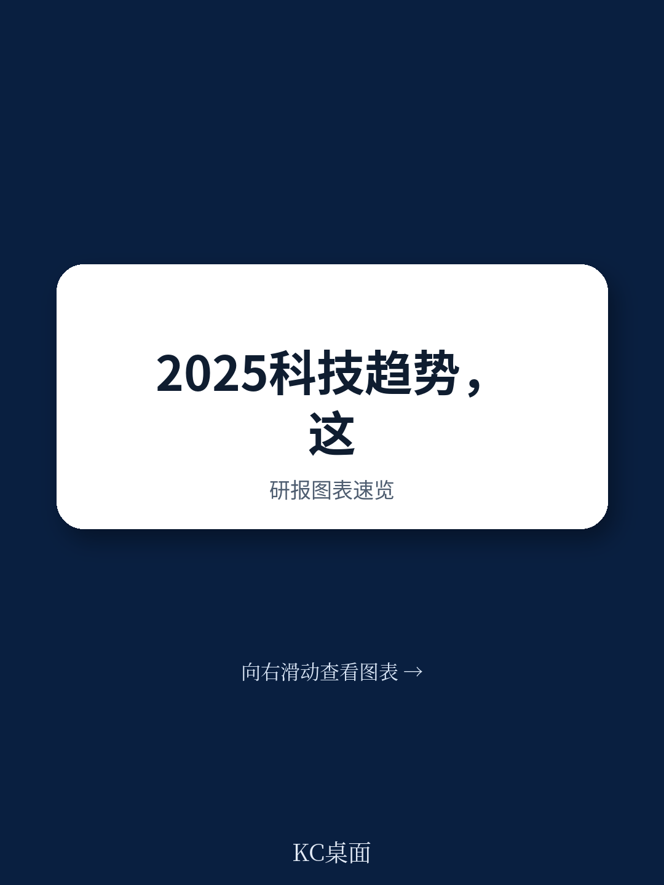
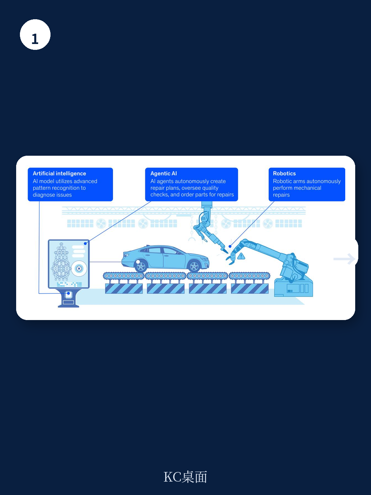
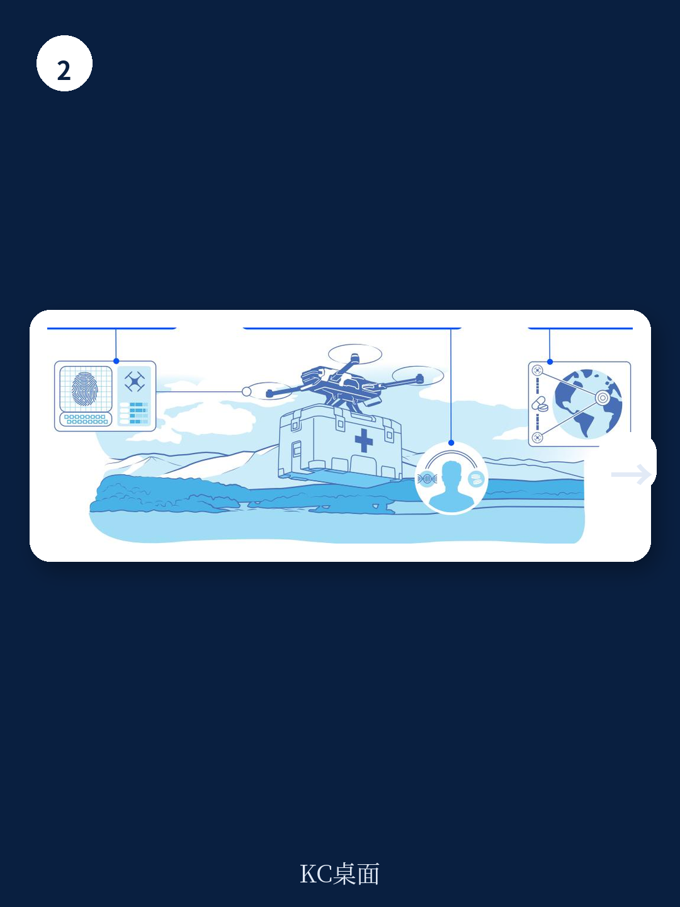

# 麦肯锡：麦肯锡2025技术趋势，AI不是主角，而是激活其他技术的引擎

如果你只打算读一份关于2025年技术趋势的报告，麦肯锡全球研究院（MGI）刚刚发布的第五版年度《技术趋势展望》可能是最值得花时间的一份。它不追逐热点，不制造焦虑，而是用一套严谨的量化框架——专利、研究、新闻、搜索、股权投资、人才需求六个维度——对13项前沿技术做了全景扫描。

这份报告最值得看的判断是什么？不是AI本身有多强，而是AI正在成为其他所有技术的“激活器”。换句话说，2025年的技术叙事不再是一个个孤立的赛道，而是一张由AI串联起来的、相互赋能的网络。工厂里的机械臂、医院里的个性化药物、偏远风电场的维护，背后都是AI+机器人、AI+生物工程、AI+沉浸式现实的组合拳。

报告给出了一个清晰的信号：技术投资在经历了2023年的整体回调后，2024年已经出现明显反弹。13个趋势中有10个的股权投资在2024年实现增长。但更值得关注的不是总量，而是结构——哪些技术获得了“超额”关注，哪些技术正在从实验室走向商业场景，以及哪些技术组合正在催生新的商业范式。

以下是这份报告的核心洞察，以及它们对企业决策者的含义。

> **KC评论：** 麦肯锡这份报告的价值不在于告诉你“AI很重要”——这已经是共识。它真正有用的地方，是用数据告诉你：AI正在如何改变其他技术的商业化节奏和投资回报预期。如果你只看AI本身，可能会错过更大的机会——那些被AI激活的、原本增长缓慢但壁垒极高的技术领域。

---

## 1. 最值得关注的不是AI本身，而是“Agentic AI”的爆发式增长

报告首次将“Agentic AI”单独列为一项趋势。这不是概念炒作，而是有数据支撑的。2024年，Agentic AI的股权投资达到11亿美元，虽然绝对规模不大，但增速惊人——相关岗位的招聘需求在2023至2024年间增长了985%。

Agentic AI的本质是什么？它把大语言模型的“理解能力”和“行动能力”结合在一起。传统的AI是回答问题，Agentic AI是执行任务——自主规划、调用工具、完成多步骤工作流。换句话说，它不再是“副驾驶”，而是“虚拟同事”。

这个转变的意义在于：AI的商业模式正在从“卖工具”转向“卖劳动力”。企业不再只是购买一个软件来辅助决策，而是购买一个可以独立完成任务的数字员工。这对人力成本结构、业务流程设计、甚至组织架构都将产生深远影响。

> **KC评论：** 985%的招聘增速意味着什么？意味着市场正在用脚投票。但要注意，Agentic AI目前还处于早期阶段，技术成熟度、安全可控性、与现有系统的集成都是待解问题。报告没有展开的是：当“虚拟同事”开始犯错，责任如何界定？这将是未来两年企业采用Agentic AI时最大的隐形成本。

---

**单篇报告只是一个切片。** 每天的国际信源汇编会把当天国际投行、咨询公司、国际机构报告整理成中文摘要、KC评论和图表合集，适合喂给AI追问，也适合人工快速扫市场变化。如果你希望持续跟踪Agentic AI、应用专用芯片、量子计算等前沿技术的动态，欢迎扫码加入知识星球，每日获取完整信源汇编。

---

## 2. 半导体不再是“摩尔定律”的故事，而是AI驱动的“定制化”叙事

报告另一个值得注意的新趋势是“应用专用半导体”。这不是一个新概念，但麦肯锡的数据显示，相关专利数量出现了显著增长。背后的驱动力很明确：AI训练和推理对算力、内存、网络带宽的需求呈指数级上升，而通用芯片在成本、功耗、散热上的瓶颈越来越明显。

这意味着什么？半导体行业的竞争逻辑正在从“制程竞赛”转向“架构创新”。英伟达的GPU是一个例子，但更广泛的趋势是：越来越多的公司开始设计自己的专用芯片，用于特定的AI工作负载。这不仅是技术问题，更是生态问题——谁掌握了芯片+软件+应用的全栈能力，谁就能在AI时代建立护城河。

报告没有直接点名，但一个清晰的推论是：未来两年，半导体行业的并购和合作将加速。拥有芯片设计能力的小公司会成为大厂的收购目标，而拥有制造能力的代工厂将获得更强的议价权。

---

## 3. 量子计算的热度在上升，但商业落地仍需“再等一个周期”

量子技术是报告中最“反直觉”的一个趋势。一方面，科技巨头近期的技术突破引发了大量关注，新闻和搜索热度明显上升。另一方面，股权投资却相对低迷。这种“叫好不叫座”的局面，反映了市场的一个清醒判断：量子计算在特定领域（如密码学、材料科学）有颠覆性潜力，但距离大规模商业应用还有相当距离。

报告给出的框架是：对于量子技术，企业应该采取“警惕观望”策略——保持跟踪，但不要过早重仓。这个判断与高盛、摩根士丹利等投行的观点一致：量子计算的商用化可能需要5到10年，但关键应用场景（如药物研发、金融风险建模）的早期布局现在就可以开始。

> **KC评论：** 这里有一个容易被忽视的点：量子计算的“威胁”可能比“机会”来得更早。如果量子计算机真的在5年内破解了现有的RSA加密，那么今天所有基于公钥加密的数字资产、通信协议、身份验证系统都将面临重新设计。对于金融机构和科技公司来说，现在开始布局“后量子密码学”不是未雨绸缪，而是生存需求。

---

## 4. 报告尚未完全回答的关键问题：AI的能耗如何解决？

报告提到了一个贯穿多个趋势的挑战：算力需求激增带来的基础设施压力。数据中心的电力消耗、物理网络的脆弱性、供应链延迟、劳动力短缺——这些“脏活”正在成为AI规模化部署的真正瓶颈。

但报告没有深入展开的是：当AI的能源消耗达到一个临界点，它是否会反过来抑制AI本身的采用？目前，一个大型AI模型的训练能耗相当于数百个家庭一年的用电量。如果AI应用继续指数级增长，电网能否承受？这不仅是技术问题，更是政策问题、地缘政治问题。

报告提到了“能源与可持续发展技术”这个趋势，但两者之间的交叉点——即AI如何优化能源系统、能源约束又如何限制AI发展——没有给出足够深度的分析。这可能是下一份报告需要重点解答的问题。

---

## 5. 给企业决策者的观察框架：从“要不要做”到“怎么做”

报告最有价值的部分，不是列出了13个趋势，而是提供了一个思考框架：企业应该如何根据自身行业和竞争地位，选择不同的技术策略——从“警惕观望”到“积极部署”。

这个框架的核心是：不要追求“技术先进性”，而要追求“技术适配性”。一家传统制造业企业，现在最应该关注的不是量子计算，而是AI+机器人+数字孪生的组合。一家金融机构，最应该关注的是Agentic AI在合规、风控、客户服务中的应用，而不是盲目上马大模型。

报告给出了三个具体的组合案例：工厂机器维修（AI+Agentic AI+机器人）、个性化药物递送（生物工程+区块链+自主无人机）、风电场维护（能源技术+沉浸式现实+卫星通信）。这些案例的价值不在于技术本身，而在于展示了“技术组合”的思维方式——未来的竞争优势，来自于把不同技术拼成一张完整的解决方案拼图。

---

## 6. 最后，一个值得持续追问的问题

报告提到了“负责任创新”作为贯穿多个趋势的主题，但没有深入讨论一个现实难题：当AI的决策越来越自主，当机器人的行动越来越独立，当生物工程的边界越来越模糊——谁来为错误买单？现有的法律框架、保险机制、监管体系，是否跟得上技术演化的速度？

这不是一个理论问题。2025年，我们很可能看到第一起由Agentic AI引发的重大商业事故。届时，市场的反应将决定整个行业的发展节奏。对于企业来说，现在就开始建立AI治理框架，不是合规要求，而是风险管理的底线。

---

**更多国际信源汇编和评论，扫码交流，每日更新。** 我们汇总国际主流叙事、数据和图表，观测边际变化。知识星球会把单篇报告放回当天国际投行、咨询公司、国际机构的主线里，整理成中文摘要、KC评论和图表合集，便于喂给AI，也便于人工快速扫市场dynamics。目前已汇聚了头部券商、PE/VC、投行、并购、hedge fund、资管机构、战略咨询、智库等朋友，期待与你交流。

Personal reading notes and learning share only. Not investment advice.

