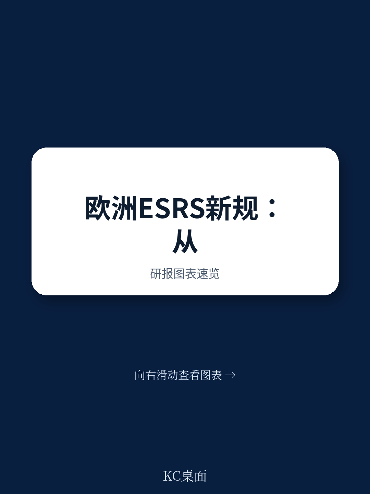

# 波士顿咨询：AI在可持续报告中的承诺与现实，多数企业仍陷低效流程

欧洲企业的可持续报告正站在一个关键转折点上。经历了CSRD指令下的首批强制披露周期后，一个清晰的信号已经浮现：多数公司仍在用“合规应付”的方式做报告，而非将其作为战略工具。波士顿咨询（BCG）在2026年7月发布的最新研究指出，即将生效的ESRS Set 2标准将削减约60%至70%的强制数据点，这为那些准备改变的企业提供了一个重新定义报告模式的窗口期。核心判断是：可持续报告的成本与复杂性正在迫使企业做出选择——要么继续深陷低效流程，要么将其转化为一项真正的战略能力。

## 1. 合规导向的均衡正在制造高成本与低价值

BCG基于欧洲财务报告咨询组（EFRAG）对900余份2025财年报告的分析，识别出了当前市场的主流实践模式。大多数公司披露了大量实质性议题，但这些议题与公司战略目标、具体指标和激励机制之间的关联往往十分松散。报告显示，许多企业的披露议题超过7个，子议题超过16个，但其中只有不到3个议题配有可量化、有时限的目标，更少被嵌入管理层薪酬体系。这种“宽而浅”的披露模式，直接导致了每份报告的页数动辄超过110页，字符数超过35万，而年度合规成本对于大型企业而言已超过100万欧元。结果就是，报告越来越厚，但决策有用性却在下降。

> **KC评论：** 这里的核心矛盾不是“披露不够”，而是“披露太多但缺乏聚焦”。对读者而言，判断一家公司在可持续议题上是否真正认真，不应只看它报告了多少议题，而应看它把哪些议题与业务战略和考核挂钩。BCG的框架提示了一个更务实的观察角度——报告的长度和议题数量，反而可能是战略模糊的信号。

## 2. AI的承诺与现实之间存在结构性落差

在可持续报告领域，AI被广泛宣传为效率提升的关键。BCG的研究梳理了从数据收集、验证到报告生成的多个潜在应用场景。但通过与报告编制团队的深入交流，他们发现了一个显著落差：期望在快速上升，但实际部署仍然有限且影响甚微。许多AI应用未能实现预期的效率提升或质量改善。原因集中在四个方面：用例与报告流程中的具体痛点匹配不足；数据治理薄弱导致模型效果受限；实施过程未能融入整体工作流，形成孤立的试点；组织能力——包括技能、流程和信任度——滞后于技术野心。目前，AI在可持续报告中的贡献更多停留在边际实验层面，尚未实现规模化转型。

> **KC评论：** 这个判断对任何正在考虑引入AI工具的企业都是一个务实提醒。BCG没有否定AI的潜力，但明确指出，在数据基础和流程设计没有理顺之前，AI只能解决局部问题，无法带来系统性的效率提升。完整报告中关于如何将AI融入端到端流程的“三步走”框架，值得仔细阅读。

## 3. 报告尚未完全回答的关键问题：从合规到战略的路径有多宽？

BCG提出的“智慧合规”模型在逻辑上非常清晰：从双重要性评估入手，重新建立披露与战略优先级的联系；设计端到端的报告流程；通过AI、治理和组织能力来支撑规模化。但报告本身也承认，这一转变能否真正落地，仍面临几个未完全展开的挑战。首先，双重要性评估中的“自上而下”视角，要求管理层对业务战略有足够清晰的判断，而在许多公司，战略本身可能正在演化中。其次，流程再造需要跨职能的深度协同——可持续、财务、不确定性、IT和法律团队必须打破壁垒，这在组织惯性强的企业中难度极高。最后，AI的规模化应用依赖于可靠的数据基础设施，而许多公司的数据治理成熟度尚不足以支撑。这些结构性障碍意味着，即便方向正确，执行过程中的折衷和延迟几乎是必然的。

## 4. 给读者的观察框架：如何判断一家公司是否真正在转变

基于BCG的研究，可以建立一个更简洁的观察框架。在阅读任何一份欧洲企业的可持续报告时，可以重点关注三个信号：第一，报告披露的实质性议题数量是否显著减少，且这些议题是否明确对应到公司的核心业务模式和战略目标；第二，报告中是否有清晰的路径说明，将有限的实质性议题与具体的目标、时间表和激励机制挂钩；第三，报告是否开始体现对AI和自动化工具的系统性整合，而非仅仅作为附录中的技术实验。如果一家公司能够在2026财年的报告中展现出上述三个特征，它很可能已经走在了从合规负担转向战略能力的前沿。反之，如果报告仍然保持“议题全面、目标模糊、流程割裂”的旧模式，那么它可能正在错过这个难得的重置窗口。

完整的波士顿咨询报告、中文摘要以及KC评论与图表合集，会放进当天的国际信源汇编中。适合在更广泛的监管与市场叙事背景下，持续追踪这一主题的演变。

For informational purposes only. Portions may be generated,translated,summarized,or edited with AI assistance based on source materials and may contain omissions or errors. Please verify independently. This is not investment,legal,tax,accounting,or other professional advice.
