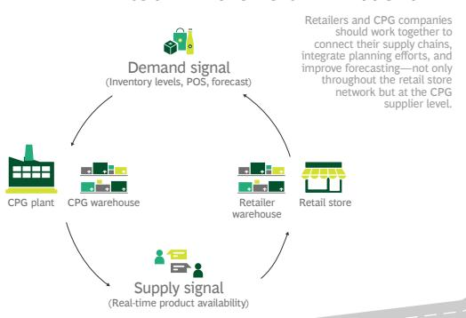
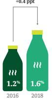
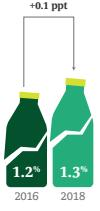
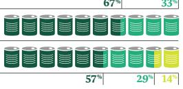

  
Embed an integrated process: Retailers should meet to discuss strategy with CPG representatives—not just from marketing and sales, but from operations too, with discussions going well beyond pricing and promotions.  
SPOILAGE HAS INCREASED ...  
Outbound
DC operations
Inbound  
Cases filled as a percentage of original order

## Creating an Integrated Supply Chain in Retail Grocery

With the ongoing expansion of online retail, consumers want more convenience and a wider selection of fresh products, which have shorter shelf lives—putting more pressure on the entire supply chain. This pressure is pushing retailers' cost and service metrics in the wrong direction and boosting tension between retailers and their CPG suppliers.

But what if they dealt with this pressure by looking at the supply chain together and using digital tools to collaborate?

## A TRUCKING CAPACITY CRUNCH HAS RAISED LOGISTICS COSTS

Growing demand for fresher products means trucks often leave the distribution center (DC) with less than a full truckload—even as drivers are harder to hire.

There's room to improve
outbound freight utilization

Truckload utilization is far lower than inbound
2018 median capacity utilization (by weight)

  
Inbound freight

  
Outbound freight

Fresher products have a shorter shelf life and need to be delivered quickly, but it's not always fast enough. Meanwhile, rush deliveries come with an inevitable rise in shrinkage—that is, breakage and loss.

  
... AND SO HAS SHRINKAGE

## SERVICE LEVELS ARE FALLING AS IT BECOMES HARDER TO GET

PRODUCTS TO THE SHELF ON TIME

Most grocery retailers are now missing internal store service-level targets, as reflected by on-shelf product availability.

Majority of retailers missing service levels...
Actual vs. target performance, 2018 (% respondents)
● Below ● Target ● Above

## RETAILERS AND THEIR CPG SUPPLIERS ARE NOW AT ODDS AS A RESULT

On-time delivery rates have fallen, but CPG suppliers say it's not completely their fault: retail order volatility has risen, order lead times have shortened, and order quantities have shrunk. It's increasingly difficult for them to forecast and meet these mounting service demands.

SERVICE DECLINES PARTIALLY DRIVEN BY REDUCED CPG SERVICE LEVELS

WHAT IS THE KEY CAUSE OF SERVICE LEVEL DECLINES?

  
On-time rate, based on requested arrival date

  
On-time rate, based on scheduled arrival time

44%

Demand forecasting was the most prominent cause cited by CPG companies

Manufacturing reliability was the most prominent cause cited by retailers

## COLLABORATION UNLOCKS IMPROVEMENTS FOR ALL INVOLVED

  
CPG plant

## DIGITAL TECHNOLOGIES SUPPORT COLLABORATION

Retailers and CPG companies should use digital technologies to share more internal and customer information, thereby improving demand forecasting and product allocation.

Most retailers have begun to implement technology that would support collaboration.

<table><tr><td>DIGITAL TECHNOLOGY</td><td>EXAMPLES OF POTENTIAL COLLABORATION OPPORTUNITIES</td><td>PENETRATION AMONG RETAILERS</td></tr><tr><td>Cloud-based systems</td><td>Real-time visibility across E2E supply chain to manage inventory and purchasing decisions</td><td></td></tr><tr><td>Big data</td><td>Ability to forecast consumer demand and manage supply chain decisions, thereby optimizing costs</td><td></td></tr><tr><td>Robotic process automation</td><td>Enhanced decision making through process automation (e.g., inventory-level alerts, thresholds)</td><td></td></tr><tr><td>Internet of things (IoT)</td><td>Ability to track and trace products in real time, enabling real-time demand management</td><td></td></tr><tr><td>Augmented reality</td><td>Better alignment with CPG companies on planogramming and product design, helping to optimize assortment and maximize sales and margins</td><td></td></tr><tr><td>AI &amp; machine learning</td><td>Higher forecasting accuracy to manage inventory levels (Including holiday seasons), leading to reduced waste and costs</td><td></td></tr><tr><td>Blockchain</td><td>Increased product journey transparency (from CPG facility to retail stores), thereby developing mutual trust</td><td></td></tr></table>

DEGREE OF (FULLY OPERATIONAL) PENETRATION AMONG RETAILERS

## THE WAY FORWARD

To address these issues, retailers and CPG companies should take four steps to digitize and further integrate their supply chains.

Agree on incentives and goals: Ensure common KPIs and objectives among retailers and CPG companies to address end-to-end performance.