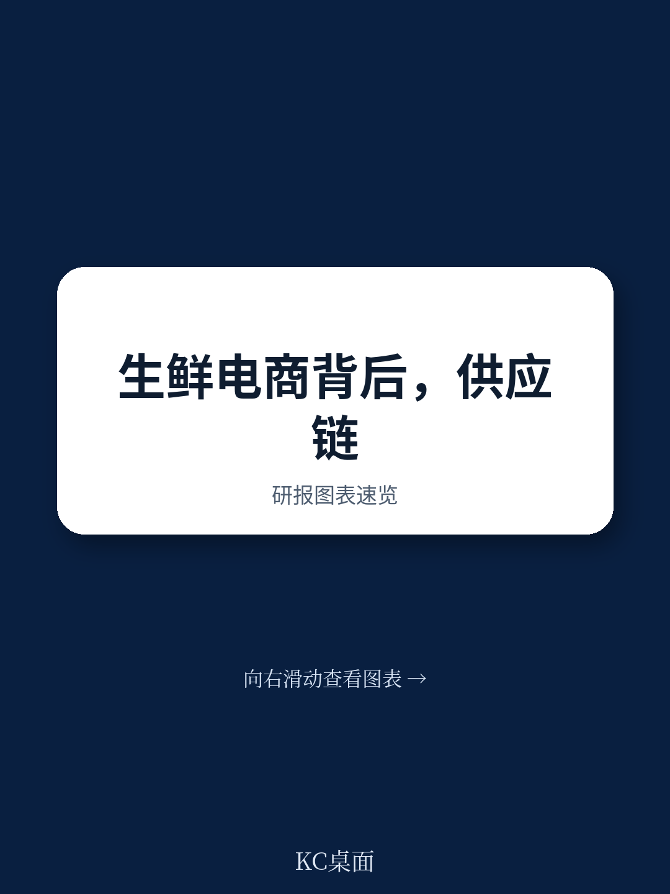
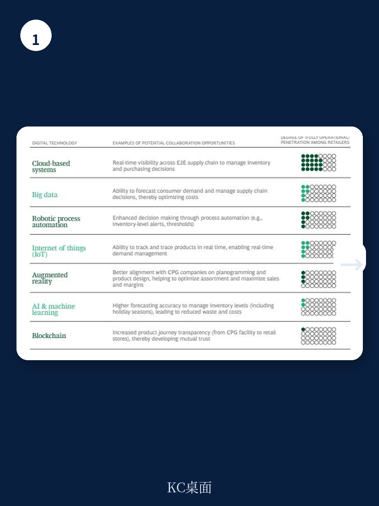
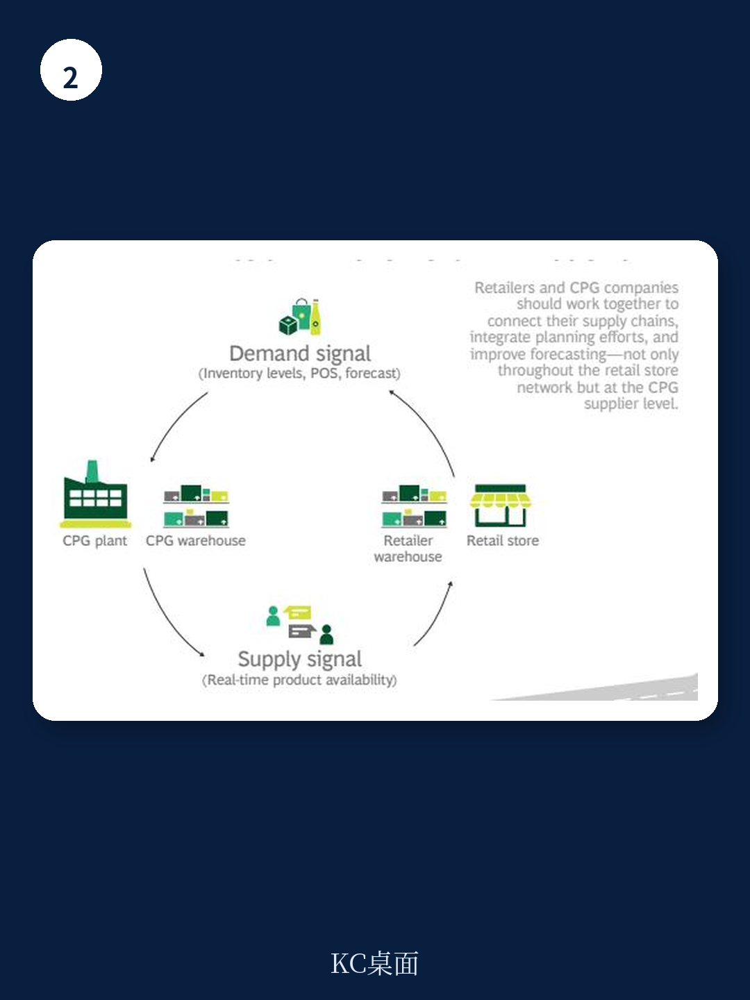

# 波士顿咨询：生鲜供应链的瓶颈不是技术，而是组织协同

生鲜电商的扩张和消费者对“更新鲜”产品的追求，正在将零售供应链推向一个危险的临界点。波士顿咨询（BCG）在一份最新研报中提出一个核心判断：零售商与快消品（CPG）供应商之间传统的、以博弈为主的合作关系已经失效，双方必须转向深度的供应链协同与数字化整合，否则成本与服务水平将同时出现变化。

这份报告并非老生常谈的“降本增效”。它揭示了一个结构性的矛盾：消费者想要更多品类、更短保质期的生鲜产品，这直接导致零售商从配送中心发出的卡车装载率下降、紧急补货增多、损耗率上升。与此同时，供应商端也面临订单波动加剧、前置时间缩短的困境，双方正在互相推诿责任。波士顿咨询认为，问题的根源不在于单点效率，而在于整条供应链的信息孤岛和激励错位。

> **KC评论：** 简单说，零售商抱怨供应商送货不准时，供应商则说是零售商的订单太乱太急。双方都觉得自己没错，但问题出在彼此没有共享同一个计划系统。波士顿咨询的核心建议是：把“你的库存”和“我的货架”当成一个整体来看，而不是各自为战。

## 1. 生鲜渗透率每提升一个点，供应链成本就多一分不确定性

报告引用的数据显示，生鲜产品的特性——保质期短、需求波动大、需要冷链运输——天然不适合传统的大批量、长周期供应链模式。当零售商为了满足线上订单而增加生鲜SKU时，一个直接后果是：出库卡车的装载率远低于入库卡车。波士顿咨询的调研显示，2018年出库卡车的平均装载率（按重量计）显著低于入库端，这意味着每趟运输的固定成本被摊薄到更少的产品上。

更隐蔽的成本来自“损耗”和“紧急补货”。生鲜产品一旦错过最佳上架窗口，就会变成损耗。为了抢时间，零售商不得不增加紧急订单和加急配送，这反过来又推高了物流成本和运营复杂度。报告指出，损耗率在过去几年持续上升，而大部分零售商已经无法达到内部设定的货架有货率目标。

## 2. 服务水平下降的根源不是单点故障，而是系统性的供需错配

波士顿咨询的调查揭示了一个关键事实：零售商和CPG供应商对“服务水平下降的原因”看法截然不同。44%的CPG公司将问题归咎于需求预测不准，而零售商则认为制造可靠性是主因。这种认知分歧本身就是问题的一部分。

订单的波动性在增加，前置时间在缩短，单笔订单的批量在变小——这些变化让供应商的排产和物流计划越来越困难。结果是，供应商的准时交货率在下降。但零售商往往只看到“你没送到”，而忽略了“我的订单本身就不合理”。波士顿咨询认为，这种相互指责的循环，只有通过共享需求数据、联合制定库存和补货计划才能打破。

## 3. 数字化工具已经就位，但真正的瓶颈在组织协同

报告列举了多种可以支持供应链协同的数字化技术：云端系统、大数据、机器人流程自动化、物联网、增强现实、AI与机器学习、区块链。绝大多数零售商已经在不同程度上开始部署这些技术。然而，波士顿咨询的结论是：技术本身不是障碍，障碍在于双方缺乏共同的KPI和激励机制。

没有共同的目标，零售商不会主动分享实时销售数据，供应商也不会为了零售商的货架有货率而调整自己的生产计划。报告提出的“四步走”框架，第一步就是“就激励和目标达成一致”。这听起来简单，但在实际操作中，这意味着零售商要放弃部分采购议价权，供应商要接受更高的订单波动不确定性。

> **KC评论：** 波士顿咨询这份报告最值得关注的一点是，它把问题从“物流效率”提升到了“商业关系治理”的层面。对于行业观察者来说，一个值得追问的问题是：当生鲜和线上渗透率继续上升，那些无法与供应商建立深度数字化协同的中小零售商，会不会被挤出市场？报告没有给出明确答案，但逻辑指向了这个方向。

## 4. 报告没有完全回答的问题：谁来主导这场协同？

波士顿咨询的解决方案逻辑自洽，但有一个关键问题悬而未决：在零售商和CPG供应商的博弈中，谁更有动力、更有能力去推动这种深度协同？是拥有终端消费者数据的零售商，还是拥有生产能力和品牌资产的供应商？报告没有提供明确的判断。

从行业实践来看，沃尔玛这样的巨头可以凭借规模要求供应商接入自己的系统，但大多数区域零售商并不具备这种议价能力。反过来，宝洁、雀巢这样的全球CPG巨头，也可能更倾向于自建数据平台，而非被动接入每个零售商的系统。这场协同的最终形态，可能取决于哪一方能率先证明“共享数据带来的增量收益”远大于“放弃数据控制权的不确定性”。