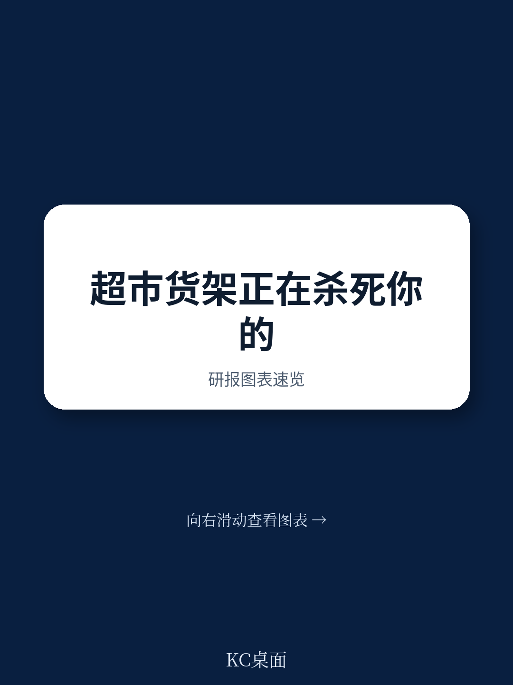
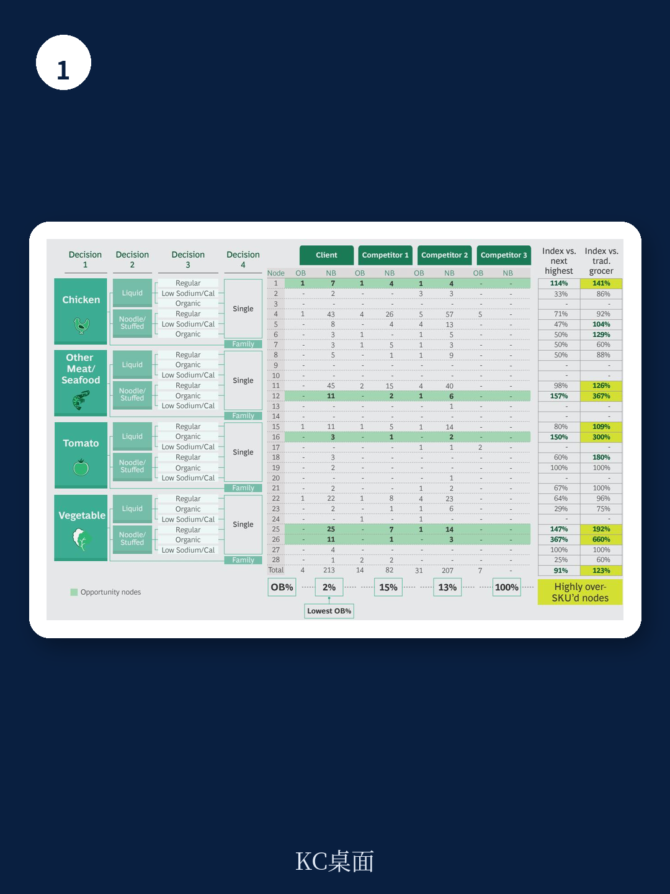

# 波士顿咨询：超市SKU不是太少，而是太多，减20%反增销售额

疫情之后，超市行业面临一个反直觉的结论：让货架变空，反而能提升销售额。波士顿咨询在一份针对美国区域连锁超市的研究中，通过试验发现，主动削减20%至25%的SKU后，受影响品类的销售额反而增长了2%。这个数字背后，是传统超市行业一个长期被忽视的结构性问题。

过去三十年，美国传统超市的平均SKU数量增长了80%。货架被塞满，顾客却更难找到想要的东西。波士顿咨询指出，这种“产品泛滥”不仅没有带来销售增长，反而成为传统超市在与折扣店、会员店甚至便利店竞争中的致命短板。一个关键数据是：区域超市每英尺货架的SKU数量，比折扣渠道高出50%。

> **KC评论：** 这个2%的销售增长，是在疫情前完成的试验。但疫情后，消费者对“快速完成购物”的诉求只会更强。波士顿咨询认为，如果传统超市不主动简化，它们会继续被两端挤压——价格上输给Costco这种会员店，便利性上输给便利店。完整报告里有一张“消费者决策树”的图表，展示了如何用数据决定保留哪些SKU，值得细看。

## 1. 品种越多，运营成本越高，但顾客满意度越低

超市行业的“品种悖论”在于，零售商长期把“更多选择”等同于“更好服务”。波士顿咨询的调研显示，在维生素、冷冻蔬菜、罐头汤这类标准化品类中，过多的选择反而引发“决策瘫痪”——顾客因为选择困难而放弃购买。2020年美国零售联合会的调查中，63%的消费者把“便利”列为重要指标，其中47%的人明确说“容易找到商品”就是便利。

从运营端看，SKU膨胀带来的成本是系统性的。仓储空间被低效占用，补货和理货的工时持续增加，供应链因为品项过多而接近满负荷运转。更隐蔽的问题是，供应商通过进场费和新品上架费控制了货架决策权，零售商反而失去了对“什么该卖”的主导权。波士顿咨询认为，这种让渡控制权的模式，长期看会侵蚀超市的核心竞争力。

## 2. 简化不是砍产品，而是重新拿回货架控制权

波士顿咨询强调，简化不是盲目减少品种，而是基于“消费者决策树”做精准修剪。这套工具可以帮助零售商理解，顾客在某个品类中做选择时，真正看重的属性是什么——是品牌、价格、包装大小，还是有机认证。只有基于这种分析，才能区分哪些SKU是顾客离不开的“必需品”，哪些只是供应商塞进来的“冗余品”。

报告特别提到一个常见误区：很多零售商担心削减SKU会失去供应商的经费支持。但试验结果显示，简化后供应商经费反而净增加。原因很简单，当零售商把营销费用集中在更少、更核心的商品上时，对供应商的议价能力反而更强。

> **KC评论：** 这个结论对国内超市同样有参考价值。过去几年，国内社区团购和折扣店的冲击，本质上也是在用“更少的SKU、更高的周转”来挑战传统超市。波士顿咨询的框架提供了一个思考方向：问题不是要不要做减法，而是用什么标准做减法。报告里关于“区域性口味差异”的讨论，也提醒了标准化和本地化之间的平衡。

## 3. 报告没有完全回答：简化之后，增长从哪里来？

这份报告的核心价值在于证明了“简化不伤销售”，但它没有深入回答一个更关键的问题：当超市完成SKU优化后，增长的真正引擎是什么？波士顿咨询的论述更多集中在成本优化和效率提升上，对于“简化后如何实现差异化竞争”着墨不多。

一个值得追问的方向是：如果所有超市都开始简化，那竞争优势会不会重新回到价格和供应链效率上？报告提到了“简化可以释放仓库空间、降低资本开支”，但并没有给出一个明确的、可量化的增长路径。这也意味着，对于已经启动SKU优化的企业来说，简化只是第一步，真正的挑战在于如何把省下来的资源和空间，转化为对顾客有吸引力的新价值——比如更快的配送、更好的生鲜品质，或者更具竞争力的自有品牌。

对于行业观察者而言，波士顿咨询的判断提供了一个清晰的观察框架：未来几年，超市行业的竞争焦点将从“货架多不多”转向“货架对不对”。能够用数据驱动的方式持续优化品种结构，同时把节省的成本转化为顾客体验提升的企业，才更有可能在存量市场中守住份额。