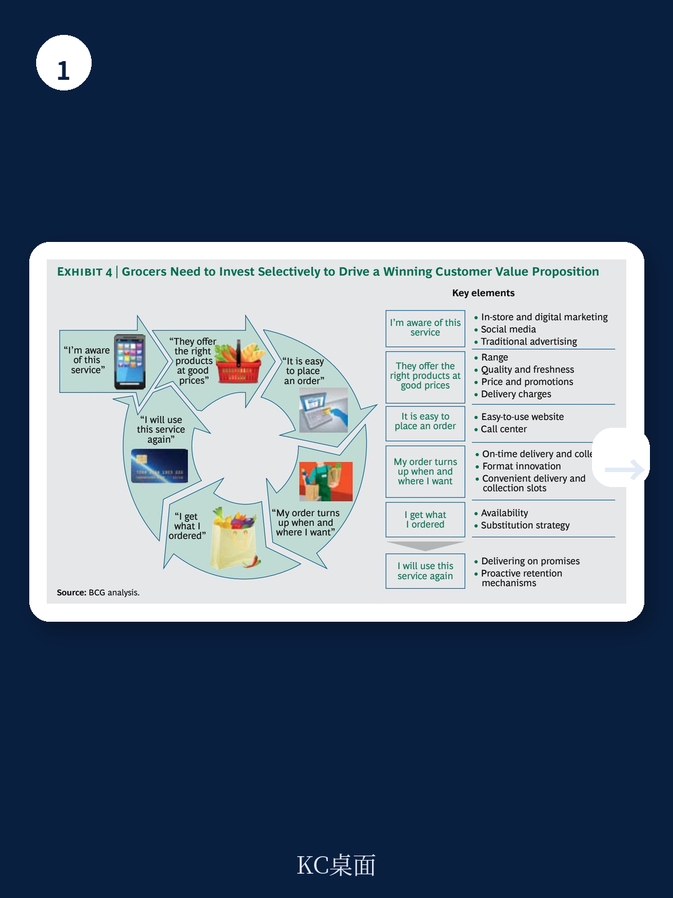
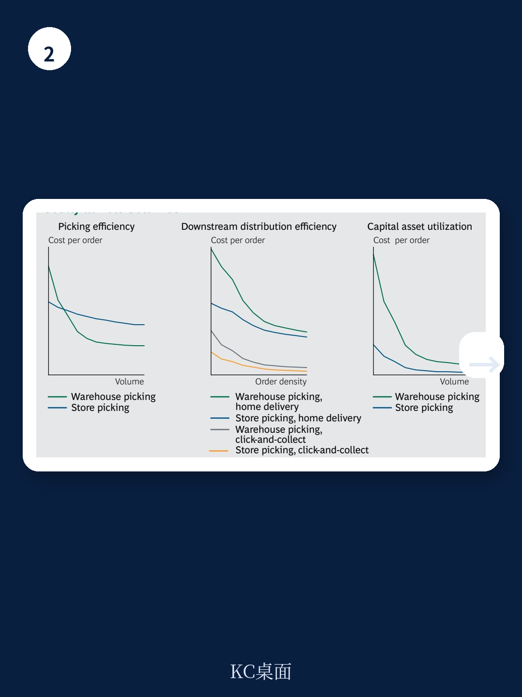

# 波士顿咨询：年轻家庭线上杂货消费比线下高30%至50%

线上买菜的渗透率在多数国家仍远低于消费者意愿。波士顿咨询这份报告的核心判断是：供给端的犹豫，而非需求端的不足，才是制约市场爆发的关键。报告预测全球线上杂货市场到2018年将达1000亿美元，并指出早期行动者将获得显著的先发优势。但真正有价值的洞察，不在于市场规模有多大，而在于如何用宏观环境上可行的方式去获取它。

报告的核心主张可以概括为：不要在起步阶段就追求昂贵的“最后一公里”配送，而应优先选择“点击取货”模式，在积累足够本地规模后再谨慎拓展上门配送。这个判断基于对八个国家消费者的调研和多家头部零售商的实际运营经验。

## 1. 消费者已准备好，但零售商仍在观望

波士顿咨询的调研显示，消费者对线上购物的期待远高于当前的实际使用频率。受访者平均每年愿意使用线上杂货服务13.5次，超过每月一次。在巴西和中国，这一频率接近每月两次。在美国，约半数受访者表示会尝试上门配送或点击取货服务。

报告特别指出，零售商最重要的客户群体——年轻家庭和高收入夫妇——对线上购物尤其热衷。当他们转向线上后，全渠道消费额往往比纯线下购物高出30%至50%。

> **KC评论：** 这意味着零售商面临的核心不确定性不是线上业务蚕食线下，而是竞争对手通过线上渠道锁定你的最佳客户，进而带动更高价值的全渠道消费。报告的逻辑是：线上不是替代线下，而是客户关系管理的延伸和升级。

目前各国线上杂货渗透率的差异，更多源于供给端而非需求端。英国线上杂货已占市场总额的5%，法国3%，韩国4%。这些领先市场每年以20%至50%的速度增长。报告认为，到2016年，多数市场的线上份额将翻倍。而落后市场的差距，主要源于零售商的犹豫，而非消费者的抗拒。

## 2. “点击取货”是更宏观环境的起步策略

报告明确反对新进入者一开始就追求全城配送。波士顿咨询为零售商设计了一条清晰的路径：从“点击取货”起步，在特定区域积累足够订单密度后，再谨慎添加上门配送服务。

这个判断基于两项关键数据。第一，消费者愿意为取货平均开车13分钟，这个数字在八个调研国家中惊人地一致。第二，消费者愿意支付的配送费用远不足以覆盖最后一公里的实际成本。在美国，消费者愿意支付5到10美元，但模型显示，在低渗透区域，每单配送成本可能高达20美元。

法国市场是“点击取货”模式的最佳案例。法国主要零售商已建立超过2000个此类提货点，许多以“汽车穿梭”形式运营。这些站点在过去几年推动了线上销售每年50%的增长。法国线上杂货市场在2012年占市场总额的2.9%，预计到2016年将增长至7%。

> **KC评论：** 报告没有回避的一个关键问题是：提货点应该设在店内、店旁，还是独立设施？法国经验显示，独立设施能更好地降低对现有门店的蚕食不确定性。这个问题报告没有给出唯一答案，但明确表示这是需要根据本地情况重点评估的变量。

## 3. 差异化要“负担得起”，而非“不计成本”

报告提出了“可负担的差异化”概念。线上消费者比线下更挑剔。在成熟的英国和法国市场，消费者有四项基本期望：产品品类和质量符合预期；订单准确率高、替代率低、新鲜度好；配送准时且时间窗口便利；网站和App使用便捷。

关键在于，零售商必须找到哪些差异化元素能真正驱动客户满意度和复购，同时密切监控执行成本。报告强调，不是所有“好服务”都值得研究。例如，缩短配送时间窗口是消费者最看重的因素之一，但实现这一点的成本很高，需要精确的路线规划和订单密度支撑。

报告没有给出具体的差异化清单，而是提供了一个分析框架：先识别本地市场最关键的2-3个满意度驱动因素，然后评估这些因素的成本结构，最后选择那些“成本可控但客户感知强烈”的维度进行投入。

## 4. 报告尚未完全回答的关键问题

尽管报告提供了一个清晰的行动框架，但它也承认，所有模式都需要随着时间的推移而演化。以下是报告提及但未完全解决的关键问题

第一，美国市场何时真正爆发？报告指出美国是最大的电商市场，但线上杂货渗透率落后。虽然沃尔玛和亚马逊正在试验多种模式，但报告没有给出明确的“引爆点”预测。

第二，当市场规模达到1000亿美元后，竞争格局会如何演变？报告提到早期行动者能获得显著优势，但没有深入分析当市场成熟后，规模效应是否会压倒先发优势。

第三，“点击取货”与“上门配送”的切换条件是什么？报告建议在“足够本地规模”后再添加配送，但这个“足够”的具体标准是什么？是订单密度、客户基数，还是区域覆盖率？

这些问题本身，就是读者在阅读完整报告时可以重点寻找答案的方向。波士顿咨询的分析框架为零售商的决策提供了清晰的起点，但真正的挑战在于执行细节和本地化调整。