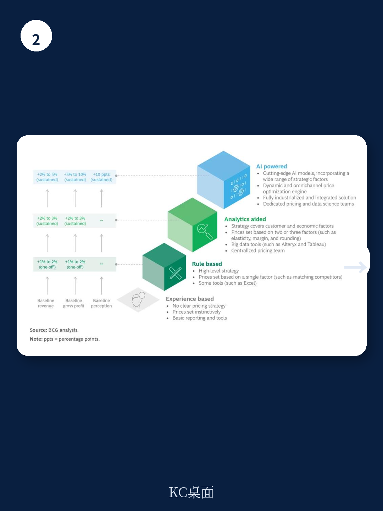

# 波士顿咨询：AI定价不是选择题，是零售商的生存题

当成本通胀、供应链波动、消费转移和价格竞争同时发生，传统零售定价方法已经到达极限。波士顿咨询最新报告给出的判断非常直接：AI驱动的动态定价，不再是可选项，而是零售商维持竞争力的必要条件。

报告基于对全球零售商的调研发现，那些已经完成AI定价转型的企业，毛利润提升5%到10%，同时营收和客户价值感知也获得可持续增长。这不是一个理论推演，而是可量化的结果。

> **KC评论：** 很多零售商还在用Excel或传统规则引擎做定价，认为“AI定价就是自动化调价”。波士顿咨询的报告提醒，真正的AI定价是同时处理战略、卫生和动态三个维度的复杂系统，而不是简单替代人工。

## 1. 传统定价只抓一两个维度，AI定价同时处理十几个变量

规则驱动的定价通常只关注一到两个维度，比如成本加成或竞品对标。波士顿咨询报告指出，AI定价引擎可以同时考虑战略、卫生和动态三大类十几个维度，在数十亿个潜在场景中找到每个门店、每个商品的最优价格。

战略维度包括定价目标、品类角色和关键价值商品、全渠道定价、价格区域。卫生维度关注商品间关系、自有品牌与全国品牌的价格差、定价的“魔法数字”。动态维度则涉及实时竞品追踪和动态预测。

一个关键差异：传统定价做“平均化”，AI定价做“去平均化”。零售商可以主动研究于那些最能吸引客流、最能塑造价值感知的品类和商品，而不是对所有商品一视同仁。

## 2. 动态定价的核心不是降价，而是精准定位

报告中最具操作性的洞察来自动态维度。当一家连锁超市开始系统追踪竞品价格，它发现自己的某些商品价格比主要竞品低了20%到30%。通过提价到刚好低于竞品的位置，这家零售商在几乎不影响销量的情况下改善了利润率。

这揭示了一个反直觉的事实：很多零售商在“被动低价”，而不是“主动定价”。他们不知道自己相对于竞品的位置，也就无法做出有策略的调整。

另一个被忽视的维度是价格弹性的动态化。大多数零售商使用的价格弹性是静态的，这导致他们无法捕捉消费者行为的微小变化，还会把基础价格弹性和促销弹性混为一谈，高估基础价格变动的影响。

> **KC评论：** 报告没有展开的是，动态定价对组织能力的要求远超技术本身。很多零售商不是买不起AI引擎，而是没有建立能够理解、操作和信任AI输出的定价团队。

## 3. 报告没有完全回答的关键问题：组织惯性如何打破？

波士顿咨询报告详细描述了AI定价所需的技术平台和数据架构，但在组织变革的深度上着墨相对有限。

报告提到，最佳实践是建立一个跨品类、跨区域、跨渠道的中央定价团队，通常隶属于商品采购部门。但现实是，大部分零售商的定价决策分散在各个品类经理手中，他们有自己的经验、习惯和KPI。让一个中央团队用AI接管定价，相当于重新分配权力。

报告也指出，AI定价需要从每年一到两次的“重置”变为持续的“读取和反应”流程。这意味着零售商需要建立一套全新的决策节奏和审批流程。对于习惯了年度定价周期的传统零售商，这个转变的难度可能被低估了。

## 4. 零售决策者如何评估自己的AI定价成熟度

波士顿咨询报告给出了一个清晰的启动框架，值得每一个零售商对照自检

**你的定价目标是否足够清晰？** 是追求营收最大化、毛利率优先，还是平衡两者？AI引擎需要明确的优化目标，否则输出会失去方向。

**你的数据基础是否足够？** 除了销售数据，你是否有客户忠诚度数据、竞品价格数据、天气等第三方数据？AI定价的精度取决于输入数据的广度和质量。

**你的组织能否承接？** 你是否有能力组建一个同时懂定价策略和数据科学的中央团队？如果内部能力不足，是选择购买现成工具还是与外部伙伴合作？

报告没有点明但值得追问的是：当AI建议的价格与品类经理多年经验冲突时，组织如何决策？这可能是AI定价落地过程中最真实、也最容易被忽视的障碍。

For informational purposes only. Portions may be generated,translated,summarized,or edited with AI assistance based on source materials and may contain omissions or errors. Please verify independently. This is not investment,legal,tax,accounting,or other professional advice.
