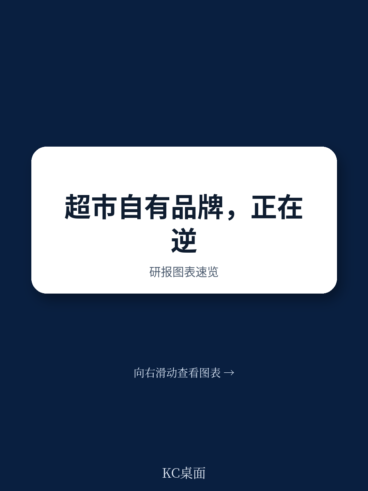
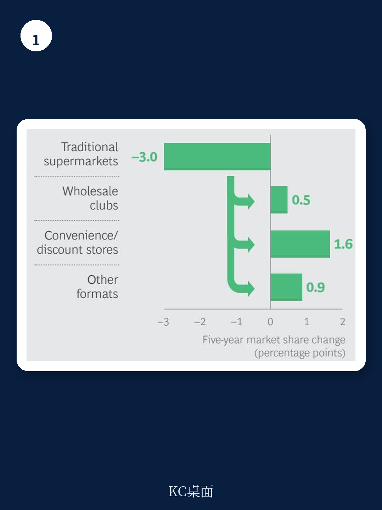

# 波士顿咨询：自有品牌不是平替，而是零售商核心竞争力

传统超市正在被折扣店、会员店和电商蚕食份额，而驱动这场格局重塑的核心力量，并非全国性品牌，而是自有品牌。波士顿咨询这份报告的核心判断是：自有品牌已从“低价仿制品”进化为零售商差异化、提升利润、掌控供应链的战略武器。那些仍将其视为“二线产品”的零售商，将在未来五年内失去市场地位。

报告指出，美国自有品牌年销售额已达1200亿美元，占整体市场的18%。而在欧洲，这一比例更高，自有品牌早已成为多个品类的市场领导者。更重要的是，美国市场的份额转移几乎完全由自有品牌驱动——每年约30亿美元的自有品牌销售额从传统超市流向其他渠道，而全国性品牌并未出现同等幅度的转移。

## 1. 消费者变了，自有品牌是唯一能同时满足“价值”与“差异化”的答案

波士顿咨询认为，当前零售业的竞争已从“价格战”转向“价值战”。消费者并非只追求最低价，而是寻求“最佳品质与价格的平衡”。千禧一代（占美国成年购物者的27%）更看重便捷、创新、健康与可持续性，他们对尝试新品牌持开放态度，也更愿意为独特的购物体验付费。

这意味着，零售商若仅靠全国性品牌打价格战，利润空间会被持续压缩，且无法建立真正的用户忠诚。自有品牌则提供了一条路径：通过独家产品、品质对标甚至超越全国性品牌，同时保持价格优势，从而在消费者心中建立“只有在这里才能买到”的认知。

> **KC评论：** 这个判断的关键在于“价值”的定义。报告强调的是“质量价格比”而非“绝对低价”。对零售商而言，自有品牌的战略价值不在于“更便宜”，而在于“用同样的钱买到更好的东西”。完整报告中对千禧一代消费偏好的详细拆解，值得所有面向年轻消费者的品牌仔细阅读。

## 2. 欧洲领先，美国追赶，但差距背后是能力鸿沟

欧洲零售商在自有品牌上的渗透率远高于美国，部分企业（如Aldi）的自有品牌销售占比已高达90%。波士顿咨询预测，美国自有品牌份额将以更快的速度增长，逐步缩小与欧洲的差距。

但渗透率提升并非自动发生。报告指出，成功的自有品牌本质上是在运营一家“消费品公司”——这需要从产品开发、供应链管理到品牌营销的全套能力。欧洲领先企业（如Tesco与Carrefour组建采购联盟）和美国头部玩家（如Walmart垂直整合供应链）都在进行系统性研究，而非简单贴牌。

报告尚未完全回答的关键问题是：当所有零售商都加大自有品牌投入时，同质化竞争是否会再次出现？届时，核心竞争力又将回归到哪一端？

## 3. 零售商的“三重能力”建设，决定自有品牌成败

波士顿咨询为零售商提供了三组关键行动框架，这并非简单清单，而是相互支撑的系统工程

**第一，战略与组织先行。** 零售商必须明确自有品牌在企业整体定位中的角色：是作为“价格武器”对抗折扣店，还是作为“品质标杆”建立差异化？不同的战略选择决定了品牌架构（是否使用零售商自有品牌名）、品质定位（对标的全国性品牌是谁）以及组织模式（独立团队、卓越中心还是混合架构）。

**第二，创新与产品开发能力是护城河。** 报告强调，创新不能只看店内数据，而需“跳出四面墙”审视整个市场。领先零售商通过系统性竞品对比，发现消费者未被满足的需求——例如包装形式、健康属性或便捷性。真正的差异化来自对消费者洞察的深度挖掘，而非简单复制。

**第三，供应商网络从“交易关系”升级为“战略伙伴”。** 过去零售商只需招标比价，现在则需寻找能提供CPG级洞察、共同研究创新、确保品质稳定的长期伙伴。当市场缺乏合适供应商时，零售商甚至需要自建或联合研究生产能力。

> **KC评论：** 这套框架的核心逻辑是“从卖货到造牌”。对国内零售商而言，最大的挑战或许不在于“要不要做”，而在于“能否忍受长期投入”。报告没有点明的是，自有品牌对组织惯性的挑战——传统采购团队习惯了全国性品牌的进场费、促销费，而自有品牌需要的是产品经理思维。这部分能力转换，往往是最大的隐性成本。完整报告中关于三种组织模式的对比分析，对正在转型的零售企业具有直接参考价值。

## 4. 报告尚未完全回答的关键问题：疫情后的“新常态”会加速还是扭曲这一趋势？

报告成文于2020年，彼时疫情正在重塑消费行为。波士顿咨询明确指出，即使疫苗问世，消费者的行为变化也不会完全回退。自有品牌在供应链中断期间展现了更强的韧性——当全国性品牌缺货时，自有品牌成为货架上的“安全网”。

但一个悬而未决的问题是：当通胀不确定性缓解、消费者信心恢复后，自有品牌的增长势头能否持续？历史经验显示，宏观环境节奏变化期自有品牌份额会快速上升，但在复苏期往往出现“回吐”。此次疫情是否改变了这一规律，仍有待时间验证。

对行业观察者而言，值得持续追踪的指标包括：自有品牌在“优质”和“超值”两个极端价位带的表现、线上渠道自有品牌的渗透率变化，以及头部零售商在自有品牌上的研发投入占比。这些数据将揭示自有品牌究竟是“消费降级的临时避风港”，还是“零售业结构性升级的长期引擎”。

For informational purposes only. Portions may be generated,translated,summarized,or edited with AI assistance based on source materials and may contain omissions or errors. Please verify independently. This is not investment,legal,tax,accounting,or other professional advice.
