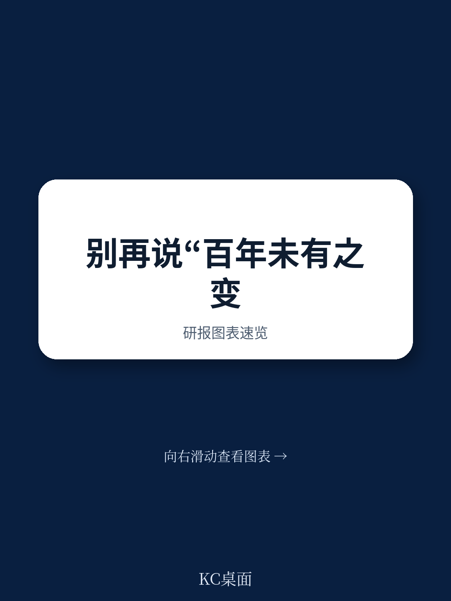

# 麦肯锡：AI匹配工具正改写技能培训与就业市场规则

当全球宏观环境被不确定性笼罩，大多数讨论聚焦于不确定性与挑战时，麦肯锡在其2025年可持续与包容性增长影响报告中，提出了一个值得产业决策者认真对待的判断：**乐观不是情绪，而是基于事实的战略选择。**

这份报告发布正值麦肯锡成立100周年。它没有停留在罗列企业社会责任项目，而是试图回答一个更根本的问题：在长达一个世纪的尺度上，增长能否同时做到可持续、包容、且可量化？报告给出的答案是肯定的，但前提是领导者必须同时管理三个维度——宏观环境机会、健康改善、环境可持续——而非将其视为零和博弈。

> **KC评论：** 这份报告的独特之处在于，它把“影响力”从叙事层面拉回到可测量的绩效指标。例如，报告指出其客户贡献了全球GDP增长的16%，每年创造约100万个就业岗位，并实现了超过80%的报告二氧化碳减排量。这些数字本身比任何口号都更有说服力。

## 1. 技术赋能包容性增长，正从愿景走向可规模化的实践

报告中最具操作性的洞察来自技术应用领域。麦肯锡与厄瓜多尔最大银行合作推出数字银行Deuna，覆盖600万用户和50万商户，其中大量用户此前从未被正规资金服务覆盖。这一案例的关键不在于技术本身，而在于它证明了**数字基础设施可以同时实现商业可行性与社会包容性**。

在AI应用方面，报告提供了两个值得关注的信号：一是与默克合作将临床研究报告的撰写时间从数周压缩至数天，二是与青年成就组织合作开发AI教练工具，帮助50万以上学生提升表达能力。这些案例的共同特征是，AI被嵌入到具体工作流中，而非作为独立项目存在。

## 2. 技能重塑的规模效应，正在改写劳动力市场的游戏规则

报告披露了一个容易被忽视的数据：麦肯锡旗下的非营利项目Generation在2025年累计毕业生超过14万人，累计工资收入超过20亿美元。更值得关注的是，该组织正在将AI工具引入岗位匹配环节，将在线职位空缺与学员技能进行智能对接。

这意味着什么？传统的技能培训面临的最大瓶颈是“培训完成后的就业转化率”。而AI匹配工具的出现，有可能将这一环节从人工操作升级为规模化算法，从而改变整个技能重塑的宏观环境模型。报告没有完全展开这一判断，但数据趋势已经指向这个方向。

> **KC评论：** 报告提到Forward项目在133个国家培训了约12万名学员。如果把这些分散的培训项目与AI匹配工具串联起来，实际上正在形成一个去中心化的全球技能市场基础设施。这可能是报告最有战略价值的隐含线索。

## 3. 报告尚未完全回答的关键问题：规模化与系统变革之间的张力

尽管报告提供了大量令人印象深刻的案例和数据，但一个核心问题仍然悬而未决：**这些项目能否从“有影响力的个案”升级为“系统性变革”？**

麦肯锡与苹果合作绘制铝、铜、稀土等材料的循环价值链，这是一个典型的“系统级”项目。但大多数案例仍停留在组织或社区层面。报告没有充分讨论的是：当这些实践需要跨行业、跨地区、跨监管体系复制时，规模化的障碍是什么？是资金、政策、还是组织能力？

此外，报告对“信任”和“合规”的强调值得关注——过去几年麦肯锡在不确定性管理、法律和合规能力上的持续投入，实际上是其能否继续获得高影响力项目的前提条件。这一点报告坦率承认，但未深入展开其与增长目标之间的内在张力。

## 给产业决策者的三个观察框架

第一，**重新定义“影响力研究”的测量标准**。不要只看投入，要看项目是否改变了目标系统的运行方式。麦肯锡报告中反复出现的“可测量”“可规模化”“可复制”三个词，值得作为评估任何社会影响力项目的标尺。

第二，**关注AI在“匹配”而非“替代”上的应用**。无论是岗位匹配、技能匹配还是资源匹配，AI真正的效率红利可能不在自动化，而在连接。那些能够将分散需求与供给高效对接的组织，将获得结构性优势。

第三，**把“乐观”当作分析工具而非口号**。麦肯锡全球管理合伙人在报告开篇写道：“乐观不是天真，而是一种塑造未来的信念。”对于产业决策者而言，这意味着在制定战略时，不仅要计算节奏变化不确定性，也要有勇气基于事实去计算上行可能。在一个世纪的时间尺度上，后者往往被系统性低估。

For informational purposes only. Portions may be generated,translated,summarized,or edited with AI assistance based on source materials and may contain omissions or errors. Please verify independently. This is not investment,legal,tax,accounting,or other professional advice.
