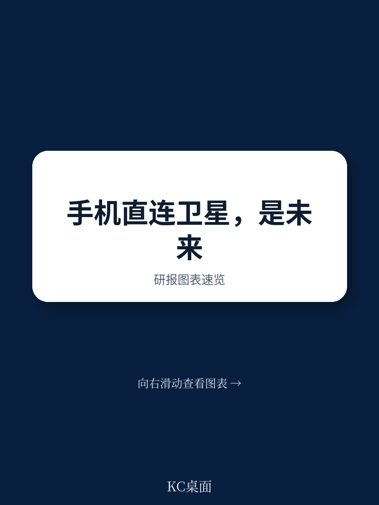
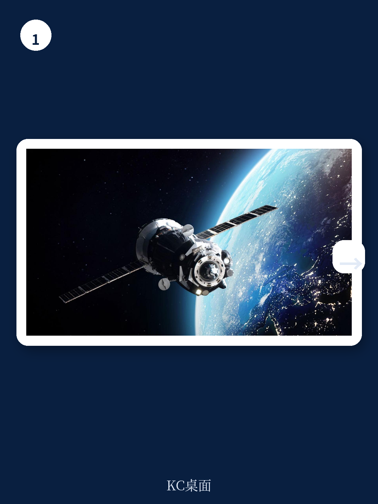
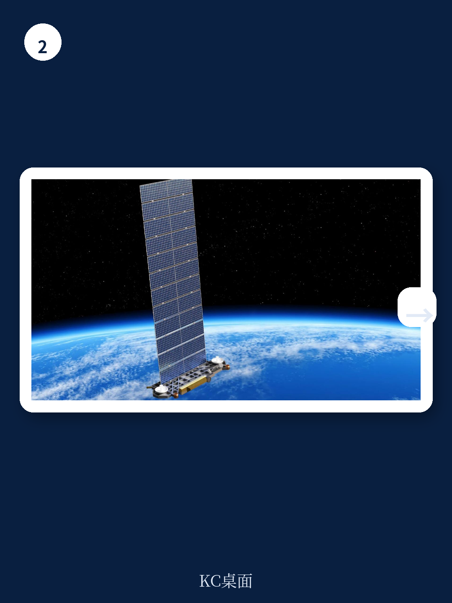

# 波士顿咨询：D2D的‘韧性溢价’到底值多少钱

直连卫星（D2D）正在成为全球通信行业最受关注的技术方向之一。2026年世界移动通信大会上，Starlink高调推出Starlink Mobile，宣称已支持超过1000万活跃用户，并计划在年底前达到2600万。但波士顿咨询（BCG）最新报告给出了一个更冷静的判断：D2D不是“太空5G”，它在物理覆盖、宏观环境模型和监管层面都面临结构性约束，而中东和北非（MENA）地区不同国家将分化出三种截然不同的采用路径。

这份报告的核心价值不在于罗列技术参数，而在于它提供了一个决策框架：当一项技术同时具备“弥补数字鸿沟”“增强通信韧性”和“商业附加服务”三种潜力时，政府和运营商究竟该优先押注哪一个场景？

## 1. 物理天花板比想象中更近：室内覆盖和人口密度是硬伤

报告明确指出，D2D只能提供室外覆盖，而全球50%至90%的移动流量发生在室内。更关键的是容量密度问题。GSMA的测算显示，假设一个拥有15000颗卫星的星座并占用全部移动卫星服务频谱，D2D只能在每平方公里人口密度低于40人的区域提供2Mbps的速率。对比之下，迪拜的人口密度超过每平方公里700人——差距不是一个数量级。

> **KC评论：** 这意味着D2D从一开始就不是为了替代城市5G而设计的。它真正能发挥作用的地方是沙漠、山区、海上和偏远农村。对于已经在城市部署了大量基站的运营商来说，D2D更像是一张“补丁”，而不是升级。

报告还指出，目前全球96%的人口已经被地面移动网络覆盖。T-Mobile的CEO已经承认，其T-Satellite D2D服务的实际付费使用量低于预期，原因很简单——地面网络留下的覆盖盲区远比想象中少。

## 2. 宏观环境账算下来，目前仍是“奢侈品附加包”

每颗低轨卫星制造成本约200万至300万美元，寿命约5年。以Starlink的规模计算，每年仅卫星制造和发射就要花费数亿美元。这部分成本最终要转嫁给用户。目前全球D2D附加服务定价在每月7至10美元，年费80至120美元。这个价格水平决定了它目前只能作为高端套餐的附加功能，而不是面向大众的基础服务。

频谱是另一个关键瓶颈。D2D要么通过与移动运营商合作获得IMT频谱，要么高价收购MSS频谱。两种路径都意味着高昂的进入成本和复杂的谈判过程。

## 3. MENA国家将分化出三种截然不同的采用路径

报告最有洞察力的部分，是它根据各国现有网络覆盖率和农村人口比例，将MENA地区国家分成三类

**A类：利用D2D弥合数字鸿沟。** 这些国家农村人口占比高、地面网络覆盖不足、用户支付能力有限。D2D理论上可以成为缩小数字鸿沟的工具，但前提是服务商能把成本降到足够低。这形成了一个矛盾：数字鸿沟最大的市场，恰恰是ARPU最低的市场。

**B类：具备商业吸引力但非充分条件。** 这些国家地面覆盖和支付能力都处于中等水平，但拥有大量农村人口。D2D可以按需提供补充连接——例如限时附加包、特定偏远地区覆盖、应急通信线路。由于用户基数较大，这类市场对运营商来说具有商业可行性。

**C类：纯粹作为备份和附加服务。** 以海湾合作委员会国家为代表，这些国家已经实现了近乎全覆盖的5G网络，其中多个国家位列全球移动网速前十。D2D在这里的角色是锦上添花——服务于旅游、偏远地区探险和工业数字化，而不是解决根本性的连接问题。

> **KC评论：** 这个分类框架的价值在于，它提醒决策者不要被技术叙事带偏。D2D在不同市场的商业逻辑完全不同。对于沙特和埃及，它的战略意义可能截然相反。报告没有给出具体国家名单，但读者可以对照GSMA的网络覆盖评分和各国农村人口比例自行判断。

## 4. 报告没有完全回答的问题：地缘政治不确定性如何定价

报告提到D2D可以成为“韧性覆盖层”，尤其是在霍尔木兹海峡海底电缆受到地缘政治威胁的背景下。这是一个非常有力的论点，但报告没有深入量化这种“韧性溢价”到底值多少钱。对于一个主权国家来说，为关键基础设施增加一层卫星备份，其战略价值可能远超商业回报。但如何将这种价值转化为具体的政策工具或研究决策，报告只给出了方向性的建议——例如印度对Starlink实施5年许可期限，而非永久授权。

## 5. 留给政府和运营商的行动框架

报告最后给出了一个务实的行动建议：政府可以通过国家电信运营商与D2D提供商合作，同时快速调整监管框架；运营商则应主动启动合作谈判，确保自己维持在客户关系和业务编排中的核心地位。

关键问题在于：如果D2D技术在未来十年实现重大突破，它可能挑战地面骨干网的“最后一公里”环节。届时，已经投入巨额资金建设地面网络的运营商将面临资产价值重估。报告建议政府考虑短期监管工具来保护既有研究，同时重新评估长期连接研究方向。这是一个典型的“双轨策略”——既不错过新技术的红利，也不让旧资产过早贬值。

For informational purposes only. Portions may be generated,translated,summarized,or edited with AI assistance based on source materials and may contain omissions or errors. Please verify independently. This is not investment,legal,tax,accounting,or other professional advice.
