## Luxury is back on track

True-Luxury Global Consumer Insights 2026

12th Edition

JULY 2026

We keep
enlarging our
sources and
tools,
leveraging AI
for the first
time

Quantitative Consumer Survey with 10,000+ respondents, 100+ questions on both True Luxury Consumers and Aspirationals

Categories

nativeresearch Research partner

26 Luxury categories explored
Across the 7 Altagamma sectors $^{1}$

Markets Top 11 WW Luxury Markets

美国

Qualitative Consumer survey, with 100+ luxury clients interviewed through AI-powered interviews on their purchasing behaviors and preferences VERSO Research partner

Enriched findings with Altrata's database, providing insights into HNWI/UHNWI $^{2}$ wealth composition and spending

ALTRATA Research partner

20+ 1:1 sessions with industry-leading CEOs & executives through the BCGxAltagamma Advisory Board

20+ Luxury experts and Luxury industry educational partners

## BCGxAltagamma 2026 Advisory Board

The priorities of
Altagamma's
partner brands
shaped this
year's
True Luxury
Consumer
Study

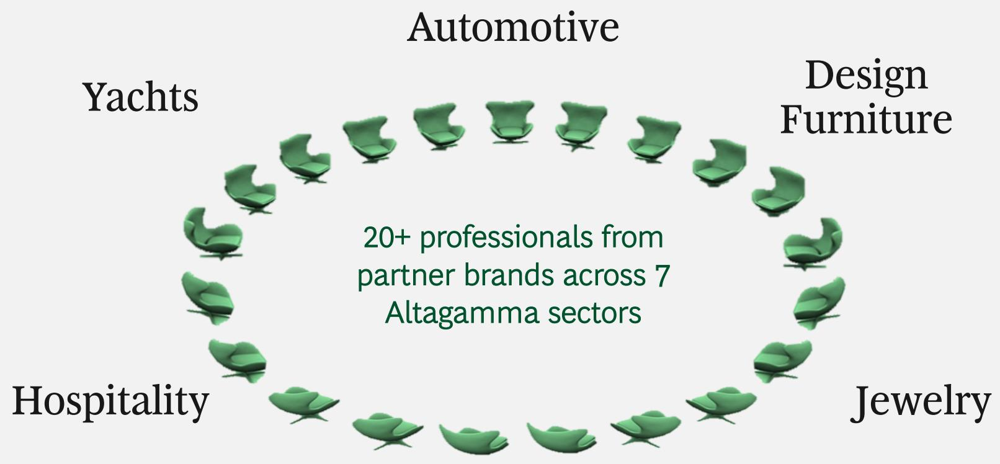  
Food & Beverage  
Fashion

## We collected from the BCGxAltagamma Advisory Board the top 5 topics that keep executives awake at night

Ranking of priority topics
Top 5 ranking (out of 20+ topics), including unprompted and prompted options

Luxury
purchase
drivers

Creative Direction's relevance

WHY
Consumers buy

AI's impact on Luxury

HOW
Innovation disrupts

Rebound of
Aspirational
Consumer

Geopolitics impact

WHO

Drives growth

## Luxury is back on track

## WHO Drives growth

From "aspirational-driven"

to a balanced
consumer base

## WHY Consumers buy

From
showing off

to feeling better

HOW
Innovation disrupts

From
hype that fades

to lasting shift (AI)

## Luxury is back on track

WHO
Drives growth

From
""aspirational-driven""

to a balanced
consumer base

WHY
Consumers buy

From
showing off

to feeling better

## HOW Innovation disrupts

From
hype that fades

to lasting shift (AI)

## Personal Luxury is back on track, with a similar growth rate as pre-Covid

Personal Luxury goods market growth evolution
CAGR % on period

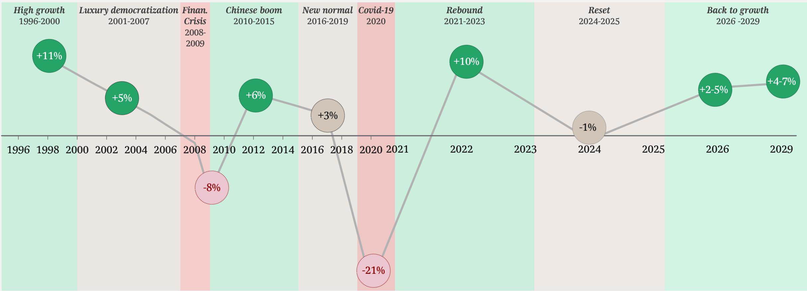

## Growth is restarting from a healthier base

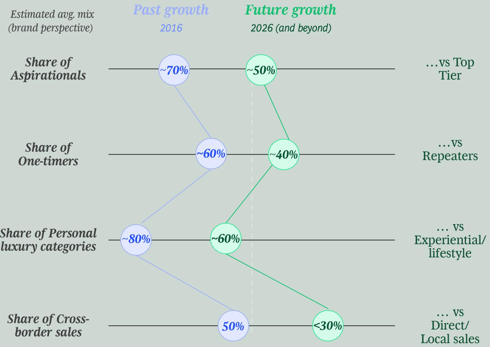

From travel flows to wealth flows

  
Personal and Experiential Luxury $^{1}$ Market, Consumer Pyramid

## Pyramid | Top Tier still driving growth, Aspirational stabilizing

20 k€

5 k€

2 k€

<table><tr><td rowspan="2">Cluster</td><td colspan="3">Population Mn</td><td colspan="3">Spend B€</td></tr><tr><td>2015</td><td>2024</td><td>2025</td><td>2015</td><td>2024</td><td>2025</td></tr><tr><td>Top Tier Clients</td><td>0.40.1%</td><td>0.60.1%</td><td>0.70.2%</td><td>12214%</td><td>23623%</td><td>26124%</td></tr><tr><td>Top Absolute</td><td>1.40.3%</td><td>1.80.4%</td><td>1.80.4%</td><td>305%</td><td>485%</td><td>495%</td></tr><tr><td>Entry Absolute</td><td>154%</td><td>174%</td><td>175%</td><td>9611%</td><td>11311%</td><td>12010%</td></tr><tr><td>Top Aspirational</td><td>205%</td><td>225%</td><td>225%</td><td>546%</td><td>606%</td><td>626%</td></tr><tr><td>Other Aspirational</td><td>36591%</td><td>38490%</td><td>38890%</td><td>54864%</td><td>56355%</td><td>57455%</td></tr><tr><td>Total True Luxury</td><td>402</td><td>425</td><td>429</td><td>850</td><td>1,021</td><td>1,066</td></tr></table>

CAGR
'15-'25

+8%

+3%

Aspirational stabilizing

## Top Tier Clients

• Proven and constant growth engine for the past 10 years: moving from 14% to 24% in spend-share, resilient (indifferent) to macro-cycles
• 420k€ avg. yearly luxury spend

## Absolute

• The solid spine: steady, consistent and quietly growing in value year after year

## Aspirational

\- Back to slow growth

• Volatility driver: macro-driven behavior creating demand instability and swings

## In the USA, AI/Tech is minting new money

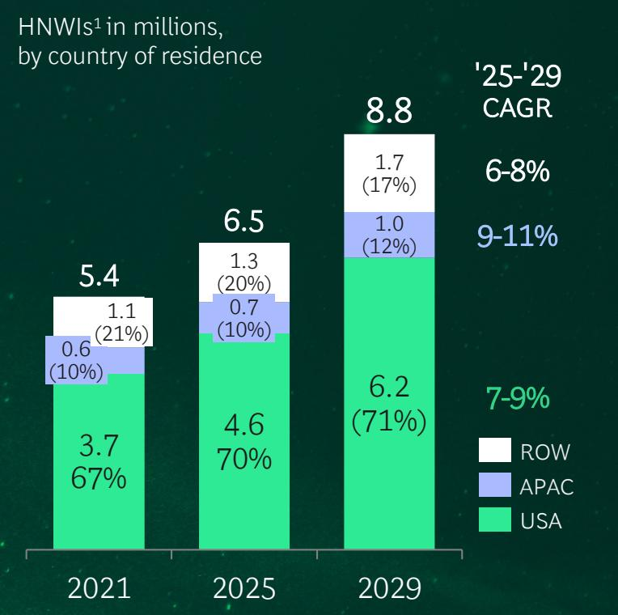

## Wealth ≠ Luxury propensity for new money when it comes to personal luxury

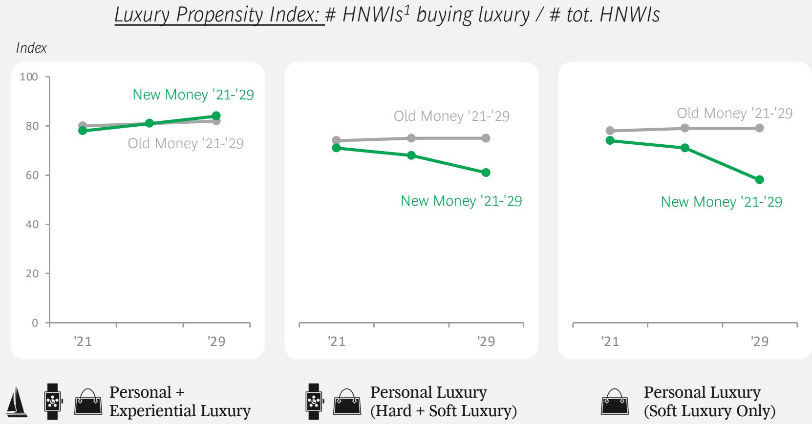

## Pyramid | Aspirational appetite freefall is stabilizing

Q: How will your luxury spend evolve in the next 18 months?
10k+ respondents, %

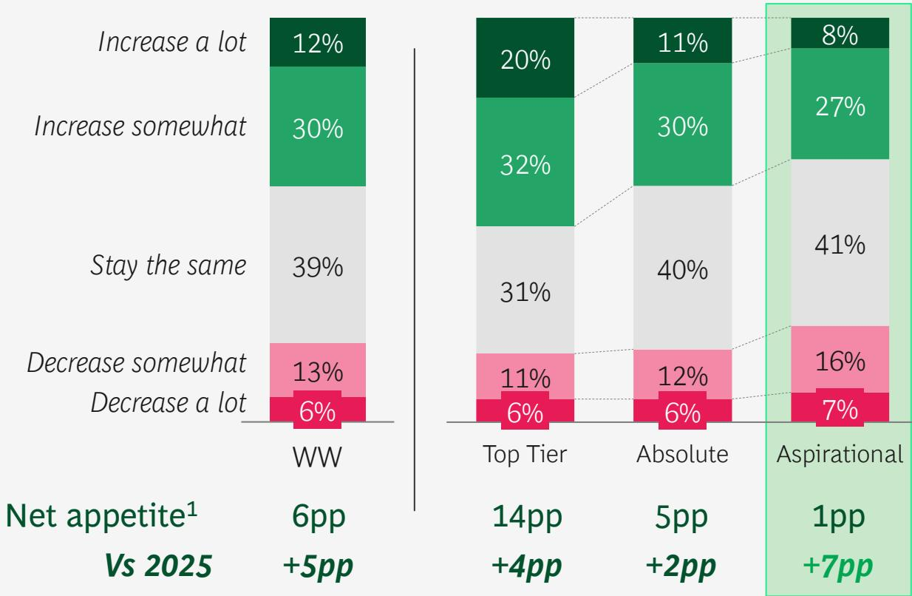

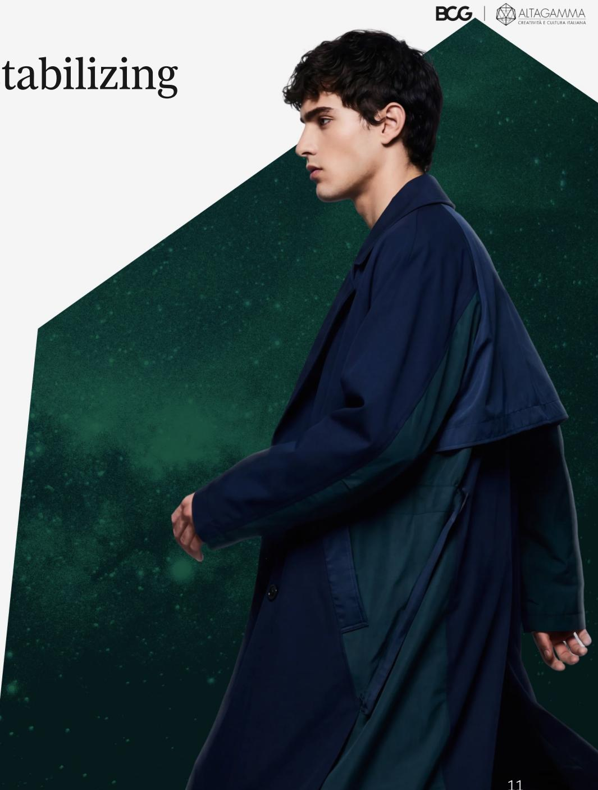  
1. Net Appetite: \% of Increased a lot - \% of Decreased a lot

## Luxury is back on track

WHO
Drives growth

From
""aspirational-driven""

to a balanced
consumer base

## WHY Consumers buy

From
showing off

to feeling better

HOW
Innovation disrupts

From
hype that fades

to lasting shift (AI)

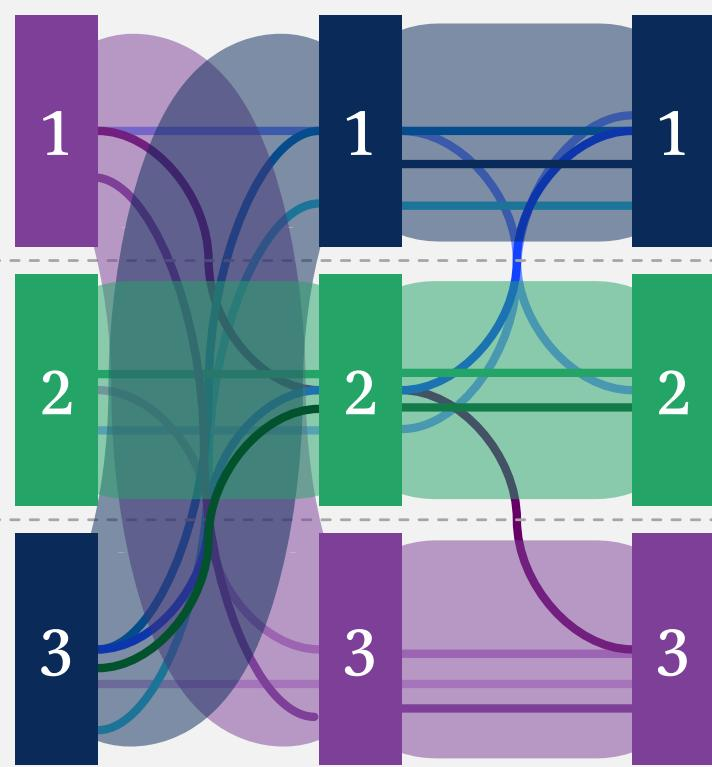  
Today  
9 years ago  
3 years ago

## Meaning of luxury / The time of showing off is over

## Q: What is "luxury" for you?

Top 3 choices, all respondents based on 11 statements

## Self / Intro values

## Luxury's new currency is time & health

Luxury's meaning today is directly linked to self-reward, time, health and longevity

## Product

## Status / Extro values

## Core values remain unchanged

The definition of luxury related to product - rooted in quality, long-term value - remains stable over time

## Status is losing relevance

Recognition/Status and Symbol of belonging as definition of luxury have lost relevance vs. 9 years ago

## Purchase drivers for Luxury Goods | Despite everything, product is still king

## Q: Rank the key purchase drivers behind your last purchase in luxury

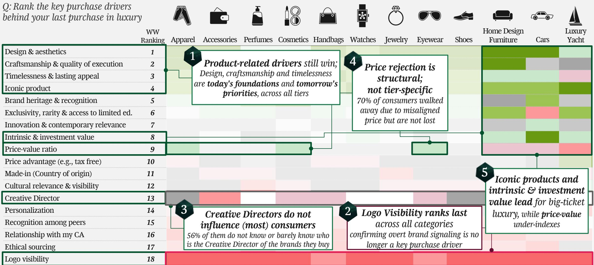  
Source: BCGxAltagamma Proprietary True Luxury Consumer Survey, N=10000, 11 markets: Italy, France, UK, USA, China, Japan, Korea, KSA, UAE, India, Brazil, as of Jun 26

Creative
directors
do not
influence
(most)
consumers

## 56% OF ASPIRATIONALS DO NOT KNOW WHO THE CREATIVE DIRECTOR OF BRANDS THEY BUY IS...

Q: Thinking about the luxury brands you buy, would you say you know who their creative director is?

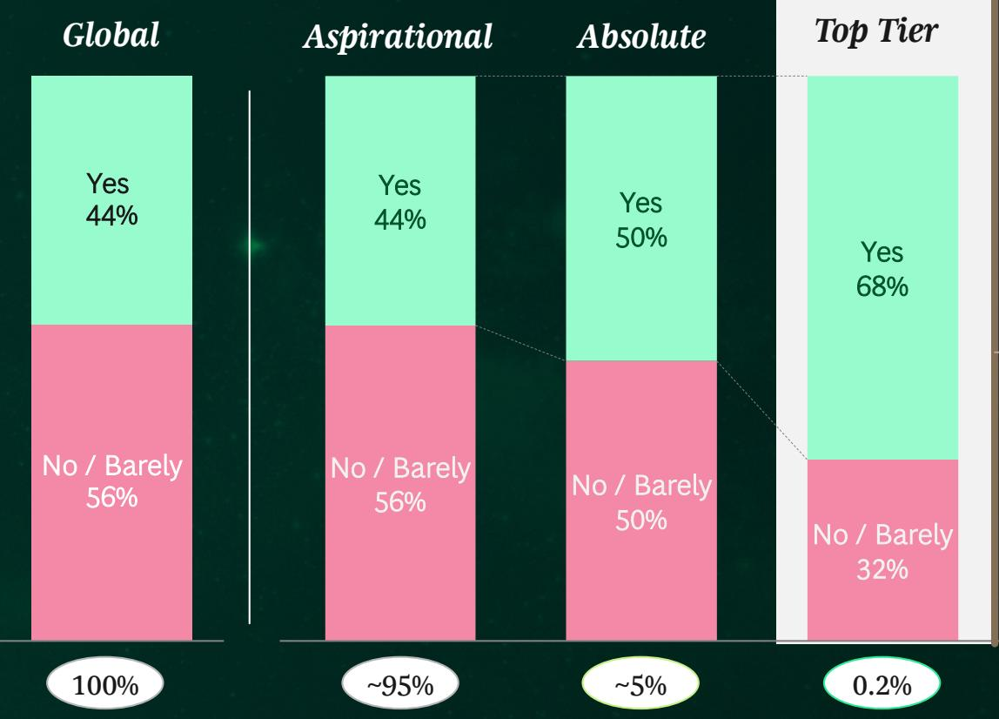

## ... WHILE TOP-TIERS ARE SOMEWHAT INFLUENCED

Q: Thinking about creative directors, which of the following apply to you?

## \~25%

of Top Tier consumers bought from a brand because of the creative director

\~15%

of Top Tier consumers stopped buying a brand because of a change in creative direction

## 70% walked away because of misaligned price, but not all are lost: 50%+ remain within sector

Both Aspirational and Top Tier did not purchase because of price

Q: Have you decided not to buy a luxury product because you felt the price was not justified?

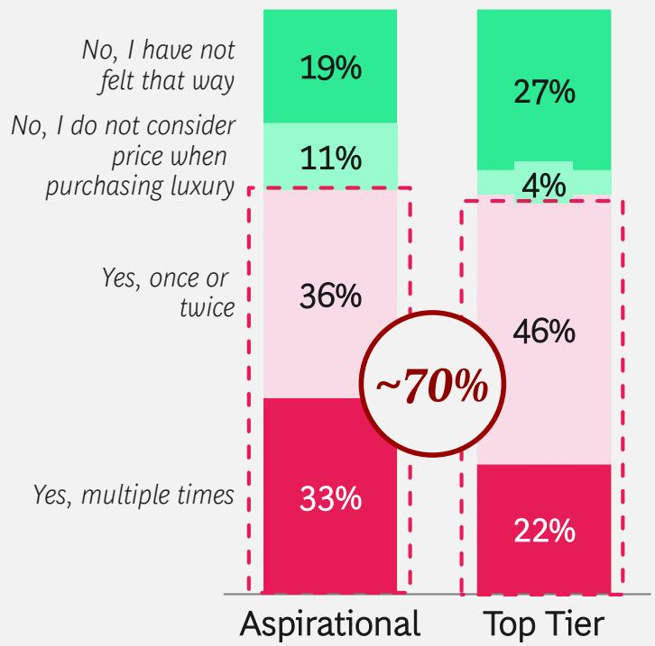  
However, they are not lost: 50+% still remain in the sector  
Q: When that happened what did you do instead?
Multiple choice question

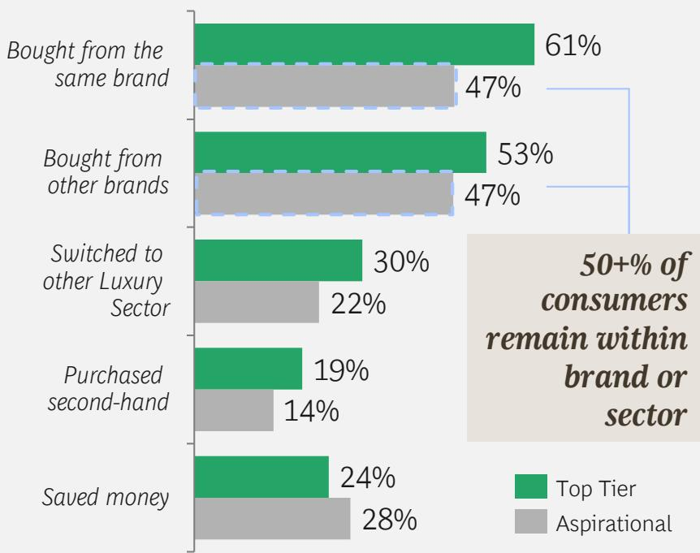  
Source: BCGxAltagamma Proprietary True Luxury Consumer Survey, N=10000, 11 markets: Italy, France, UK, USA, China, Japan, Korea, KSA, UAE, India, Brazil, as of June '26

PRICE REJECTION
IS STRUCTURAL,
NOT TIER-SPECIFIC

Every brand needs to review its price strategy and merchandising grid

## Luxury is back on track

WHO
Drives growth

From
""aspirational-driven""

to a balanced
consumer base

## WHY Consumers buy

From
showing off

to feeling better

## HOW Innovation disrupts

From
hype that fades

to lasting shift (AI)

## AI meets Luxury: what we asked the consumer

1

CONSUMER ADOPTION

Are Luxury consumers already using AI in their personal lives?

2

CONSUMER
RESEARCH & TRUST

Are they using it to research Luxury? Do they trust it?

3

BRAND IMPACT

Does AI affect brand perception and purchase?

Tested on 7 selected use cases across customer-facing domains

Is AI an innovation that is going to last?

## AI is here to stay for Luxury consumers, not another experiment

15 years ago, online disrupted the traditional luxury retail model and transformed the consumer journey...

...now, AI is the major technological trend of the past 15 years, already crossing the consumer adoption threshold

2010s-today

2018-2024

2019-2022

2019-2022

2021-2023

2021-2023

2023-now

## Online / omnichannel

Luxury moves from store-only to digital-first; COVID makes online a core channel

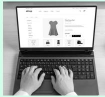  
Lasting innovation

## Immersive 3D-AR/VR

Virtual stores, VR shows and headset worlds for brand storytelling

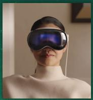  
Hype that faded
×

## Virtual try-on

AR "try before you buy" for eyewear, beauty, watches and sneakers

  
Evolution not revolution \~

Gamification

## Branded skins, in-game drops and playable worlds to reach Gen Z

  
Evolution not revolution \~

Digital collectibles

## Blockchain-certified digital collectibles sold as a new revenue stream

  
Hype that faded
×

Metaverse

## Virtual worlds (Decentraland $^{1}$ , Roblox) as a parallel reality to shop and socialize

  
Hype that faded
×

## AI / GenAI

AI shifting towards consumer-facing use cases in Luxury (Personalization, Content, After-sales..)

  
Lasting innovation

## Luxury consumers are bringing AI into the Luxury consideration journey

Q1: How frequently do you use GenAI tools?
Q2: Have you used GenAI to research Luxury?

Consumers are GenAI-literate in their personal life

Consumers using GenAI to research Luxury

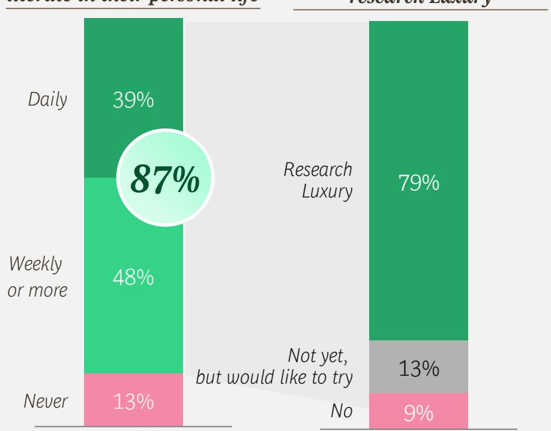  
Q3: Think about the last time you interacted with GenAI platforms about Luxury. What did you ask?  
What luxury consumers are asking AI $^{1}$ ...

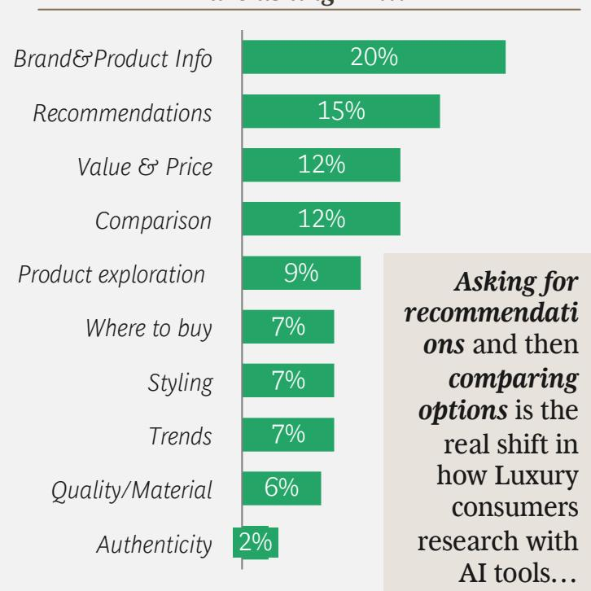  
...And which categories they are researching $^{2}$

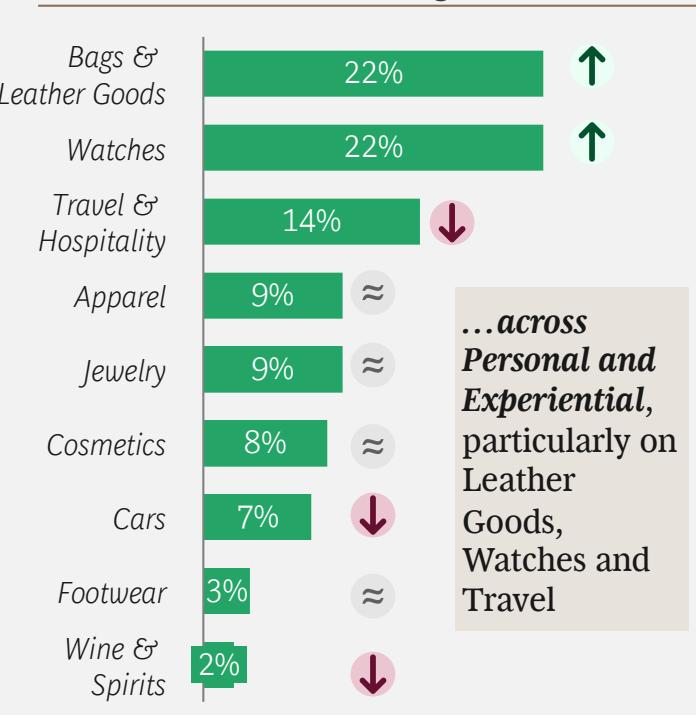  
1. % of respondents; 2. Out of all the consumers that included a category in the answer;  
Source: BCGxAltagamma Proprietary True Luxury Consumer Survey, N=10000, 11 markets: Italy, France, UK, USA, China, Japan, Korea, KSA, UAE, India, Brazil, as of June '26

# GenAI trusted nearly as much as word of mouth, and 2x social media & influencers

Q: How much do you trust each of the following sources when looking for Luxury products/experiences?
Net Score $^{1}$ , pp

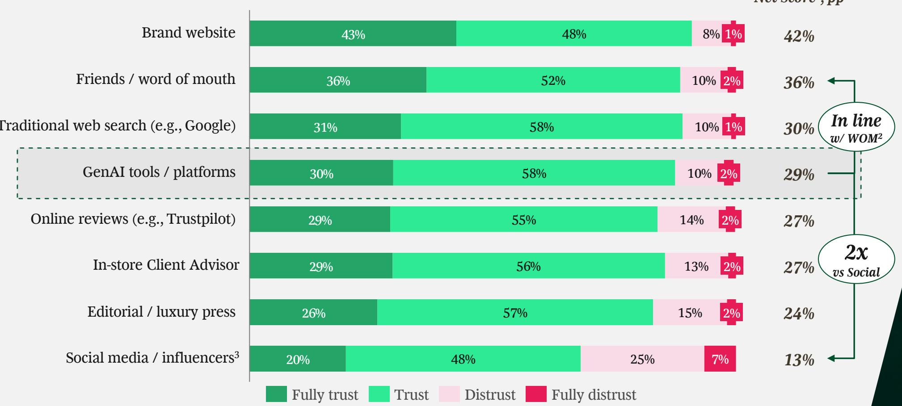

GenAI is
a trusted
source

But still in its early stages, and seen by consumers as more unbiased than social media /influencers, with no sponsored content (yet)

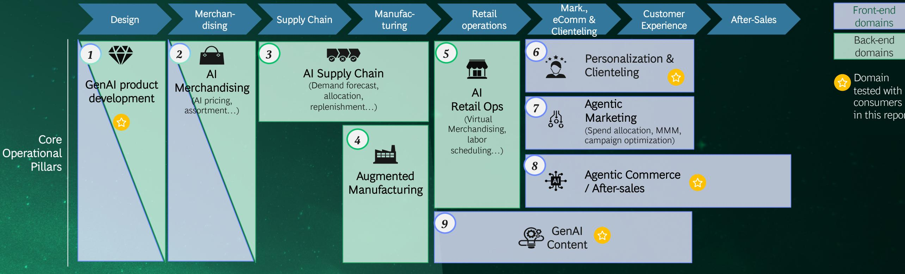

## In the research, we tested AI use cases within a Luxury brand ecosystem experience for four client-facing domains

Core Operational Pillars

Design

GenAI product development

Merchan-
dising

Merchandising (AI pricing, assortment...)

Supply Chain

Manufacturing

3

AI Supply Chain (Demand forecast, allocation, replenishment...)

Augmented Manufacturing

Retail operations

5

AI
Retail Ops
(Virtual
Merchandising,
labor
scheduling...)

9

Mark., eComm & Clienteling

8

Customer Experience

After-Sales

Personalization & Clienteling

O O

Agentic Marketing
(Spend allocation, MMM, campaign optimization)

Agentic Commerce / After-sales

Front-end domains

Back-end domains

Domain tested with consumers in this report

## AI and GenAI are expected and accepted by consumers in most domains...

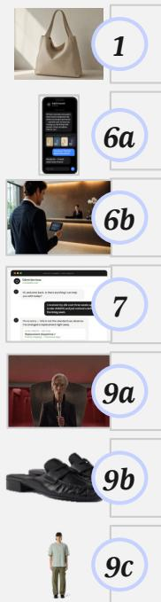

GenAI Product development
Bag product

Personalization & Clienteling
Client Advisor 1:1 message

Personalization & Clienteling
Clienteling in hospitality

Agentic Commerce (After-sales)
AI After-sales Support (Agent)

GenAI Content
Advertising AI Campaign (Video)

GenAI Content
AI-generated still-life images for website

GenAI Content
AI-generated on-model images for website

## AWARENESS

Would you expect AI to help/support in the example? $^{1}$

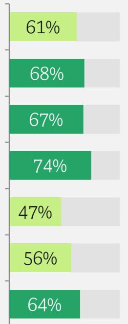

62% of consumers expect AI-assistance across key luxury use cases

## PERCEPTION

Would you still perceive the brand positively knowing AI helped?

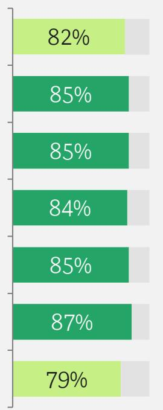

83% still perceive the brand positively after discovering AI-assistance

## IMPACT

Would you still buy the product knowing AI helped?1

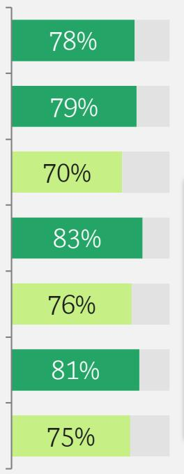

But nearly 1 in 5 remains uncertain and the headline hides the nuances

77% keep buying from a brand that uses GenAI

1. Product Detail Page

## ...but some “pockets of resistance” need to be managed

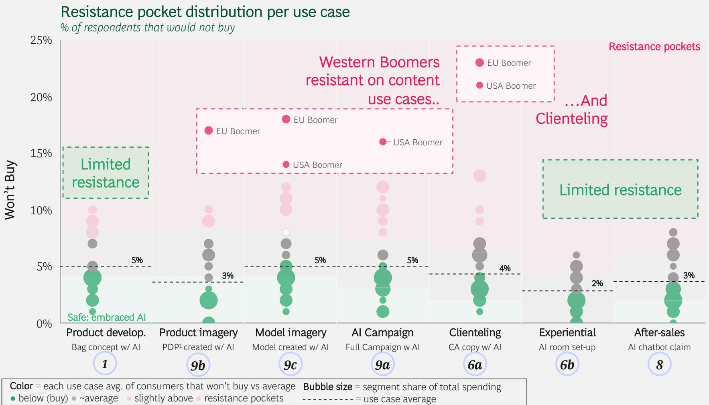

After Sales, Experiential and Product design use cases have no resistance from the consumers

All other use cases highly accepted, with small pockets of resistance concentrated among Boomers in Western markets (EU and US) on content and clienteling

A de-averaged approach is needed: education on content use cases, value and trust on clienteling

## While Consumers are embracing AI, Luxury companies still lag behind

AI Laggards

Fashion & Luxury
Cumulative share of companies

AI Stagnating

Global

14%

22%

AI Emerging

46%

57%

AI Leaders

AI Scaling

AI Future-built

40%

21%

2024 Fashion & Luxury Average

0

Taking minimal or no AI action, lack foundational capabilities, and are not generating value

2024 average

## 2025 average 2025 Fashion & Luxury Average

Have developed foundational capabilities and started initial experimentation but are struggling to scale and generate value

50

Have developed an AI strategy and advanced capabilities, and are scaling them effectively while starting to generate value

BFFxAI 2025 maturity score $^{1}$

75

100

At the forefront of AI innovation, systematically building cutting-edge AI capabilities across functions and consistently generating substantial value

\~60% of Fashion and Luxury Companies are still at an emerging stage of AI Maturity

1. AI Maturity is assessed through 41 dimensions 2. Based on 2024 AI maturity score, 3. AI Leaders vs AI Stagnating + AI Emerging data for Consumer industry, 4. External metrics, (Capital IQ): Total Shareholder Return (June 24 – May 25 for 1-year, June 20 – May 25 for 5-year); 5. External metrics (Capital IQ): Return on Capital Full Year 2024
Source: BCG Build for the Future 2025 Global Study (n = 1,250 ; n=49 for Fashion & Luxury)

Significant
value
creation
opportunities
even in
domains with
(very) limited
customer
resistance

## GEN AI Use cases: potential value and consumer acceptance

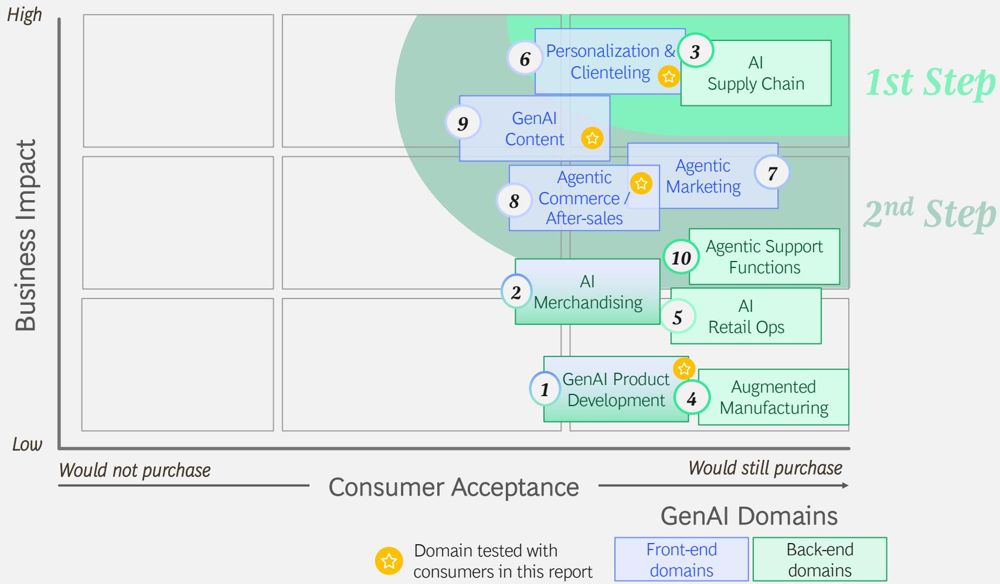

## Altagamma & BCG Team for the 12th edition of the study

  
Stefania
Lazzaroni
Altagamma
General Manager

  
Guia Ricci
BCG Managing Director & Partner

  
Luca
Solca
BCG
Senior Advisor

  
Lucia
Casagranda
BCG
Principal

  
Ioulia Chafrai
BCG Consultant

  
Sebastian
Boger
BCG Managing
Director
& Senior Partner  
Beatrice Lemucchi
BCG Managing Director & Partner

  
Javier
Seara
BCG Managing
Director
& Senior Partner

  
Veronique Yang
BCG Managing Director
& Senior Partner

  
Pierre Dupreelle
BCG Managing Director & Partner

  
Yasmine
Hamri
BCG Managing
Director
& Partner

  
Stefano
Todescan
BCG Managing
Director
& Partner

  
Simone Gentili
BCG Managing Director & Partner

## Thank you.

