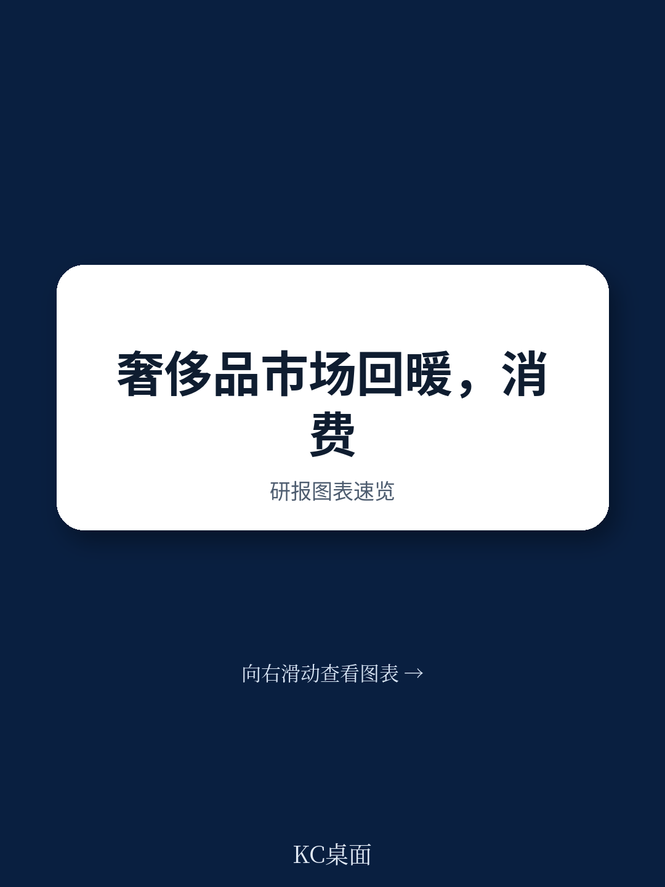
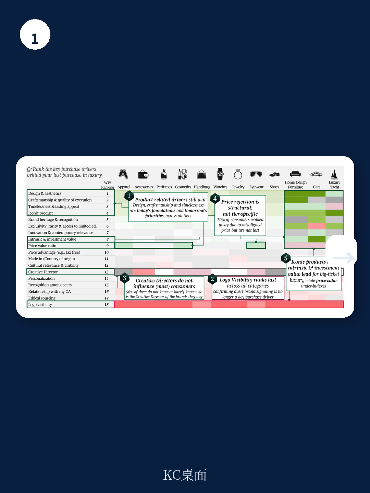
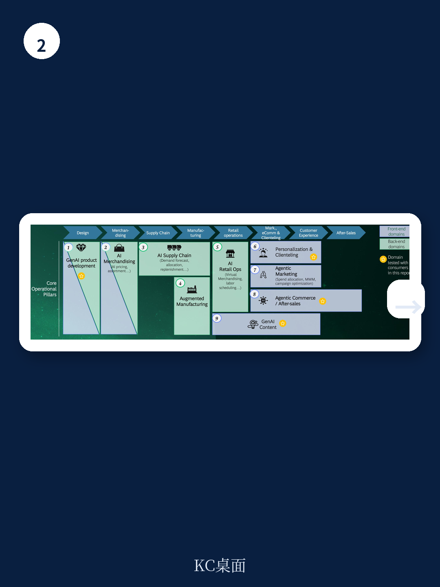

# 波士顿咨询：报告揭示，超六成消费者期待AI参与奢侈品购买

经历了过去几年的波动，全球个人奢侈品市场正在以接近疫情前的增速重新起步。波士顿咨询与Altagamma联合发布的第12期《True-Luxury全球消费者洞察》给出了一个值得关注的判断：市场增长的底层逻辑已经切换——从依赖“渴望型消费者”的扩张，转向由顶级客群和价值观变迁共同支撑的更稳定结构。

这份覆盖11个市场、超过1万名受访者的报告，核心信号是：奢侈品消费正在从“展示身份”转向“自我感受”，而这一转变将深刻重塑品牌的定价策略、沟通方式和AI应用优先级。

---

## 1. 增长引擎已从“渴望型”切换为“顶级客群”，结构更健康但更考验品牌

过去十年，奢侈品的增长故事很大程度上由“渴望型消费者”——那些年支出在2000至5000欧元之间的群体——驱动。但这份报告的数据显示，情况已发生根本性变化。

从2015年到2025年，顶级客群（年奢侈品支出超过2万欧元）在总消费中的占比从14%跃升至24%，而渴望型消费者的份额则在调整。更关键的是，顶级客群对宏观宏观环境周期几乎“免疫”，其消费行为稳定且持续增长。与此同时，渴望型消费者的购买意愿波动剧烈，成为市场不确定性的主要来源。

报告明确指出，市场正从“渴望型驱动”走向“消费群体更平衡”的状态。这意味着，品牌不能再依赖中产阶层的购买力扩张来拉动增长，而必须围绕高净值人群的偏好重构产品组合和服务体系。

> **KC评论：** 这不是一个“消费降级”的故事，而是一个“消费结构分化”的故事。顶级客群在买更多，渴望型在买更少。对品牌来说，关键不再是“如何让更多人买得起”，而是“如何让买得起的人愿意持续买单”。完整报告中对不同层级消费者的支出分布和迁徙路径，值得细看。

---

## 2. “炫耀”退潮，“自我感受”成为购买的核心驱动力

消费者对“奢侈”的定义正在经历一场静默的转变。报告对比了今天、三年前和九年前的消费者选择，发现与“地位象征”和“归属感”相关的定义正在失去吸引力，而与“自我奖励”“时间”和“健康”相关的内涵则在上升。

这不是一个短期潮流。报告指出，与产品品质和长期价值相关的核心定义保持稳定，但“展示”这一维度已经连续多年下滑。消费者购买奢侈品的理由，正在从“让别人看到”转向“让自己感到”。

这一转变对品牌的沟通策略有直接影响。如果消费者购买是为了自我感受，那么品牌故事、创意总监的个人光环和社交媒体的“种草”效果，其边际价值可能正在递减。报告中的一个数据点很有说服力：56%的渴望型消费者不知道自己购买的品牌的创意总监是谁。

> **KC评论：** 创意总监更换带来的报价波动，可能被市场高估了。报告显示，只有约25%的顶级客群会因为创意总监而购买，而15%会因此停止购买。对于绝大多数消费者，产品本身和价格合理性才是决策的关键。这或许意味着，品牌在“明星设计师”上的投入回报需要重新计算。

---

## 3. AI不再是试验，消费者接受度已超预期，但品牌落地仍滞后

报告首次系统性地测试了AI在奢侈品领域的消费者接受度。结论清晰：AI不是又一个“昙花一现”的技术概念，而是像15年前的线上渠道一样，正在成为消费者旅程中的基础设施。

超过六成消费者期待AI在奢侈品购买过程中提供帮助，而在得知AI参与后，83%的消费者仍对品牌保持正面认知，77%表示仍会购买。AI的信任度已经接近“口口相传”，是社交媒体和网红的两倍。

但报告也揭示了品牌侧的滞后。约60%的时尚与奢侈品公司在AI成熟度评估中仍处于“新兴”阶段，远未达到规模化应用的水平。这意味着，消费者已经准备好，但品牌还没有跟上。

> **KC评论：** 报告测试了从产品设计到售后服务的多个AI应用场景，消费者对“售后支持”和“产品设计”的接受度最高，而对“AI生成广告内容”存在一定保留，尤其是在欧美年长消费者中。品牌在推进AI时，需要根据不同市场和场景采取“去平均化”策略，而不是一刀切。

---

## 报告尚未完全回答的关键问题

这份报告提供了丰富的消费者洞察，但也留下了一些值得持续追踪的空白。

第一，**AI带来的价值增量如何量化？** 报告给出了消费者接受度，但没有测算AI应用对品牌营收、利润或客户终身价值的具体影响。对于正在决定投入多少资源的品牌来说，这仍是一个黑箱。

第二，**顶级客群的增长是否可持续？** 报告指出AI和科技行业正在美国“制造新钱”，但新富人群的奢侈品消费倾向是否与老钱一致？报告的数据显示，财富水平与奢侈品消费倾向并非线性关系。如果科技行业的财富创造速度节奏变化，顶级客群的增长是否会受到影响？

第三，**中国市场的特殊性如何体现？** 报告覆盖了11个市场，但在呈现的图表中，中国消费者的行为模式与欧美有明显差异。报告没有单独展开这一部分，而中国作为全球奢侈品市场的重要一极，其消费者的独特偏好和渠道习惯，值得品牌单独研究。

---

For informational purposes only. Portions may be generated,translated,summarized,or edited with AI assistance based on source materials and may contain omissions or errors. Please verify independently. This is not investment,legal,tax,accounting,or other professional advice.
