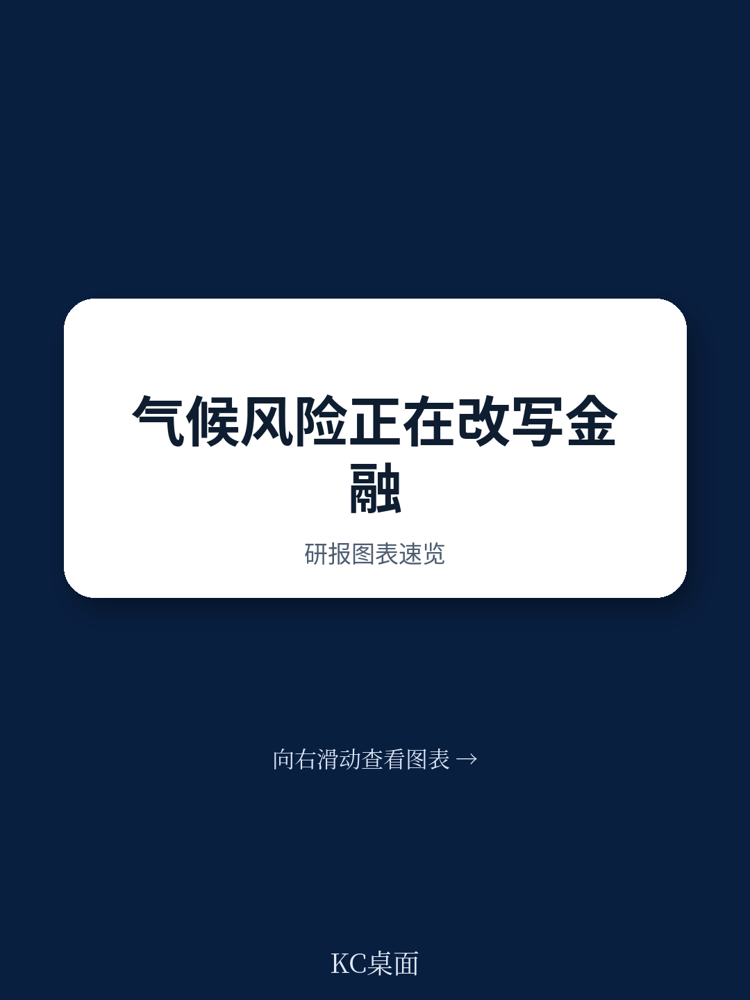
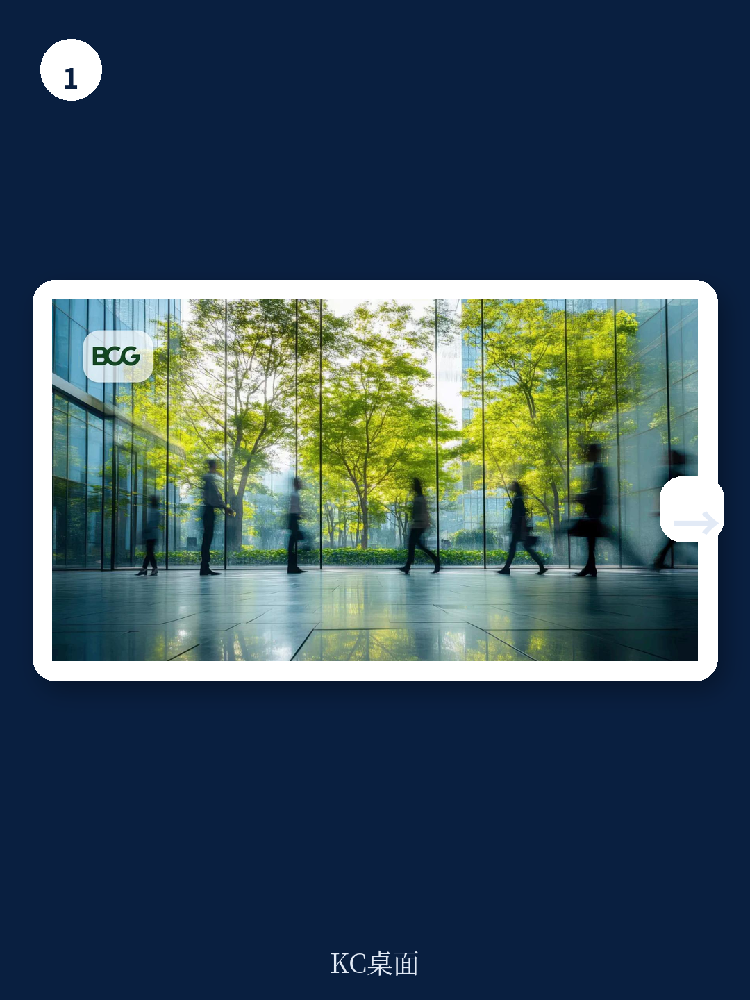
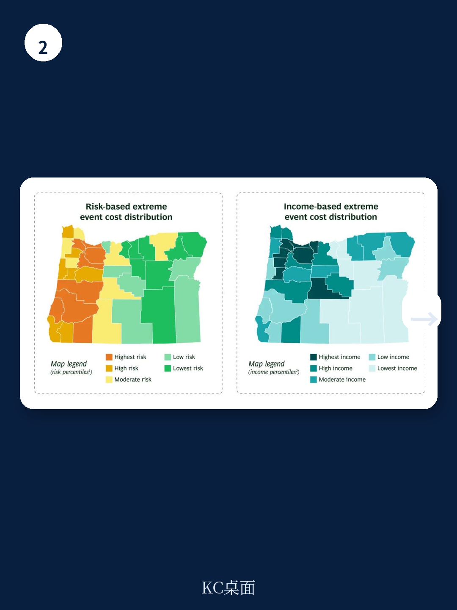

# 波士顿咨询：气候韧性最大误判，物理不确定性低的地方，资金更脆弱

传统的气候韧性战略只盯着物理损失：洪水淹没了几栋楼、飓风刮坏了多少屋顶、干旱毁掉了多少亩农田。波士顿咨询这份2026年7月发布的报告提出了一个更值得产业决策者关注的判断——气候不确定性的真正引爆点，正在从物理世界转移到资金系统。当保险、再保险、市政债券、大宗商品对冲这些“资金减震器”开始失灵，一次区域性的气候事件就可能触发连锁反应，造成比物理损失大得多的资金冲击。

报告的核心信号是：全球气候损失在以非线性方式增长，但吸收和分散这些损失的资金机制却在调整。这不是一个渐进出现变化的问题，而是一个接近临界点的问题。

## 1. 再保险和资本市场这两大“不确定性分散器”正在失效

过去二十年，全球自然灾害的保险损失翻了四倍。但同期，再保险资本和巨灾债券相对于这些损失的比例却下降了近三分之二。这意味着保险公司正在承担越来越多原本可以分散出去的不确定性。当一场特大灾害到来时，保险公司自身的偿付能力可能成为下一个引爆点。

> **KC评论：** 这张图值得仔细看。它说明的不是“保险不够用”，而是“分担不确定性的机制在调整”。读者可以追问：如果再保险和巨灾债券都跟不上，下一个不确定性承接方是谁？政府？还是最终落到家庭和企业头上？

报告没有完全展开的是，这种机制性调整对不同行业的影响差异很大。对于房地产、公用事业、农业和物流这类高暴露行业，保险公司调整承保范围或提高保费，会直接改变其成本结构和资产估值。

## 2. 物理不确定性低的地区，资金脆弱性可能更高

波士顿咨询的分析发现了一个反直觉的现象：在美国，五个接收最多联邦灾害资金的州（如佛罗里达、路易斯安那、加州）确实面临最高的物理不确定性。但另一个群体——密西西比、北卡罗来纳、俄克拉荷马等州——尽管物理不确定性评分较低，其房主保险的“不续保率”却同样高企。这意味着，一场中等规模的灾害在一个资金韧性薄弱的地区，可能造成比高物理不确定性地区更严重的连锁反应。

这个判断对企业和读者的启发是：评估气候不确定性不能只看物理地图。一个地区的保险渗透率、抵押贷款违约率、市政信用评级、家庭保费负担率，这些资金指标才是判断“哪里会先出问题”的关键。

## 3. 气候成本分配机制正在制造新的系统性不确定性

报告中最具政策含义的部分，是关于“损失如何分配”的讨论。在俄勒冈州的模拟分析中，同样的灾后损失，按不确定性分配和按收入分配，会导致截然不同的家庭负担分布。当前美国部分州的做法是，将超额损失通过“平摊附加费”的方式转嫁给所有保单持有人。结果是，低不确定性、低收入的家庭反而承担了最高比例的灾害成本，以钱包占比计算。

这种分配方式会引发一系列连锁反应：保费上升导致更多家庭放弃保险，未保险家庭在灾害后更容易违约，抵押贷款违约率上升冲击银行资产质量，地方政府税基调整，最终削弱整个地区研究未来韧性的能力。

> **KC评论：** 报告这里点到但没有深挖的一个问题是：如果气候成本分配不公，会不会反过来加剧社会和政治上的阻力，让更有力的气候适应政策更难落地？这是一个值得读者自行追问的维度。

## 4. 报告尚未完全回答的关键问题：谁为“尾部不确定性”买单？

波士顿咨询提出了一个清晰的框架——物理韧性、资金韧性、社会韧性三者缺一不可。但它也坦承“没有单一模板”。具体到操作层面，报告列举了澳大利亚的飓风再保险池、加勒比海的参数化保险等案例，证明政府兜底和公私合作是可行的。但这些案例都相对成熟，对于更复杂、更碎片化的市场（如美国各州各自为政的保险监管体系），如何建立一个跨州、跨行业的不确定性分担机制，报告并未给出明确路线图。

另一个未解问题是：当再保险和资本市场都退缩时，政府应该扮演什么角色？是最后贷款人，还是不确定性定价的规则制定者？不同角色的选择，会直接影响企业的融资成本和经营环境。

## 5. 给产业决策者的观察框架

基于这份报告，决策者可以建立一个三层观察框架

第一层，看物理暴露。自己的资产和供应链位于哪些灾害带，这是最基础的。

第二层，看资金韧性。所在地区的保险市场是否健康？再保险渠道是否畅通？市政信用评级有没有节奏变化不确定性？大宗商品市场是否因为地理集中和流动性不足而容易剧烈波动？

第三层，看社会韧性。家庭保费负担是否在快速上升？抵押贷款违约率有没有异常？地方政府是否有足够的财政空间应对下一次冲击？

这三个维度叠加的区域，才是真正的不确定性高发区。波士顿咨询报告最有价值的地方，不是给出了答案，而是提供了一个更完整的不确定性坐标。

For informational purposes only. Portions may be generated,translated,summarized,or edited with AI assistance based on source materials and may contain omissions or errors. Please verify independently. This is not investment,legal,tax,accounting,or other professional advice.
