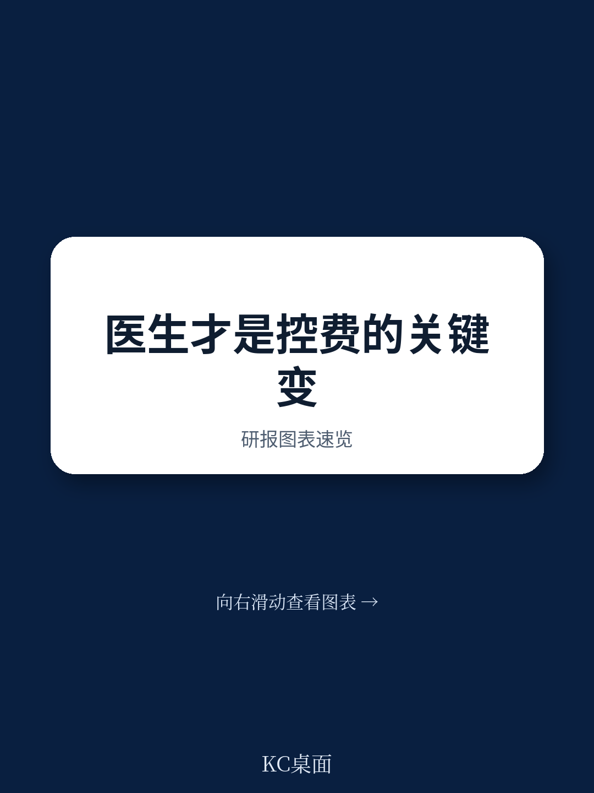

# 波士顿咨询：医生不是成本难题，而是医院控费真正引擎，波士顿咨询

医院管理者习惯将成本控制的焦点放在行政开支、非临床人员薪酬和可自由支配的运营费用上。波士顿咨询最新报告指出，这些努力方向虽然直观，却往往绕过了真正的大头——临床驱动的采购支出，尤其是医生偏好类物品，如外科植入物和生物制剂。

这份报告的核心判断是：医院最大的成本改善空间不在财务办公室，而在手术室和临床科室。但绝大多数机构并未触及这一领域，不是因为价值不存在，而是因为改变临床行为极其困难。波士顿咨询基于其与多家医疗系统的合作经验，提出了一条被证明有效的路径：将成本管理重新定义为临床优先事项，并在整个过程中嵌入医生的持续参与。

> **KC评论：** 这份报告的价值不在于告诉管理者“要省钱”，而在于指出“为什么过去省不下来”。许多医院在采购环节反复谈判却收效甚微，根源在于医生没有被真正纳入决策过程。当医生在方案成型后才被通知，他们自然把成本倡议视为行政指令而非临床共识。完整报告中包含一个关键案例对比，展示了同一个支出类别，在传统采购模式下与医生主导变革模式下，节约效果的天壤之别。

## 1. 临床采购中最大的成本陷阱，是“默认已经拿到了最优价”

第三方支出通常占医院运营总费用的30%至40%。其中相当比例与临床实践模式、历史供应商关系和科室习惯深度绑定。波士顿咨询观察到，许多机构对这部分支出存在三个误判：一是认为最佳价格已经谈妥；二是与供应商的关系根深蒂固，难以撼动；三是缺乏早期且持续的医生参与。

结果就是，成本改善努力沦为采购部门主导的零散招标，每年只能挤出边际收益。真正的结构性改善从未发生。报告明确指出，问题不在于识别机会，而在于建立抓住机会的组织能力。

## 2. 医生不是成本问题的障碍，而是解决方案的引擎

波士顿咨询的核心洞见是：医生参与不是成本改善的“最后一环”，而应是“第一原则”。成功的成本转型始于确立原则，而非设定节约目标。这些原则包括：患者临床结局不可妥协；差异化产品在影响疗效的地方必须保留；仅在产品临床等效时才进行整合。

当医生早期参与定义等效性标准、评估替代方案、分享基准数据时，他们从被动的“被说服者”转变为主动的“变革推动者”。报告特别指出，医生与供应商的长期关系往往被视为障碍，但在医生被充分动员后，这些关系反而成为强化医院谈判立场的资产。

> **KC评论：** 这一点对国内医疗管理者尤其有参考价值。中国公立医院面临的控费仍在调整同样巨大，但许多医院在耗材和药品管理上采取的是行政命令式压降，结果常常是执行层面反弹或形式合规。波士顿咨询的方法论强调“先共识、再行动”——医生需要看到数据、理解财务现实、参与制定标准，然后才能成为变革的同盟军。报告中列出的六项具体行动（如识别医生 champions、建立医生论坛、定期一对一沟通）可以视为可操作的检查清单。

## 3. 价值释放有两条路径，但能力建设才是真正的回报

医生参与创造的价值通过两条路径实现。外部路径：医生参与重塑供应商行为，强化谈判地位，支持基于项目和数量的定价讨论。内部路径：临床共识建立后，医院可以设置更清晰的使用规范，在保障专科选择的同时减少临床等效产品间的无谓差异。

波士顿咨询用一个实际案例证明了这套方法的威力。一家医疗系统对医生偏好类物品发起结构化招标，将医生与供应链、运营负责人配对参与谈判，整个过程围绕临床原则展开。结果与以往边际改善形成鲜明对比：供应商行为发生实质性转变，节约效果显著，同时临床结局未受影响。

但报告强调，更大的价值在于这套模式的可复制性。这家机构通过一次成功实践，建立了未来处理其他临床敏感领域变革的组织能力。这才是可持续成本管理的真正基础。

## 4. 报告未完全回答的问题：这套方法在中国场景下的适用边界

波士顿咨询的分析基于美国医疗系统，其医生关系、支付体系和医院治理结构与国内有显著差异。报告没有讨论的核心问题是：当医生薪酬结构不同、医院采购决策链条更长、供应商关系更复杂时，医生主导的成本变革是否依然有效？中国公立医院在耗材集采政策下，供应商议价空间已被大幅压缩，此时医生的角色更多转向“合理使用”而非“价格谈判”，波士顿咨询的方法论需要做哪些本地化调整？

这些问题报告没有展开，但恰恰是国内读者需要自己思考的下一步。