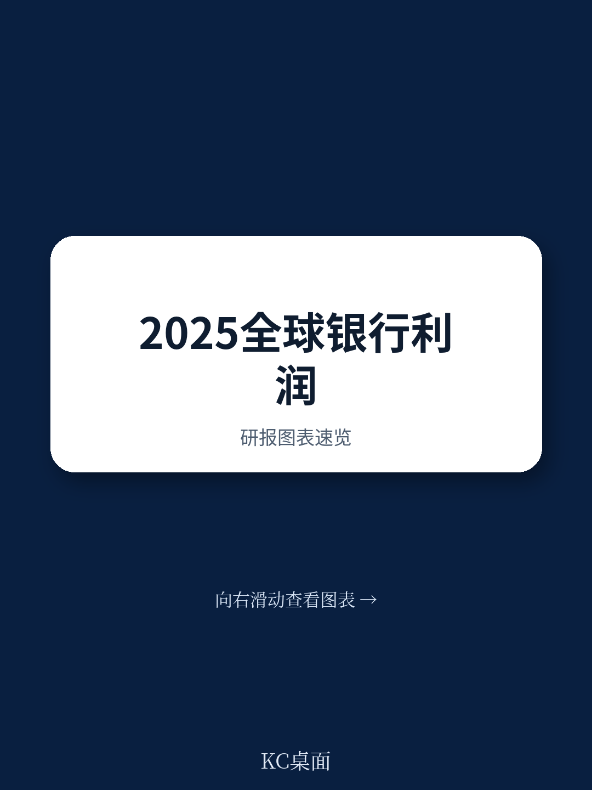
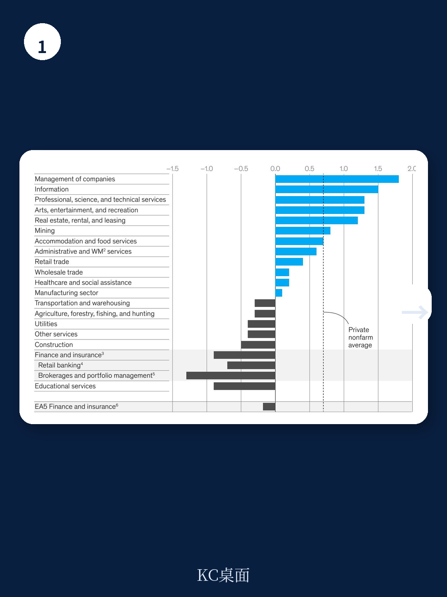
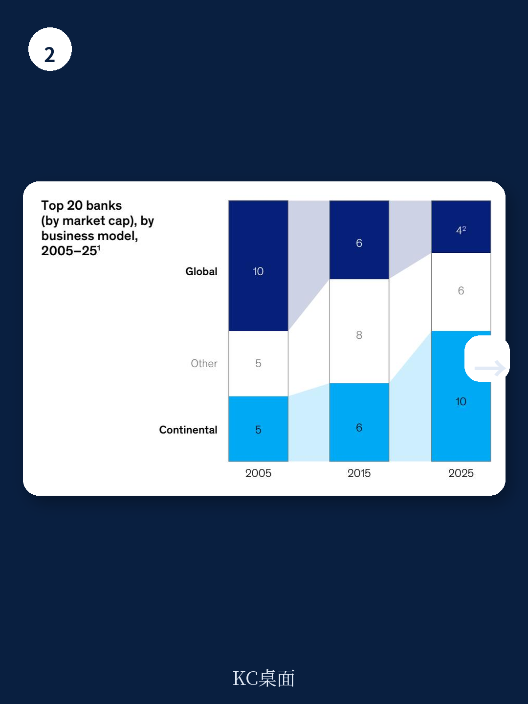

# 麦肯锡：AI时代银行不能只等对手出局，客户正绕过银行完成资金服务

2025年全球银行业净利润达到1.3万亿美元，同比增长7%，再次成为所有行业中盈利最高的板块。但这份麦肯锡《2026全球银行业年度报告》的核心判断并不在此：银行业的市场定价（P/B和P/E）依然是所有行业中最低的，读者享受了短期回报，却并未押注长期增长。报告认为，银行面临的真正挑战不是利润增速，而是“客户关系”这一核心资产正在被四股力量同时侵蚀，而银行过去赖以自保的“等对手出局”策略，在AI时代已不再有效。

这份报告是麦肯锡资金服务团队的最新成果，由Klaus Dallerup、Miklós Dietz、Pradip Patiath和Vik Sohoni领衔撰写。以下是我们提炼的三个核心观察。

## 1. 利润新高背后，银行赚钱的方式正在不可逆地改变

2025年全球资金系统管理的资金规模达到468万亿美元，但银行资产负债表上的份额从2022年的44%降至40%。这意味着银行越来越不靠“存贷差”赚钱，而是靠交易银行和分销业务——这两项业务现在贡献了47%的收入和57%的利润。

> **KC评论：** 资产负债表不再是银行的护城河。当收入和利润更多来自手续费和交易服务时，竞争门槛大幅降低，新进入者（尤其是fintech）的攻击面也更大。报告里那张“全球收入利润率从0.97降至0.94”的图表值得细看，它暗示银行必须在成本端更激进。

区域模型的分化也在加速。北美银行受益于财富管理流入，ROE达到12%；欧洲银行通过运营改善将ROE从10.7%提升至11.6%。但最值得注意的是，麦肯锡绘制了一张“新世界银行地图”，发现瑞典和芬兰的银行在“脱离资产负债表”和“成本效率”两个维度上同时做到了最优，为全球同行提供了可参照的路径。

## 2. 客户关系正在被四股力量同时瓦解，而银行没有时间等待

报告明确指出，银行业面临四个同时上升的挑战，其合力可能改写行业格局。第一，成熟的fintech（如Revolut、Nubank）已经拿走了行业17%的收入，并且还在扩张。第二，数字银行（neobank）突破了增长与盈利的边界，重新定义了客户对银行的期望。第三，AI代理和稳定币等技术让零售和企业客户可以“绕过银行”完成资金服务。第四，客户态度已到临界点——他们不仅偏好新进入者，而且对其信任度也在上升。

过去，银行应对威胁的策略是“等对手出局”。但这次不同：AI的采用速度是历史上最快的，年轻人和老年人在使用AI方面的速度差异正在消失。银行过去依赖的“年长客户迁移慢”这一优势将不复存在。

> **KC评论：** 报告没有详细展开的是，AI代理和稳定币对银行的影响可能不是渐进式的。一旦客户习惯通过AI代理管资金规划务，银行与客户的直接触点就会消失。这是比fintech争夺收入更根本的威胁。

## 3. 银行的应对框架：从“精准策略”升级为“多速组织”

麦肯锡在去年报告中提出的“精准策略”依然有效，但今年增加了一个关键变量：执行速度。报告建议银行采用“三速组织”模式：基础业务保持合规速度，非核心创新以更快节奏孵化，最前沿的AI和数字资产创新则在“沙盒”中以科技公司速度运行。

报告承认，这需要银行在文化上做出根本调整——更高的失败率、更大的不确定性、新的绩效预期。但这是银行“在技术变革和客户争夺战中保持相关性”的唯一路径。对最传统的银行和中小型机构来说，这反而是一个历史性机会：AI和数字资产允许后来者实现跨越式竞争。

**报告尚未完全回答的关键问题：** 银行如何在维持监管合规的同时，真正实现“三速”运转？目前多数银行的多速架构在激励机制和治理上仍不清晰。另外，地缘政治摩擦对银行资产负债表和跨境业务的长期影响，报告仅点到为止，值得持续跟踪。