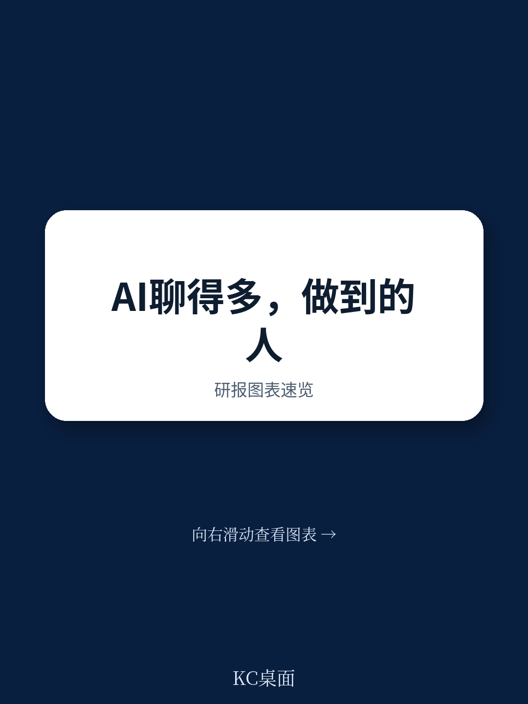
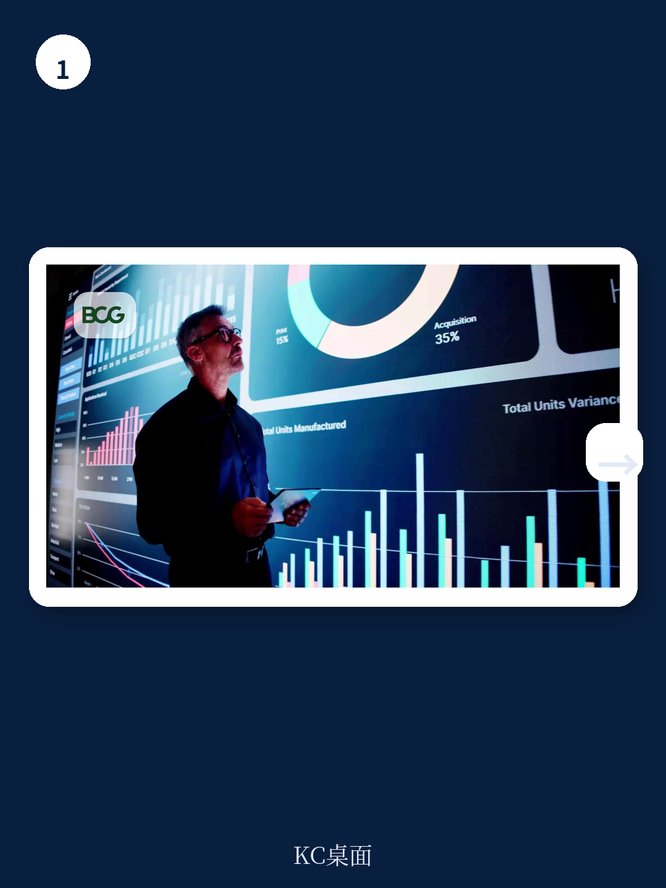
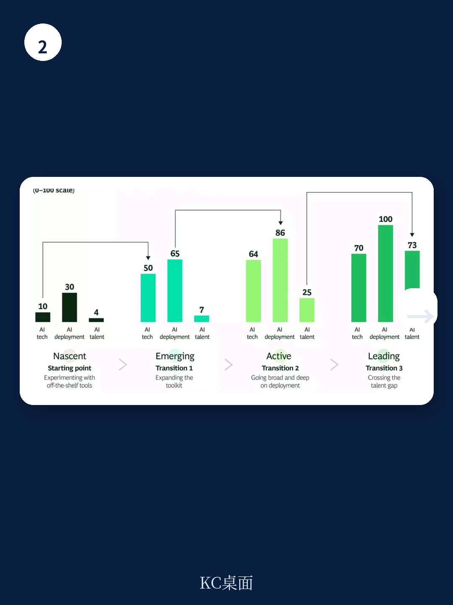

# 波士顿咨询：AI价值创造不是斜坡而是门槛，波士顿咨询揭晓6%真相

关于AI的讨论充斥每季度的业绩发布会。波士顿咨询（BCG）一项覆盖600余家美国上市公司的研究发现，CEO们在电话会上提及最多的主题就是AI。但这家咨询机构想回答一个更实在的问题：哪些公司真正把AI的讨论转化成了可衡量的业绩？

答案比多数人预想的更集中，也更反直觉。

BCG构建了一套从外部衡量AI应用成熟度的指标体系，涵盖技术栈、人才密度和部署深度三个维度。结果只有一个数字值得记住：**仅有6%的公司可以被定义为AI应用领导者。** 但这6%的企业在过去三年创造了行业调整后9.3个百分点的股东总回报（TSR）超额收益。更关键的是，这一超额收益并非来自市场情绪驱动的估值扩张，而是完全由基本面——营收增长和利润率提升——贡献。

这意味着一件事：AI的价值创造不是一条平缓的斜坡，而是一道陡峭的门槛。绝大多数公司还站在门槛之外。

## 1. 真正的价值不在效率，而在增长

外界对AI的主流叙事是自动化、降本和裁员。BCG的数据给出了另一个方向。在那些AI领导者中，只有10%选择了“用更少的人做同样的事”这一路径。59%的领导者走的是“用同样的人做更多的事”——他们将AI带来的生产力提升重新投入业务扩张，而不是转化为成本削减。

结果也很直接：这些领导者不仅在营收和利润率上领先，其员工人数增速也比行业中位数高出3个百分点。AI并没有让它们变得更“瘦”，而是让它们变得更大、更快。

> **KC评论：** 这组数据对任何正在制定AI战略的管理者都值得反复看。效率路径是入门，不是终点。如果一家公司把AI的回报定义在减少几个岗位或节省百分之几的运营成本上，它可能永远无法跨过那道价值门槛。报告里提到的IBM、Salesforce、Meta案例，完整原文中每个都有更具体的数字和机制拆解。

## 2. 人才是最后一关，也是最难的一关

BCG的分析揭示了一个清晰的进阶路径：从购买现成AI工具开始，到扩大部署范围，再到将试点转化为规模化生产。但真正区分“活跃”和“领先”两个梯队的，不是技术栈的丰富程度，也不是部署的广度和深度——这两个维度在梯队间的差距几乎可以忽略。

**拉开差距的是人才。** 在AI领导者中，拥有AI相关技能的员工占比达到13%，而在落后梯队中只有1%。更关键的是，AI专岗人员占比从后者的0.1%跃升至前者的3.5%。

BCG引用了一个内部长期观察的“10-20-70法则”：AI转型中，技术占10%的努力，算法和数据占20%，而人和组织变革占70%。当每个公司都能从同一个供应商买到同样的AI工具时，真正的护城河变成了组织能否将这些工具嵌入到自身业务的特定宏观环境逻辑中。人才不是锦上添花，而是从“试用AI”到“靠AI竞争”之间的决定性变量。

## 3. 报告没有完全回答的问题：这6%会扩大还是固化？

BCG的研究提供了清晰的横截面画像，但有一个问题它没有深入展开：**这6%的领先者是否会持续扩大优势，还是随着技术普及而被追赶？**

从逻辑上看，AI基础设施的持续商品化降低了入门门槛。但BCG的数据也暗示，人才和组织能力的差距可能比技术差距更难弥合。如果“10-20-70法则”成立，那么那些在人才和组织变革上投入不足的公司，即使买到了同样的工具，也可能永远停留在“活跃”梯队，无法跨越那道价值门槛。

另一个未解的问题是：非科技行业的AI领导者具备什么共性？BCG指出行业调整后的超额收益存在，但没有详细拆解哪些传统行业出现了真正的突破者。对于产业决策者来说，这可能是原文中最值得细读的部分——看看同行中那些跑出来的公司到底做对了什么。

> **KC评论：** 这份报告最有价值的不是那6%的结论，而是它给出了一个可操作的观察框架：不要只看一家公司说了多少AI，要看它的AI人才占比、部署深度和生产力增速。这三个指标比任何CEO在电话会上的表态都更能预测未来两三年的回报表现。

For informational purposes only. Portions may be generated,translated,summarized,or edited with AI assistance based on source materials and may contain omissions or errors. Please verify independently. This is not investment,legal,tax,accounting,or other professional advice.
