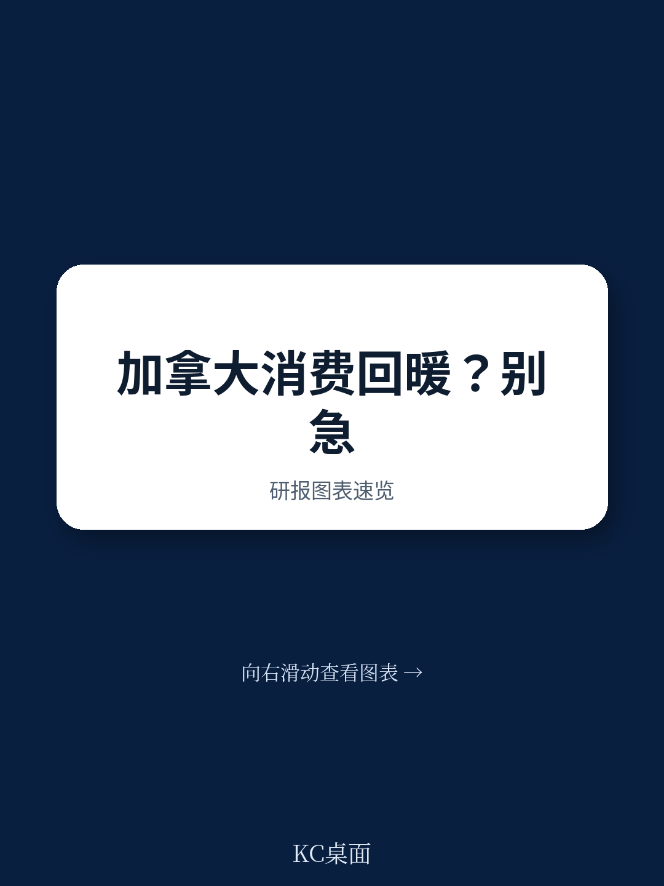
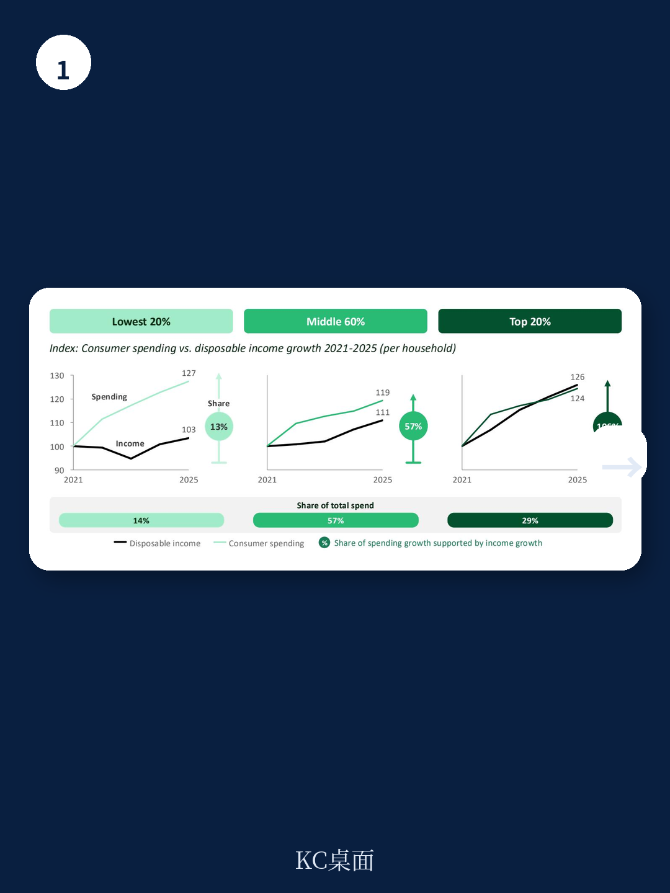
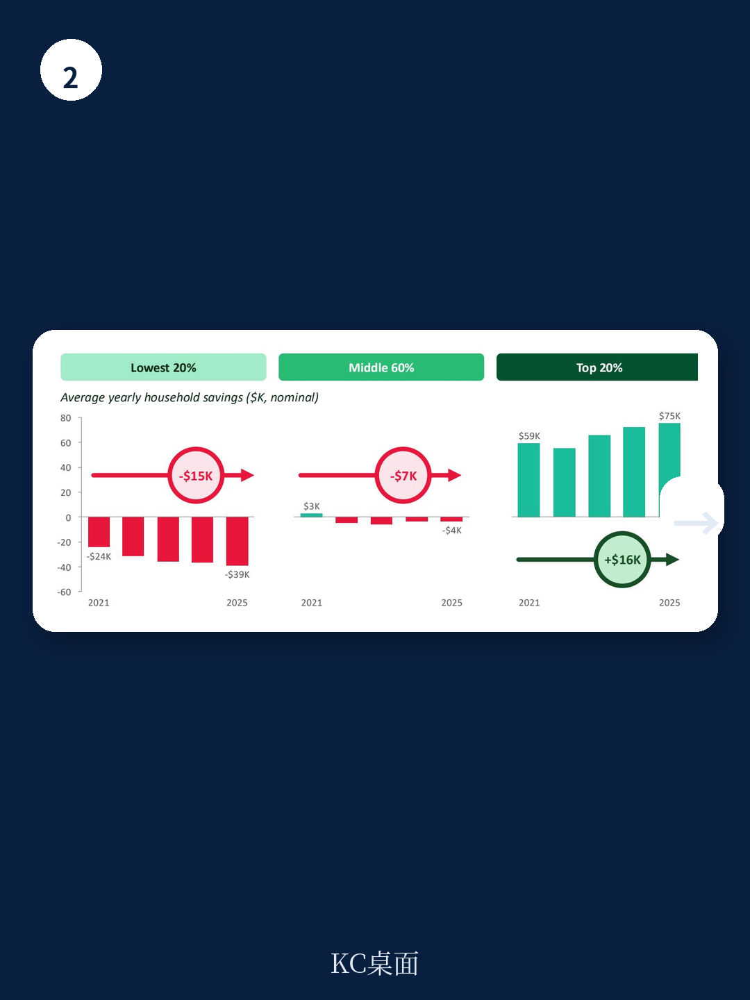

# 波士顿咨询：波士顿咨询拆解加拿大消费韧性，收入覆盖不足六成

加拿大2026年第一季度实际消费支出增长约2%，与十年均值持平，人均支出连续六个季度上升。如果只看这个数字，结论很直接：消费者韧性十足，宏观环境基本面健康。

但波士顿咨询（BCG）一份最新研报给出了完全不同方向的判断。报告标题已经点明：**这个信号的含义已经变了。**

增长确实存在，但来源正在切换。收入已不再是消费扩张的主要支撑。取而代之的是三个更脆弱的引擎：储蓄消耗、资产增值和借贷。而真正需要关注的，是中间60%的家庭——这是多数消费企业赖以生存的核心客群——正在向低收入群体的财务状态靠拢，而非向上。

> **KC评论：** 报告的真正价值不在于否定消费数据，而在于拆解了“支出增长”这个总量指标背后的结构性分化。对于任何以加拿大为重要市场的消费企业，这份报告提供了一个更精细的不确定性地图。完整报告中的四张图表，分别展示了收入覆盖、储蓄变化、资产分配和负债结构，值得仔细对照。

## 1. 收入只覆盖了中间家庭不到六成的新增支出

从2021年到2025年，加拿大各收入阶层的支出增幅大致相当：最低20%家庭支出增长27%，中间60%增长19%，最高20%增长24%。表面看，消费扩张是普适的。

真正的分化在于收入能否覆盖这些新增支出。最高20%是唯一一个收入增长完全匹配并支撑支出扩张的群体，覆盖了新增支出的106%。中间60%的收入增长只覆盖了每新增1美元中的57美分。最低20%几乎完全没有被收入覆盖。

这意味着，对于中间阶层而言，近一半的新增支出并非来自工资增长，而是来自其他来源。报告没有完全展开的是，这种“收入与支出脱钩”的状态已经持续了四年，而非一个季度的异常波动。

## 2. 中间60%家庭的储蓄已转为负值，资产增值是唯一缓冲

储蓄数据验证了上述判断。从2021年到2025年，最高20%家庭的年储蓄在增加，而其余80%家庭的储蓄在持续出现变化。中间60%家庭从微弱的正储蓄状态转为支出超过收入，每户年均储蓄出现变化约7000美元。最低20%家庭年均储蓄下降约15000美元。

资产增值在一定程度上缓解了不确定性。最高80%的家庭总资产增长了13%到26%，主要得益于市场估值上升。这种“财富效应”为家庭提供了继续消费的信心，也为部分家庭提供了借贷的抵押品。但最低20%家庭的总资产缩水了2%，他们既没有资产增值带来的信心，也没有可借贷的抵押物。

> **KC评论：** 这里的关键矛盾在于，资产增值带来的“纸面财富”高度集中在最高收入群体，而中间家庭的资产多为房产等流动性差的资产。一旦资产价格出现调整，或者利率继续上升，中间家庭将同时面临资产缩水和偿债不确定性上升的双重挤压。报告没有直接给出这个情景下的不确定性测试，但这是企业制定明年计划时应该自行推演的。

## 3. 借贷填补了缺口，但利率环境正在收紧

当收入跟不上、储蓄变薄，借贷就成为了维持支出的最后一根支柱。中间60%家庭的负债增长最快，达到22%。最低20%家庭的负债增加了17%，而同期资产基础却在调整，每户净财富减少约35000美元。

波士顿咨询在报告中特别指出，加拿大公司估值相对于宏观环境规模处于25年高位，五年期国债回报表现在最近几个月上升了约40个基点。如果资产价格走软而借贷成本攀升，缓冲最薄弱的家庭几乎没有空间吸收冲击。

报告提出的三个建议值得企业重视：中间消费者可能变得更注重性价比，信贷条件对需求的影响将更加显著，以及资产增值不会均匀地转化为支出——尤其是在汽车、奢侈品、餐饮和宠物护理等跨收入群体消费差异较大的品类上。

**一个尚未完全回答的问题是：如果资产价格维持高位但通胀因油价上升而重新抬头，消费者的实际购买力将如何变化？** 波士顿咨询的框架暗示，这种组合对中间和低收入家庭可能是最糟糕的情景——他们既无法从资产增值中获益，又要面对更高的生活成本。但对于最高收入群体，这种情景的影响可能有限。加拿大消费市场的二元分化，正在从一种观察变成企业必须纳入战略规划的现实。