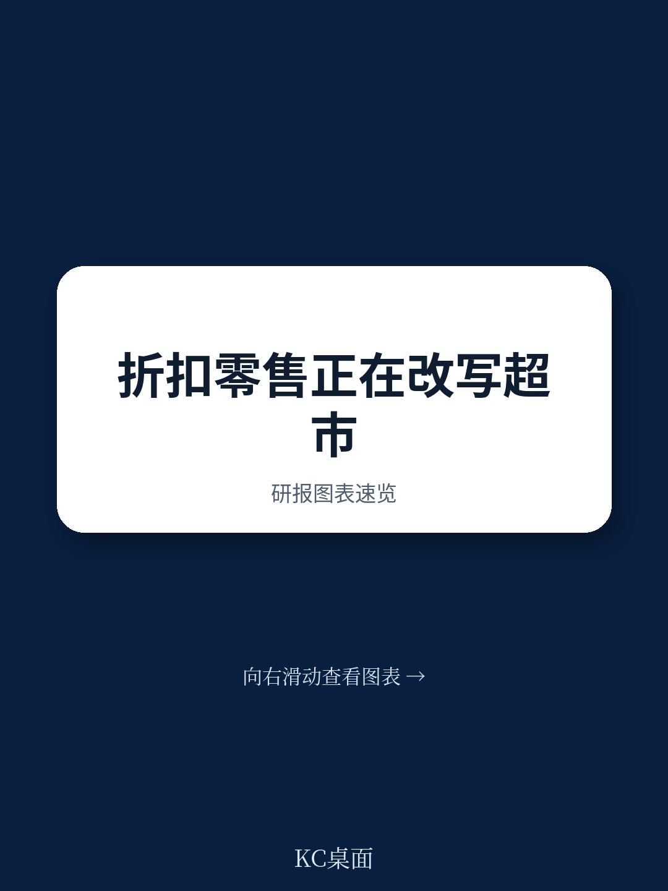
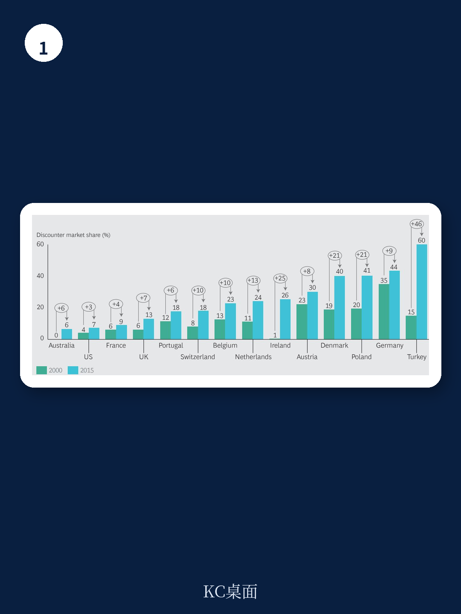

# 波士顿咨询：折扣超市占据过半市场？波士顿咨询称这不是预警而是现实

折扣超市的崛起已经不再是“宏观环境节奏变化时的替代选择”，而是一场结构性的行业重塑。波士顿咨询这份最新报告的核心判断是：折扣超市正在从“低价简陋”的业态进化为“高质低价”的主流渠道，在许多地区，它们即将占据超过一半的市场份额。这不是威胁预警，而是行业格局已经发生根本性变化的信号。

过去十年，折扣超市不再满足于用有限品类和简陋店面吸引价格敏感人群。它们开始开设更大的门店，扩充生鲜和有机产品线，在盲测中击败传统品牌的自有产品，并通过精心设计的店面体验赢得顾客提到度。更关键的是，它们的客户群已经从低收入群体扩展到了高收入、精明的消费者——这些人开始问一个根本问题：“我为什么要多付钱？”

> **KC评论：** 这份报告最值得关注的不是折扣超市的增速，而是它们已经打破了“低价=低质”的消费者心智。当高收入群体开始主动选择折扣渠道，传统超市的定价权就出现了不可逆的裂缝。报告中的BAI（品牌倡导指数）数据值得细看，它揭示了折扣超市如何将价格优势转化为品牌忠诚度。

## 1. 折扣超市的扩张已进入“自我强化”阶段，传统玩家很难靠等待逆转

波士顿咨询将折扣超市的发展分为三个阶段：萌芽期（市场份额低于15%）、扩张期（15%-40%）、成熟期（超过35%）。在德国、挪威、丹麦等成熟市场，折扣超市已占据超过35%的份额，传统玩家即便反击，也难以扭转趋势。

更值得警惕的是扩张期市场。在比利时、波兰等地，折扣超市已建立高效运营模型，单店坪效远超传统超市，并正在通过新店复制加速渗透。报告提到，Lidl计划在波兰开设200家门店，在罗马尼亚开设100家。这不是零星的试水，而是系统性的市场占领。

## 2. 传统超市只有两个战略选项，但“什么都不做”只在萌芽期成立

面对折扣超市的冲击，波士顿咨询给出了两条清晰的路径：一是彻底改造运营模型和成本结构，二是推出独立的折扣子品牌。

第一条路要求传统超市在价格敏感品类（如罐头、纸品、清洁用品）上大幅缩小与折扣超市的价差，同时在生鲜、熟食等差异化品类上发挥规模和服务优势。报告指出，降价5%需要削减7.5%的运营成本——这不是小修小补，而是需要从供应链、品类管理到门店运营的系统性变革。

第二条路更为激进。报告以瑞士的Migros和法国的Carrefour为例，说明成功推出折扣子品牌需要将其独立运营，拥有独立的采购、定价和门店管理团队，甚至完全不同的企业文化。这意味着传统超市需要同时管理两套逻辑：一套服务追求品质和体验的客户，另一套服务追求极致性价比的客户。

> **KC评论：** 报告没有完全展开的一点是，这两条路径对组织能力的要求截然不同。改造现有业务需要的是“在旧体系内做减法”，而推出折扣子品牌则需要“在旧体系外建新体系”。大多数传统超市在组织惯性和文化冲突面前，往往两条路都走不通。报告建议在萌芽期市场可以“什么都不做”，但这其实是一种战略选择，而非被动等待。

## 3. 报告尚未完全回答的关键问题：折扣超市的“天花板”在哪里？

波士顿咨询的报告展现了折扣超市的强劲势头，但也留下了一个关键悬念：折扣超市的扩张是否存在边界？

报告自身也指出了不确定性：过度扩张可能破坏折扣超市最核心的竞争力——简单高效的运营模型。进入新市场需要建立复杂的配送网络，增加产品品类会带来供应链复杂性，提升门店体验则可能推高成本。报告提到，已有少数折扣超市因扩张过快导致管理层更替。

这个问题在报告中未被充分展开：当折扣超市的市场份额接近50%甚至更高时，它们是否会面临与传统超市类似的“规模不宏观环境”？在成熟市场，折扣超市之间的竞争是否会挤压利润空间？这些问题，或许需要读者在完整报告中寻找更细致的分析框架。

## 4. 对行业观察者而言，需要跟踪的三个关键指标

波士顿咨询的报告提供了一个清晰的观察框架。对于关注零售行业变化的读者，以下三个指标值得持续跟踪

第一，折扣超市的坪效增速是否持续高于传统超市。这决定了折扣超市是否有能力继续研究于品质和体验提升。

第二，传统超市的“价格敏感品类”与“差异化品类”的毛利率变化。如果传统超市在差异化品类上也无法维持溢价，说明折扣超市的冲击已经蔓延到所有品类。

第三，折扣超市在新市场的首店表现和复购率。这比门店数量更能反映其模式的可复制性。

折扣超市的崛起不是一场短跑，而是一场马拉松。波士顿咨询的报告提醒所有行业参与者：规则已经改变，等待只会让竞争变得更难。

For informational purposes only. Portions may be generated,translated,summarized,or edited with AI assistance based on source materials and may contain omissions or errors. Please verify independently. This is not investment,legal,tax,accounting,or other professional advice.
