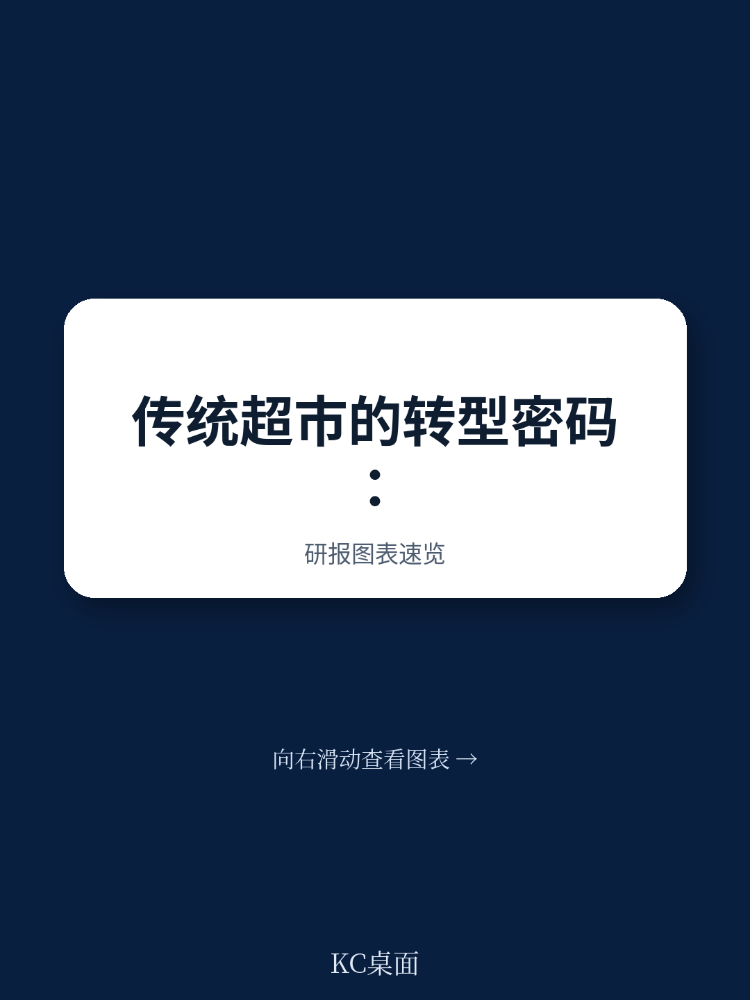
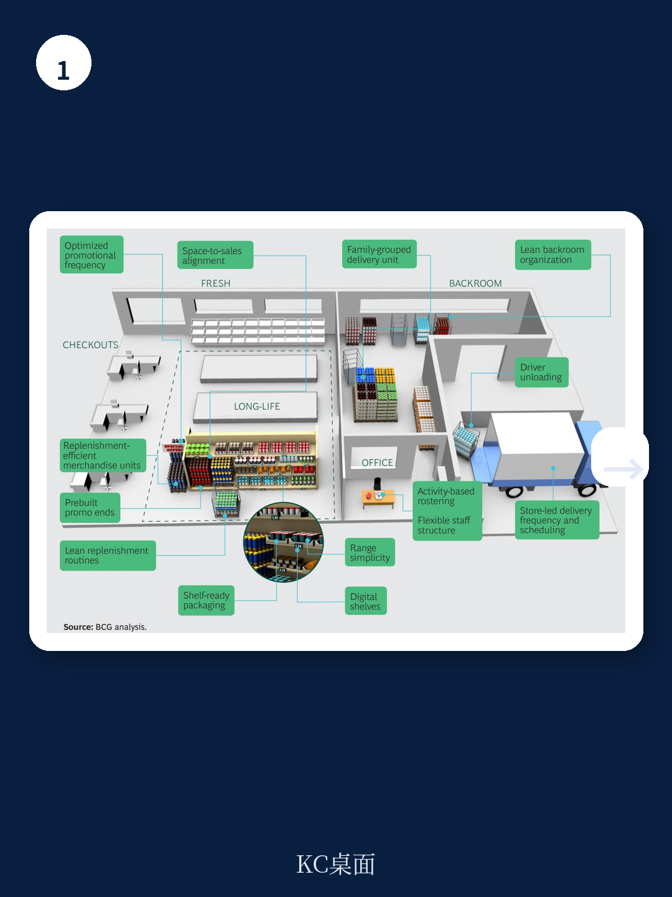

# 波士顿咨询：超市运营利润提升1-3个百分点的秘密，不是降本，而是重置流程

传统超市正面临折扣店、会员店和电商的多面夹击，多数人的应对方法是供应链降本、门店减员、减少损耗。但波士顿咨询一份深度研报指出，这条路走不通。报告的核心判断是：传统超市真正需要的不是零敲碎打的优化，而是一场以顾客为起点的运营模式重置。这不是一个效率改善项目，而是一次战略级重构。

报告认为，那些敢于从顾客真实需求出发、重新设计端到端流程的超市，有机会将运营利润率提升1到3个百分点。这个数字听起来不大，但放在整个行业，意味着可以腾出数十亿美元重新投入价格、服务和体验，而这恰恰是传统超市生存的关键。

## 1. 多数超市的优化方向一开始就错了

波士顿咨询发现，传统超市的普遍问题不是不努力，而是努力的方向偏了。大多数企业把目标框定在“降低成本”和“提升效率”上，结果往往是每个部门都在自己的孤井里做优化：供应链团队压缩库存，门店团队削减工时，损耗团队盯着过期商品。这些动作各自有道理，但放在一起，反而可能损害顾客体验。

报告举了一个典型案例：一家欧洲超市因SKU过多导致补货效率下降、库存成本上升，同时顾客面对琳琅满目的货架反而感到困惑。传统的做法可能是进一步削减SKU或压缩补货人手，但波士顿咨询的建议是成立跨职能团队，从顾客需求出发重新梳理品类结构、优化货架布局、与供应商重新谈判。结果顾客满意度提升，品类销售额实现个位数增长，毛利率显著改善，从配送中心到门店的端到端运营成本也下降了两位数。

这个案例说明一个道理：当优化目标从“省钱”转向“让顾客满意”，反而更容易找到成本与体验的双赢点。

## 2. 真正的杠杆藏在端到端流程里，不是单一职能

报告提出了一个关键框架：超市运营重置需要三个步骤——识别顾客真正看重的价值、重新设计端到端运营模式、让改变持续落地。

其中最具洞察力的一步是“识别顾客价值”。波士顿咨询强调，不能把顾客价值定义得太宽泛。“性价比高”“选择多”这类说法听起来没错，但落到具体操作层面毫无帮助。真正有价值的洞察必须细化到部门甚至品类。比如，一家超市的面包房顾客可能最在意“早上7点到晚上7点都能买到刚出炉的面包”。这是一个可以倒推出排班、烘焙流程、补货节奏的清晰目标。

> **KC评论：** 这个观点对国内超市尤其有意义。很多企业做“以顾客为中心”，最后变成了做一堆满意度调查，却无法指导任何具体操作。波士顿咨询的方法论是：把顾客价值拆解到可执行的颗粒度，然后反向设计流程。完整报告里对“端到端流程设计”有更细的拆解，值得仔细看。

## 3. 让改变落地，比设计更难

报告指出，许多超市的转型失败不是因为方向不对，而是因为执行层面出了问题。波士顿咨询提出了一个“门店引领”的变革方法论：先在一个门店做快速原型测试，验证方案后再扩展到23家店，接着是230家，最后铺开到整个网络。每一步都有明确的时间表、里程碑和培训机制。

报告还特别提到一个细节：一家大型超市在解决生鲜损耗问题时，发现门店端只占问题根源的一半，另一半来自上游供应链。管理层公开承诺，这不是门店的“减亏任务”，而是跨职能的共同责任。这种表态看似简单，但对一线员工的信任和参与度至关重要。

## 4. 报告没有完全回答的问题

波士顿咨询的框架逻辑清晰，但有几个关键问题并未深入展开。第一，超市行业普遍存在的“组织孤井”如何真正打破？报告建议设立跨职能的“影子委员会”，但没有说明这种治理结构如何与现有的绩效考核、晋升体系兼容。第二，技术投入的节奏和优先级缺乏量化指引。报告提到了无人收银、仓储自动化、智能传感器等方向，但对不同规模、不同区域的超市而言，哪些技术应该先投、哪些可以等，没有给出判断标准。

这些空白恰恰是决策者需要结合自身情况填补的部分。波士顿咨询的方法论提供了一个思考框架，但最终的选择仍然取决于企业的具体竞争环境和资源禀赋。

对于传统超市来说，波士顿咨询的这份报告提供了一个清晰的信号：与其在旧模式里继续“挤毛巾”，不如回到顾客这个起点，重新思考运营的本质。那些敢于这样做的企业，可能正是下一个十年里活下来的那批。

For informational purposes only. Portions may be generated,translated,summarized,or edited with AI assistance based on source materials and may contain omissions or errors. Please verify independently. This is not investment,legal,tax,accounting,or other professional advice.
