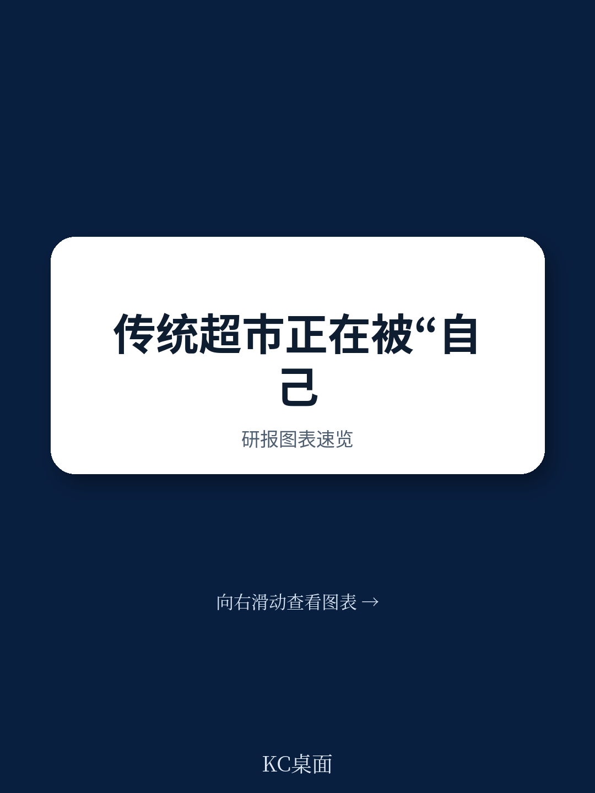
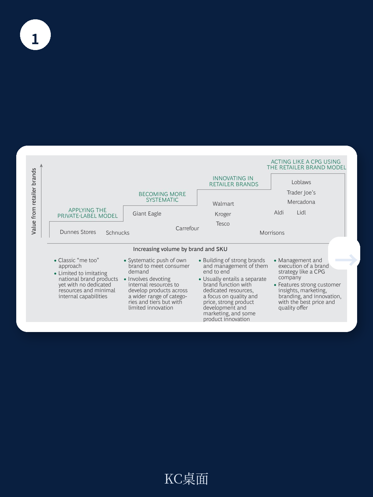
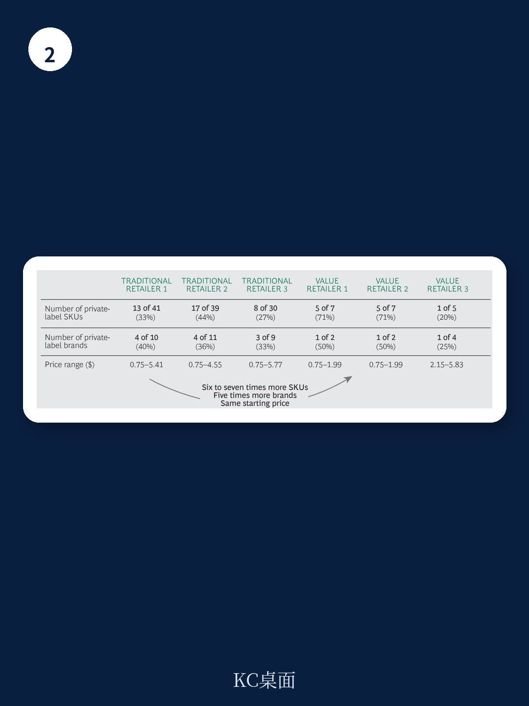

# 波士顿咨询：超市行业新战场，不是价格战而是品牌战，折扣店已领先15年

传统超市的自有品牌业务正面临一个尴尬的转折点。它们拥有大量SKU，却既无法在品质上追赶国家品牌，也无法在价格上匹敌折扣店的内生品牌。波士顿咨询最新报告指出，问题的根源不在于产品本身，而在于运营逻辑——超市需要从“卖货渠道”转变为“品牌经营者”。

报告的核心判断相当尖锐：传统超市目前的自有品牌策略，是“最差的两个世界”——既没有国家品牌的资产价值，也无法在价格或品质上击败折扣店。而折扣店如Aldi、Lidl、Mercadona的成功，恰恰证明了一件事：当超市像消费品牌一样思考时，它们能同时实现差异化、降低成本并提高客户忠诚度。

## 1. 折扣店正在用“品牌思维”重塑行业规则

报告以服装行业为类比，指出多品牌零售商（如百货公司）的困境正在超市行业重演。Zara和H&M通过控制从设计到门店的全链条，实现了更短的交付周期和更低的成本。折扣超市正在做同样的事：它们开发自己的产品，控制生产（Lidl甚至自产冰淇淋和巧克力），并通过更少的SKU实现更高效的供应链。

以蛋黄酱品类为例，传统超市的SKU数量是折扣店的3-5倍，但价格区间却更宽，从0.75美元到5.77美元不等。而折扣店的价格集中在0.75-1.99美元，且自有品牌占比高达71%。这种简化不仅降低了运营成本，还让消费者在更低的价格点上获得了不逊于国家品牌的品质。

> **KC评论：** 这张表格值得细看。它揭示了传统超市的“复杂性陷阱”：为了覆盖所有价格带，它们不得不增加SKU，但每个SKU的销量和利润都不足以支撑其存在。折扣店的选择是“少而精”，用爆款逻辑替代全覆盖逻辑。

## 2. 从“自有品牌”到“零售商品牌”的转型路径

波士顿咨询提出了三种品牌架构模型。最传统的是“单一主品牌”，即所有自有产品都使用超市名称。但报告认为这已不足以形成差异化。更优的选择是“品类专属品牌”，如Mercadona的Deliplus（化妆品）、Hacendado（包装食品）、Compy（宠物食品），这些品牌在消费者眼中就是独立品牌，与超市名称无关。

Mercadona的案例尤其值得关注。这家西班牙超市巨头通过13个创新中心，每年邀请超过8000名顾客试用在开发中的产品。例如，观察到家庭主妇用醋清洁瓷砖地板后，它开发了Bosque Verde系列的醋基清洁产品。这种“从顾客需求出发”的产品开发逻辑，正是传统超市最欠缺的能力。

## 3. 组织变革是最大障碍，而非产品本身

报告指出，传统超市需要设立专门的零售商品牌部门，这个部门必须拥有足够的权力和问责制，能够直接获取顾客洞察，并与营销、质量、品类管理等职能紧密协作。同时，KPI和激励机制需要重新设计——Migros的案例表明，基于产品价值的激励系统比基于销量的系统更有效。

但这里存在一个尚未完全回答的问题：如何在发展自有品牌的同时，维持与国家品牌供应商的关系？许多传统超市的利润高度依赖国家品牌的进场费和营销支持。如果自有品牌做得太好，国家品牌可能会减少合作甚至撤出。报告提到了“探索合作与联盟”的方案，如Costco与Starbucks合作推出Kirkland Signature品牌，但这更多是特例而非通则。

## 4. 报告尚未完全回答的关键问题

波士顿咨询的分析逻辑清晰，但有两个问题值得进一步追问。第一，传统超市的转型需要多长时间？Mercadona用了15年才建立今天的竞争优势，而许多传统超市的股东可能没有这样的耐心。第二，线上渠道的威胁是否被低估？报告提到了CPG公司直接触达消费者的趋势，但并未深入讨论线上生鲜平台（如Ocado、FreshDirect）对传统超市的冲击。这些平台同样可以推出自有品牌，且数字化能力更强。

> **KC评论：** 对于读者和行业观察者而言，关注点不应只是“哪家超市在推自有品牌”，而应是“是否建立了独立的品牌开发能力、创新中心和供应链效率”。没有这些基础设施，自有品牌只是另一个成本中心。

报告最后给出的判断值得反复琢磨：传统超市不是没有选择，而是选择已经变得非常有限。继续维持现状，将不断丢失份额给折扣店和线上玩家；而转向品牌化运营，则需要投入巨大的资源和决心。这场转型，考验的不只是产品策略，更是整个组织的基因。

For informational purposes only. Portions may be generated,translated,summarized,or edited with AI assistance based on source materials and may contain omissions or errors. Please verify independently. This is not investment,legal,tax,accounting,or other professional advice.
