# McKinsey Global Institute: 2025 in charts

Here are some of the McKinsey Global Institute's favorite data visualizations from 2025.

In 2025, we are no longer on the cusp of a new era, but truly in it. This year, MGI's fact-based insights helped make sense of the latest business and economic signals. We found that just a few “Standout” firms can move the productivity needle for entire economies. We also put forward new reasons to accelerate national productivity now, so that countries can grow their way to balance-sheet health and drive prosperity. We explored ways in which the private sector could help lift more people above an “empowerment line” to meet essential needs and otherwise advance beyond ESG checklists. As trade policy shifts and other geopolitical developments packed some surprises, we updated our analysis of the geometry of global trade and looked to foreign direct investment (FDI) as a window to what may come next. We also introduced a “rearrangement ratio” to better understand potential knock-on effects of US–China trade tensions.

To understand the demographics and other defining hallmarks of our new era, we delved into the consequences of falling fertility and increasing longevity. We took stock of where the energy transition stands and tallied the costs and benefits of meeting climate adaptation challenges. We also explored labor market dynamics through the lens of work-experience trajectories and emerging skills partnerships with robots and agents in the age of AI. The following data visualizations, grouped into our five core research themes, encapsulate some of our key findings over the past year.

## Productivity & Prosperity

Creating and harnessing the world's assets

most productively

## Single firms can move the productivity

needle for entire economies—the “power of one.” In fact, fewer than 100 of the 8,300 large firms in our study sample account for 63 percent of productivity growth observed in the three countries analyzed. Dubbed “Standouts,” these companies generated the majority of productivity growth in powerful bursts rather than in a smooth trickle of gradual change, and through bold strategic moves, top-line growth, and portfolio shifts more than efficiency gains. This is a more concentrated, dynamic, and sporadic pattern than existing literature tends to highlight, with progress on productivity being defined by a few firms moving a mile rather than many firms moving an inch.

## A few 'Standout' firms shape the majority of productivity growth.

Share of national sample's productivity growth, %

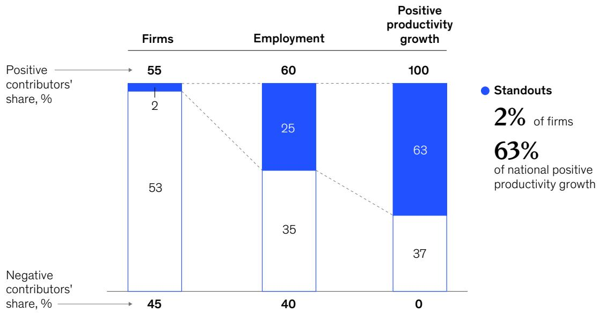  
Source: The power of one: How standout firms grow national productivity, McKinsey Global Institute, May 2025

McKinsey & Company

Entering 2025, the world's wealth reached its highest level ever. Yet much of its growth came from asset price increases, funded by a proliferation of debt, rather than new saving and investment. Borrowing a page from corporate finance, we constructed a “global balance sheet” of the world's assets and liabilities as a new lens into the economy. Households gained \$400 trillion in wealth between 2000 and 2024, but only about \$100 trillion was cumulative net investment to build new wealth, while three-quarters of the gains were from assets' appreciation on paper and general inflation, not fully backed by economic growth.

## One-third of global household wealth growth since 2000 was on paper.

Decomposition of growth in global household net worth, 2000–24, \$ trillion

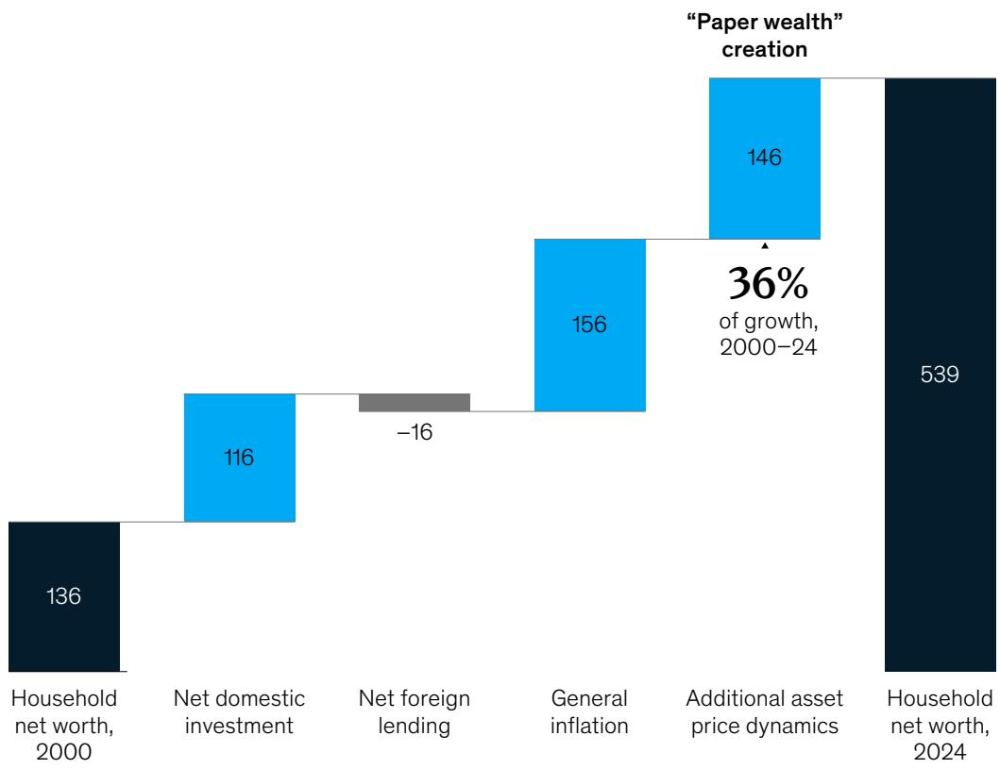  
Source: Out of balance: What's next for growth, wealth, and debt?, McKinsey Global Institute, October 2025

McKinsey & Company

Number of mandatory ESG regulations globally

After a decade of expansion, ESG as a framework to measure a company's societal impact is undergoing a rethink. At the median, large companies today manage 100 environmental, social, and governance (ESG) KPIs. The rapid proliferation of ESG metrics and ongoing disagreements about prioritization—both within companies and in public discourse—have made knowing where business and societal goals do and don't align difficult. We analyzed a representative set of 18 environmental and societal issues to see where companies can apply their capabilities and innovate to make a real difference.

Attention to ESG has increased significantly in the past decade.

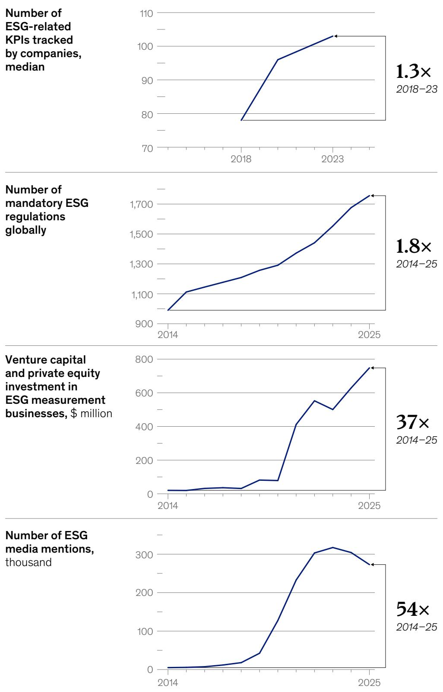  
Source: Beyond ESG: From checklists to capabilities, McKinsey Global Institute, September 2025

McKinsey & Company

If Indonesia is to meet an ambition of becoming a high-income economy by 2045, productivity growth would need to be the primary driver of its 5.4 percent annual GDP growth. The contribution from population and labor force participation factors would be lower in the years ahead, likely accounting for about 0.5 percentage points of GDP growth—less than one-third of what it has been since 2000 at 1.8 percent. The balance would need to come from productivity growth, which would have to increase 1.6 times from the 3.1 percent CAGR that Indonesia achieved between 2000 and 2023 to 4.9 percent.

The year in which Indonesia reaches high-income status depends on how fast it can accelerate growth, especially productivity growth.

Year reaching high-income status based on benchmarks' annualized GDP growth rate, %

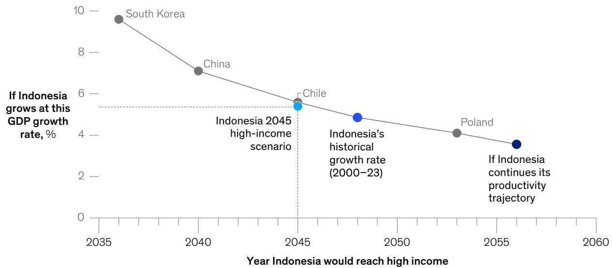  
Implied real GDP growth rate decomposition, percentage points

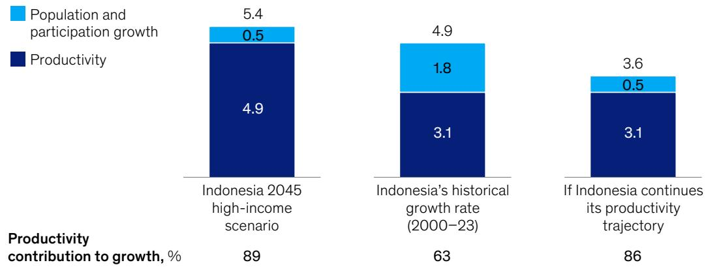  
Source: The enterprising archipelago: Propelling Indonesia's productivity, McKinsey Global Institute, April 2025

McKinsey & Company

## Global Connections

Exploring how flows of goods, people, and ideas shape economies

## Trade reconfiguration continues along

geopolitical lines. The most significant ongoing shift in trade patterns is a fall in the average geopolitical distance of trade: It declined by about 7 percent between 2017 and 2024, a period that witnessed ongoing trade tensions between the United States and China as well as Russia's invasion of Ukraine. Economies at each end of the geopolitical spectrum have been trading less with one another: China, Germany, and the United States have experienced sharp reductions in the geopolitical distance of trade. By contrast, the average geographic distance of trade has been climbing very slowly, but steadily by about 10 kilometers each year over the past decade. This appeared to continue through 2024. Global import concentration—that is, the breadth of trading relationships an economy relies on for each of the goods it imports—also remained stable.

## Trade is traveling shorter geopolitical distances.

## Evolution of goods trade indicators, 2000–24E

Geographic distance traveled by trade, thousand km, value-weighted average

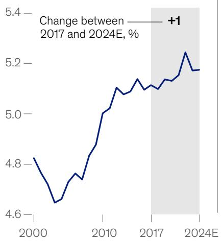  
Geopolitical distance traveled by trade, value-weighted average, 0–10 scale

McKinsey & Company

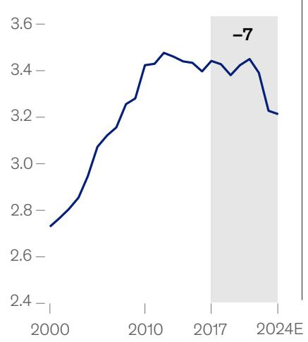  
Source: Geopolitics and the geometry of global trade: 2025 update, McKinsey Global Institute, January 2025  
Import concentration, Herfindahl-Hirschman Index

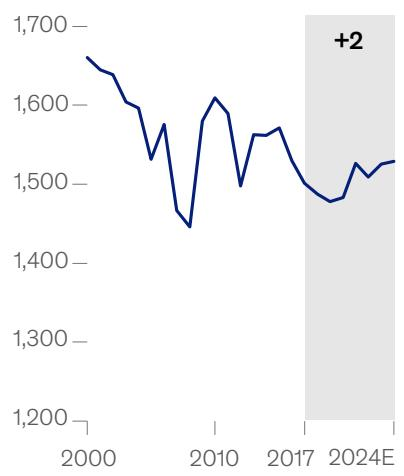

## Recent patterns of foreign direct investment (FDI) announcements signal a new

shake-up. FDI promises to shape advanced manufacturing—including semiconductors, electric vehicles, and batteries—alongside communications and software (mostly AI infrastructure), and the resources that power them. Since 2022, three-quarters of cross-border announcements have gone to these types of future-shaping industries as well as energy and mining projects—up from about half pre-2020. If successful, FDI projects announced since 2022 could more than quadruple current battery manufacturing capacity outside China, nearly double the global data center capacity that powers AI, and draw the United States into the circle of top leading-edge semiconductor-producing nations. These patterns show how trade corridors are shifting, country competitiveness is evolving, and new business ecosystems are emerging worldwide.

## FDI in semiconductors reconfigured sharply toward the United States.

Semiconductors: Top 25 corridors by announced greenfield FDI, \$ billion

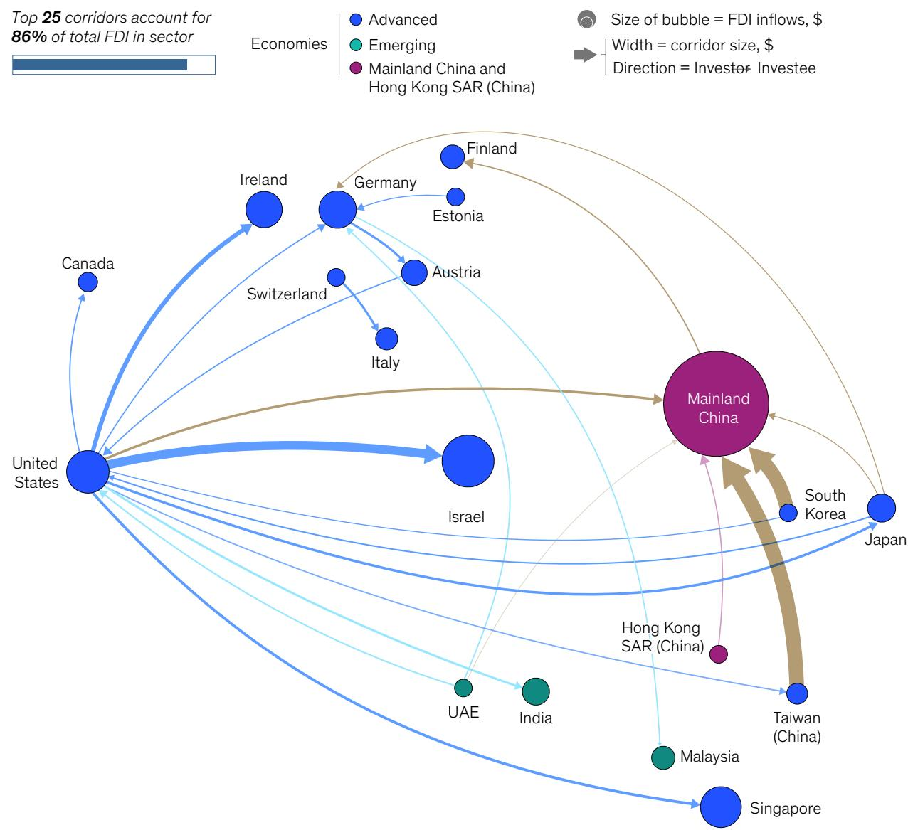  
Source: The FDI shake-up: How foreign direct investment today may shape industry and trade tomorrow, McKinsey Global Institute, September 2025

McKinsey & Company

2022–25  
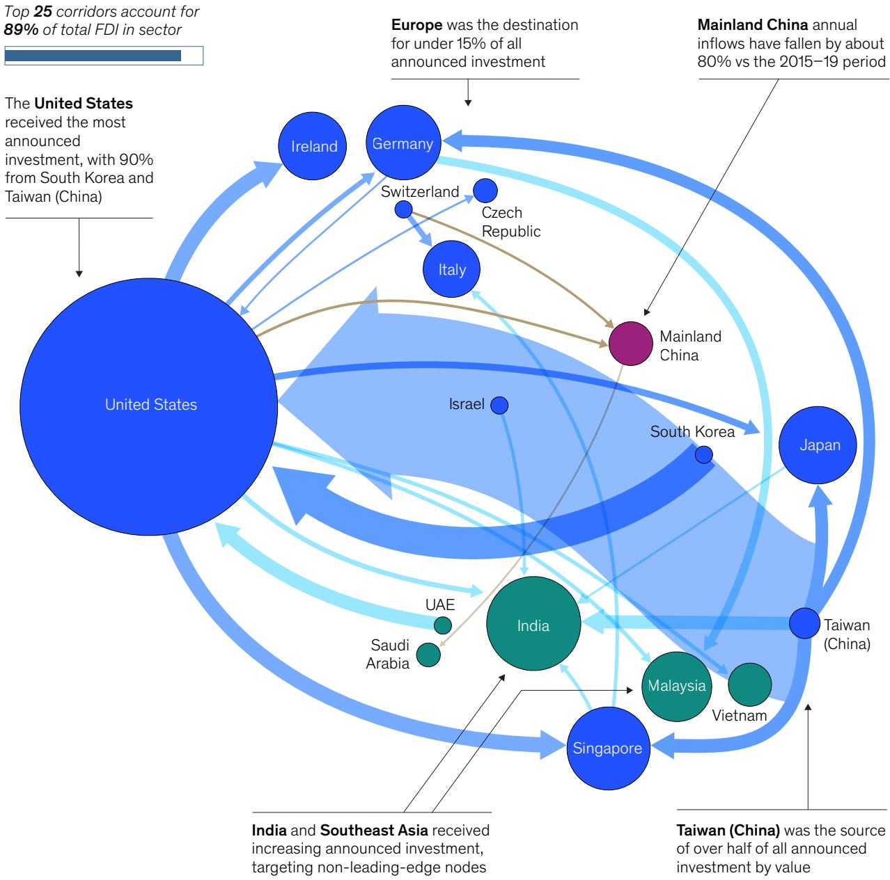

# Ease of rearrangement varies across products. Cotton T-shirts? Fairly easy. Fireworks? Impossible.

Amid pressure on US–China trade, firms may look to rearrange sourcing to alternative suppliers. We introduced a “rearrangement ratio” to quantify how hard the change might be. Thirty-five percent of US imports from China have a ratio less than 0.1, signifying a global available export market ten times larger than current US imports from China. Think T-shirts or logic chips. For higher ratios, rearrangement becomes harder, and for the 5 percent of trade with a ratio greater than 1.0—for example, rare earth magnets—US imports from China exceed available global exports. Consumer goods are harder to rearrange than business inputs. Sixty-one percent of business input imports have a rearrangement ratio less than 0.1, versus 16 percent of consumer goods. Major products like laptops, smartphones, and toys are harder to rearrange.

Rearrangement ratio for products imported by the US from China, by sector, 2023

Circle size = Value of imports from China ◇ Sector's average ratio

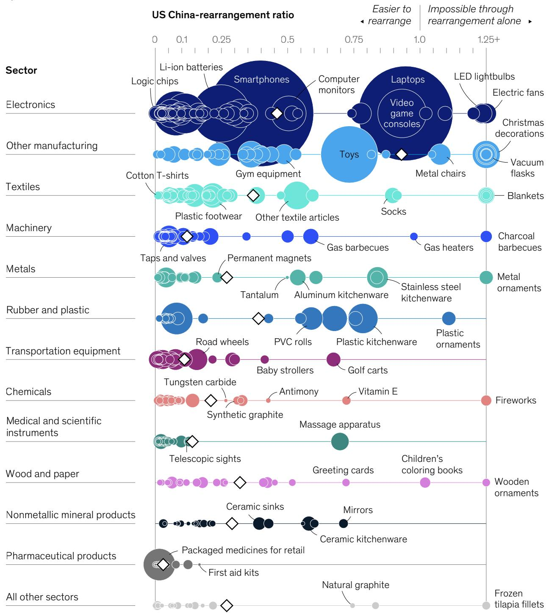  
Source: The great trade rearrangement, McKinsey Global Institute, June 2025

McKinsey & Company

Technology & Markets of the Future
Discussing the next big arenas of value and competition
McKinsey Global Institute: 2025 in charts 13

## People, agents, and robots could all play significant roles in the workforce of the future.

Work in the future will be a partnership between people, agents, and robots—all powered by AI. With the capabilities of existing technologies, AI-powered agents could perform tasks that occupy 44 percent of US work hours today, and robots 13 percent. At the same time, more than 70 percent of human skills can be applied in both automatable and non-automatable work. This means most human skills will remain relevant, but how and where they are used will change. For example, in a building-supply store, workers may spend less time locating materials, managing inventory, and handling routine logistics—and more time interacting with customers and interpreting AI-driven recommendations. Our research finds that by 2030, about \$2.9 trillion of economic value could be unlocked in the United States—if organizations prepare their people and redesign workflows, rather than individual tasks, around people, agents, and robots working together.

Distribution of work hours in the US, by technical automation potential, 2024, %

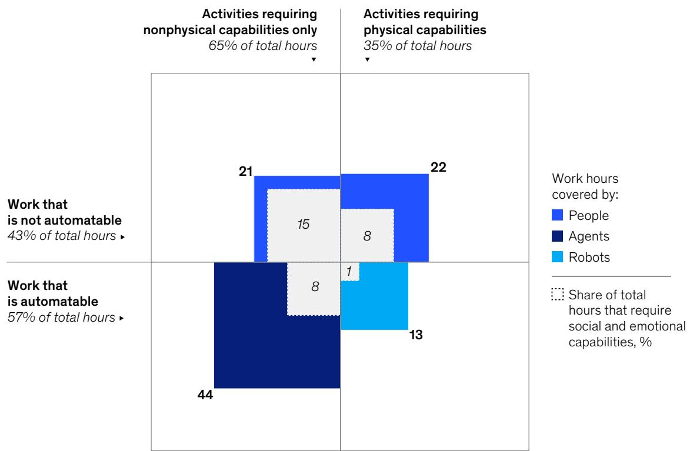  
Source: Agents, robots, and us: Skill partnerships in the age of AI, McKinsey Global Institute, November 2025

McKinsey & Company

The industrial landscape has shifted dramatically over the past 20 years. Just look at the top ten most valuable companies in 2005 and 2025. Only one company appears on both lists. And the rest of the 2025 leaders are worth about ten times more than the 2005 leaders they replaced. What has caused this radical reshuffling? And why are today's winners winning on a whole new scale? The short answer points to the high-growth industries we call “arenas,” which are characterized by a particularly intense race to win, with outsize rewards but also a high risk of displacement.

## The past 20 years have seen a radical reshuffling in the ranking of the top ten companies.

Company ranking by market cap, \$ billion

\- Arenas of today ○ New entries

<table><tr><td colspan="3">Ranking, 2005</td><td colspan="3">Ranking, 2025</td></tr><tr><td>1</td><td>General Electric</td><td>370</td><td>1</td><td>Nvidia</td><td>5,027</td></tr><tr><td>2</td><td>ExxonMobil</td><td>350</td><td>2</td><td>Apple</td><td>3,976</td></tr><tr><td>3</td><td>Microsoft</td><td>278</td><td>3</td><td>Microsoft</td><td>3,843</td></tr><tr><td>4</td><td>Citi</td><td>246</td><td>4</td><td>Alphabet</td><td>3,426</td></tr><tr><td>5</td><td>BP</td><td>229</td><td>5</td><td>Amazon</td><td>2,715</td></tr><tr><td>6</td><td>Shell</td><td>211</td><td>6</td><td>Broadcom</td><td>1,712</td></tr><tr><td>7</td><td>Walmart</td><td>195</td><td>7</td><td>Aramco</td><td>1,650</td></tr><tr><td>8</td><td>Bank of America</td><td>185</td><td>8</td><td>Meta</td><td>1,607</td></tr><tr><td>9</td><td>Johnson &amp; Johnson</td><td>179</td><td>9</td><td>Tesla</td><td>1,558</td></tr><tr><td>10</td><td>HSBC</td><td>177</td><td>10</td><td>TSMC</td><td>1,267</td></tr><tr><td colspan="2">Total market cap, $ billion</td><td>2,420</td><td colspan="2"></td><td>26,780</td></tr></table>

Source: Capturing the next big arenas of competition in ten charts, McKinsey Global Institute, November 2025  
McKinsey & Company

# Resources of the World

Building, powering, and feeding the world sustainably

The physical transformation needed for the energy transition is advancing, but at about half the pace required to meet global commitments. On average, about 13.5 percent of low-emissions technologies needed to meet Paris-aligned 2050 targets across the seven domains we study had been deployed by the end of 2024. This is about three percentage points of progress in two years. During this time, deployment advanced in three of the seven parts of the energy system we analyzed—namely, low-emissions power, mobility (electrifying transportation), and raw materials (critical mineral supplies). Progress is mostly stuck in carbon capture, hydrogen fuels, and in heavy industry.

## The energy transition is advancing at half the required pace.

Deployment of low-emissions technologies, 2022 and 2024 actual and 2024 at cruising speed, % of total deployment to meet 2050 targets

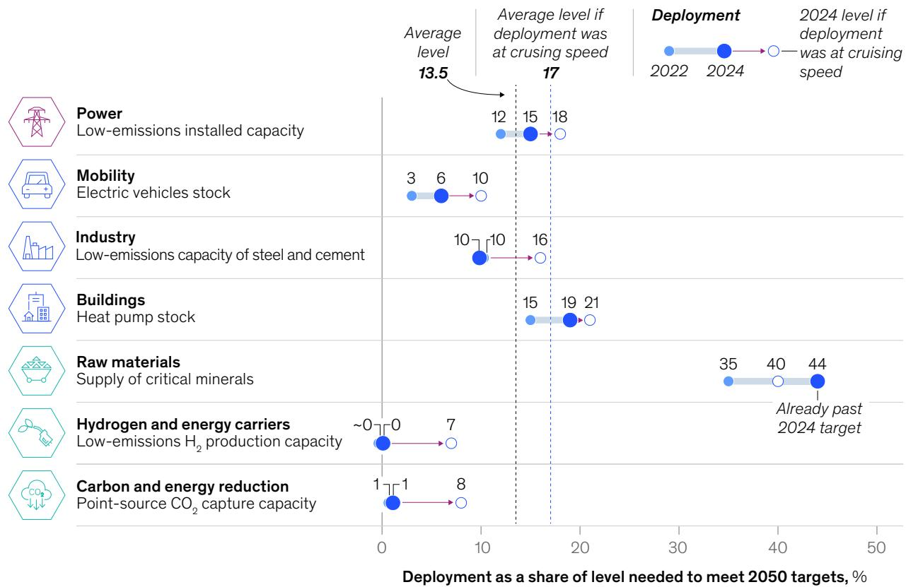  
Source: The hard stuff 2025: Taking stock of progress on the physical challenges of the energy transition, McKinsey Global Institute, November 2025

McKinsey & Company

Advancing adaptation is a good buy, but achieving protection at 2°C would require more than six times today's spending—and that spending is not guaranteed. The world currently spends \$190 billion annually to defend its denizens against extreme weather at the standards established in developed economies. As the world warms, on current emissions trajectories reaching 2°C above preindustrial levels by about 2050, exposure to drought and heat will increase the most. Maintaining today's level of protection at 2°C would require 2.5 times current spending, while achieving developed-economy standards would cost about \$1.2 trillion annually, most of which would go to air conditioning and irrigation. Many such proven measures to adapt exist, and at 2°C, their benefits outweigh their costs by seven-to-one.

## Air conditioning and irrigation systems account for more than half of the adaptation spending to protect at $2^{\circ}$ C to developed-economy standards.

Distribution of annual average operating and amortized capital costs to adapt to 2°C hazards to developed-economy standards, 2020–50, %

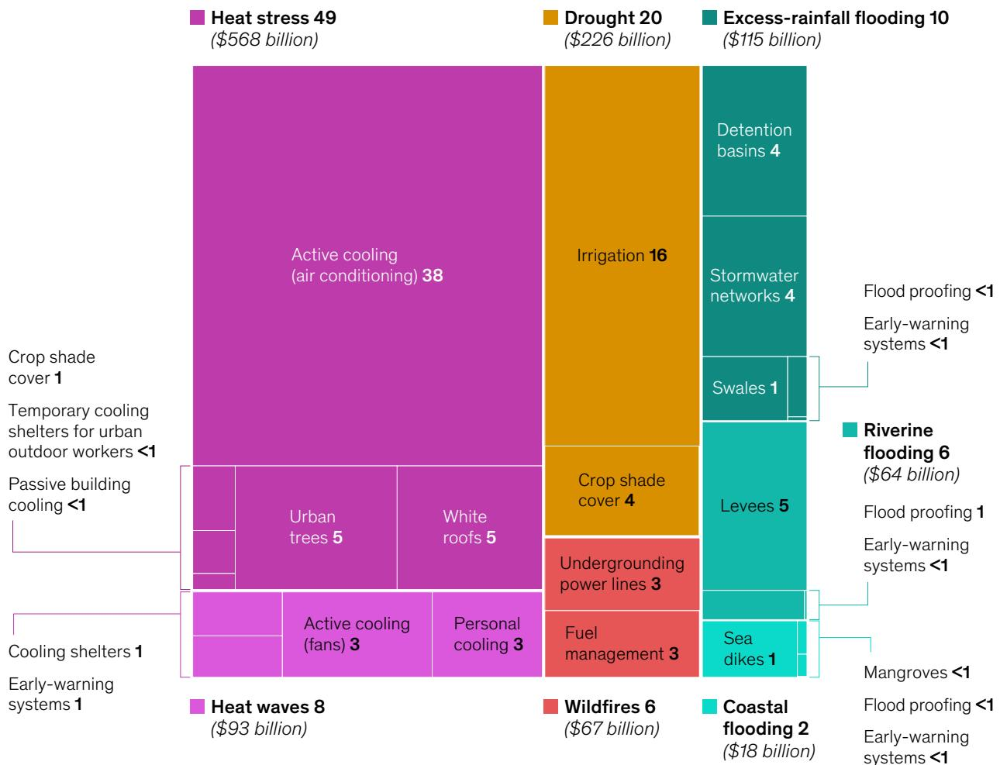  
Source: Advancing adaptation: Mapping costs from cooling to coastal defenses, McKinsey Global Institute, December 2025.

McKinsey & Company

Human Potential
Maximizing and achieving the potential of human talent
McKinsey Global Institute: 2025 in charts 19

Population aged 15–64 years, % of total population

## Working-age populations peak in three waves.

Falling fertility rates are propelling major economies toward population collapse in this century. Maintaining past economic progress, let alone increasing it, will require measures to address the impact of demographic headwinds. The working age population has already peaked in developed economies and Greater China, the first wave. Emerging economies in the second wave have a bit more time, but they need to “get rich” before they “get old”. The working age population share is beginning to peak in Emerging Asia, India, Latin America and the Caribbean, and the Middle East and North Africa. Sub-Saharan Africa, where the average fertility rate is still 4.4 (even if also falling), is alone in the third wave, which will peak well into the second half of the century. While many countries are trying to increase their birth rates, none has been very successful so far—and a baby born today won’t join the workforce for roughly two decades. Three levers are available to keep economic growth on course and public finances sustainable: more employment, faster productivity growth, and effective migration. The magnitude of improvement required for each individual lever is large, so they will need to be deployed in combination. Each country can opt for a different “menu” of combinations, depending on its characteristics, opportunities, and challenges.

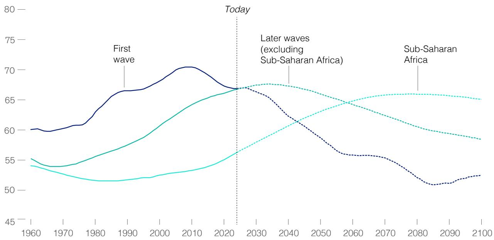  
McKinsey & Company  
Source: Dependency and depopulation? Confronting the consequences of a new demographic reality, McKinsey Global Institute, January 2025

Diverging work experience patterns drive a “work-experience pay gap” that makes up nearly 80 percent of the total gender pay gap, equal to 27 cents on the dollar among US professional workers. Over a 30-year career, the gender pay gap averages out to approximately half a million dollars in lost earnings per woman. To arrive at this conclusion, we analyzed how men and women go about accumulating work experience—switching jobs, returning after breaks, climbing the corporate ladder, making lateral moves, downshifting, and more—and how they realize the value of human capital differently (in terms of pay). While individual stories vary widely, the big picture indicates that diverging occupational paths and shortfalls in accumulated work experience drove most of the pay gap.

About 80 percent of the gender pay gap can be attributed to differences in work experience—both career pathways and time spent out of work.

Decomposition of average pay gap between men and women at year 10 of a career, percentage points

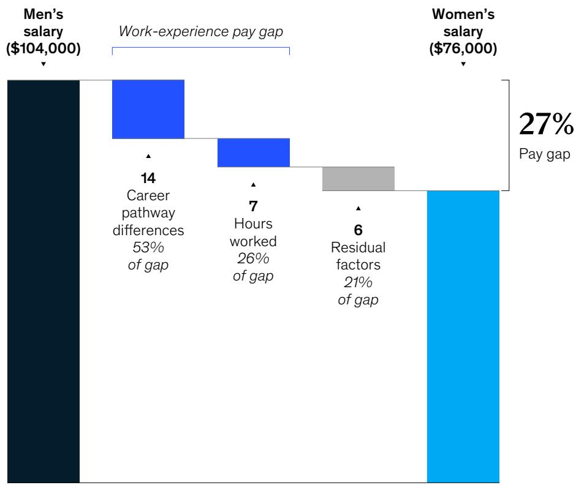  
Source: Tough trade-offs: How time and career choices shape the gender pay gap, McKinsey Global Institute, February 2025

McKinsey & Company

The “empowerment line” measures progress toward a world where everyone’s essential needs are met. This metric is based on an estimate of the cost of a basket of essential goods and services—including housing, healthcare, food, and transportation—for a frugal yet decent quality of life. Even in economies at similar GDP levels, the share of people living below their respective empowerment lines varies widely, because costs and income opportunities vary. Empowerment may be out of reach for context-specific reasons. Those reasons include, for example, the affordability of housing or food, or the availability of stable jobs with sufficient wages. The private sector is pivotal to achieving empowerment and has a wide array of options.

## At the country level, the elements contributing to the degree of variation in empowerment share look very different.

Importance of 9 income and affordability elements influencing economic empowerment

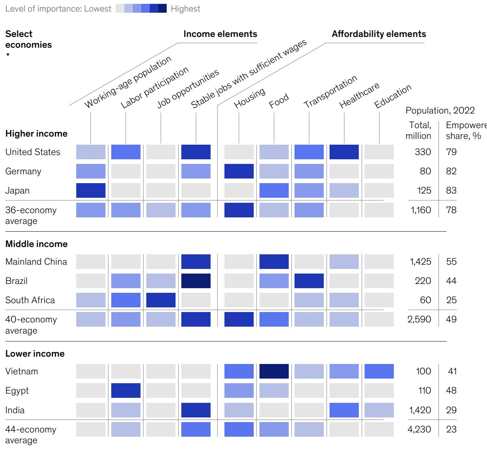  
Source: Economic empowerment made-to-measure: How companies can benefit more people, McKinsey Global Institute, January 2025

McKinsey & Company

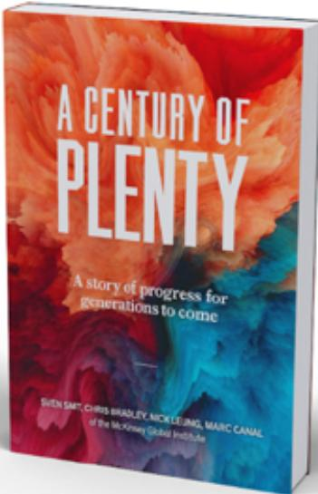

Can you imagine even the poorest country in the world achieving the prosperity and quality of life of today's Switzerland—by 2100? MGI's new book, A Century of Plenty: A Story of Progress for Generations to Come, stress tests this vision. Its conclusion: we can have enough energy, food, metals, and minerals. We can innovate quickly enough. And we can do this while protecting our planet. By 2100, everyone could have the life of the top few percent of humanity today. But that requires a new, optimistic narrative, along with a belief in growth and the determination to build a better future for generations to come.

The book will be available on January 13, 2026, on Amazon.

McKinsey Global Institute

December 2025

Copyright © McKinsey & Company

Designed by the McKinsey Global Institute

mckinsey.com/mgi

X @McKinsey\_MGI

@McKinseyGlobalInstitute

in @McKinseyGlobalInstitute

Subscribe to MGI's LinkedIn newsletter,

Forward Thinking: mck.co/forwardthinking