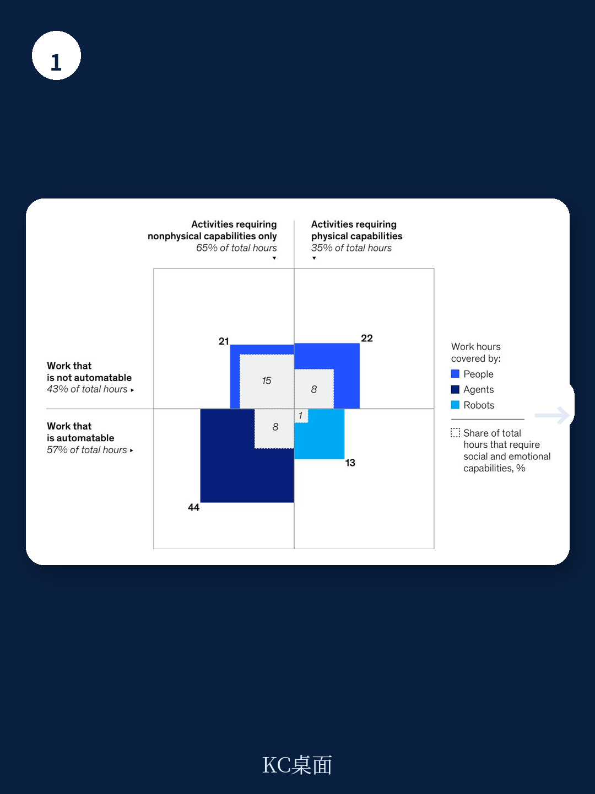
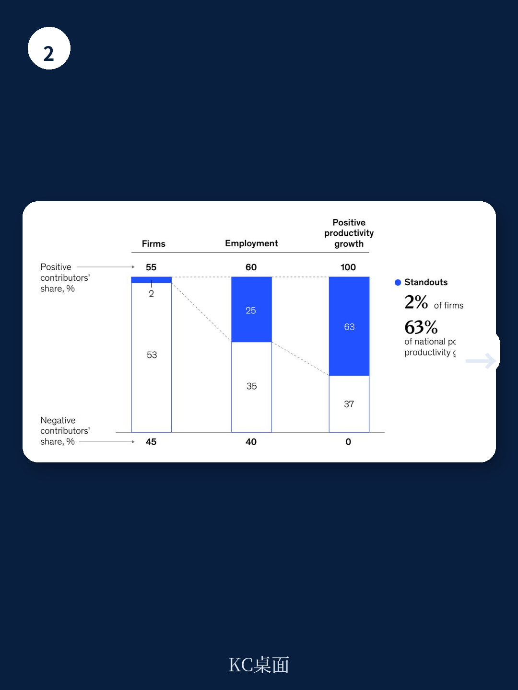

# 麦肯锡：全球资产负债表显示，过去20年财富增长七成来自通胀

麦肯锡全球研究院在2025年年末发布的年度图表总结，没有停留在罗列数据，而是给出了一个反直觉的判断：全球生产率增长的引擎，不是广泛的企业群体，而是极少数“杰出公司”。在三个国家的8300家大型企业中，不到100家公司贡献了63%的生产率增长。这个发现推翻了“涓滴式进步”的传统叙事，也让决策者和读者不得不重新思考——真正驱动宏观环境效率的，到底是什么力量。

这份报告覆盖了生产率、全球贸易、技术变革、能源转型和人口结构五大主题。但最值得关注的，不是每个领域的独立进展，而是它们共同指向的一个核心矛盾：全球宏观环境的“账面财富”在膨胀，但真实的生产性研究并未跟上。麦肯锡构建的全球资产负债表显示，2000年至2024年间，全球家庭财富增加了400万亿美元，但其中约四分之三来自资产价格重估和通胀，而非新增储蓄和研究。这意味着，过去二十年的财富增长，相当一部分是“写在纸上的”。

> **KC评论：** 麦肯锡的全球资产负债表是一个很有价值的分析框架。它提醒我们，不要被资产价格的上涨所迷惑，真正支撑长期繁荣的是实物研究和生产率提升。这份报告里对“账面财富”和“真实研究”的拆解，值得仔细研究。

## 1. 生产率增长的主角是“少数派”，而非“多数派”

麦肯锡的研究发现，生产率进步并非均匀分布。在三个国家的研究样本中，那些被称为“杰出公司”的企业，其生产率增长往往以爆发式的方式实现，而非渐进的改善。这些公司通过大胆的战略举措、收入增长和业务组合调整来推动进步，而非单纯依赖效率提升。这一发现挑战了传统宏观环境学中“生产率进步来自大多数企业缓慢改善”的假设。对于政策制定者而言，这意味着支持“明星企业”的成长环境，可能比试图提升所有企业的平均效率更为有效。对于企业而言，这提示了一个残酷的现实：要么成为那1%的“杰出公司”，要么面临被甩开的危险。

## 2. 全球贸易的“地缘距离”在缩短，但“地理距离”在拉长

麦肯锡的贸易指标揭示了两个看似矛盾的趋势。一方面，贸易的“地缘政治距离”在2017年至2024年间下降了约7%，这表明中国、德国、美国等主要地区正在减少与地缘政治对立方的贸易往来。另一方面，贸易的“地理距离”却在缓慢但稳定地增加，过去十年每年约增加10公里。这意味着，尽管地缘政治在撕裂原有的贸易网络，但全球供应链并未简单调整，而是在寻找新的、更远的替代来源。报告还提出“重新配置比率”来量化美国从中国进口商品的替代难度：35%的商品（如T恤和逻辑芯片）相对容易转移，但5%的商品（如稀土磁铁）几乎无法替代。这一框架对评估供应链不确定性具有直接的应用价值。

> **KC评论：** “重新配置比率”是一个很实用的分析工具。它告诉我们，不是所有贸易转移都同样困难。对于企业来说，理解自己所在行业的产品属于“容易重新配置”还是“难以重新配置”，是制定供应链战略的起点。这份报告里对不同产品类别的详细分类，值得花时间看。

## 3. 能源转型“半速前进”，气候适应的成本被低估

麦肯锡对能源转型的评估并不乐观。到2024年底，为实现巴黎协定2050目标所需的低碳技术，平均只部署了约13.5%，且进展速度仅为所需速度的一半。虽然低碳电力、交通电气化和关键矿物供应有所进展，但碳捕集、氢能和重工业的脱碳基本停滞。与此同时，报告对气候适应成本的测算令人警醒：若要在全球升温2摄氏度的情景下达到发达地区的防护标准，当前每年1900亿美元的适应支出需要增加六倍以上，其中大部分将用于空调和灌溉系统。这提示我们，能源转型的“硬仗”还在后面，而适应的成本可能比许多人预想的更高。

## 4. 报告尚未完全回答的关键问题：生产率增长能否被“制造”？

麦肯锡的研究发现，少数“杰出公司”贡献了大部分生产率增长，但报告并未深入探讨这些公司是如何出现的。它们是特定政策环境、市场结构或技术浪潮的产物，还是可以被系统性地“培育”出来的？如果生产率增长本质上是一种随机或不可预测的爆发，那么政策制定者试图“制造”生产率增长的努力可能效果有限。这个问题对于正在推动宏观环境转型的国家和企业至关重要，但报告只是点出了现象，没有给出答案。读者在阅读原文时，可以重点关注麦肯锡对“杰出公司”特征的进一步描述，看看是否能从中提炼出可复制的规律。

---

For informational purposes only. Portions may be generated,translated,summarized,or edited with AI assistance based on source materials and may contain omissions or errors. Please verify independently. This is not investment,legal,tax,accounting,or other professional advice.
