BCG

Executive Perspectives

## Applied AI at its most impactful with Agentic Enterprise Operations

Agentic Enterprise Operations

June 2026

## Introduction

Agentic AI is redefining how enterprises operate, and represents Applied AI at its most transformative. Many organizations have captured their first productivity gains from AI, deploying copilots, bots, and an automation layer, yet few companies have realized impact at scale. As with many general-purpose technologies, unlocking the full value requires structural reinvention of end-to-end (E2E) processes and their governance. AI-native pioneers demonstrate that completely different outcomes are possible when enterprise operations built or rebuilt for AI autonomy from the ground up.

Building agentic enterprise operations requires moving beyond individual AI use cases to AI-enabled processes E2E. To succeed, organizations need to shift their focus from tasks to outcomes, from improving individual efficiency by embedding AI in human-led workflows to redesigning entire processes for multistep AI autonomy. Organizations also need to rethink how decisions are governed and how risk and accountability are structured while building the underlying AI, data, and orchestration capabilities required to enable reliable multistep AI autonomy at scale.

This journey raises a new set of leadership questions that we address in this executive perspective:

• How will agentic enterprise operations disrupt and redefine workflows and business models?

• What will be needed to enable multistep AI autonomy at scale (e.g., process redesign)?

\- Which transformation path best fits the organization’s starting point and ambition?

While agentic AI is still maturing, its exponential trajectory leaves little room for delay: Now is the time to build the operational and technical foundations for near-term value realization and scale.

This document is a guide for CEOs, C-suite executives, and Operations leaders to rethink enterprise operations end-to-end in the light of agentic AI for true value unlock.

In this Executive Perspective, we explore how agentic AI reveals full value once redesigning enterprise operations E2E for AI autonomy and application at scale

## Summary | Rethinking value creation with agentic enterprise operations

## Agentic enterprise operations rewrite the AI paradigm

• AI has delivered measurable productivity gains, yet 60% of enterprises have not structurally unlocked value at scale

\- Most transformations left the operating system of work untouched: Limited E2E redesign, unclear process ownership, and tech constraints continue to cap impact, while AI-native companies operate at radically different FTE-to-revenue ratios owing to multistep autonomous agents embedded E2E

\- Building agentic enterprise operations – redesigning E2E processes for multistep autonomy that are managed by outcomes, not tasks – is the step change; first transformations are already targeting material impact (e.g., up to 80% straight-through processing, 60% cost-out, and 30% CLTV uplift)

## Focus shifts from optimizing tasks to designing autonomy

\- Traditional process optimization improved task efficiency in human-led systems; with agentic execution, capacity stops being scarce and the constraints shift toward control, integration, and reliability

\- Process steering evolves toward a unified process owner, accountable for E2E outcomes with system-embedded decision rights and coordination

\- Near-instant, capacity-elastic execution unlocks new value propositions and business models (e.g., real-time decisions or always-on operations)

1. Focus on outcomes: Review your processes focusing on the outcomes before optimizing your as-is operations

## Five elements to successfully build your agentic enterprise operations

2. Build an "agentic process transformation factory": Centralize E2E process transformation and standardize embedding of AI agents

3. Make tech choices a C-level priority: Elevate ecosystem orchestration and build the AI layer for agentic scale

4. Place a platform bet: Pick one agentic platform and get started; portability is expected to increase as agentic AI matures

5. Start the journey early and evolve governance along the way: Pick 1 or 2 high-value domains while addressing the new challenges resulting from change

\- Since agentic AI is still maturing and key questions and tradeoffs remain, there is no single successful blueprint; choices such as a greenfield or brownfield transformation, a governance or ownership model, and autonomy boundaries will determine each organization’s transformation path

## D

## Different transformation paths can succeed

\- Five bets can anchor the path forward: Building muscle now is crucial, platforms will converge, integration efforts will become easier, an outcome-first redesign will unlock true value, and tailored pathways will be required

\- To get started, first sensible steps are assessing agentic maturity and value potential, defining transformation principles, and prioritizing process redesign domain; integrated into a holistic approach of strategic ambition, program orchestration, agentic operations design and agentic foundation

Note: FTE = full-time equivalent; CLTV = customer lifetime value.
Source: BCG research.

## Chapter A

## Agentic Enterprise Operations Rewrite the AI Paradigm

## AI has boosted task efficiency, yet 60% of companies still miss material value mainly due to unchanged work systems and persistent tech constraints

60% companies are not generating material value from previous AI waves focused on task efficiency $^{1}$

Task-focused AI use cases generated early enthusiasm (e.g., 10% to 20% productivity increases with copilots and isolated bots)

First AI waves left the operating system of work untouched
Limited structural gains given low E2E redesign and change management

Use case impact was limited by practical tech challenges (e.g., data fragmentation and quality, security issues, compliance risks)

## True value can be realized by embedding agents E2E in enterprise operations

Structural reinvention and E2E redesign of processes is needed to unlock full impact

First companies are redesigning processes and workflows for E2E agentic execution

AI-first pioneers achieve step-change impact (e.g., 3x productivity improvement, 80% cycle time reduction)

## At the same time, AI-native companies operate at structurally lower FTE-to-revenue ratios, enabled by autonomous agents embedded E2E

## Differentiators of AI-native companies

  
Operations are built for AI autonomy and scale by design, not superior LLMs  
Time to scale from \$1M to \$100M ARR (years)

Processes embed AI agents E2E who are led by outcomes

Agent-driven execution
(control flow) and
multiagent orchestration

Deep dive follows

Note: ARR = annual recurring revenue;
LLM = large language model.
Sources: BCG-conducted expert interviews; BCG analysis.

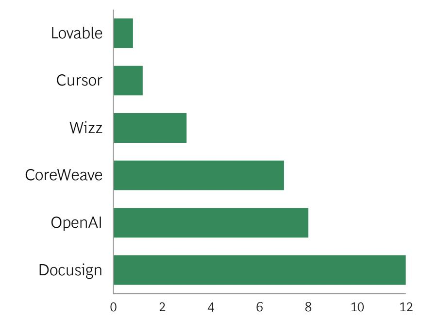

Other notable companies

Together.ai | Sales force | Deel | Drop box | Okta | Servicenow

## ARR and FTEs

Lovable \$200M ARR

120 FTEs, 2025

Up to \$1M to \$5M ARR per employee

## Agentic enterprise operations, with multiagent systems, reinvent the entire operating system of work and unlock completely different AI value creation

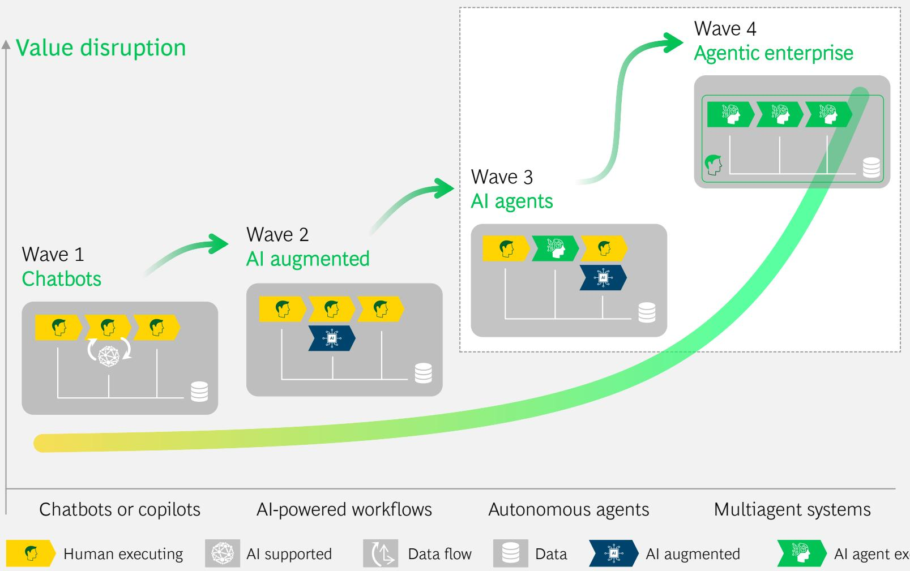

## Agentic enterprise Key characteristics

Redefined, amplified and outcome-led processes

## E2E processes run by reusable AI agents

## Decisions AI-driven by default across execution and control flow

## Multi-agent coordination across functions & systems

## The AI gap is massive – agent-native organizations largely run without humans, while most enterprises have <3% of the work run by agents

## What's happening now

## StrongDM Dark Factory

Three engineers, zero human code review. Shipping production security software with AI agents

## Goldman Sachs and Devin

\~12,000 developers from Goldman Sachs working alongside Cognition's Devin AI. Firm plans for thousands of agent instances.

## Anthropic internal

90% of Claude Code written by Claude Code itself. 4% of all GitHub commits written by Claude Code.

## Zero Human Company

First autonomous company; the AI CEO, named Grok, and more than 30 agents handle all operations

## Y Combinator Winter 2025 Startups

25% of startups have 95% AI-generated codebases; agent-native from day one

## What we typically see

Three pilots
approved

One copilot
deployed

\~2%

of work run by
autonomous
agents

Al roadmap for 2028

Governance
unclear

While competitors run 90%+ autonomous

## There are successful AI transformations - key ambitions we see on agentic

## Success stories of previous AI transformations

Reckitt

Foxconn

BMW

Alphabet

Capita

DKB

Merck

Amazon

Rio Tinto

DHL

Signal Iduna

Salesforce

\+ many more...

## Ambitions and impact we see at our clients for agentic transformations

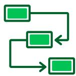

Up to

80%

Straight-through processing

More than

60%

Cost reduction
long-term

Up to

20%

Short-term savings unlocked

Up to

30%

CLTV
improvement

## A global bank implemented an OpsAI agent in its retail lending processes and realized significant benefits in production

## Context

A global bank was experiencing rapid growth accompanied by a significant increase in operating costs and complexity. This was because of the limited scalability of its operations caused by heavily manual retail-lending processes:

\- Human agents manually screened, categorized, extracted, transferred, validated, and corrected information.

\- These tasks were repetitive, had limited complexity, and added minimal business value, but they consumed significant resources (FTEs).

The bank's ambition was to upscale operational excellence to cap operating costs while further pursuing an ambitious growth trajectory.

Note: OCR = optical character recognition.
Source: BCG experience.

## BCG's approach

To help the bank achieve its ambition, BCG recommended setting up a scalable operation and E2E processes. The bank deployed BCG's OpsAI agent as part of a holistic, zero-based process transformation. The OpsAI agent automates E2E retail-lending processes in a reliable fashion by replicating human processing. Combining LLMs, OCR and data synchronization, file splitting, and validation, the OpsAI agent leverages five key capabilities to automate unstructured data handling.

5 capabilities of the OpsAI Agent for significant productivity gains:

Document recognition and classification, incl. quality checks

File splitting and data synchronization across systems

Autonomous data extraction, interpretation, and correction

Integrated consistency, fraud, and plausibility checks

Signature recognition and contract validation

>90%

Automation rate of E2E processing of consumer loans

>70%

Automation rate of E2E processing of mortgage loans

>50%

Productivity gains
across retail lending
processes

## A global technology company redesigned E2E processes across support functions, realizing significant cost reductions

## Context

A global tech company started a transformation in the context of a structural cost gap and a high-complexity operating and technology footprint:

• Support-function expense to revenue in 3rd quartile

\- \~5% incremental annual targets delivered marginal impact

\- Process and system complexity from M&A and fragmented ERP and application landscape (incl. over 5,000 IT back-office apps)

\- Stranded cost following major portfolio moves (e.g., spin-offs)

The ambition was to deliver a step change in productivity and cost transformation to move support functions to first-quartile expense to revenue, as well as to increase free cash flow to fund strategic pivot to hybrid cloud and AI to fuel growth

## BCG's approach

As part of the broader transformation roadmap, the tech company followed a three-step approach to drive productivity and ensure value realization across all prioritized processes

## Eliminate

Detailed, critical evaluation of every process (no protected processes or functions) to identify opportunities to eliminate superfluous processes that did not add value

## 2 Simplify

Identification of opportunities to remove complexity, minimize process steps, and handoffs between teams and systems; Put focus on designing simple workflows to reduce touch and cycle time

## 3 Agentification

Infusion of agentic AI throughout the redesigned processes to automate activities in areas with more subjectivity, enable self-service, and leverage unstructured data in analysis (e.g., summarization of tax documents with an inconsistent format)

Savings delivered in the first 18 months

## Annual savings delivered

## Activities automated

## Chapter B

## Focus Shifts From Optimizing Tasks to Designing Autonomy

## Agentic AI is radically changing the way processes are designed and governed by shifting focus from optimizing flow to business outcomes

## Traditional process optimization

Optimization for availability and cost of human capacity

## Tedious standardization of process

variants to generate automation at scale

Reduction of unhappy-path deviations with predefined breakouts

New opportunities with agentic enterprise ops

Abundant, scalable execution capacity with completely revised economics

Decoupling of bespoke processes from standard business outcomes through agentic flexibility

Process deviation as part of core design of agentic systems

## Agentic enterprise operations shift process steering from multiple owners to a single agentic process owner

## Traditional, distributed process ownership up to wave 3 Wave 3: AI agents

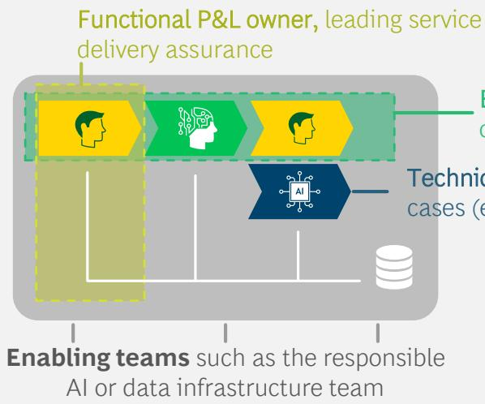  
Business process owners leading E2E process oversight and continues improvement  
Technical Owners leading individual use cases (e.g., bots and AI tools)  
Singular process ownership in wave 4
Wave 4: Agentic enterprise

\- Multiple partial owners, each owning separately functional P&L, business process, and technical dimension

\- As ownership is distributed across different aspects of the process, a significant coordination effort is needed to steer and optimize for outcomes with often diverging KPIs and targets - Single steering logic, with agentic process owner having E2E accountability for the redesigned process

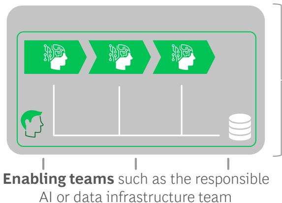  
Agentic process owner, accountable E2E for all steering dimensions  
Enabling teams such as the responsible AI or data infrastructure team

\- Agentic process owner can become central supervisor for steering AI-executed process flows by outcomes, with respective accountability and decision rights

Shifting processes
to agentic AI E2E
allows an evolution
of business models
and a GTM approach

Outcome-based offerings are enabled by full process-control and highly decreased incremental cost (e.g., for optimization)

Truly tailored offerings and services are delivered at scale due to a low marginal cost of changes, regardless of complexity

Monetization shifts from static offerings to dynamic value-capture models as processes continuously optimize

## Chapter C

## Five Elements to Successfully Build Your Agentic Enterprise Operations

Five elements
to successfully
build your
agentic
enterprise
operations

Focus on outcomes: Review your processes focusing on the outcomes before optimizing your as-is operations

Build an "agentic process transformation factory": Centralize E2E process transformation and standardize embedding of AI agents

Make tech choices a C-level priority: Elevate ecosystem orchestration and build the AI layer for agentic scale

Place a platform bet: Pick one agentic platform and get started – portability is expected to increase as agentic matures

Start the journey early and evolve governance and change management on the way

## Five elements to successfully build your agentic enterprise operations

1

Focus on outcomes: Review your processes focusing on the outcomes before optimizing your as-is operations. Rather than layering AI onto unstable or fragmented processes, start by redesigning processes from the outcome and intent back to ensure autonomy amplifies value rather than structural weaknesses

2

Build an "agentic process transformation factory": Centralize E2E process transformation and standardize embedding of AI agents. Centralize the prioritization of E2E processes, funding, and guardrails, and standardize how to embed AI agents E2E with evaluations and a continuous feedback loop – C-level owned, run by integrated business and tech teams and measured on value

3

Make tech choices a C-level priority: Elevate ecosystem orchestration and build the AI layer for agentic scale. To successfully drive and scale the agentic process transformation, it requires multivendor ecosystem orchestration and a solid AI layer (e.g., based on data, workflow integration, and testing)

4

Design for interoperability (among APIs, standards, logging) as vendor capabilities and product boundaries will likely evolve; next-generation architectures will increasingly mix agents across platforms

5

Start the journey early and evolve governance and change mgmt. along the way. Focus on shifting processes to agentic AI across one or two high-value domains and create a path to scale. Use pilots to set up and harden governance and data products. At the same time address new challenges from redefining roles, align on risk thresholds and institutionalize continuous improvement before scale

Source: BCG experience.

## An outcome-first design unlocks true value from an agentic transformation

## Common pitfall: Introducing agents for unstable legacy processes

Legacy processes are often manual, fragmented, and error-prone

AI is layered onto inefficient workflows without redesign

Automation accelerates existing flaws and causes rework

Errors become more visible and scale faster

Poorly defined processes limit true agent autonomy

## Don't use AI agents for existing broken processes because this will amplify structural weaknesses

Source: BCG experience.

## Design processes and workflows starting at the target outcomes and intents

Agentic outcomes

Value stream mapping

Identify targeted
outcomes and
intents and clarify
unmet needs of
users and agents

  
Decision analysis

Map decisions,
handoffs,
dependencies, and
ownership across
the value stream

Clarify decision and
escalation logic
and determine
confidence
thresholds

Agent-first redesign

Reimagine the customer journey and processes AI agent-first with human oversight

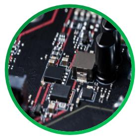

Agentic foundation design

Design the agentic foundation (including governance) to enable scalable autonomous execution

## Deep-dive | The mantra shifts from focus on output to focus on outcomes

## Example: Loan application processing

Start with outcomes as business goals (decide what you are trying to achieve)

Reduced time-to-outcome

Customer satisfaction increase

Lower processing cost

Break into dependency trees, with pain points and human constraints

Accelerated case resolution

reduced
exception backlog automated validation and checks

manual touchpoints improved decision consistency

Prioritize and assess decomposed outcomes as agent opportunities

Document verification

Remediation suggestions

Prioritize opportunities systematically, and consider impact, feasibility, and agent fit

## Key pain point

Source: BCG experience.

Outcome-first design defines success over process; forcing clarity on what good looks like helps to prioritize where agents can add measurable value

Decomposition reveals leverage points; breaking outcomes into dependencies and pain points uncovers the specific tasks and decision areas that move the KPIs

Agent opportunities then emerge naturally; clear dependencies allow for roles to be defined early, and the design process can develop from here

## Build an "agentic process transformation factory" to deliver value at speed

Continuously
Improve workflows

## Leadership vision

Enterprise AI
ambition and value
targets

Aligned leadership on priority workflows

Governance and
decision rights

## Decide

• Map workflows at task level

• Identify/prioritize automation opportunities

## Design

\- Redesign workflows to AI-first

\- Set-up deliver and scale prioritization logic

## Deliver

\- Rapid, iterative deployment to production

• Measure real impact; Use proof points to build momentum

## Scale

\- Scale across functions

\- Track ongoing performance and value capture

Op. Model Enablement (Change mgmt., employee transformation, adoption acceleration)

## Enable & Sustain

Agent Platform (Data platforms, model orchestration, integration layers)

Foundations (Governance, security, and workforce enablement)

Process delivers early value through quick iteration cycles; Embed and institutionalize to build repeatable agentic factory that efficiently scales transformation

## While agentic AI is still maturing, it is time to lay an agnostic technology foundation that supports exponential capability build and scale

## Agnostic technology blueprint $^{1}$

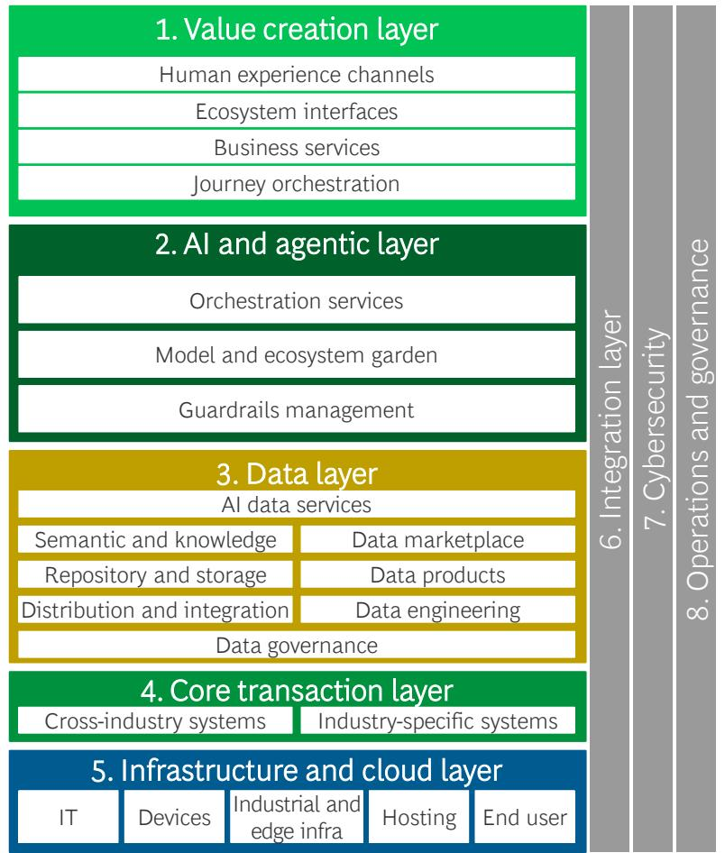

4. Core transaction layer
Cross-industry systems | Industry-specific systems

## 1. Value creation layer

Deliver customer and employee digital journeys, orchestrate front-end workflows, and embed smart decision engines and AI-enhanced apps for a personalized, omnichannel experience.

## 2. AI and agentic layer

Drive enterprise AI and the agentic layer through governed model access and controlled agent orchestration, enabling secure, compliant, real-time AI-driven decisions across products and processes.

## 3. Data layer

Collect, organize, and expose trusted data products through standard access points, ensuring high-quality information for both operational and analytical use.

## 4. Core transaction layer

Execute and record mission-critical business transactions in systems-of-record, ensuring authoritative data for the enterprise and exposing clean APIs to the upper layers.

## 5. Infrastructure and cloud layer

Supply automated, scalable compute, storage, networking, orchestration, and physical systems so every workload runs on a consistent, monitored foundation.

## 6. Integration layer

Ensure systems are integrated and developer friendly. These enablers provide the foundation for consistent, scalable, and efficient delivery across all horizontal layers.

## 7. Cybersecurity

Ensure systems are secure and compliant. These enablers provide the foundation for consistent, scalable, and efficient delivery across all horizontal layers.

## 8. Operations and governance

Ensure that AI, data, and digital ops run safely, reliably, and in compliance by managing life cycle processes, monitoring performance, enforcing governance controls, and coordinating cross-functional workflows.

## Three realities to consider when building the agentic layer

## Agentic scale will ramp exponentially within months enforcing the need to manage complexity

\- Typical businesses have 100 to 150 core processes and about 7,000 to 8,000 subprocesses; if one-third of them become agentic, this implies roughly 2,000 agentic solutions with 3 to 5 agents each, and about 8 to 12 new configuration items per agent to manage – leading to a high risk of overwhelming traditional IT service management

\- ADLC is needed to manage a federated control of an AI platform and services, establish clear graduation pathways for scaling discipline, continuously refactor the data and architecture, and redefine IT service mgmt. by adopting observability-first ops, automated guardrails and evaluation gates with joint tech-risks-ops accountability

## To scale, progressively build AI services and upgrade critical tech services at the pace of agentic adoption

• Progressively build AI-shared services in lockstep with agentic process adoption

\- Run a software delivery life cycle along with an agentic delivery lifecycle as adoption grows (progressively standardizing build-to-run controls); when about 30% to 40% of E2E processes are agent-focused, consider to execute a one-off shift to agentic delivery lifecycle mgmt. by default

## Clear AI graduation pathways are needed to bring agentic solutions into the business fast

\- Establish clear graduation pathways with funded routes for successful value proofs, adopting real-time service acceptance

\- Ensure disciplined scaling (e.g., staged rollout, thresholds, and operational readiness) for maturing minimal viable products, treating use case graduation as an ongoing investment

\- Give every agent a managed identity, and automate continuous improvement checks (flag redundancy, drift, rogue agents)

## Orchestrating the tech ecosystem will be inevitable

## Examples

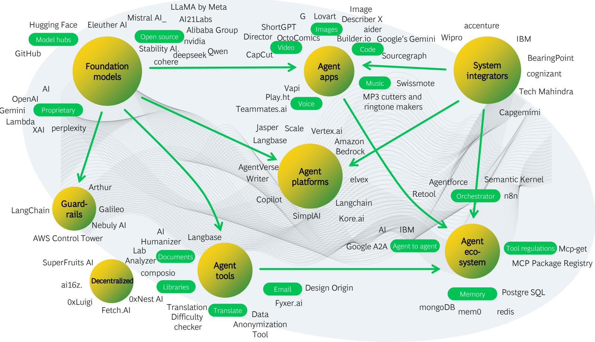  
Source: BCG experience; BCG AI Agent Ecosystem Database.

## Structural reality

• E2E autonomy exceeds the scope of any single vendor

\- Most solutions address slices of the stack

## Strategic implication

Enterprises must deliberately orchestrate the multivendor ecosystem

\- Define integration standards

• Make explicit buy-versus-build decisions

\- Maintain architectural coherence over time

## Next-generation architectures will increasingly mix agents across platforms, with shared protocols enabling cross-platform communication

## Emergence of tightly coupled agents 2023 – 2024

Agents built directly into existing apps, with hardcoded workflows and system-specific integrations, limiting adaptability

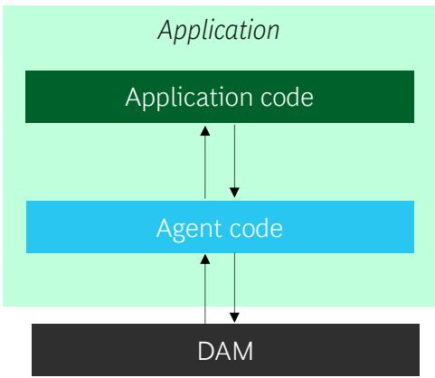  
Code, data, and deployment in the same stack constrain scalability and reuse

## Progression to decoupled agent platforms 2025

Rise of agent platforms; agent logic and orchestration separate to existing back-end systems to facilitate reuse and scaling

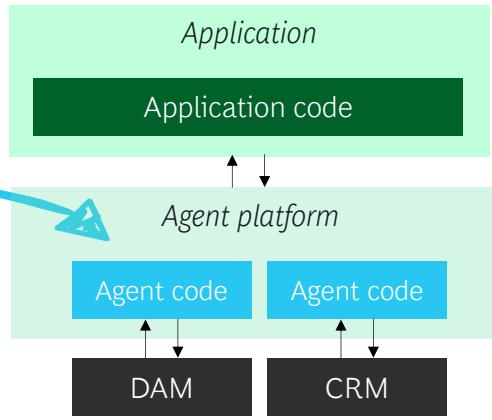  
1. Interoperability refers to cross-platform orchestration.  
Source: BCG analysis.  
Decoupling offers modularity and flexibility, breaking down integration barriers  
Note: DAM = digital asset management; CRM = customer relationship management.

## Rise of agent interoperability across platforms 2026 and after

Next-generation architectures may mix agents across platforms, with shared protocols allowing for cross-platform communication

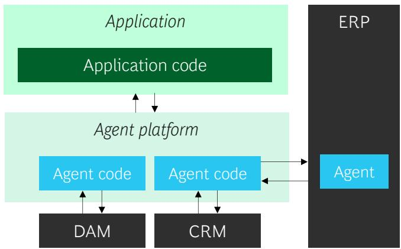  
Hybrid architectures enable interoperability, $^{1}$ adaptability, and connected agent ecosystems

## The agentic transformation redefines the change imperative

## Examples

## Change mgmt. often became bottleneck for AI success Wave 1-3

Reliance on voluntary frontline adoption

Incentives and KPIs not aligned with AI usage

Leadership misalignment and unclear sponsorship

Operating model not designed for scale

Immature pilots undermining credibility

## Pivoting to agentic enterprise ops shifts type of change Wave 4

Classical change management shifts from driving tool adoption to governing agentic execution, where usage is embedded in E2E processes and humans become supervisors instead of users

## Process governance will likely need to shift, with

redefined roles and accountabilities, reviewed decision rights and risk thresholds supporting AI-led execution, and new escalation mechanisms

Continuous improvement broadens, combining coaching and upskilling of people with oversight of system behavior, including monitoring and steering of autonomous processes moving to self-adjustment over time

## Chapter D

## Different Transformation Paths Can Succeed

## Path forward: Key questions for agentic enterprises and bets to place

## Key questions to address in the future

Where will P&L ownership and control for business outcomes sit (e.g., with an E2E process owner or with a functional owner)?

How does functional governance and process governance look like (e.g., who defines standards, who arbitrates trade-offs etc.)?

What does AI and IT governance in the future look like (e.g., who is the technical owner and who will be the control function)?

How will process and AI governance interlink (e.g., will one person own each or both)?

How to run the transformation (e.g., will the shift to agentic layers, functions, or processes use a brownfield or greenfield approach)?

## Core bets for agentic enterprise operations

While agentic AI is still maturing, exponential development makes building the muscle now inevitable

There will be no one size fits all, allowing room and need for tailored individual transformation pathways

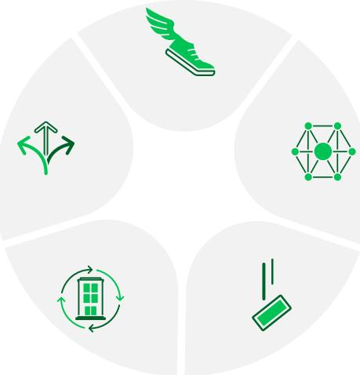

Platform decisions may lose importance as platforms converge and agents become increasingly portable across stacks

Outcome-first redesign will avoid embedding agents in unstable workflows and will allow true value unlock

Integration friction falls as agentic AI manages legacy complexity and reduces integration efforts

## The agentic enterprise transformation journey will be shaped by different strategic design choices and tradeoffs

Two major design choices and tradeoffs

## GREENFIELD VS. BROWNFIELD?

\- While both greenfield and brownfield approaches can unlock full value, organizations need to decide whether to build on an existing AI stack and processes or design autonomy-first from scratch

\- A brownfield build of agentic enterprise ops progressively adds agents to stable cores, prioritizing continuity and controlled risk

\- A greenfield build enables an autonomy-first redesign of processes if legacy constraints make incremental change not economical

## FULL VS. PARTIAL SHIFT TO AGENTIC AI

\- The key decision is whether to partially phase toward full autonomy or commit to an all-in redesign from the start

\- Partially shifting to agentic AI doesn’t unlock the full value, but it allows less disruption, higher speed, and lower investment, while preserving human-agent models where judgment remains critical

\- Fully shifting to agentic AI E2E unlocks the full structural value by redesigning entire processes for autonomous execution

## AGENTIC FOUNDATION

• Strategic design decisions should align with foundational readiness across technology, data, processes, governance, and talent

\- For a brownfield approach, a maturity assessment helps to prioritize a foundational buildup, while a greenfield approach demands a deliberate focus on tech and people strategy; the speed and scope of a transformation remain separate design choices

## An agentic enterprise transformation requires a holistic approach including Strategic Clarity and Applied AI – beginning with these first steps

## Strategic ambition

Define the value ambition, transformation principles, and governance philosophy

## Program orchestration

Set up transformation governance, roadmap sequencing, value assurance, and change management

## Agentic operations design

Redesign E2E processes (starting with target outcomes), deploy agentic workflows, and establish continuous monitoring and new agentic governance

## Agentic foundation

Build the enabling AI capabilities across tech, data, processes, talent, and governance

## First steps to get started

Assess agentic maturity and value potential across key E2E processes

Define transformation principles (e.g., brownfield or greenfield approach)

Select 1 or 2 priority domains for process prioritization, redesign and the target state definition

## BCG experts | Key contacts for Agentic Enterprise Operations

## Global Leadership

  
Marcus
Wittig

  
Alfonso
Abella

  
Nicolas de Bellefonds

## Europe, Middle East, and South America

  
Hrvoje Jenkač

  
Sebastian
Schmöger

  
Alexander
Noßmann

  
Tamsin
Hirson

  
Michael Engels

  
Ignacio
Hafner

  
Lukas
Haider

  
Juan Martin
Maglione  
Salvatore Cali  
Christoph Schmitt

  
Yann
Letourneux

  
Melih
Yener

  
Guillem
Borrell

  
Robin
Anders

  
Carolin
Bimmermann

  
Olivier
Bouffault

  
Matthew Marchingo

## North America

  
Simon
Bamberger  
Samir
Kapur

  
Luke
Purcell

  
Haytham
Yassine

  
Amit Kumar

  
Shervin
Khodabandeh

  
Angad
Grewal

  
Lingqiao Li

  
Stephen Robnett

  
Uche
Monu

  
Alexander
Duerloo

## Asia-Pacific

  
Johannes
Goltsche

  
Manish
Chandra

  
Tarandeep
Singh

## BOG