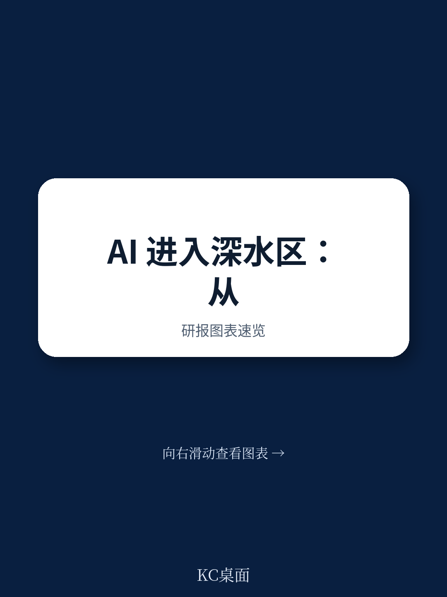
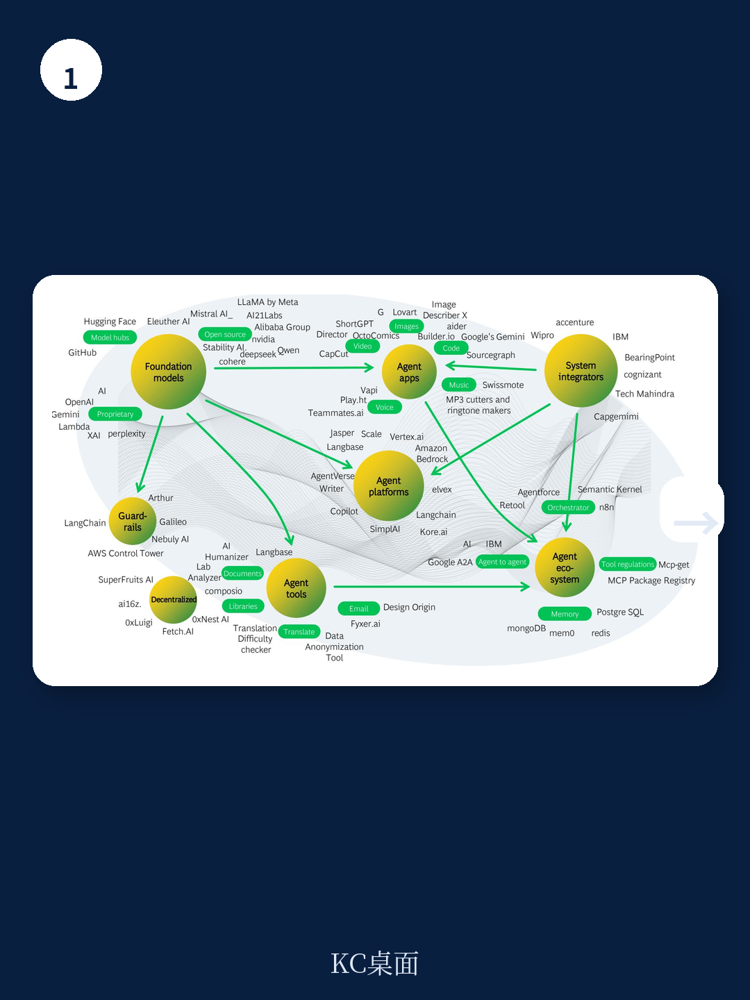
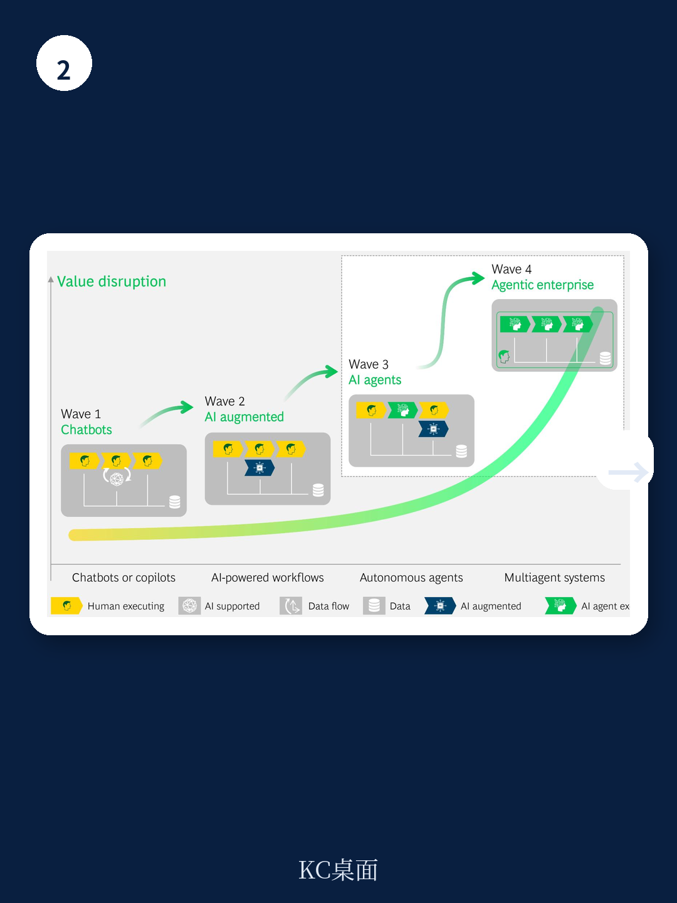

# 波士顿咨询：企业AI的真正价值不是提效，而是重新设计端到端流程

AI带来的生产力提升已经不是什么新鲜事。过去两年，许多企业部署了Copilot、聊天机器人和自动化工具，收获了10%到20%的效率改进。但波士顿咨询最新发布的《Agentic Enterprise Operations》报告给出了一个有点反常识的判断：60%的企业其实并没有从AI中拿到结构性的价值。

不是因为技术不够好，而是因为企业的工作操作系统几乎没有被触动。

报告的核心主张是，AI的真正爆发力不在于让现有流程跑得更快，而在于重新设计整个端到端流程，让多步骤的AI自主执行成为可能。这家咨询机构称之为“Agentic Enterprise Operations”——一个听起来很学术，但指向非常具体的概念。

## 1. 过去两年，大多数企业其实只做了“表面AI”

波士顿咨询的研究发现，尽管AI用例层出不穷，但绝大多数企业的转型并没有触及运营系统的核心。流程没有做端到端重构，流程所有权模糊，技术架构的限制依然存在。结果就是，AI带来的收益被锁死在局部，无法规模化。

报告给出了一组对比数据：传统企业在AI上的投入，最终只有不到3%的工作流程由自主代理运行。而AI原生企业，比如那些从第一天就按代理架构设计的初创公司，其员工与收入的比率已经完全不同——一些公司可以达到每人每年100万到500万美元的营收。

> **KC评论：** 这不是说大企业落后了，而是提醒决策者，真正的差距不在模型选择，而在流程架构。波士顿咨询在报告中用“Dark Factory”和“Zero Human Company”这样的案例说明，当流程为AI重新设计后，人力不再是瓶颈。完整报告里还对比了传统银行和AI原生公司的FTE-收入曲线，值得细看。

## 2. 从“优化任务”到“设计自主”：流程治理的逻辑被颠覆

传统流程优化的核心逻辑是：人贵，所以想办法让机器替代人的某些步骤。但波士顿咨询指出，当AI代理可以大规模、低成本地执行任务后，约束条件变了——稀缺的不再是执行能力，而是控制、集成和可靠性。

这意味着，流程设计的目标要从“减少人工操作”转向“设计自主执行”。报告提出了一个关键变化：流程的所有权将从分散的多个所有者（业务负责人、技术负责人、合规负责人各管一段）转向一个统一的“代理流程所有者”。这个角色要对端到端的结果负责，决策权被嵌入系统，协调由代理完成。

波士顿咨询认为，这种变化还会催生新的商业模式。当流程可以近乎实时、弹性扩展地运行时，企业可以推出“按结果付费”的定价模式，或者提供真正个性化的服务——因为边际调整成本大幅下降。

## 3. 构建“代理流程转型工厂”：五个要素决定成败

报告没有停留在概念层面。波士顿咨询提炼了五个实操要素，其中第一个尤其值得关注：**专注于结果，而不是优化现有流程。**

很多企业做AI转型时，第一步是画出现有流程图，然后找哪些步骤可以自动化。但波士顿咨询的建议是反过来——先明确你想要什么业务结果，再重新设计流程。这听起来简单，但执行起来需要打破部门墙。

其他四个要素包括：建立标准化的代理流程转型工厂、将技术选型提升到C级优先级、选择一个代理平台并快速启动、以及尽早开始并在过程中迭代治理。

> **KC评论：** 这五个要素中，“平台押注”可能是最容易被忽视的。波士顿咨询认为，当前代理AI仍在成熟过程中，企业不需要等到标准统一再行动。选一个平台先跑起来，因为未来平台之间的可移植性会提高。完整报告里有一张关于“全量迁移”与“部分迁移”的决策框架图，对正在做技术选型的团队很有参考价值。

## 4. 报告没有完全回答的问题：治理与不确定性谁来兜底？

波士顿咨询坦率地承认，代理AI仍在成熟中，许多关键问题还没有标准答案。报告特别提到了几个未解难题：当AI代理自主决策时，责任归属如何界定？如果多个代理协同出错，谁来承担后果？现有的治理模型是否还能适用？

这些问题在报告中被列为“需要边做边解决”的事项。波士顿咨询建议企业先选择一两个高价值领域开始试点，在推进过程中逐步建立新的治理框架。但对于那些高度监管的行业——比如资金、医疗——这个问题的紧迫性可能更高。

报告没有给出具体的治理模板，但指出了方向：企业需要在“完全自主”和“人机协作”之间找到自己的平衡点。这不是技术问题，而是组织设计和不确定性偏好的问题。

## 观察框架：如何判断你的企业是否准备好了

波士顿咨询在报告结尾提供了一个简洁的评估框架，可以作为决策者的自查清单

- **代理成熟度评估**：你的核心端到端流程中，有多少可以由AI自主执行？
- **价值潜力评估**：哪些流程的优化最能影响客户生命周期价值或运营成本？
- **转型原则定义**：你是选择“棕地”渐进改造，还是“绿地”全新设计？
- **治理哲学选择**：你愿意在多大程度上让AI代理拥有决策权？

这些问题的答案，将决定每家企业通往Agentic Enterprise的路径。波士顿咨询的结论很明确：现在不是等待标准成熟的时候，而是打好基础的时候。

---

For informational purposes only. Portions may be generated,translated,summarized,or edited with AI assistance based on source materials and may contain omissions or errors. Please verify independently. This is not investment,legal,tax,accounting,or other professional advice.
