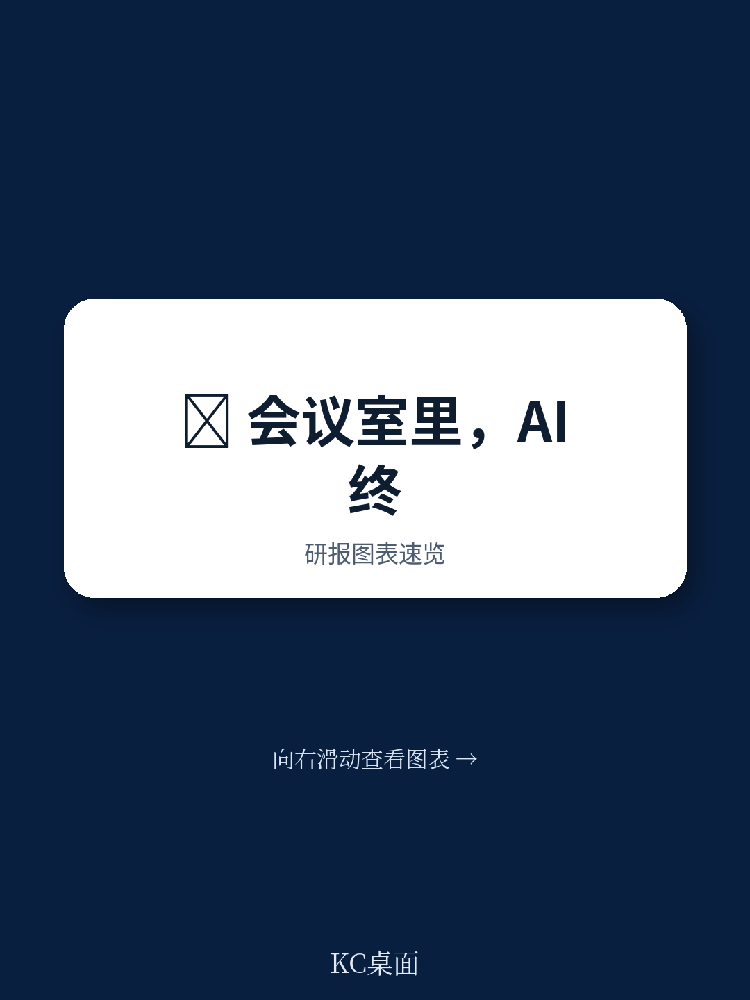
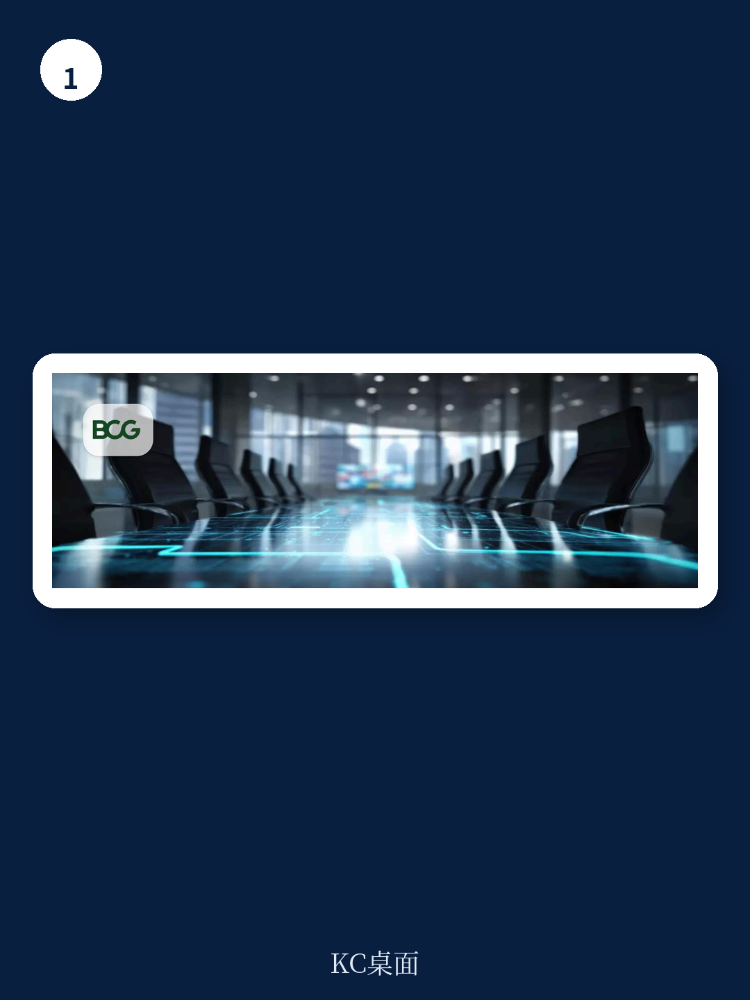

# 波士顿咨询：AI真正该进的地方，不是执行层，而是董事会

大多数企业高管都熟悉这样一个场景：会议室里，有人抛出一个关键问题——“如果三季度需求走软会怎样？”“亚洲主要供应商突然提价，我们的真实敞口是多少？”所有人都知道数据存在，但它从不在讨论现场。数据往往在数周后才能拼凑出来，而那时决策窗口已经关闭。

波士顿咨询最新报告《Decision Agents Bring AI into the Boardroom》提出了一个反常识的判断：企业AI研究正在快速翻倍，但最需要AI介入的领域——战略决策——恰恰是AI投入最少的地方。报告认为，下一轮竞争优势的来源，不是更快的流程自动化，而是“决策智能体”（Decision Agent）进入董事会会议室。

**KC评论：** 这不是又一篇讨论AI工具的文章。波士顿咨询的洞察在于，企业AI研究的回报正在出现结构性错配——钱流向了执行层的效率提升，但真正决定企业命运的高层决策，仍然依赖人工、碎片化信息和漫长的对齐过程。报告给出的判断是：谁能率先把AI从“执行工具”升级为“决策伙伴”，谁就能在战略层面获得不可逆的优势。

## 1. 企业AI研究翻倍，但决策层几乎没分到蛋糕

波士顿咨询2026年AI雷达调查覆盖全球约2400名高管，结果显示：企业今年AI研究占收入比例预计翻倍至1.7%。但这些钱绝大部分流向了运营、流程和任务自动化。只有不到五分之一的高管将“决策”列为AI研究的首要优先级。

更值得关注的是这一组数据：虽然42%的CEO报告自己每周都在使用AI智能体，但在那些声称“决策是AI战略重点”的企业中，实际投入决策智能体的比例只有14%。波士顿咨询的结论很清晰——AI在提升“怎么做”方面已经见效，但在回答“做什么”这个更根本的问题上，几乎还是空白。

## 2. 决策智能体与执行智能体的本质区别：它不替代人，而是提升人的判断质量

报告区分了两类AI智能体。执行智能体（Execution Agent）是当前主流，它自动化复杂的操作任务，几乎不需要人工干预。而决策智能体（Decision Agent）的定位完全不同：它不在执行环节工作，而是在“选择环节”工作。

具体而言，决策智能体在三个维度创造价值：第一，建立统一的证据基础，将来自不同部门、不同格式的数据整合成一致基线；第二，实时生成并测试多种场景，高管在会议中调整假设，系统立刻更新推演结果；第三，限制认知偏差，通过共享数据和明确的业务逻辑，降低“信息不对称准备”和“未经挑战的假设”对决策质量的影响。

**KC评论：** 这里的关键不是技术突破，而是工作方式的根本变化。传统决策流程中，高管依赖的是会前准备的简报、个人经验和部门间的博弈。决策智能体试图把“会前数周的准备”压缩为“会中实时推演”，同时将隐性的利益冲突显性化。报告没有回避的是：这要求企业先解决数据基础设施和治理问题，否则智能体只能输出“垃圾进垃圾出”的结果。

## 3. 三个高价值应用场景，以及一个尚未完全回答的问题

波士顿咨询给出了三个已经验证的应用方向。供应链管理是典型案例：销售推动增长，制造优化利用率，采购追求成本效率，三者激励天然冲突。决策智能体作为供应链的数字孪生，可以实时整合需求预测、供应商产能、成本结构，让高管在会议中直接调整假设并看到代价。产品创新和不确定性智能管理类似——前者将客户反馈、开发成本、竞争对手信号和利润影响整合为特性优先级排序；后者将分散的不确定性信号统一折算为对业务绩效的影响，并给出主动管理的盈亏平衡点。

报告没有完全回答的一个关键问题是：当决策智能体给出提到后，谁来为最终决策负责？波士顿咨询明确提到“智能体支持判断，但不能替代问责”，但报告没有展开讨论的是，如果智能体的提到事后被证明错误，责任边界如何划定。这是一个需要企业自行探索的治理问题。

## 4. 从试点开始，但不要把决策智能体当成又一个IT项目

波士顿咨询建议从单一高摩擦的跨职能决策流程开始试点，比如综合业务规划、资本支出分配或新市场进入。关键是让相关职能负责人（销售、运营、财务）先共同敲定一个可用的输入版本，再逐步迭代优化。

报告特别强调，决策智能体不是另一个分析层，而是决策流程的参与者。这意味着企业需要建立数据治理体系、跨职能数据层（共享数据湖或整合层）、语义层（存储业务逻辑和本体），以及确保安全架构到位。这些投入是结构性的，不是一次性项目。

> **KC评论：** 波士顿咨询的这篇报告最有价值的部分，是它把AI的应用场景从“效率提升”拉回到了“战略决策”。对于正在规划AI研究的企业决策者，一个值得追问的问题是：你的AI预算中，有多少是投给“让现有流程更快”，又有多少是投给“让核心决策更好”？后者的回报周期可能更长，但波士顿咨询的判断是，它会成为下一个竞争壁垒。