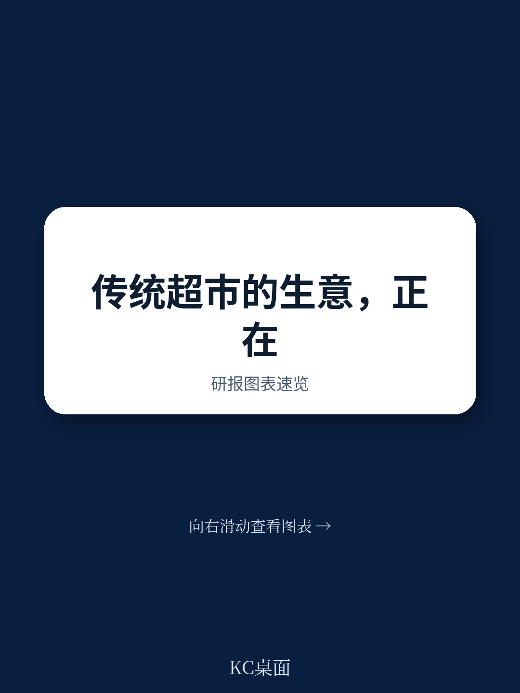
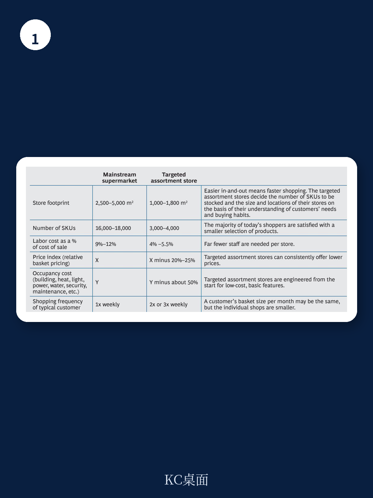

# 波士顿咨询：传统超市自救越努力，市场份额反而丢得越快

传统超市正面临一个残酷的悖论：他们越努力自救，市场份额流失得越快。波士顿咨询（BCG）最新研报指出，以Aldi、Lidl、Trader Joe's为代表的精选品类零售商，已经用一套完全不同的运营逻辑，证明了消费者不必在“品质”和“价格”之间二选一。而传统超市的应对——加品类、加促销、砍人工——恰恰是三重错误叠加，反而加速了自身边缘化。

这份报告的核心判断值得每一位零售决策者反复咀嚼：传统超市的扰动不是周期性的，而是结构性的。消费者的购物习惯已经从“每周一次大采购”转向“高频、小批量、就近购买”，而传统超市的运营模型仍建立在20年前的假设之上。

## 1. 精选品类零售商用“少”打败了“多”

BCG的数据对比直接揭示了问题的根源。一家传统超市通常占地2500-5000平方米，陈列16000-18000个SKU；而一家精选品类零售商仅需1000-1800平方米，SKU数压缩至3000-4000个。但后者能以低20%-25%的价格提供同等甚至更好的商品体验，同时将人工成本从销售额的9%-12%降至4%-5.5%，物业成本削减约50%。

关键不在于“小”，而在于“精准”。这些零售商不是简单做减法，而是基于对目标客群需求的理解，精心策划每一个SKU的存在意义。当传统超市还在为“176种沙拉酱”的丰富度沾沾自喜时，消费者已经用脚投票，选择了更快、更便宜、更清晰的购物体验。

> **KC评论：** 这张对比表是整份报告最有说服力的部分。它说明精选品类零售商的优势不是单一维度的价格战，而是从选址、陈列、供应链到人工配置的系统性效率碾压。传统超市试图在现有架构上“修补”，只会让差距越拉越大。

## 2. 传统超市的“自救三板斧”反而加剧了问题

BCG毫不客气地解剖了传统超市最常见的三种应对措施，并指出它们都产生了反效果。

第一，**增加品类**。为了刺激销售和满足供应商谈判，许多超市不断扩充SKU。但宽泛无差别的品类线稀释了单品销量，增加了供应链复杂度，也让门店变得更加杂乱。消费者不是要更多选择，而是要更对的选择。

第二，**加大促销**。部分超市的促销商品占比已超过40%。但高频促销扰乱了消费者对价格的正常认知，削弱了信任感。更糟糕的是，促销成本最终会转嫁到日常售价上，形成“高价-促销-更高价”的恶性循环。

第三，**削减人工**。为了腾出资金降价，超市压缩员工工时。但服务质量的下降立竿见影——消费者很快就能感受到货架没人理、收银排长队。在零售业，员工是品牌最直接的代言人，削减人工等于自毁口碑。

这三种做法的共同问题在于：它们都是战术性、短期性的动作，没有触及运营模型的核心。BCG称之为“三重打击”——同时伤害了消费者、供应商和零售商自己。

## 3. 报告没有完全回答的难题：转型的“先有鸡还是先有蛋”

BCG提出了正确的方向：重新审视客户价值主张、重置品类管理、精简端到端运营模型。但报告也承认，这些变革需要巨大的前期投入和时间。

这里存在一个尚未被充分讨论的困境：传统超市的现金流正在被精选品类零售商侵蚀，而转型所需的研究恰恰需要健康的现金流来支撑。削减人工可以短期改善利润表，但会损害客户体验；增加促销可以拉动销售额，但会破坏价格体系。在“既要又要”的约束下，大多数传统超市选择了最容易做的动作，而不是最正确的动作。

> **KC评论：** 报告没有完全回答的问题是“转型的节奏和优先级”。对于一家正在失血的传统超市，是先关掉一半门店、还是先重置品类？是先砍掉冗余SKU、还是先研究供应链？BCG给出了方向，但具体路径需要每个企业根据自身情况判断。这恰恰是报告留给读者自己思考的空间。

## 4. 给零售决策者的三个观察框架

基于BCG的分析，我们提炼出三个用于审视自身业务的框架

**第一，用“购物频率”而非“客单价”衡量客户价值。** 精选品类零售商的核心优势不是单次交易金额，而是让消费者每周光顾2-3次。如果传统超市的客户仍然维持每周1次的频率，说明你的价值主张在消费者心中已经沦为“不得已的选择”。

**第二，用“每SKU销售额”而非“总销售额”评估品类健康度。** 如果大量SKU贡献的销售额低于其占用货架的成本，这些SKU就是在吞噬利润。传统超市需要建立一套严格的SKU淘汰机制，而不是不断加新品。

**第三，用“员工有效服务时间”而非“总工时”衡量运营效率。** 削减人工不一定是坏事，但如果削减的是与客户互动的时间，就是灾难。真正需要优化的是那些不创造价值的后台流程，而不是一线服务。

这份报告的价值不在于给出标准答案，而在于提供了一套重新审视零售运营模型的分析框架。对于正在思考转型的传统超市决策者，它既是一面镜子，也是一张地图。