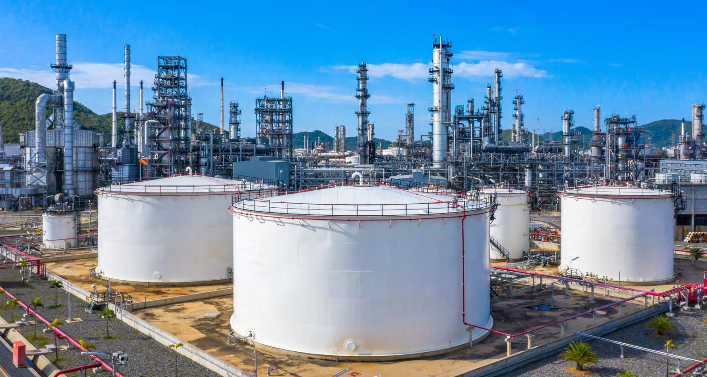
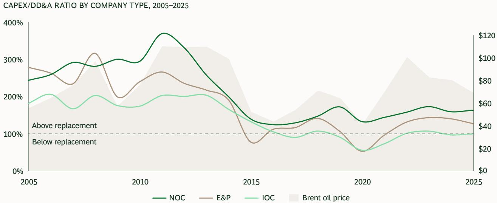
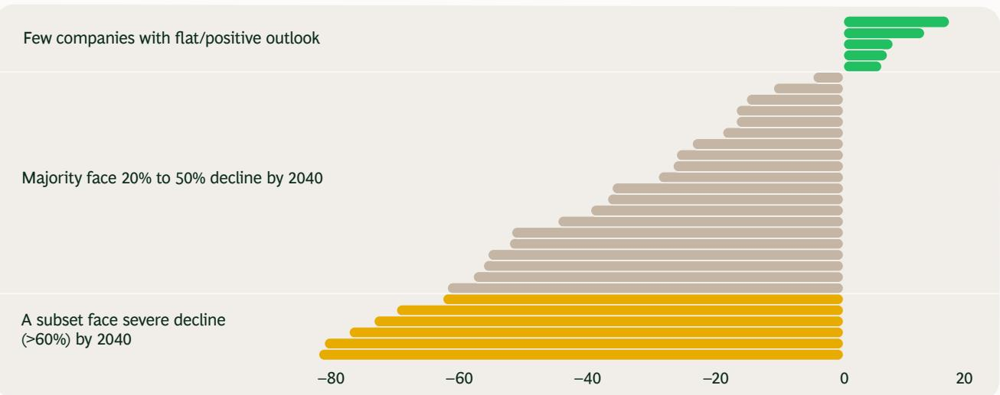
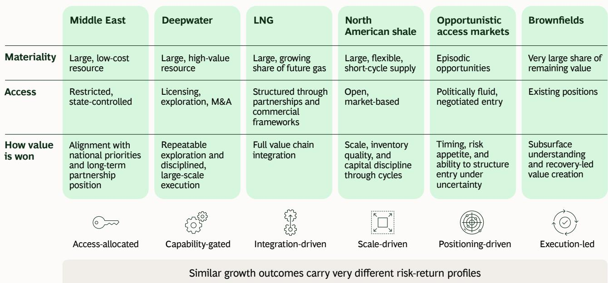
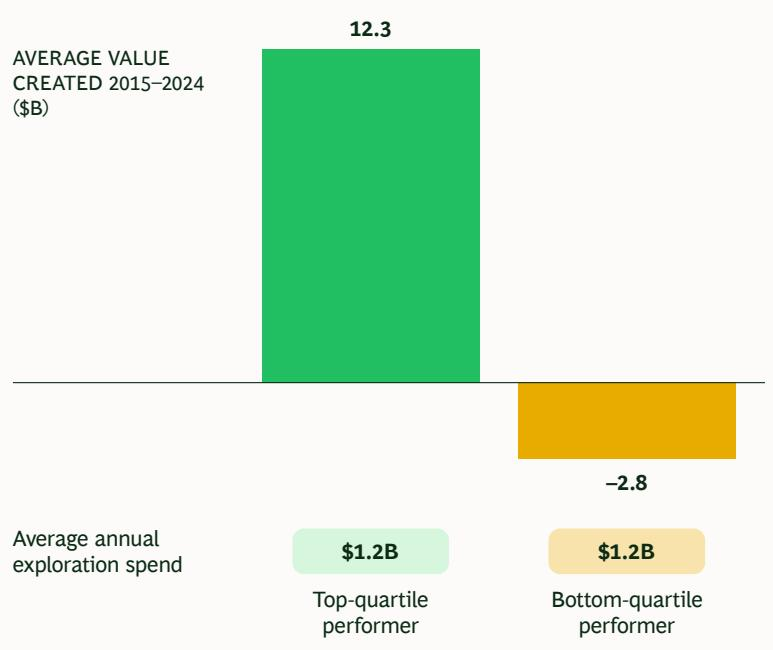
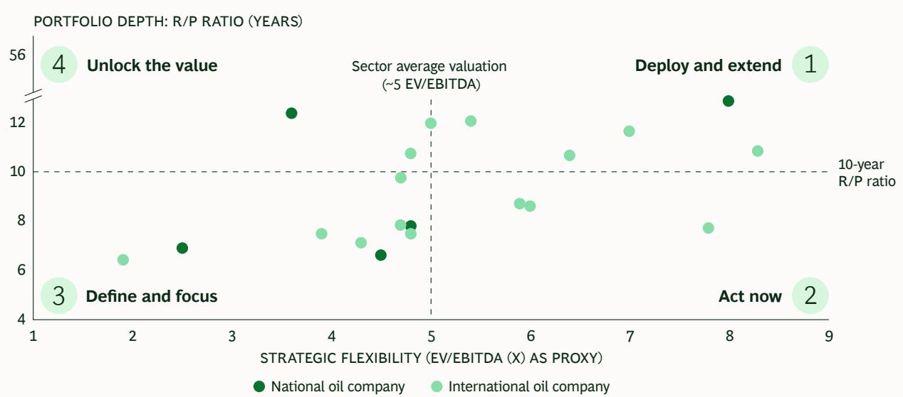

# Securing the Oil and Gas Resources of the Future

July 2026

By Rebecca Fitz, Ketil Gjerstad, Jaime Ruiz-Cabrero, Pattabi Seshadri, Odd Arne Sjatil, Martha Vasquez, and Betsy Winnike

For the past decade, oil and gas investors have largely de-emphasized how long a company’s reserves would last—instead rewarding capital discipline, returns on existing assets, payout consistency, and balance sheet strength. But that’s starting to change. BCG analysis shows that shareholders are beginning to factor portfolio longevity into their valuation calculations for the first time since the 1998–2008 supercycle. Although relatively small, it is a meaningful shift.

The elevation of longevity as a driver of investment decisions reflects the current reality of the energy transition. Demand for oil and gas has proven stickier-than-expected. At the same time, a decade of capital discipline has thinned the investment pipelines that players depend on for future supply, and the flexible short-cycle projects that partly masked this reality are themselves maturing. Furthermore, recent geopolitical events, including the disruption in the Strait of Hormuz, have heightened the urgency around energy security. Taken together, these developments have significant implications for energy

sustainability, affordability, and security, the three components of the energy trilemma. In this context, a focus on ensuring portfolio longevity is not about boosting overall production but rather replacing existing output as it is depleted. Disciplined, selective upstream investment therefore advances affordability and security while supporting an orderly energy transition—reducing the risk of the price volatility, energy shortages, and reliance on higher-emission sources that underinvestment would otherwise invite.

How companies respond will determine who creates value over the next cycle and who destroys it. Of course, these pressures apply across the sector—though not equally. National oil companies (NOCs) and international oil companies (IOCs) alike face the longevity challenge. But where a company sits in the competitive landscape depends on the depth of its existing portfolio and the strategic flexibility it commands. Both dimensions vary as much within company types as between them.

Against this backdrop, the central question is: Can companies' current upstream portfolios sustain the level of returns investors expect through the next cycle, and what will it take for them to do so?

Having a successful upstream strategy with adequate reserves shapes effective capital allocation for years to come—enabling companies to optimize key value creation drivers including payouts, earnings, and debt levels. It also supports the broader objectives of company owners, whether these objectives are capital market returns or sovereign energy and revenue priorities. Most players will need to take steps to extend the longevity and quality of their portfolios through a combination of organic and inorganic moves and extracting more from existing assets. For the small group of players that enjoy a structural oil and gas surplus, and so are not hampered by longevity concerns, the challenge is maximizing value through better integration across the value chain and having the right partnership model.

We've found that companies can achieve similar volume outcomes through pathways that have very different risk-return profiles. The companies that outperform will be those that select pathways to replenish oil and gas reserves proactively, based on where they have a genuine right to win. Companies that fail to do this risk repeating the value destruction of previous cycles.

## The upstream sector is entering a more competitive phase

A decade of capital discipline has compressed the future supply pipeline—and the implications are becoming clear at a difficult moment

Geopolitical disruption has sharpened a question the market had largely set aside: Can today's portfolios sustain the returns investors expect through the next cycle?

Portfolio longevity is quietly re-entering the valuation equation for the first time since the super cycle

Companies enter this cycle from fundamentally different positions—and the strategic choices they make now will shape who captures the next decade of value creation

# Capital discipline has thinned the future supply pipeline Capex-to-depreciation ratios have nearly halved over the past decade

  
Sources: S&P Capital IQ; International Energy Agency; BCG analysis.  
Sources: S&P Capital IQ, International Energy Agency, BCG analysis.
Notes: Capex/DD&A ratio for 81 large oil and gas producers by peer group. DD&A = depreciation, depletion, and amortization. IOC = international oil company. NOC = national oil company. E&P = exploration and production company.

# Most companies face a material production decline by 2040 Even after including identified growth projects

NET PRODUCTION 2040 VS 2025 $^{1}$ FOR LARGEST IOCS AND NOCS (%)

  
Sources: Wood Mackenzie; S&P Capital IQ; BCG analysis.
Notes: IOC = international oil company. NOC = national oil company. $^{1}$ Gap calculated from total forecast oil and gas production in 2040 compared to 2025, including existing growth projects.

## Much of the remaining upstream value sits in markets controlled by host states and national oil companies

  
Sources: Wood Mackenzie; BCG analysis.
Notes: “Limited access” represents states with restricted foreign access. “Selective access” represents states accessed via select partnerships. NPV at 10% WACC, \$65/bbl base case. NPV = net present value. Tcf = trillion cubic feet. NOC = national oil company.

Winning in upstream will depend on taking a differentiated approach  
  
Source: BCG Center for Energy Impact analysis

## The best explorers deliver more discoveries from similar investment levels

Sources: Wood Mackenzie; BCG Center for Energy Impact analysis.
Note: Companies include Aker bp, APA, bp, Capricorn Energy, Chevron, CNOOC, COP, Ecopetrole, Eni, Equinor, Exxon, Galp, Harbour Energy, Inpex, Kosmos, Murphy, Oxy, OMV, ONGC, Pemex, Petrobras, PTT, Repsol, Santos, Shell, Talos, TotalEnergies, Tullow, and Woodside.

## Different starting positions drive different renewal strategies Portfolio depth shapes renewal needs; valuation premiums create strategic optionality

  
Sources: S&P Capital IQ; Wood Mackenzie; BCG Center for Energy Impact analysis.
Notes: R/P ratio from YE 2025; EV/EBITDA as of 4/10/2026. Only partially-listed NOCs are included in the data series. r/p ratio = reserves-to-production ratio.

## Questions executives should be asking now

Where do we genuinely have a structural right to win?

How much of our renewal plan depends on growth that is economically inferior to the base business?

Does our capital framework preserve the flexibility to act offensively when the cycle or landscape shifts?

Does our strategy translate into earnings durability, payout confidence, and valuation support?

Is our portfolio resilient if geopolitical shocks create sustained volatility in prices or access?

## A More Demanding Environment

Several factors are reshaping the competitive landscape for upstream oil and gas. While some of these factors are making it harder for companies to extend the longevity of their upstream portfolios, they are also making it more important to get their upstream strategies right.

The first is capital discipline. Combined with the redirection of capital into low-carbon businesses that are not generating the earnings that were anticipated, capital discipline has predictably shortened many companies' investment pipelines. The average five-year capex-to-depreciation ratio has nearly halved over the past decade. This was the right response to the value destruction of previous cycles. But lower reinvestment is now compressing near-term supply options at a difficult moment, with geopolitical risk in the Middle East creating uncertainty over a meaningful share of the near-term supply pipeline.

Disruption in the Middle East has sharpened an already intensifying global resource access challenge. High-quality resources (with lower costs and lower carbon emissions) are becoming more concentrated in markets where entry depends on relationships and related factors. For IOCs that don’t already have strong positions in such markets, the window of opportunity to access these resources is narrowing as these factors grow in importance.

The same forces reshaping company strategies are creating both pressure and opportunity for resource-holding governments. While open markets like the US remain critically important—and highly competitive—a significant share of the remaining upstream value in both liquids and gas sits in state-controlled or access-restricted markets, where host governments set the terms on which capital enters. Maximizing the value of those resources over the long term depends on more than ownership; it requires the right partners, with the right capabilities and commitment. The governments best positioned to attract these partners will be those that offer not just access, but stable frameworks, clear terms, and a genuine alignment of interests between state and investor. With capital becoming more selective, governments should do the same in the partnerships they seek.

There are three overarching solutions to the longevity challenge: exploration, M&A, and technology.

## Exploration

Some companies can help solve their portfolio longevity issues through exploration, but this won't work for all and is unlikely to be the main source of new reserves through 2040. Most of what the industry needs is expected to come from existing production or from resources that are under development or already discovered.

For players with the right combination of access, technical capability, and financial structuring discipline, there are real opportunities in the Atlantic margin, the Eastern Mediterranean, and selective markets that are reopening across Africa.

Returns from exploration are highly concentrated, however. BCG analysis shows that, despite similar levels of spending, top performers generate significantly more positive value than laggards. The difference lies in how they manage capital exposure along with subsurface skills—through phased development, infrastructure-adjacent targets, and pre-development farmdowns that optimize partnership structures early and limit capital exposure before the highest-risk spending starts. Advances in development technology have made this model increasingly viable, creating a flexibility that has fundamentally changed the economics of exploration.

## Mergers and Acquisitions

M&A is another option for companies seeking to replenish their oil and gas reserves. However, the benefits of deal making vary widely. For companies with high valuations, it enables them to use their paper as a sought-after currency to achieve their renewal plans. But for resource-constrained companies, M&A is often most attractive when it is most dangerous—increasing the risk of overpaying for assets, eroding strategic flexibility, and potentially destroying value through the cycle.

## Technology

The biggest game-changer in enabling players to extend their portfolios could be technology. Players with genuine technical depth create value in two reinforcing ways: extracting more from their existing resource bases, and opening doors to new ones.

In terms of existing resource bases, currently some of the world's largest holders of conventional reservoirs recover less than half the average for their peer group. Innovations in equipment—including smaller and more mobile surface infrastructure; floating production, storage, and offloading units; and multiphase subsea boosting pumps—have already transformed the economics of offshore recovery and continue to do so. AI-enabled subsurface modeling is creating further headroom. The most consequential frontier may be shale: if enhanced oil recovery technologies could double recovery factors to around 15%, it would go a long way toward meeting future resource needs. Many technological pathways are being explored today, including creating fractures to expose oil to the wellbore, using chemical agents to release oil from the pores, or injecting $CO_{2}$ . But achieving this goal depends on companies making deliberate strategic choices and carries real technical risk, and the winning approach is far from settled.

The second way to create value is using technical capability as an access key. In markets where resources are controlled by host states, the basis for partnership rests on what a company can genuinely offer—whether that’s subsurface expertise, a strong execution track record, or development innovation. Players that have built deep capabilities in these areas find that doors are opened to them that remain shut for purely financial competitors.

While either route demands genuine capability and deliberate commitment, the returns for those that get it right are substantial.

## Responding to the New Upstream Reality

Companies do not enter the approaching cycle from the same starting position. The right strategic response to an upstream environment where competition and resource access are getting tougher depends on where a player sits across two dimensions: the depth of its existing portfolio and the strategic flexibility its valuation provides. In this context, valuation matters not as a scorecard but as a source of optionality. A strong valuation benefits companies via equity-financed M&A, cheaper capital, and the ability to act decisively when others cannot. It is the product of responsible capital management through the cycle—and it has a compounding effect. Companies that have maintained capital discipline enter the cycle with genuine strategic choice, while those that have been less disciplined face a more constrained set of options.

Based on these dimensions, BCG's analysis places leading oil and gas companies—among them both IOCs and NOCs—within one of four categories. While there is some overlap between the companies in different categories, each category has a distinct strategic logic for pursuing portfolio longevity. (See “Different starting positions drive different renewal strategies” on page 6 for a visual representation.)

## Deploy and Extend

Companies with both portfolio depth and strategic flexibility enter the cycle from a place of genuine strength. Their priority should be to extend resource positions selectively within the narrowing set of high-quality opportunities, without overextending beyond positions where they have a genuine right to win. The risk for this group is not scarcity of options but maintaining discipline in choosing from among them. They also need to anticipate how more constrained competitors will act under pressure, as this can reshape the opportunity set faster than internal planning cycles allow.

## Act Now

Companies with strong valuations but thinning portfolios still hold an important strategic card. A strong valuation makes inorganic moves accretive in a way that simply isn't available to lower-valued peers paying the same nominal premium. In addition, given the volatile geopolitical environment, resource positions that are available today in difficult-to-access markets may not be available on the same terms, or at all, in a few years. The risk these players face is overpaying for assets or spreading capital thinly across too many positions and plays simultaneously, eroding the valuation advantage that made action possible in the first place. Selectivity is paramount: players need to identify one or two renewal opportunities that can compound over the next decade, and concentrate their firepower here rather than hedging across multiple bets.

## Define and Focus

Players with weaker portfolio depth and more limited financial flexibility face the hardest conversations at a C-suite level. Pursuing growth without advantage (whether based on capabilities, access, or the benefits of a strong valuation) will destroy value. The constructive path involves improving technology deployment to increase recovery factors and utilizing aggressive high-grading around a genuinely advantaged core of resource positions—which requires hard choices about where to concentrate and where to exit. That is difficult to execute and harder to communicate to investors, but it can be done effectively.

Partnerships are particularly important with high-grading, as a way to create scale and share capital exposure around existing positions. The most instructive recent examples are in mature basins. They typically extend across country borders and create operational scale neither partner could achieve alone, or they involve forming standalone vehicles that enable companies to attract independent capital while retaining strategic influence. These moves don’t require new resource access or involve frontier risk. But they do require players to have the discipline to consolidate deliberately rather than managing subscale complexity indefinitely.

## Unlock the Value

Players with strong portfolios but valuations that don't reflect this strength face a different challenge: developing a credible narrative that connects portfolio quality to future cash generation. Until this valuation gap closes, their strategic flexibility will remain constrained. Their priority is not just demonstrating oil and gas delivery but actively closing the gap—through simplification of the business, balance sheet discipline, and a credible investor narrative that connects portfolio quality to future cash generation.

Although they will differ by portfolio depth and strategic flexibility, all major upstream players will enter the approaching industry cycle with genuine and hard-won strengths—whether in subsurface, project execution, enhanced oil recovery within shale and tight reservoirs, trading, or geopolitical relationship management. Companies need to ask themselves if the technical or relationship strengths they possess today align with the resource pathways (in, for example, deepwater or LNG) that are open to them. Where gaps exist, they must decide whether to use targeted M&A, partnerships, or organic moves to close them.

BCG's scenario-planning work with leading upstream players consistently shows that companies can achieve similar volume outcomes via pathways that have materially different risk-return profiles—in other words, pathways that diverge sharply on cash flow quality, capital intensity, above-ground risk, and capability requirements. The standout winners over the approaching cycle will not all have the same starting position. But players that outperform will share one aspect: they will be honest about where they have a real advantage over peers, enabling them to make better and more deliberate pathway decisions and execute their strategies more effectively.

In an environment where portfolio longevity is again becoming part of the valuation equation, the cost of not answering these questions clearly—and then acting decisively—is growing.

## About the Authors

## Pattabi Seshadri

Pattabi Seshadri
Managing Director and Senior Partner
Global Leader, Energy Practice
Dallas
seshadri.pattabi@bcg.com

Rebecca Fitz
Partner and Director,
Center for Energy Impact
Washington DC
fitz.rebecca@bcg.com

## Ketil Gjerstard

Managing Director and Senior Partner
Oslo
gjerstard.ketil@bcg.com

## Betsy Winnike

Senior Manager,
Energy Vantage team
Washington DC
winnike.betsy@bcg.com

## Jaime Ruiz-Cabrero

The authors thank Håvard Holmås, Olivia Weber, Rachit Sharma, Steven Ho, Obel Chin, and Borja Jimenez for their contributions to this article.

## Acknowledgments

Managing Director and Senior Partner
Madrid
ruiz-cabrero.jaime@bcg.com

Odd Arne Sjåtil
Managing Director and Senior Partner
Oslo
sjatil.oddarne@bcg.com

## Martha Vazquez

Partner and Associate Director
London
vasquez.martha@bcg.com

## Boston Consulting Group

## Where Strategic Clarity Meets Applied AI

We are navigating an era of unprecedented change and disruption—powered by technology, marked by complexity, where change amplifies at scale. To lead, companies need a partner that can bridge the gap between ambition and outcomes. BCG is built for this moment. We bring strategic clarity, rooted in over 60 years of deep domain knowledge, to ensure leaders make the right choices. We combine it with applied AI, shaped and wielded by our practitioners, teaming shoulder-to-shoulder with your teams to deliver transformative impact at scale. The result? Stronger returns, transferred capabilities, and change that sticks. We are BCG.

## The Center for Energy Impact

The Center for Energy Impact (CEI) shines light on the energy transition, focusing on the actions required to achieve global transformation. CEI applies a holistic perspective to understanding and shaping bold responses to one of the most critical and complex challenges of our time.

Our deep expertise spans markets and economics, carbon and technology, capital and investors, the macrodynamics of geopolitics and resilience, and the microdynamics of politics and specific policies. We offer nuanced, constructive ideas and solutions covering the future availability, economics, and sustainability of the world's energy sources—and the implications for energy companies, industries, investors, consumers, and governments. The CEI team is committed to facilitating informed, innovative discussions to make our world sustainable.