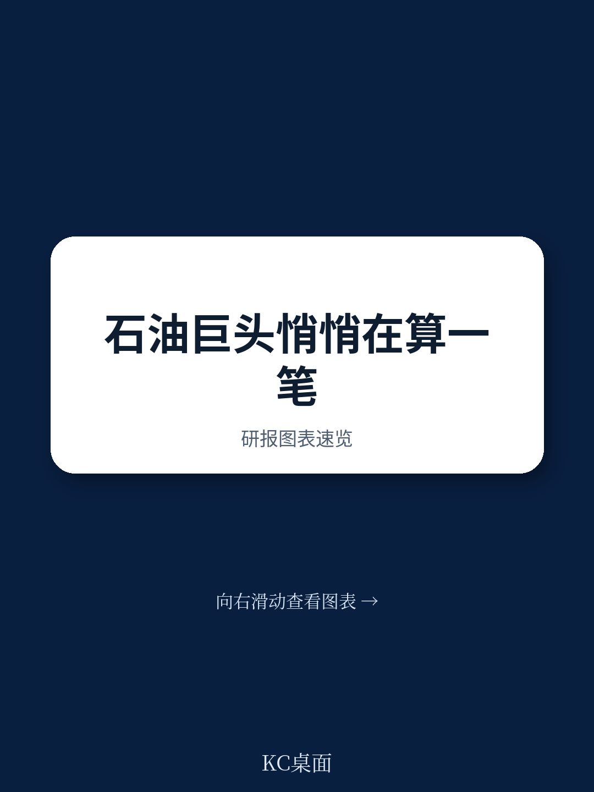
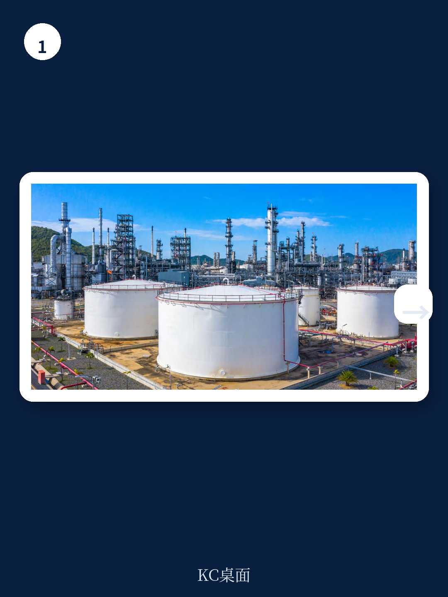
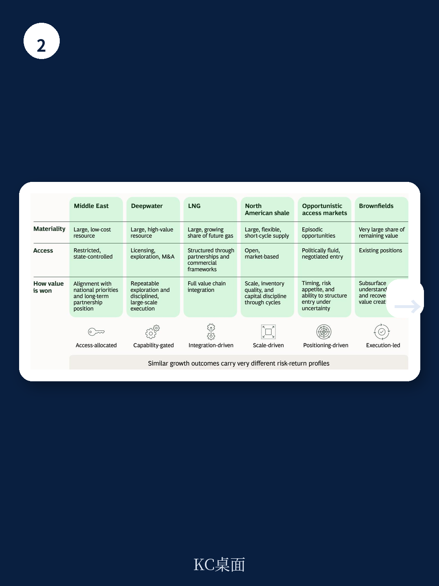

# 波士顿咨询：AI与现金流之外，油气公司真正需要修复的是什么

一份来自波士顿咨询（BCG）的最新研究报告指出，油气行业的读者正在重新评估一个自1998-2008年超级周期后便几乎被遗忘的指标：**资产组合的寿命**。这并非一个微调，而是一个信号，预示着上游市场正进入一个竞争更激烈、战略选择更分化的新阶段。

过去十年，资本纪律、回报率和资产负债表健康度是油气公司估值的核心。读者奖励那些控制支出、兑现分红的公司，而非那些拥有最长资源寿命的公司。但BCG的分析发现，这一逻辑正在松动。尽管变化幅度尚小，但“长寿”作为估值驱动因素的权重正在上升。这背后是三重不确定性的叠加：油气需求比预期更具韧性；长达十年的资本纪律已显著压缩了未来的供应管道，资本支出与折旧摊销比在过去十年近乎减半；而地缘政治事件，尤其是霍尔木兹海峡的扰动，将能源安全推至前所未有的优先级。

这意味着，公司当前的上游组合能否在下一个周期中维持读者所期望的回报，已不再是一个可以回避的问题。

> **KC评论：** 读者重拾对“组合寿命”的关注，本质上是对“供给缺口”的提前定价。报告的核心洞察并非预测油价，而是指出一个结构性变化：过去十年靠“省钱”获得估值溢价的公司，未来可能需要靠“有选择地花钱”来维持地位。完整报告中对不同公司起始位置的矩阵分析，是理解这一轮分化的重要框架。

## 1. 资本纪律的后遗症：供应管道变薄，竞争门槛提高

BCG的报告用一组数据清晰地展示了行业面临的困境。过去十年，大型油气公司的平均五年资本支出与折旧摊销比几乎减半。这意味着，行业在修复资产负债表的同时，也显著削减了对未来产量的研究。当全球需求并未如预期般快速下降，而地缘政治不确定性又加剧了供应的不确定性时，这种“压缩”的后果开始显现。

报告预测，即使计入已确定的增长项目，大多数公司在2040年的净产量相对于2025年都将出现实质性下滑。更关键的是，剩余的高质量、低成本、低碳排放的上游价值，正越来越集中于由资源国政府或国家石油公司控制的市场。对于国际石油公司而言，进入这些市场的窗口正在收窄，且门槛越来越高——不再仅仅是资本，而是技术、关系与长期承诺的组合。

这并非一个全行业的挑战，而是一个分化的起点。那些拥有深厚资产组合和战略灵活性的公司，与那些资源正在枯竭、估值又不高的公司，将面临截然不同的战略选择。

## 2. 三种“补库”路径：勘探、并购与技术，各有各的赢家和陷阱

面对组合寿命的挑战，公司并非无路可走。BCG梳理了三条主要路径，但每一条都伴随着明确的“赢家”与“陷阱”。

**勘探**：机会依然存在，尤其是在大西洋边缘、东地中海和非洲部分重新开放的市场，但回报高度集中。顶尖的勘探者能以相似的研究水平获得远高于同行的发现。关键在于，他们通过阶段性开发、靠近现有基础设施的目标以及早期优化合作伙伴结构，来管理资本不确定性，而非单纯依赖地质技术。

**并购**：这是高估值公司的“特权”。当一家公司的公司被市场追捧时，它可以将其作为“硬通货”进行收购，从而在不稀释价值的情况下实现资源更新。但对于资源受限、估值偏低的公司，并购往往在最诱人的时候也最危险——极易为资产支付过高溢价，侵蚀战略灵活性，最终在周期中毁灭价值。

**技术**：报告认为，这可能是最大的变量。技术通过两种方式创造价值：一是从现有资源中“挤”出更多产量，例如通过AI驱动的油藏建模提高采收率，或通过增强型技术将页岩油采收率从目前的个位数提升至15%左右；二是作为进入资源国市场的“钥匙”，那些拥有深厚技术能力和优异执行记录的公司，能打开纯粹财务读者无法触及的大门。

> **KC评论：** 报告对“技术”路径的描述尤其值得关注。它并非简单的“技术乐观主义”，而是指出技术优势必须与“进入权”结合才能兑现价值。对于拥有技术但缺乏资源准入的公司，寻找拥有资源但缺乏技术的国家石油公司作为合作伙伴，可能是最现实的路径。完整报告中对不同技术路径（如CO2注入、化学驱油）的不确定性评估，是决策者需要细读的部分。

## 3. 报告尚未完全回答的关键问题：估值溢价如何转化为持久优势？

BCG的报告将公司分为四类，并给出了相应的战略建议：对于资产深厚且估值高的“部署与扩展”型公司，核心是克制；对于估值高但资源减少的“立即行动”型公司，核心是聚焦；对于两者都弱的“定义与聚焦”型公司，核心是取舍；对于资产好但估值低的“释放价值”型公司，核心是沟通。

这个框架极具洞察力，但它留下了一个关键问题：**估值溢价本身是动态且脆弱的。** 一家公司通过资本纪律赢得了高估值，但为了弥补资源缺口而进行大规模并购或高不确定性勘探，其估值溢价能维持多久？报告暗示了“灵活性”的复合效应——高估值带来更多选择，更多选择又可能巩固高估值——但并未深入探讨这个正反馈循环的断裂点在哪里。当整个行业都在追逐“长寿”时，那些率先行动的公司是否会因为推高资产价格而侵蚀自己的优势？这或许是读者在阅读报告后需要自行推演的场景。

## 4. 一个可供读者使用的观察框架：从“省钱”到“花钱”

对于行业观察者和决策者而言，BCG的报告提供了一个清晰的观察框架：**未来几年，评估一家油气公司，不能只看其资本回报率，还要看其“花钱”的质量和方向。**

具体而言，可以关注以下几个维度
- **资源更新路径的“不确定性-回报”特征**：公司是选择高不确定性的深水勘探，还是通过技术提高现有油田采收率，或是通过并购获取已探明储量？不同路径对应着截然不同的现金流质量和资本密集度。
- **估值与行动的匹配度**：一家估值较低的公司却在进行大规模并购，这通常是一个危险信号。相反，高估值公司若在资源获取上过于保守，也可能错失窗口。
- **技术能力的“可转移性”**：公司的技术优势是局限于特定盆地或地质条件，还是具有普适性？后者才是打开资源国市场的真正钥匙。

在“长寿”重新成为估值变量的当下，那些能够诚实评估自身优势、并据此做出有纪律的战略选择的公司，更有可能在下一个十年中胜出。而那些试图用过去的策略应对新环境的公司，则可能面临价值毁灭的不确定性。

---

> **KC评论：** 这份报告最有价值的部分，或许不是其对趋势的判断，而是其提供的“自我诊断”框架。对于任何一家油气公司的高管，报告末尾列出的五个问题（例如“我们的更新计划中有多少依赖于宏观环境性低于现有业务的增长？”）比任何宏观预测都更具实践意义。建议读者回到原文，仔细研读那四类公司的具体案例和战略建议。

For informational purposes only. Portions may be generated,translated,summarized,or edited with AI assistance based on source materials and may contain omissions or errors. Please verify independently. This is not investment,legal,tax,accounting,or other professional advice.
