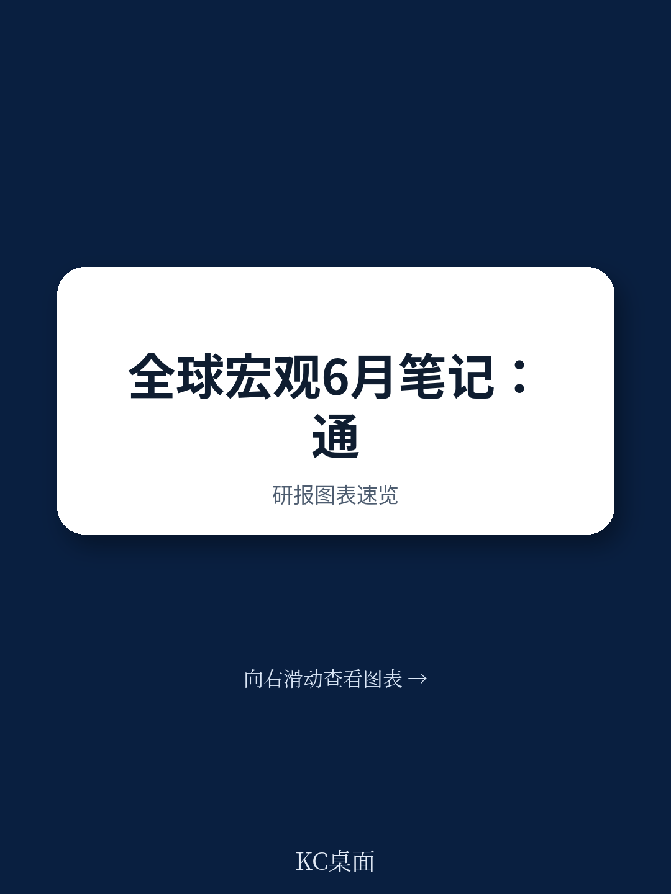
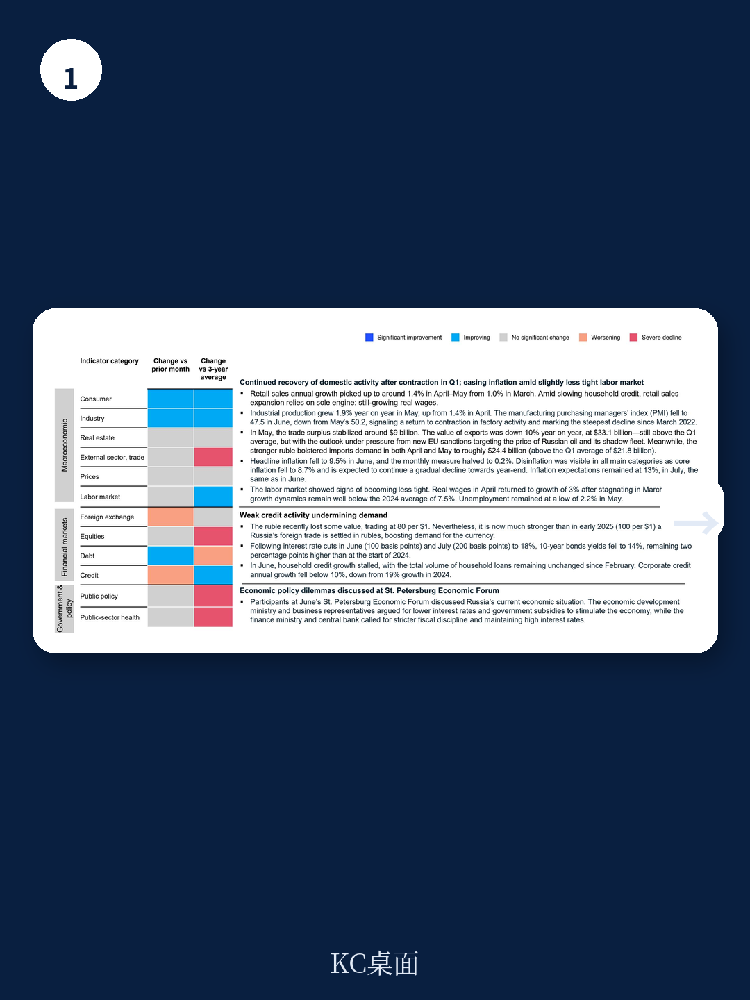
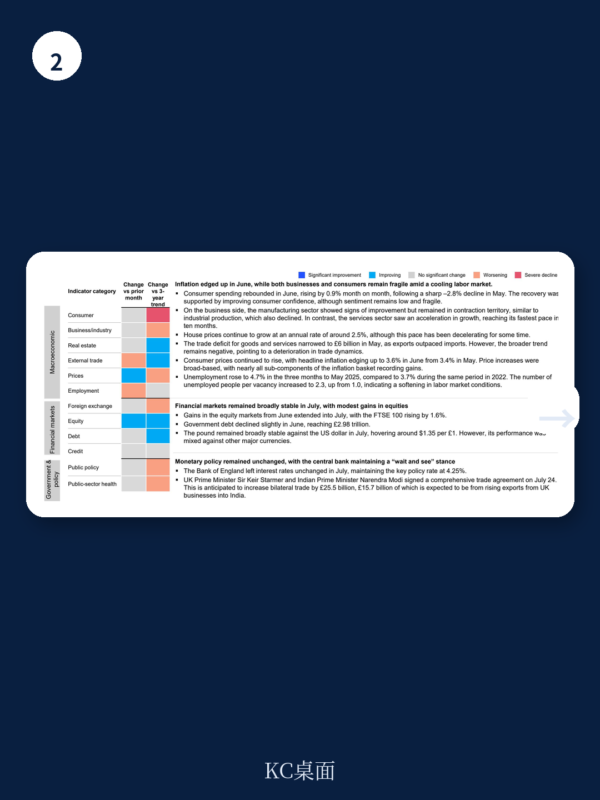

# 麦肯锡：中国Q2增长5.2%，消费与贸易结构悄然变化

国际货币产品组织在7月29日发布的《全球宏观环境展望》更新中，将2025年全球增长预期上调至3.0%，2026年上调至3.1%。表面看，这是好消息。但麦肯锡在最新一期《全球宏观环境情报》中捕捉到一个容易被忽略的细节：IMF同时强调，这一预测仍比今年4月2日之前的基线低约0.2个百分点。换言之，上调是因为关税前抢跑、美元走弱和部分地区的财政扩张暂时掩盖了真实冲击，而非贸易摩擦本身已经消化。

报告用大量数据表明，全球宏观环境的“韧性”正在被关税、通胀黏性和劳动力市场信号的分化所考验。真正值得关注的不是增长数字本身，而是这些数字背后的结构性张力——消费者信心与消费行为脱节、制造业与服务业分化、通胀读数与央行政策空间之间的错位。

> **KC评论：** 麦肯锡这份报告最有价值的地方，不是罗列各国GDP和CPI，而是把“贸易摩擦的滞后效应”具象化了。IMF上调增长预期，但同时也说“贸易紧张正在伤害全球宏观环境”——这两句话放在一起，才是完整画面。

## 1. 美国宏观环境的矛盾：消费撑起3%的GDP，但就业数据正在被大幅下修

美国Q2 GDP初值显示宏观环境环比年化增长3%，主要靠家庭消费和进口骤降带来的净出口改善。但麦肯锡报告同时指出，美国6月CPI同比升至2.7%，核心CPI年化升至2.9%，通胀不确定性并未消退。更关键的是劳动力市场：7月非农就业仅增加7.3万人，而5月和6月的就业数据被大幅下修——5月从+14.4万修正为+1.9万，6月从+14.7万修正为+1.4万，两个月合计下修25.8万人。

这意味着，此前市场认为“稳健”的就业市场，实际强度远低于初值所暗示的水平。美联储在7月30日以分歧投票维持利率不变，仍预期年内降息两次，但通胀预期上修至3.0%，GDP增速预测从2.1%下调至1.4%。麦肯锡的报告暗示，美联储的“等待”策略正在被宏观环境数据本身侵蚀——不是调整不确定性，而是“滞胀”的早期轮廓。

## 2. 全球制造业与服务业的分化，比任何单一指标都更能说明问题

报告显示，6月全球制造业和服务业均在扩张，但制造业内部信号混乱：美国制造业PMI在7月跌至49.5，进入调整区间；欧元区制造业PMI也降至50.7，为四个月低点；墨西哥制造业PMI连续12个月处于调整状态，6月进一步降至46.3。而服务业普遍更具韧性——美国服务业PMI升至55.2，欧元区升至51.2，英国服务业录得十个月最强增长。

这种分化不是暂时的。麦肯锡的数据暗示，关税冲击对可贸易部门（制造业）的传导速度远快于不可贸易部门（服务业）。当制造业订单因关税不确定性而推迟或取消时，服务业仍在受益于前期积累的消费动能。但问题是，服务业的韧性能否持续——如果制造业调整最终传导至就业和收入，服务业的滞后反应可能在下半年出现。

## 3. 中国Q2增长5.2%，但消费与贸易的结构正在发生微妙变化

中国Q2 GDP同比增长5.2%，与Q1的5.4%基本持平，略高于全年5.0%的目标。消费贡献了52.3%的GDP增长，研究占24.7%，净出口占23.0%。但麦肯锡报告指出，中国跨境贸易在Q2出现复苏，出口增长稳定在6.0%，而进口调整幅度从Q1的-7.0%大幅收窄至-0.9%。这组数据意味着什么？出口保持韧性，但进口正在从深度调整中缓慢修复——这既反映了国内需求的边际改善，也暗示企业可能在关税不确定性下提前备货或调整供应链。

同时，中国城镇调查失业率从3月的5.2%降至6月的5.0%，青年失业率从16.5%降至14.5%。就业市场有所改善，但青年失业率仍处于高位。麦肯锡的报告没有给出明确结论，但数据本身指向一个判断：中国宏观环境的“量”在恢复，但“质”的改善——尤其是消费信心和就业结构——仍需时间。

## 4. 新兴市场的分化：印度通胀降至2019年以来最低，巴西和墨西哥面临不同不确定性

印度7月CPI同比降至2.1%，为2019年以来最低，但核心通胀已从2024年中持续上升至4.5%。麦肯锡报告指出，印度服务业和制造业PMI均显示强劲扩张，制造业产出创14个月最快增速。通胀节奏变化与需求扩张并存，使印度成为当前全球少数几个“低通胀+高增长”组合的地区。

巴西和墨西哥则面临不同挑战。巴西6月CPI升至5.35%，高于央行目标上限4.50%，央行维持基准利率15%不变。墨西哥通胀小幅回落至4.3%，但制造业PMI连续12个月调整，6月进一步出现变化至46.3。两国都受到美国关税政策的直接冲击——美国对巴西加征50%关税，对墨西哥威胁加征30%关税。麦肯锡的报告显示，墨西哥约一半出口符合USMCA规则可获豁免，但汽车和电子等核心行业仍面临不确定性。

> **KC评论：** 新兴市场的分化本质上是“谁更依赖制造业出口”的分化。印度受益于内需驱动和相对较低的关税敞口，而巴西和墨西哥的制造业链条更直接暴露在美国关税政策之下。这份报告的价值在于，它把这种分化量化到了PMI、贸易差额和通胀路径的层面。

## 5. 一个可复用的观察框架：关注“关税收入”这个被忽视的变量

麦肯锡报告提供了一个容易被忽视的数据点：美国最新关税收入显示，新关税已将月度进口税收推高约65亿美元，达到215亿美元。如果当前趋势持续，2025年新关税可能为美国财政带来2500亿至3000亿美元的收入。这个数字的意义不在于财政本身，而在于它提供了一个衡量“关税真实冲击”的替代指标——关税收入越高，意味着进口商和消费者承担的成本越大，而这一成本最终会通过价格传导影响通胀和消费。

观察框架可以简化为三个问题：第一，关税收入是否持续增长？第二，核心通胀是否开始反映关税传导？第三，制造业PMI是否在关税冲击后持续低于50？当这三个信号同时出现时，贸易摩擦的“滞后效应”才真正进入宏观环境数据的显性阶段。
