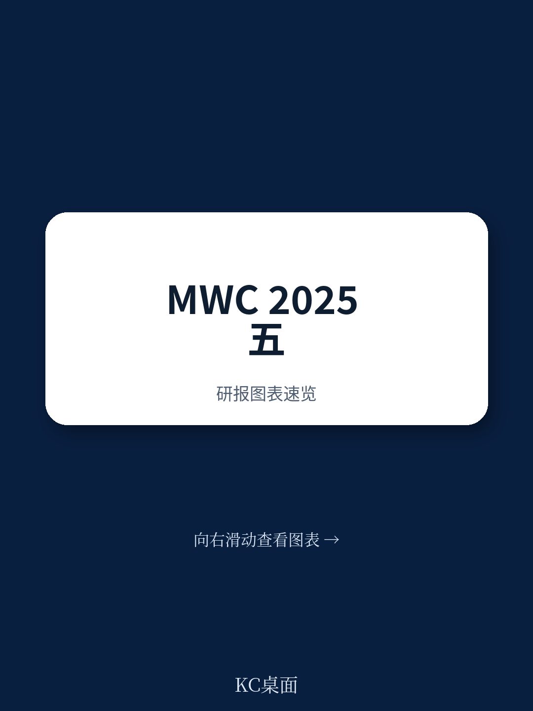
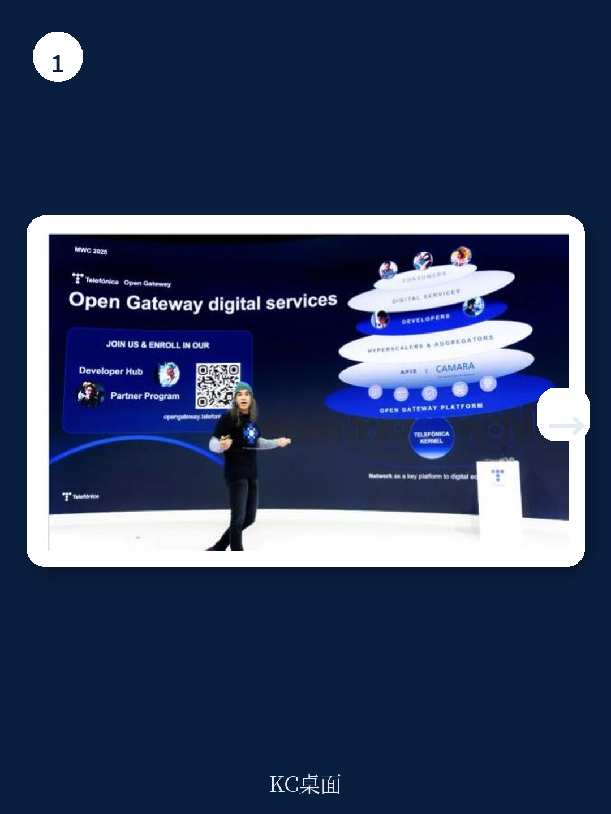
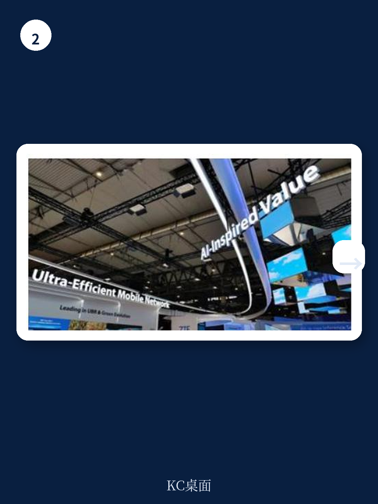

# 麦肯锡：6G讨论聚焦AI原生和感知，但各方对定义尚未对齐

巴塞罗那的 MWC 2025 刚刚落幕。麦肯锡在会后发布的观察报告中，提炼出一个贯穿全场的主线：AI 已经渗透到每一场发布、每一次演示和每一个展台，但行业尚未回答“什么能留下，什么能产生可持续价值”。这可能是今年展会最诚实的一句话。

报告覆盖了从卫星直连到 6G 频谱、从网络 API 到量子安全等多个议题，但真正串联起所有讨论的，是运营商和设备商在 AI 面前既兴奋又焦虑的姿态。他们不想再错过下一波技术红利，但路径并不清晰。

## 1. AI 无处不在，但“可持续价值”仍是一个问号

麦肯锡的报告指出，AI 和生成式 AI 在 MWC 上几乎无处不在，但不确定性同样明显：哪些应用会真正留下来，哪些只是展台概念，行业还没有共识。

运营商在消费者端推出了 AI Phone、个人 AI 助手，甚至 AI 驱动的 XR/VR 眼镜。德意志电信的 Magenta AI Phone 计划在 2025 年下半年推出，搭载 Perplexity 的 AI 能力，试图让用户无需切换应用就能完成多项任务。亚洲运营商如 LGU+、中国移动和 SK 电讯则展示了个人 AI 助手，SKT 的 Astar 预计 2025 年在北美上线。

在企业端，运营商开始推出面向中小企业的 AI 数字助手、专有 GPT 模型，以及针对工业场景的 AI 智能维护方案。多家运营商还宣布了 GPU 即服务计划，试图将 GPU 托管在无线接入网侧，利用靠近用户的低延迟优势。

> **KC评论：** 运营商在 AI 上的布局，本质上是在回答一个老问题——过去十年，他们没能从视频流量暴增和 5G 部署中分到足够利润。AI-RAN 和 GPUaaS 是新的尝试，但报告提醒，产业链各方对“RAN 优化是否需要 GPU”仍有分歧，设备商认为现有加速器足够，新进入者则试图用 GPU 方案挑战传统架构。

## 2. 卫星直连从概念走向现实，但谁主导还不确定

卫星直连设备是今年 MWC 最具体的突破之一。麦肯锡观察到，一批新合作在展会期间宣布：沃达丰与 AST SpaceMobile、KDDI 与 Starlink、Verizon 与 Singtel 及 Skylo。欧盟也签署了 100 亿欧元的协议，委托 SpaceRISE 联盟在 2030 年前开发卫星星座，目标是缩小数字鸿沟并增强欧洲自主性。

Bharti Airtel 的 CEO 在展会上说得很直接：“我们的使命是覆盖最后 4 亿人，卫星服务是填补覆盖空白的方案。”

但报告也给出了三个冷静的判断：卫星市场尚未出现主导玩家，AST、Starlink 和 Eutelsat 占据了多数合作；行业共识是卫星将补充而非替代蜂窝网络；在物联网和固定无线接入领域，低轨卫星与蜂窝技术之间确实存在竞争。

## 3. 网络 API 在升温，但商业模式仍是最大悬念

超过 20 家国际运营商已经成立合资公司，试图将网络 API 货币化。麦肯锡估算，2025 至 2028 年间这一市场的累计机会约为 200 亿欧元。Orange 在展会前两天宣布成立 LiveNet 业务单元，专门负责网络 API 的市场化；Telefonica 则通过黑客马拉松拉拢开发者社区。

但报告没有回避现实：真正的收入仍然很低。目前最受关注的用例集中在防欺诈和服务质量按需保障上，这更像是“低垂的果实”。API 是一个生态系统游戏，运营商需要与整个价值链协作才能规模化。

## 4. 6G 讨论聚焦 AI 原生、感知和 4-7 GHz 频谱

在 3GPP 韩国会议前夕，MWC 成为 6G 标准讨论的重要预热场。麦肯锡注意到，感知技术的演示已经从纯技术验证转向了首批用例——诺基亚展示了实时定位和测距的 6G 原型，大型私有网络数字孪生也强调了感知系统的重要性。

行业对 6G 使用 4-7 GHz 频谱有强烈偏好，太赫兹频谱的讨论则相对沉寂。AI 原生被认为是 6G 的关键差异化特性，但各方对“AI 原生”的具体含义尚未对齐——它和 AI-RAN、GPUaaS、AI 运维之间的边界在哪里，行业还需要在 3GPP 会议上进一步厘清。

## 5. 国防与公共安全成为运营商和设备商的新增长点

一个容易被忽视的趋势是：公共安全机构正从 TETRA、P25 等非 3GPP 标准转向蜂窝系统，以支持宽带服务。各国政府也在扩大国防预算。麦肯锡报告指出，私有网络在国防和公共安全领域的部署，单网覆盖面积远大于工厂场景，因此支出也显著更高。

诺基亚与 Verizon 合作，将诺基亚的军用级 5G 方案集成到洛克希德马丁的混合基站中。中国厂商如海能达也展示了基于 4G/5G 的 mcX 关键通信服务。报告认为，设备商和运营商可能应该优先将国防和公共安全纳入市场策略，因为未来几年将有大量机构完成向 3GPP 标准的迁移。

---

MWC 2025 的展台终会撤下，但麦肯锡这份观察的价值在于：它没有停留在“AI 很热”的泛泛之谈，而是逐一拆解了每个方向上的进展、分歧和未解问题。对于产业决策者而言，真正的功课不在展会现场，而在会后判断——哪些信号值得跟进，哪些噪音可以忽略。

For informational purposes only. Portions may be generated,translated,summarized,or edited with AI assistance based on source materials and may contain omissions or errors. Please verify independently. This is not investment,legal,tax,accounting,or other professional advice.

