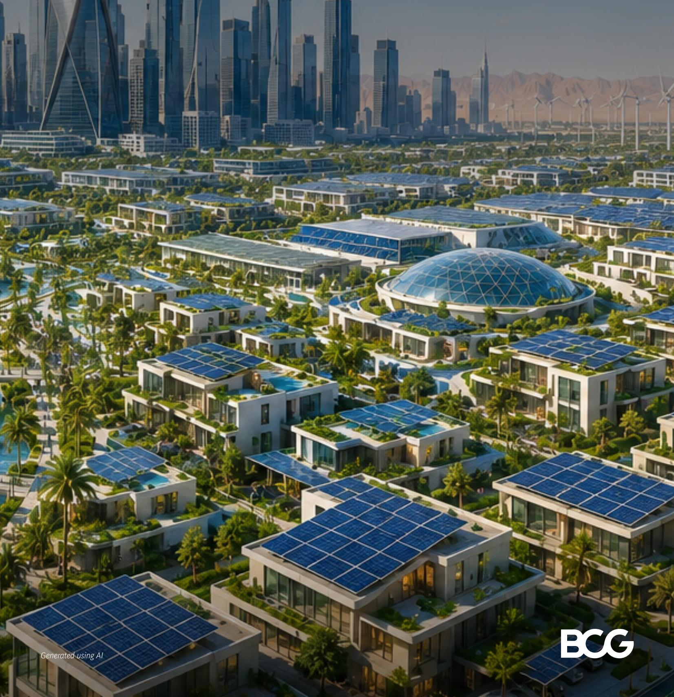
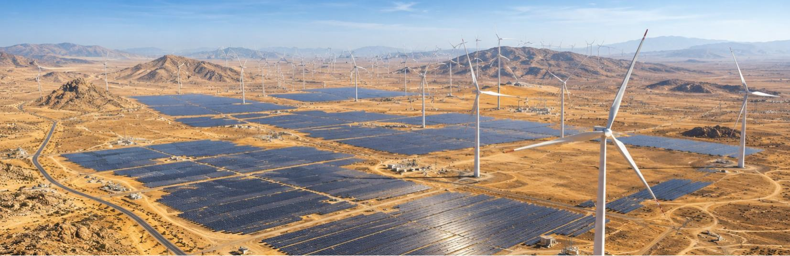
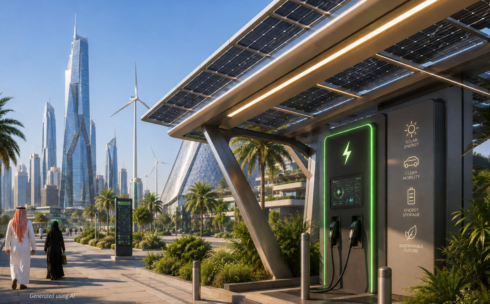
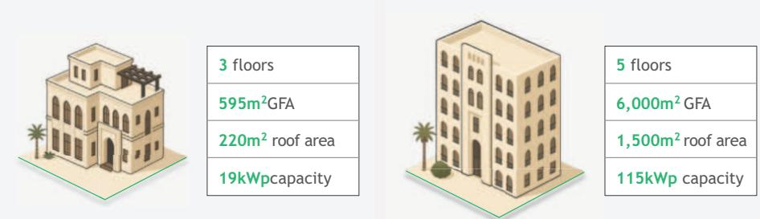
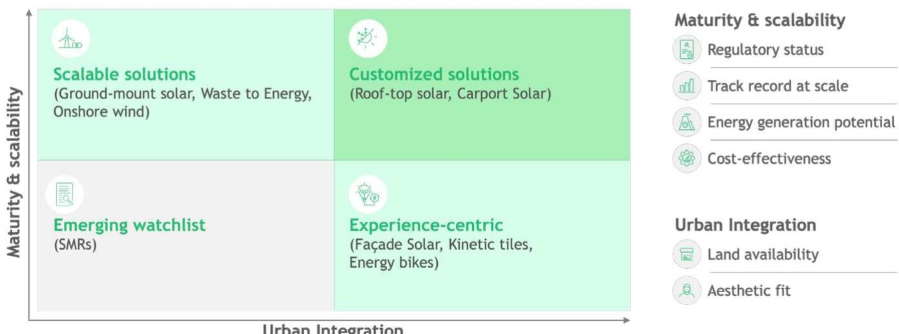
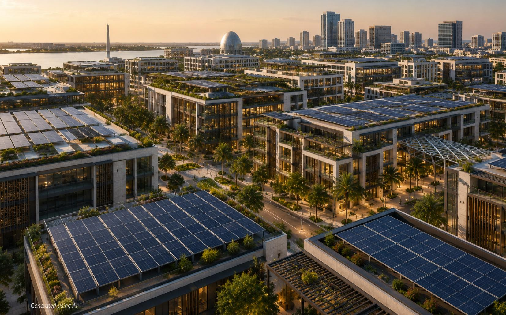
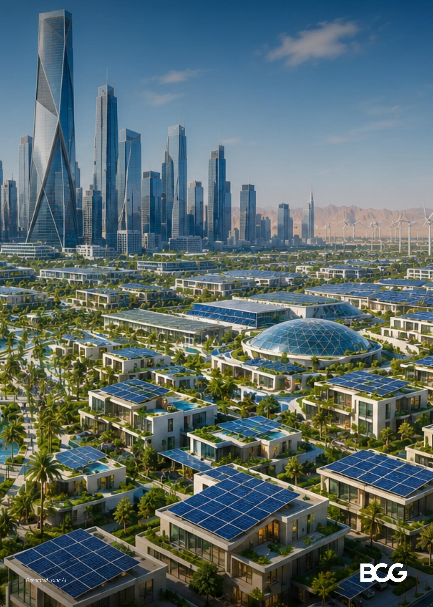

# Mega-Projects Powered by Renewables: A Practical Playbook for Saudi Arabia

July 2026

By Edoardo Geraci, Peter Jameson, Maciej Winiarski, Jonas Schroeder, Radwa Elgazzar and Omar Alsomali

BCG

## Contents

## 01 Executive summary

## 02 A Vision of Renewable Energy-Powered

Cities in Saudi Arabia

• Recognizing Key Benefits

• Overcoming Perceived Constraints

\- Case study

\- Renewable Energy that Delivers Meaningful

Impact to Communities

\- From Ambition to Execution: A Roadmap for Developers

Key Takeaway

# Executive summary

Saudi Arabia is undergoing one of the most ambitious urban transformations in the world. Under Vision 2030, mega-scale city projects and new districts are being built from the ground up, creating a singular opportunity to design the next generation of iconic, sustainable cities powered by low-carbon energy solutions.

The case for integrating renewables into these developments is both economically and strategically compelling. On-site solar photovoltaics, deployable across rooftops, carports, and shading structures, can meet up to 35% of total electricity demand across an urban development portfolio, without requiring additional land or compromise to architectural design. For developers, this translates to electricity cost savings from year one, achievable with zero upfront capital investment through Power Purchase Agreements (PPAs) or energy-as-a-service models. Early integration also reduces long-term exposure to energy price volatility and tightening carbon regulations.

Despite this opportunity, many developers remain cautious due to three perceived constraints: that renewables are too space-intensive or visually intrusive for urban settings; that they require prohibitive upfront investment with long payback cycles; and that regulatory complexity makes implementation difficult. This paper addresses each

concern directly. Modern solar solutions can be seamlessly integrated into facades, rooftops, and shade structures. Financing barriers have been effectively removed by third-party models that require no upfront capital. And Saudi Arabia's SERA self-consumption framework, introduced in 2022, now provides clear guidelines for behind-the-meter generation. In short, none of these challenges are insurmountable.

Beyond economics, renewable energy infrastructure can serve a dual purpose: generating power while shaping a distinctive identity for Saudi Arabia's new cities. Solar canopies, building-integrated photovoltaics, and interactive energy features offer developers the opportunity to turn sustainability into a signature urban asset, enhancing appeal for residents, visitors, and investors alike.

For developers ready to act, this paper sets out a clear roadmap: seize the opportunity through early energy assessments; orchestrate stakeholders, including government authorities, utilities, and solar providers from the master planning stage; and start as early as possible to avoid costly retrofits and maximize long-term returns. The tools and regulatory frameworks are already in place. The window to act is now.

Generated using AI

# A Vision of Renewable Energy- Powered Cities in Saudi Arabia

The Kingdom of Saudi Arabia (KSA) is undergoing a major urban transformation. Under Vision 2030, mega-scale city projects and new districts are being built from the ground up. This presents a unique opportunity to design the next generation of iconic, sustainable cities powered by low-carbon energy solutions.

Renewable energy use across buildings, transport, and public spaces can help communities balance growth with sustainability while shaping a modern urban identity. This approach would support KSA's broader goals of generating $50\%$ of its electricity from sustainable sources by 2030 and reaching net zero emissions by 2060, positioning the country's new cities as global examples of sustainable development.

The case for renewables is compelling, both in terms of sustainability and economics. The developments underway in KSA will create significant energy demand. Even with significant gains in energy efficiency and a target of sourcing 50% of electricity from renewables, Saudi Arabia will still need additional generation technologies to supply the

balance of its power demand. Using on-site renewables can serve as an important pathway to bridge the sustainability gap and meet national climate targets. The country's natural solar advantage, combined with falling technology costs, makes renewables a practical and financially sound choice. They reduce long-term operating costs, hedge against price volatility, and enhance the appeal of these locations as sustainable cities.

Momentum is building; decentralized renewable energy projects in KSA are already underway, with rooftop solar developers recently working on multi-megawatt projects in malls, factories, and residential complexes, such as King Abdullah Economic City's estimated 12.5 megawatt-peak (MWp) of renewable capacity. The Saudi Electricity Regulatory Authority's self-consumption framework, introduced in 2022, allows private developers to generate and use renewable energy directly on-site, with an overall capacity cap of 30 MW per premises. Early adopters are also proving that renewable integration is achievable, cost-effective, and commercially viable.

## Recognizing Key Benefits

On-site renewables, and solar energy in particular, offer developers of urban projects a compelling set of advantages across space, financial feasibility, and regulatory readiness. Through smart planning, novel financing options, and early collaboration, these benefits are both immediate and long-lasting. The following highlights the key advantages that renewable energy integration brings to mega projects and real estate developers in Saudi Arabia:

Benefit #1: Significant electricity cost savings with flexible financing. On-site solar PV can reduce electricity costs by up to 30% across a development portfolio. For developers concerned about capital outlay, Power Purchase Agreements (PPAs) and energy-as-a-service models eliminate upfront investment entirely: the energy service company builds, owns, and operates the system while the developer simply buys electricity at a competitive rate. For those who self-invest, falling technology costs and strong solar irradiance in KSA result in shorter payback periods and attractive long-term returns.

Benefit #2: Reduced Scope 2 carbon emissions and regulatory resilience. Integrating on-site renewables directly cuts a development's reliance on the national grid, which currently runs on a fossil-fuel-dominated mix. This reduces Scope 2 carbon emissions from electricity consumption by a meaningful margin, helping developers stay ahead of tightening carbon regulations and align with KSA's net-zero 2060 target. Projects that act early are better positioned as sustainability disclosure requirements and carbon pricing mechanisms continue to evolve across the region.

Benefit #3: Hedge against energy price uncertainty. While KSA electricity tariffs have historically been subsidized, pricing frameworks continue to develop and may expose asset owners to higher operating costs over time. On-site solar guarantees a portion of self-generated, low-carbon power regardless of grid developments, effectively locking in a portion of energy costs for the lifetime of the system. This reduces long-term financial exposure and strengthens the investment case for developers and asset owners alike.

Benefit #4: Seamless design integration with no additional land required. Modern solar solutions, including rooftop panels, building-integrated photovoltaics, and solar canopies over walkways, plazas, and carports, can be incorporated without consuming additional land or compromising architectural vision. When planned from the outset, renewable energy infrastructure complements high-end design rather than conflicting with it and can even enhance a project's premium, high-tech appearance. Early integration avoids the cost and disruption of retrofitting later.

However, despite these favorable conditions, some developers remain cautious due to perceived constraints.

To fully unlock potential at scale, clarifying the realities behind these perceived constraints and challenges is pivotal.

## Overcoming Perceived Constraints

Perceived constraints among developers that hinder the adoption of renewables in urban projects include those related to space requirements, financial feasibility, and regulatory complexity. Each of these can be overcome through smart planning, novel financing options, and early collaboration, with the focus pertaining to solar energy.

\- Perceived Constraint #1: Renewables are space-intensive and visually intrusive for city settings. Developers often worry that solar panels might take up valuable space or clash with high-end architectural designs. Modern renewable options can be highly compact and aesthetically integrated. For example, solar panels can be integrated seamlessly into rooftops, facades, and shade structures without needing extra land. When planned thoughtfully, they can complement the architecture or enhance it with a high-tech appearance. The key is to incorporate energy features into the design stage rather than seeing them as an afterthought. This way, renewable energy infrastructure becomes an asset to the project and not a problem.

## - Perceived Constraint #2: Renewable energy projects require substantial upfront investment with long payback cycles.

Power purchase agreements (PPAs) and energy-as-a-service contracts have effectively removed the barrier of requiring upfront investment. These options enable solar systems to be installed and operated with no upfront cost, allowing developers to buy electricity at a competitive rate. For those who self-invest, KSA's low solar generation costs and falling technology prices now result in shorter payback periods and strong long-term returns. Additionally, deploying renewables early can help projects avoid potentially costly retrofitting.

## - Perceived Constraint #3: Regulatory complexity makes renewables hard to implement.

Developers often worry about approvals or grid connections, but the KSA SERA self-consumption framework now provides clear guidelines for behind-the-meter generation, capacity limits, and permitting procedures. Early adopters have shown that engaging regulators and experienced solar providers from the outset helps navigate requirements smoothly. As adoption grows, permitting and interconnection will become even faster.

In short, none of these challenges are insurmountable. With careful planning, innovative financing, and early collaboration, the myths about cost and regulation are rapidly fading.

## On-Site Small-Scale PV: Immediate Impact and Hedging Against Risks

One of the most practical steps developers can take today to implement renewable energy is to deploy on-site solar photovoltaics. Solar PV is ideally suited to Saudi Arabia's conditions and the scale of its major developments. With abundant sunlight and plenty of available surfaces, especially rooftops and shading structures, projects can incorporate solar power without needing extra land or compromising design. Modern systems are modular, visually discreet, and cost-competitive, making on-site generation a viable source of renewable power from the start.

The immediate impact of rooftop solar varies by asset type and can be significant. As shown in Exhibit 1, a single-family villa can meet about 50% of its annual electricity needs, while a mid-rise building with higher load density typically achieves about 15%. These results demonstrate that even without additional land, rooftop solar alone can deliver 35 MWh/year for single-family villas and 190 MWh/year for mid-rise buildings, with substantial gains in both cost efficiency and emissions reductions.

## EXHIBIT 1

## Energy self-sufficiency and lifetime savings per rooftop PV asset

Rooftop PV can deliver 15-50% energy self-sufficiency and SAR0.2-1.3m+ in lifetime savings per asset

## Asset 1: Single-family villa

3 floors $595\mathrm{m}^2\mathrm{GFA}$ $220\mathrm{m}^2$ roof area   
19kWpcapacity  
Asset 2: Mid-rise building

<table><tr><td colspan="2">Solar generated (share of annual demand)</td><td>MWh/year</td><td>35 (50%)</td><td>190 (15%)</td></tr><tr><td rowspan="2">Costs</td><td>CapEx</td><td>SAR</td><td>55,000</td><td>240,000</td></tr><tr><td>OpEx</td><td>SAR/year</td><td>2,000</td><td>7,000</td></tr><tr><td colspan="2">Grid electricity savings</td><td>SAR/year</td><td>13,000</td><td>70,000</td></tr><tr><td colspan="2">Lifetime net savings (25 years)</td><td>SAR</td><td>220,000</td><td>1,300,000</td></tr></table>

Illustrative rooftop solar PV economics for Saudi Arabia: yield $\approx 1,780\mathrm{kWh / kWp}$ , cost $\approx$ SAR2.2-2.8k/kW, lifetime 25 yrs, discount $7\%$ , electricity SAR0.30-0.38/kWh (2025-2040), $0.5\%$ module degradation and $98\%$ availability

## EXHIBIT 2

# Estimating returns from PV system ownership compared to using third-party PPAs

System ownership delivers up to 50% higher long-term returns vs. third-party models but requires upfront investment

<table><tr><td colspan="2"></td><td>Third-party PPA</td><td>Own &amp; Operate</td></tr><tr><td>Installed capacity</td><td>(MW)</td><td colspan="2">90</td></tr><tr><td>Share of annual energy demand met</td><td>(%)</td><td colspan="2">25-35%</td></tr><tr><td>CapEx</td><td></td><td>0</td><td>180-240</td></tr><tr><td>OpEx over lifetime</td><td></td><td>900-1,000</td><td>120-150</td></tr><tr><td>OpEx savings over lifetime</td><td>SAR (millions)</td><td>1,400-1,600</td><td>1,400-1,600</td></tr><tr><td>Net lifetime savings (25 years)</td><td></td><td>500-600</td><td>1,100-1,200</td></tr><tr><td>Net Present Value</td><td></td><td>140-170</td><td>200-250</td></tr></table>

Assumptions: Illustrative portfolio economics includes PV installations across building rooftops, carports, and bike-lane shading structures, maximizing usable surface area for solar deployment

At a portfolio level, BCG's work indicates that a comprehensive deployment of on-site solar, spanning rooftops, carports, and shading structures, can meet up to $35\%$ of total electricity demand across an urban development portfolio, as shown in Exhibit 2. This potential can be unlocked through two proven financing models:

\- Own-and-operate: This approach can deliver 35-50% higher long-term returns but requires upfront capital and operational management.

\- Power purchase agreement: This approach involves a third-party energy service company that builds, owns, and operates the renewable energy system, while consumers pay per unit of electricity produced, providing a zero-capex option with transferred performance risk.

The optimal model depends on the project's financial objectives and investment horizon. Nonetheless, both approaches unlock significant cost savings and emissions reductions, demonstrating that funding is not a barrier to on-site solar deployment.

Concerns sometimes raised about solar projects in the region include high ambient temperatures, which can reduce PV efficiency, and heavy dust from the seasonal shamal, which can lower output if panels are not cleaned or protected. However, it is important to understand that both issues are very manageable and can be addressed cost-effectively. Modern PV designs, along with siting and cooling strategies (such as panel spacing, tilt optimization, and passive versus active cooling), significantly reduce panel overheating. Implementing technical and operational measures, like targeted cleaning routines, anti-soiling coatings, and verified O&M protocols, into the design and tendering process quickly restore yield and minimize the effects of dust. Such measures, implemented at the Bhadla Solar Park in India's Rajasthan Desert and at solar plants in Chile's Atacama Desert, have consistently mitigated challenges with delivering competitive tariffs and stable output.

Given the obvious financial benefits and absence of structural barriers, the cost of inaction on renewables is high. Relying solely on the national grid to reduce emissions may be insufficient to align with the Kingdom's 2060 net zero target, given the grid's current fossil-fuel-dominated mix and the potential for an uneven pace of future decarbonization. As a result, developers seeking to reach an earlier net zero target will need to secure their own low-carbon power supply. Additionally, electricity prices in the country may evolve over time as energy pricing frameworks continue to develop, potentially exposing asset owners to higher operating costs. On-site solar helps hedge against both of these risks; it guarantees a portion of low-carbon, self-generated power regardless of grid advancements and reduces long-term energy costs through ownership or PPAs. Investing in solar today is not just a sustainability-conscious decision but a strategic step toward financial resilience.

## Renewable Energy that Delivers Meaningful Impact to Communities

Beyond engineering and economics, the use of renewables can shape a new urban experience. The most innovative developments are making their sustainability features visible, interactive, and iconic rather than hiding them. In this way, low-carbon energy infrastructure serves a dual purpose: it generates power and shapes a distinctive identity for the project. Saudi Arabia's mega projects have an opportunity to turn renewable energy into a signature feature of their urban landscape, enhancing the appeal for visitors and residents.

How can renewables be made experiential? The first step is design integration. Solar canopies can complement traditional shading structures over plazas, walkways, or parking lots, providing shade from the desert sun while producing sustainable power. Similarly, building-integrated photovoltaics can transform facades into energy-generating surfaces, providing a visible statement of the project's sustainability ambition. When thoughtfully incorporated, these elements demonstrate that renewables can be both functional and aesthetic, blending seamlessly into the cityscape.

Beyond architectural integration, renewables can become part of the public experience. Developers can introduce interactive energy features such as walkways with kinetic tiles or energy-generating bikes that let people contribute to low-carbon power generation. Real-time displays showing electricity output or carbon savings can turn these spaces into hubs for learning and engagement, transforming sustainability from an abstract concept into something concrete and participatory.

These ideas are already taking shape through pioneering projects across the GCC, where solar installations serve as attractions that combine innovation, education, and design. By following suit, KSA's new cities can reshape how renewables are viewed; no longer as mere background infrastructure but as integral parts of a city's character. Renewable features can also become unique selling points, from the first carbon-neutral shopping districts to parks where families produce low-carbon energy. This experiential approach fosters public pride and generates long-term commercial value.

## From Ambition to Execution: A Roadmap for Developers

Turning a bold renewable vision into reality requires deliberate action from the outset, yet meaningful integration remains beneficial and achievable at any stage of a project's development. Drawing from practical experience, developers could follow a clear roadmap to integrate renewables into their mega projects effectively. Below are key strategies for moving from ambition to execution:

## EXHIBIT 3

## How developers can translate renewable energy ambitions into action

## From Ambition to Execution: A Roadmap for Developers

## Size the opportunity

• Quantify energy offset and savings from emissions

\- Match best-fit technologies to site and asset typology

\- Prioritize solutions with strong ROI and project fit

## Orchestrate stakeholders

\- Engage authorities, utilities, and municipalities early

\- Align with contractors to embed renewable energy into the masterplan

• Involve solution providers early to co-lead delivery

## Start from day one

\- Avoid retrofits and redesigns that increase cost

\- Reserve space for renewables and design to maximize yield

\- Avoid missed opportunities from acting too late

Urban Integration

\- Size the opportunity: Start by quantifying the renewable energy potential of your specific development. As shown in Exhibit 4, options vary in maturity, scalability and relevance to various projects. For urban developments, rooftop or carport solar panels can deliver significant cost-competitive savings without compromising aesthetics. Other solutions, such as energy-charging bikes or kinetic tiles, serve as experiential features and can enhance a project's identity and sustainability story. An early assessment will identify opportunities, show the energy savings that can be achieved, and help guide your master plan.

\- Orchestrate stakeholders: Effective on-site renewables implementation relies on early alignment of all parties involved. Engaging with government authorities, utilities and municipalities help simplify permitting and grid connection processes. Additionally, advocating for solar-ready codes and interconnection standards early on can remove obstacles to progress. Renewables could be treated as core infrastructure,

integrated into master planning and design from the beginning. This requires developers to work closely with solar providers to incorporate renewable energy into the master plan, allowing them to handle much of the heavy lifting, from technical design to approvals, accelerating deployment and lowering implementation risks.

\- Start from day one, but not only on day one: Timing is critical, and planning for renewables as early as possible helps avoid costly redesigns and missed opportunities. Developers could reserve space for renewable systems and design structures to support their integration from the beginning. Even small design choices, such as roof orientation or reducing shading, can significantly boost long-term yield. Early planning also prevents situations where assets are completed with no remaining space or grid capacity. Nevertheless, renewable energy integration remains feasible across all project phases, enabling both cost optimization and progress toward the Kingdom’s net zero objectives.

## EXHIBIT 4

# Maturity and scalability of low-carbon and renewable energy solutions vs their urban integration potential

## Aligning renewable deployment with project intent and solution readiness

By sizing the opportunity, aligning stakeholders, and starting early, developers can move confidently from a

# Key Takeaway

Urban renewable energy continues to be a significantly underexploited opportunity within Saudi Arabia's development agenda. As the country progresses through the construction phases of its most ambitious mixed-use districts and mega projects, the integration of on-site solutions should be strongly considered to deliver immediate and long-term gains, ensure long-term resilience, and meet regulatory readiness.

Renewables, such as rooftop solar PV systems, offer numerous benefits to mega projects and real estate developers. They can cut electricity costs significantly across their portfolio, often with zero upfront investment through PPAs or energy-as-a-service models, while simultaneously reducing operational carbon emissions by a similar margin due to reduced reliance on fossil-fuel grid power.

The real advantage lies in the timing of integration. Early planning can be decisive; projects that embed renewables from the outset avoid costly retrofits, secure stronger lifetime economics, and stay ahead of rising energy prices and tightening carbon regulations.

The window to act is now. The tools and frameworks are already available, and success depends on early stakeholder coordination and effective implementation. Saudi Arabia's developments will shape the region for decades, and the projects that integrate renewables today can maximize both sustainability and economic value for the long term.

## About the Authors

Edoardo Geraci is a Managing Director and Partner at BCG in Dubai, where he leads the firm’s sustainability agenda in the built environment across the Middle East. He works with developers, operators, and government entities on ESG strategy, green building certifications, decarbonization, and renewable energy integration, and has supported several of the region’s flagship megaprojects. You may contact him by email at geraci.edoardo@bcg.com

Maciej Winiarski is a Project Leader at BCG Middle East and a core member of the Travel, Cities & Infrastructure practice. He supports clients on topics related to real estate development and investments, construction, and asset operations, including renewable energy implementation and broader sustainability initiatives. His work also spans strategy and large-scale development programs. You can contact him by email at winiarski.maciej@bcg.com

Radwa Elgazzar is a Manager in BCG's Düsseldorf office and a member of BCG Vantage. She has expertise in renewable energy supporting clients globally on a range of topics including market strategies, due diligences, supply chains, and cost benchmarking in the solar and wind sectors. You may contact her by email at elgazzar.radwa@bcg.com

Peter Jameson is a Managing Director & Partner in BCG's Copenhagen office, leading BCG's Climate & Sustainability work globally across transport, cities, and infrastructure. He works with leaders in urban development to design and deliver large-scale sustainability strategies. You may contact him by email at jameson.peter@bcg.com

Jonas Schroeder is a Vantage Director in BCG's Frankfurt office. He advises clients primarily in the energy and heavy industry sectors, as well as the public sector, on net zero strategies, climate policy, green growth, and the energy transition. You may contact him at schroeder.jonas@bcg.com

Omar Alsomali is a Senior Analyst at BCG Riyadh. He has vast experience in sustainability projects across megaprojects, energy, public sector and telecommunications in the Middle East. He has been involved in ESG strategy development/ refreshment, ESG reporting, ESG strategy implementation, ESG assurance, and ESG ratings. You may contact him by email at alsomali.omar@bcg.com.

## Acknowledgements

The authors would like to extend their sincere thanks to the clients, industry leaders, and experts who generously shared their time and perspectives through interviews and roundtable discussions. Their insights and reflections were invaluable in shaping the perspectives presented in this report and grounding the analysis in real-world experience.

## For Further Contact

If you would like to discuss this report, please contact the authors.

## BCG

## Boston Consulting Group

Boston Consulting Group partners with leaders in business and society to tackle their most important challenges and capture their greatest opportunities. BCG was the pioneer in business strategy when it was founded in 1963. Today, we work closely with clients to embrace a transformational approach aimed at benefiting all stakeholders—empowering organizations to grow, build sustainable competitive advantage, and drive positive societal impact.

Our diverse, global teams bring deep industry and functional expertise and a range of perspectives that question the status quo and spark change. BCG delivers solutions through leading-edge management consulting, technology and design, and corporate and digital ventures. We work in a uniquely collaborative model across the firm and throughout all levels of the client organization, fueled by the goal of helping our clients thrive and enabling them to make the world a better place.

For information or permission to reprint, please contact BCG at permissions@bcg.com. To find the latest BCG content and register to receive e-alerts on this topic or others, please visit bcg.com. Follow Boston Consulting Group on LinkedIn, Facebook, and X (formerly Twitter).

BCG