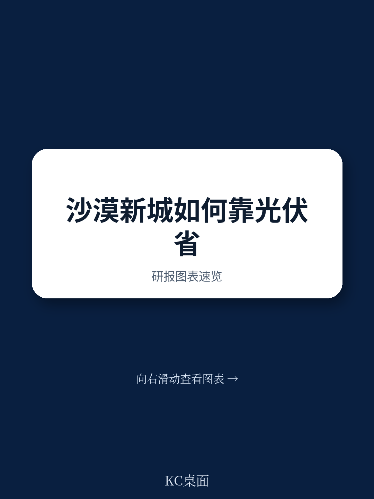
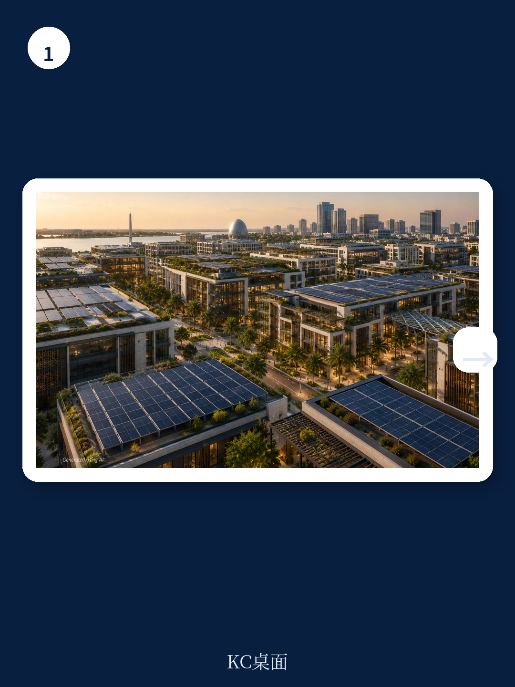
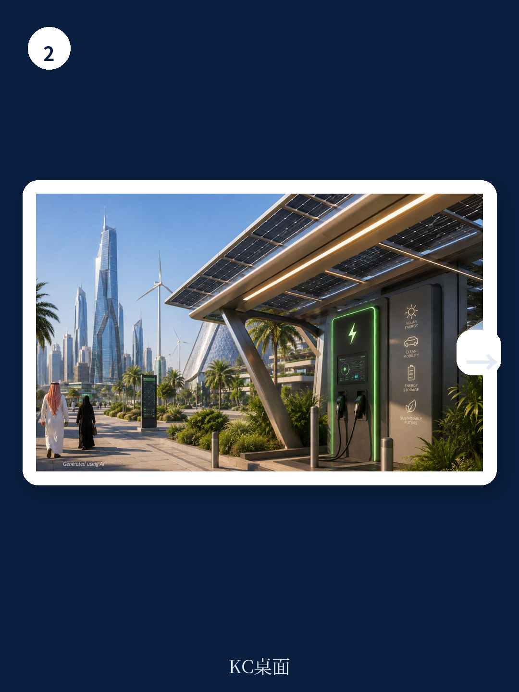

# 波士顿咨询：可再生能源驱动的超级项目实用指南

沙特阿拉伯正在推进全球最激进的造城计划之一。Vision 2030 框架下，从零建设的新城和超级项目，对电力的需求将是巨大的。波士顿咨询（BCG）这份报告的核心判断是：这些新城的开发商不需要等待国家电网的清洁化进程，也不需要占用额外的沙漠土地。他们最直接、最宏观环境的低碳选项，就在自己项目的屋顶、车棚和遮阳棚上。

报告给出的测算很具体：一个典型的独栋别墅，仅靠屋顶光伏就能满足约 50% 的年用电需求；一栋中层建筑，这一比例约为 15%。如果在一个城市开发项目组合中，系统性地利用所有屋顶、车棚和自行车道遮阳棚，光伏可以覆盖高达 35% 的总用电需求。这个数字，对于一座从零开始规划的城市而言，意味着巨大的成本对冲和碳减排空间。

## 1. 零首付的绿电：PPA 模式让开发商从第一天就开始省钱

开发商最常见的顾虑是初期投入。BCG 的报告直接回应了这一点：在沙特，通过购电协议（PPA）或能源即服务模式，开发商可以实现零资本支出。第三方能源服务公司负责建设、拥有和运营光伏系统，开发商只需按低于电网的竞争性电价购买电力。

报告对比了两种模式的财务表现。以一个 90 兆瓦的分布式光伏组合为例，如果开发商选择自建自营，25 年生命周期内的净现值（NPV）可达 2 亿至 2.5 亿沙特里亚尔，比第三方 PPA 模式高出约 35% 至 50%。但后者的优势在于零前期投入和不确定性转移。对于追求稳定现金流、不愿承担运营不确定性的开发商而言，PPA 模式已经足够产生可观的净节省。

> **KC评论：** 这里的关键不是哪种模式回报更高，而是“回报门槛已经消失”。无论选择哪种方式，光伏的度电成本都已经低于沙特目前的居民和商业电价。开发商纠结的不再是“划不划算”，而是“选哪种方式更符合自己的资产负债表策略”。

## 2. 三个被高估的障碍：空间、资金和审批，都有现成解法

报告识别了开发商普遍存在的三个认知障碍，并逐一给出事实回应。

第一，空间问题。现代光伏技术已经可以实现建筑一体化，光伏板可以集成在屋顶、立面甚至遮阳结构中，不需要额外占地。当从设计阶段就纳入规划时，光伏设施反而可以成为建筑的高科技视觉元素。

第二，资金问题。如前所述，PPA 模式已经彻底消除了前期资本投入的障碍。对于愿意自投的开发商，沙特的高辐照度和持续下降的设备成本，使得研究回收期显著缩短。

第三，监管复杂性问题。报告指出，沙特电力监管局（SERA）在 2022 年推出的自消费框架，已经为分布式发电提供了清晰的指导原则，包括容量上限（每个场所 30 兆瓦）和并网程序。早期采用者的经验表明，从项目启动阶段就与监管机构和有经验的太阳能供应商协作，可以顺利走通流程。

## 3. 从成本中心到城市名片：光伏可以成为新城的设计语言

这份报告最有意思的洞察之一，是将可再生能源从“工程问题”提升到了“城市品牌”的层面。BCG 认为，沙特的新城有机会把光伏设施做成一种可体验的城市景观。

太阳能遮阳棚可以为广场、步道和停车场提供遮荫，同时发电。建筑集成光伏可以将整栋大楼的立面变成发电表面。这些元素如果从设计之初就融入，就不再是藏在屋顶的设备，而是城市可持续身份的视觉宣言。对于旨在吸引全球人才、游客和研究的超级项目而言，这种“可见的可持续性”本身就是一种竞争力。

## 4. 行动的窗口期：早规划与晚改造，成本差距巨大

报告反复强调一个时间维度上的判断：早期整合至关重要。如果等到建筑主体完工后再加装光伏，不仅面临更高的改造成本，还可能破坏原有的建筑设计和结构完整性。

BCG 为开发商提供了一个清晰的行动路线图：从项目概念阶段就启动能源评估；在总体规划阶段就协调政府、电网公司和太阳能供应商；尽早锁定屋顶、车棚等可用空间的设计方案。报告认为，沙特现有的监管工具和商业模式已经到位，开发商现在需要的是行动，而不是观望。

> **KC评论：** 这份报告实际上在提醒所有参与沙特新城建设的开发商：光伏不是未来的选项，而是当下就可以产生正现金流的基础设施。在电价政策可能逐步市场化、碳监管日趋严格的背景下，早一年部署，就意味着多一年的电价对冲和碳减排积累。对于生命周期长达数十年的城市项目而言，这种时间差带来的财务影响是巨大的。

For informational purposes only. Portions may be generated,translated,summarized,or edited with AI assistance based on source materials and may contain omissions or errors. Please verify independently. This is not investment,legal,tax,accounting,or other professional advice.

