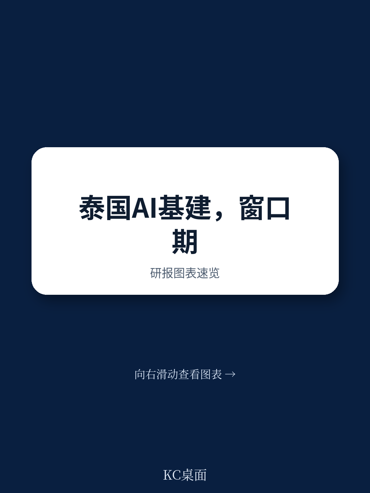
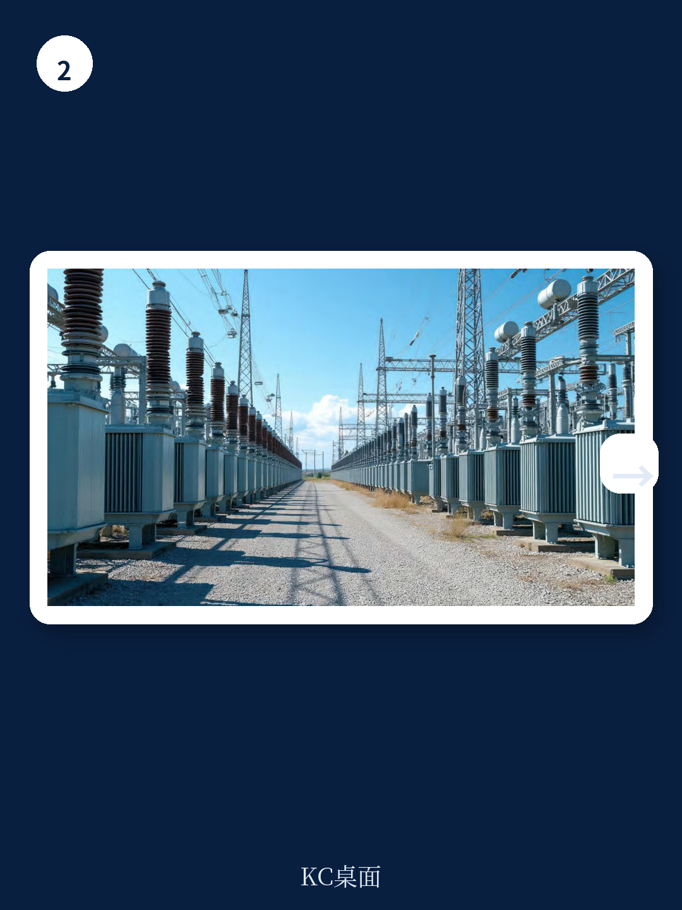

# 波士顿咨询：泰国AI基建的战略机遇

泰国正试图成为“东南亚AI枢纽”，但波士顿咨询这份报告的核心判断并非关于雄心，而是关于时机。报告指出，全球数据中心短缺带来的运营商议价优势——以及由此产生的有利宏观环境条件——不会持续太久。随着供需收敛，窗口正在关闭。泰国目前拥有电价、土地、地缘中立等结构性优势，研究管道也已成型：2025年泰国研究促进委员会收到230亿美元数据中心研究申请，2026年字节跳动承诺投入250亿美元。但报告真正想说的是：这些条件本身不够，泰国需要在治理、执行和需求信号三个层面同时行动，才能将3至4吉瓦的2030年目标变为现实。

## 1. 泰国面临的不只是竞争，而是“先到先得”的供给锁定

东南亚数据中心市场正进入第三波扩张。第一波（2014-2018年）由新加坡主导，第二波（2019-2024年）由马来西亚承接新加坡溢出需求。现在，增长正在更广泛地分散到印尼、越南和泰国。但波士顿咨询提醒，这些市场的竞争不是零和博弈，而是“先到先得”的供给锁定。一旦某个市场获得超大规模云服务商的长期承诺，配套的电力、网络和人才研究就会随之固化，后续进入者将面临更高的切换成本。

报告特别指出，马来西亚的案例值得泰国参考。马来西亚在2018至2020年间，国家电力公司TNB投入188亿林吉特扩建输电网，将输电可靠性提升65%，并在柔佛数据中心走廊专门建设了主进线变电站。这种“公共基础设施先行”的做法，让马来西亚在2023年推出的“绿色通道”能将电网接入时间从三至四年压缩至12个月。泰国目前尚未建立类似的跨部门协调机制和前置基础设施研究节奏。

> **KC评论：** 波士顿咨询这份报告最有价值的部分不是罗列泰国的优势，而是指出“治理是前提条件”。泰国目前有23个部委参与数据中心审批，但没有一个单一协调机构。报告建议设立一个由最高层赞助的专门执行机构，这与马来西亚2025年成立的数据中心工作组逻辑一致。没有这个前提，其他杠杆都难以落地。

## 2. 本地化不是可选项，而是物理AI应用的硬约束

报告用了一个具体数字来说明为什么泰国必须建设本地数据中心：从曼谷到新加坡数据中心的往返距离约1400公里，网络延迟在15至20毫秒之间。而物理AI应用——如自动驾驶、机器人焊接、实时缺陷检测——需要亚10毫秒的响应时间。这意味着，如果泰国不建设本地算力，其制造业、汽车、电子等支柱产业将无法部署最高价值的AI用例。

制造业占泰国GDP的27%。波士顿咨询的研究显示，结合虚拟AI和物理AI的端到端部署，可为制造商带来超过30%的生产率提升。但这一提升的前提是“正确的数据生态系统”，而本地计算能力是这个生态系统的地基。报告将这一逻辑概括为四个维度：释放AI对整体宏观环境的影响、阻止宏观环境漏损（目前泰国大量AI支出流向海外）、确保数据主权（泰国个人数据保护法和云政府指南已要求敏感数据留在境内）、以及保障国家韧性（避免依赖外国基础设施带来的结构性脆弱性）。

## 3. 七项杠杆中，需求信号的可信度最容易被忽视

波士顿咨询为泰国列出了七项执行杠杆，其中三项被列为“执行优先事项”：跨全AI栈的合作伙伴关系（超大规模云商、芯片供应商、前沿大模型公司、新兴云服务商）、将“云优先政策”和区域雄心转化为可银行化的需求信号、以及治理层面的跨部门问责和单一协调机构。另外三项是支撑性杠杆：清晰的跨境数据制度和主权云认证、吸引外国AI专家的长期居留签证与本地工程人才培养并行、以及为泰国本土企业参与建设提供结构化路径。

报告特别强调“需求信号”这一杠杆。新加坡和马来西亚的经验表明，政府自身的云迁移承诺和国有企业的AI工作负载，可以成为超大规模云商决定研究的关键锚点。泰国已出台“云优先政策”，要求公共部门工作负载迁移至云基础设施，但波士顿咨询认为，这一政策需要转化为具体的、可量化的、有时间表的采购承诺，才能成为读者眼中的“银行化需求”。

从宏观环境回报看，3至4吉瓦的数据中心建设可吸引250亿至350亿美元的资本研究，15年内累计贡献700亿至1000亿美元的GDP，并支持6万至9.5万个就业岗位。但更大的机会在于这些基础设施所解锁的AI宏观环境：波士顿咨询估计，到2030年，AI采用率提升可为泰国带来800亿至1200亿美元的累计GDP增量。这一数字的前提是，泰国能在窗口关闭前完成治理和执行层面的关键动作。

For informational purposes only. Portions may be generated,translated,summarized,or edited with AI assistance based on source materials and may contain omissions or errors. Please verify independently. This is not investment,legal,tax,accounting,or other professional advice.

