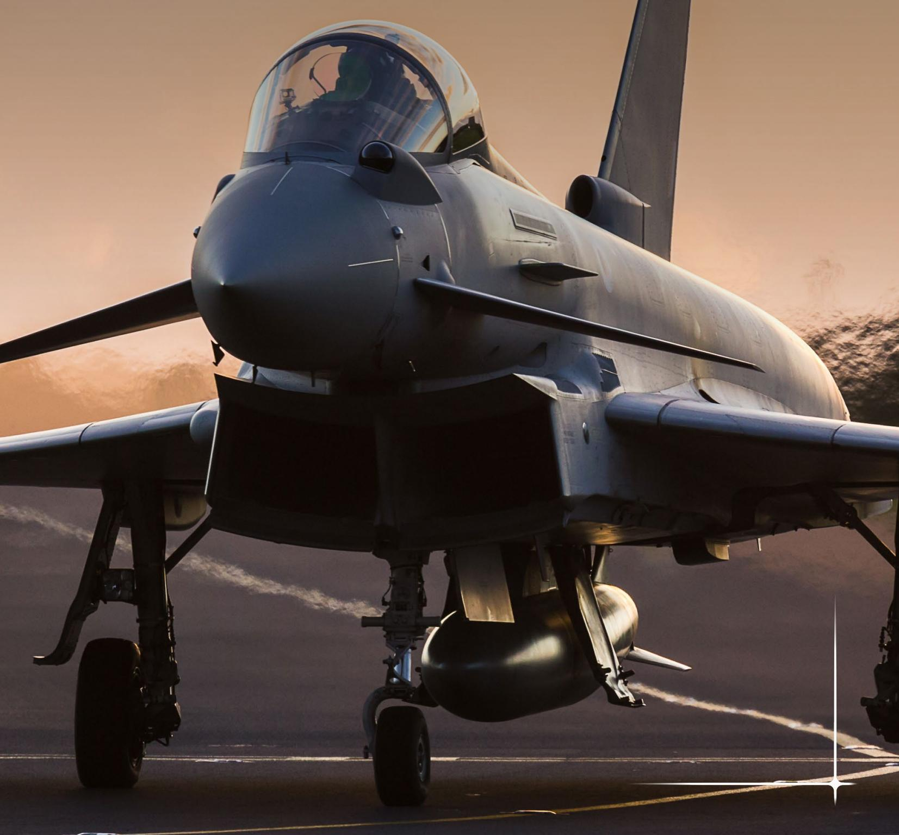
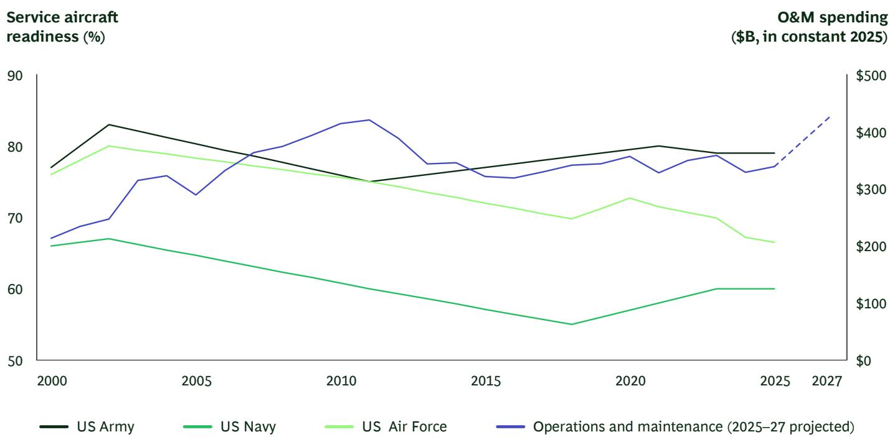

BCG

# Keeping Defense Aircraft Mission-Ready

July 2026

By Doug Peck, Brian Hirshman, Lacy Ketzner, Diana Dimitrova, Patrick Frailey, and Greg Mallory

The US Department of War spends nearly a third of its annual budget on operations and maintenance, yet the mission-capable rates for most defense aircraft have fallen steadily for decades.

Roughly 1,900 aircraft are out of service on a given day. Across 49 aircraft types studied by the Government Accountability Office between 2011 and 2021, only four met their annual mission-capable goals in a majority of years. Twenty-six did not meet them in any year. Similarly, in the UK, only one-third of its F-35 fleet was fully mission capable in 2024, far below both UK and global program targets.

Many countries around the world face readiness challenges with their air defenses. The typical response has been to throw resources at the problem: more maintenance staff, more spare parts, more depot capacity, more funding. Yet based on our engagements with military aviation clients around the world, resources are not the limiting factor. Instead, the operating system—the velocity, prioritization, demand discipline, and governance through which those inputs are deployed—is the real chokepoint on mission readiness. In many forces, maintenance systems are decades out of date when compared with commercial best practices. In other cases, the system is solid but forces don’t have the discipline to follow it.

By directly addressing these system elements and improving maintenance processes, armed services can improve mission-capable (MC) rates in aviation by 30% to 50% in 6 to 12 months, without any additional inputs. The measures required are not radically innovative; many are in wide use among commercial aviation fleets. When implemented and executed consistently, they can keep military assets where they belong: airborne and executing missions.

## More Resources, Yet Fewer Mission-Ready Aircraft

A few numbers show the clear disconnect between inputs and outcomes in defense readiness. In the US, the absolute spending on operations and maintenance is roughly double what it was in 2000, when adjusted for inflation. Yet, as the exhibit shows, aviation readiness levels for the Air Force and Navy have decreased 12% to 19% over the same period. The Air Force's fleet-wide MC rate declined to 67% in 2024, the lowest in at least two decades, with a weighted average closer to 62% when accounting for fleet size. (Notably, reported readiness rates can overstate actual fleet availability because they typically exclude aircraft undergoing long-term overhauls, upgrades, or modifications.) The services have more maintainers, more spare parts funding, and more depot capacity than they did a generation ago. Yet MC rates continue to fall.

In France, fighter aircraft and tactical transport aircraft availability fell by 26.5 points and 15 points, respectively, compared with 2014, despite substantial efforts to reform maintenance contracting and structure. Similarly, while Germany's Bundeswehr reported average readiness of $76\%$ across all major weapon systems, combat aircraft readiness averaged only $64\%$ —well below the $80\%$ benchmark commonly associated with highly available operational fleets.

While these figures may be cause for concern, particularly in a time of geopolitical instability, there are solutions. For example, between 2008 and 2018, MC rates for the US Navy's F/A-18 Super Hornet were below $50\%$ , representing billions of dollars of assets grounded. In 2018, the Navy launched a program to improve the rate to $80\%$ , largely by applying the concepts discussed in this publication. Within a year, the service achieved its MC target rate and continued making progress, reaching a fleet record number of mission-capable Super Hornets by 2023. At the same time, per-aircraft maintenance costs fell by approximately half.

The Super Hornet case illustrates a broader principle: the constraint was not inputs. It was the system that converted inputs to outcomes. The same platform, fleet, and maintainers used a different operating model to deliver a radically different outcome.

Despite Increased Investment in the US, Aviation Mission Readiness Has Declined Since 2000

  
Sources: DoD National Defense Budget Estimates (Green Book); GAO-03-300; GAO-23-106217; GAO-25-107870; CBO; Air & Space Forces Magazine FY2025 Almanac data; FY2027 President's Budget Overview Book (April 2026).  
Note: O&M = operations and maintenance. Spending includes total discretionary and mandatory. FY2027 reflects PB27 request. Readiness is a proxy constructed from publicly available service-average/representative data.

## Identifying the Root Causes to Develop Solutions

Our work across a range of military aviation platforms has consistently identified four root causes for low mission-capable rates.

Highly variable maintenance cycle times. Identical scheduled inspections on the same aircraft type can often take two to three times longer at some squadrons than others. A small number of long-tail events, typically 15% to 20% of all maintenance actions, account for a disproportionate share of total non-mission-capable days. The difference in inspection times across facilities typically comes down to the details of execution: planning discipline, structured and integrated master schedules, ring-fenced maintainer capacity, pre-kitting, standardized work, and avoiding mid-event diversions.

Lack of fleet-wide prioritization. Each unit typically focuses on its own performance and controls its own supply of scarce resources, including maintenance staff, parts, and input from engineers. No entity looks at overall enterprise readiness and reallocates resources to the aircraft most critical to the current mission. Short-term priorities like the current day's flying schedule supersede what is best for readiness overall.

programs. Maintenance programs and inspection requirements accumulate over time, based on historical precedents and OEM specifications rather than current maintenance issues and data from the field. For example, corrosion programs designed for one deployment profile get applied uniformly across a fleet, even to aircraft operating under different conditions.

Ineffective governance. Most services have readiness governance structures—weekly reviews, daily stand-ups, and monthly briefings—but they tend to focus on reporting aircraft status rather than making decisions to improve performance. Many of these structures are delegated to lower-level officers, rather than the three- and four-star leaders who can mandate change.

## Rethinking Maintenance Systems

Each of these root causes has an effective solution. These are not radically innovative actions—many have been in use in commercial aviation fleets for decades. Notably, defense ministries often tell us that versions of these solutions are already in place. But in our experience, they need to be implemented in full, as a coherent, integrated system. Military units can take the following actions to deliver a meaningful difference in mission-capable rates.

## Develop and strengthen the maintenance operations center.

A maintenance operations center (MOC) operates as a central hub of information and a resource allocation engine. It maintains a real-time picture of fleet material condition and has the institutional authority to rapidly address issues. Effective, fleet-level MOCs have strong organizational and data infrastructure. They are directly integrated with supply and engineering systems, and they have the authority to actively redirect parts and personnel to where they can have the biggest impact on fleet readiness.

These entities have strong governance in place, focusing on a handful of leading indicators tied to a specific MC target, with explicit owners and clear escalation paths for issues. AI and data tools are increasingly the differentiator here: services that integrate real-time fleet data into governance forums can identify emerging constraints days earlier, prioritize more precisely, and iterate faster, without adding headcount.

## Develop a demand management program.

Demand management programs track the performance of components and parts and maintain a single, ranked list of degraders—the parts that fail most frequently. Based on that information, military leaders can conduct a cross-functional root-cause analysis of these degraders, determine actions and timelines to improve, and enforce them. In one BCG engagement, we found that the top eight degraders accounted for approximately 20% of total days down for maintenance. A targeted demand-management effort could reduce that number by half.

## Optimize maintenance requirements.

Reducing unnecessary maintenance and inspection requirements to what is truly necessary—based on operational data—can free up maintainer capacity and improve aircraft material condition. A strong program puts the right maintenance solution at the right place, at the right time, with the right crew. The impact can be dramatic: a 20% to 40% decrease in scheduled maintenance labor hours, which translates to gains in MC rates of three to five percentage points.

## Create a supply chain control tower.

When high numbers of aircraft are grounded while waiting for parts, the problem is usually prioritization and visibility. The part exists somewhere in the system, but the service doesn't have a mechanism to locate it and route it to the right aircraft. Or, if a given part is consistently scarce, the enterprise doesn't have the supplier relationships needed to fulfill orders. Supply control towers provide real-time visibility into the location of parts, order status, and administrative lead time, consistently reducing non-mission-capable days without requiring additional investment in inventory.

## Enable the workforce through digital.

Digital technology can help military units make their current maintenance workforce far more productive. In many forces, maintenance processes are still documented on paper logs or isolated, desktop computers. New AI-enabled tools are increasingly prevalent in commercial fleets and can be applied to defense applications as well. These tools can clarify processes in real-time on job sites and create audit trails for each procedure, reducing administrative workloads and keeping wrench-time metrics high. Similarly, troubleshooting generative AI tools and AR- and VR-enabled training can help technicians gain new skills faster.

## What Leaders Can Do Now

To begin closing the gap in mission-readiness, without requiring additional resources, military leaders can immediately begin to implement the following actions.

## Set an explicit North Star goal.

Vague objectives like “improve readiness” aren’t helpful. Organizations do better with a specific, time-bound, quantifiable target: a defined number of mission-capable aircraft by a target date, derived from operational requirements, with a named owner who is formally accountable for results. This kind of specificity forces trade-offs, exposes constraints, and creates the urgency needed to evolve beyond the status quo.

## Accurately diagnose the problem before jumping into solutions.

Mission-capable rates are a lagging indicator. Before designing interventions, leaders can break the broader issue down into its component categories (supply, unscheduled maintenance, scheduled maintenance, and out-of-reporting). Teams can then compare the baseline performance of each category and identify which account for the majority of days lost. If the corrective actions still focus on a request for “more people and more parts,” push the team to try again on root cause analysis. This forward-looking approach can help organizations identify the true underlying issues and focus their actions and accountability accordingly.

## Make readiness an enterprise-wide initiative.

Operational squadrons cannot solve this problem on their own. Top-performing organizations integrate data from across the fleet, leverage advanced AI tools, assemble cross-functional teams, and ensure that root-cause analyses have the right level of urgency and the right level of leadership authority.

## Manage at the fleet level, rather than the squadron level.

Avoid decisions that optimize local metrics at the expense of overall readiness. MOCs perform best when they are centralized and have the insights and clout needed to prioritize across the entire fleet. Restructuring authority in this way requires adjusting operational metrics, so that units aren't punished for missing readiness targets at their level.

## Govern to make decisions and track outcomes.

Effective governance is linked directly to operational performance, with cascading metrics. Avoid status updates or “strategic” meetings that discuss issues but don’t have the operational rigor to identify and implement solutions. Readiness is the daily business of senior leaders, not delegated to their deputies or staffs. The effort of governance teams rises with the scale of the problem: bigger issues require more frequent interventions from more senior leaders. And AI and data tools can be part of the governance and oversight, starting today, to surface constraints faster and reduce the burden of manual processes.

As defense budgets face renewed scrutiny and as recapitalization timelines extend, the armed service divisions that improve readiness within existing budgets and constraints will gain a meaningful strategic advantage over those waiting for more resources. But in a fast-changing world, the time to act is now.

## About the Authors

  
Doug Peck
Managing Director and Partner
Washington, DC
peck.doug@bcg.com

  
Brian Hirshman
Managing Director and Senior Partner
Dallas
hirshman.brian@bcg.com

  
Lacy Ketzner
Managing Director and Senior Partner
Philadelphia
ketzner.lacy@bcg.com

  
Diana Dimitrova
Managing Director and Partner
London
dimitrova.diana@bcg.com

  
Patrick Frailey
Partner
Washington, DC
frailey.patrick@bcg.com

  
Greg Mallory
Managing Director and Senior Partner
Washington, DC
mallory.greg@bcg.com

## BCG

## Where Strategic Clarity Meets Applied AI

We are navigating an era of unprecedented change and disruption—powered by technology, marked by complexity, where change amplifies at scale. To lead, companies need a partner that can bridge the gap between ambition and outcomes. BCG is built for this moment. We bring strategic clarity, rooted in over 60 years of deep domain knowledge, to ensure leaders make the right choices. We combine it with applied AI, shaped and wielded by our practitioners, teaming shoulder-to-shoulder with your teams to deliver transformative impact at scale. The result? Stronger returns, transferred capabilities, and change that sticks. We are BCG.

For information or permission to reprint, please contact BCG at permissions@bcg.com. To find the latest BCG content and register to receive e-alerts on this topic or others, please visit bcg.com. Follow Boston Consulting Group on LinkedIn, Instagram, Facebook, and X.

