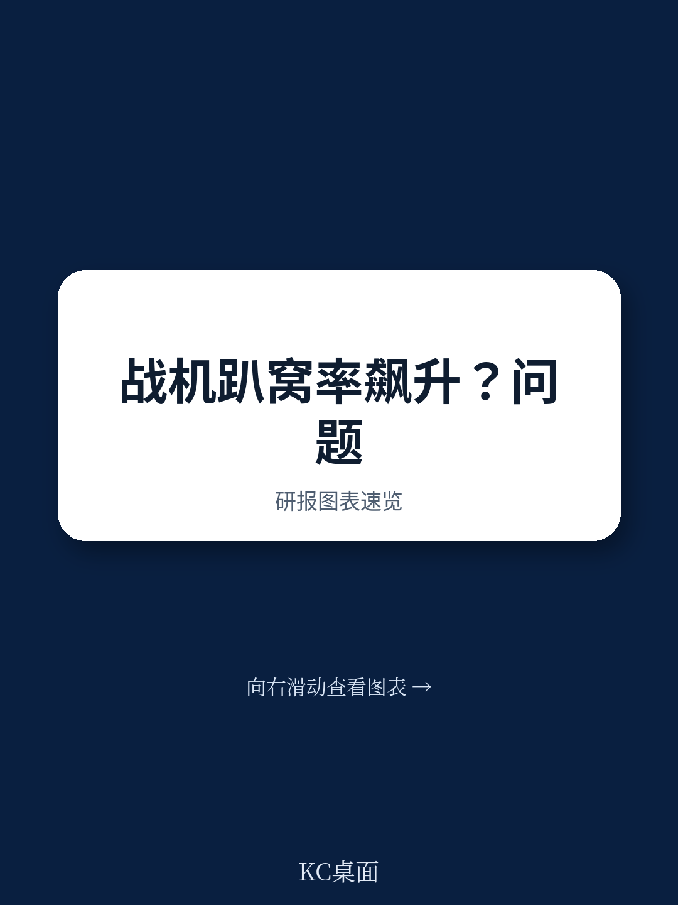
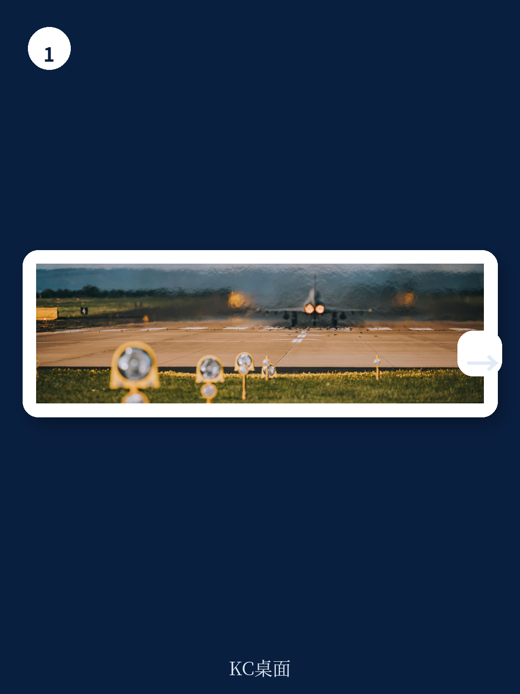
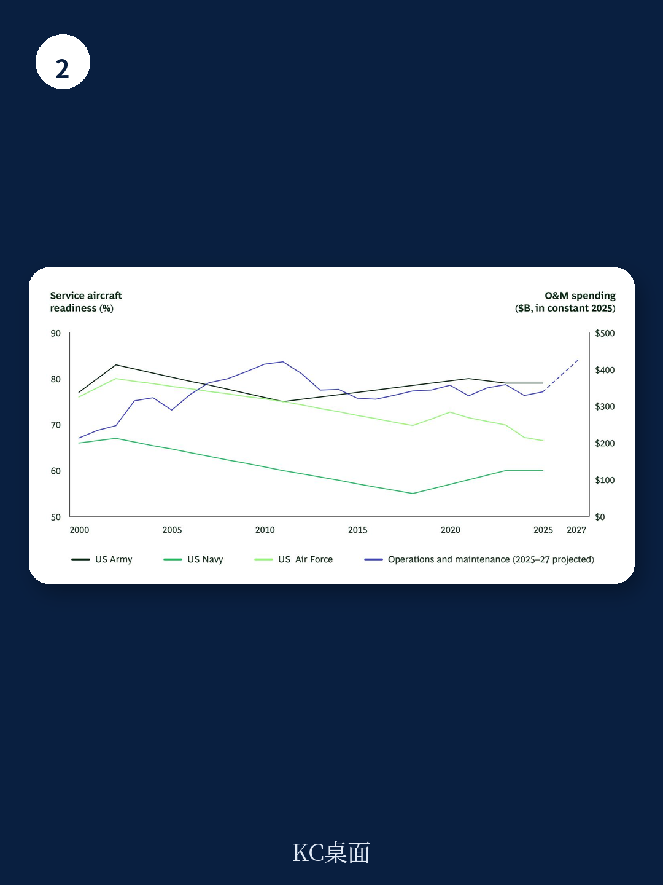

# 波士顿咨询：保持国防飞机任务就绪

美国国防部每年近三分之一的预算用于作战与维护，但过去二十年，大多数军机的任务可用率却在持续下降。美国空军2024年全机队任务可用率降至67%，为至少二十年来最低；英国F-35机队在2024年仅有三分之一处于完全可用状态。法国战斗机与战术运输机的可用率较2014年分别下降26.5和15个百分点。这些数字指向一个反直觉的结论：投入更多资源，并未换来更多可出勤的飞机。

波士顿咨询这份研报的核心判断是，制约任务可用率的不是资源总量，而是将资源转化为出勤结果的“操作系统”——维护流程的速度、优先级排序、需求纪律和治理机制。报告基于对多个国家军事航空客户的长期观察，认为通过直接改进这些系统要素，可在6至12个月内将任务可用率提升30%至50%，且无需额外投入。

## 1. 投入翻倍，出勤率反降，问题出在转化系统

美国作战与维护的绝对支出经通胀调整后约为2000年的两倍，但空军和海军航空兵的可用率同期下降了12%至19%。空军全机队任务可用率2024年降至67%，若按机队规模加权计算，实际数字更接近62%。值得注意的是，报告指出，已公布的可出勤率往往高估了实际可用机队数量，因为它们通常排除了正在长期大修、升级或改装的飞机。

法国和德国的数据同样印证了这一矛盾。法国在改革维护合同与结构上投入大量努力后，战斗机与战术运输机可用率仍大幅下滑。德国联邦国防军所有主要武器系统的平均可用率为76%，但战斗机的平均可用率仅64%，远低于高效运营机队通常设定的80%基准。

> **KC评论：** 这张投入与产出的背离图是整份报告最关键的证据。它说明，如果只盯着预算和人员数量，而不改变流程和治理方式，追加资源只会被低效系统吸收，不会转化为更多可出勤的飞机。美国海军F/A-18“超级大黄蜂”的案例从反面验证了这一点：2018年启动系统改革后，该机型任务可用率在一年内从低于50%提升至80%，单机维护成本下降约一半。

## 2. 四个根因：周期波动、优先级缺失、需求膨胀、治理空转

波士顿咨询在多个军事航空平台的实践中，识别出四个相互独立的根因。

维护周期高度不稳定。同一机型在编队间的相同例行检查耗时可能相差两到三倍。15%至20%的维护动作（长尾事件）占用了不成比例的非任务可用天数。差异的根源在于执行细节：计划纪律、集成主日程、维护人员产能保护、预装套件、标准化作业以及避免中途任务切换。

缺乏机队级优先级排序。每个单位通常只关注自身绩效，并控制自己的稀缺资源——维护人员、备件和工程支持。没有实体从整个企业的角度评估可出勤率，并将资源重新分配给当前任务最关键的飞机。短期优先级（如当天的飞行计划）往往凌驾于整体可出勤率之上。

维护需求持续膨胀。维护计划和检查要求随时间不断累积，依据的是历史先例和原始设备制造商规范，而非当前维护问题和现场数据。例如，为某种部署环境设计的腐蚀防护程序被统一应用于整个机队，即使部分飞机在完全不同的条件下运行。

治理机制流于形式。大多数部队都有可出勤率治理结构——周会、每日站会、月度简报——但它们往往聚焦于报告飞机状态，而非做出改善绩效的决策。这些结构通常被下放给较低级别的军官，而非有权推动变革的三星或四星将领。

## 3. 解决方案并非新技术，而是系统化执行

报告提出的解决方案并非激进创新，许多已在商用航空机队中应用数十年。关键在于，它们需要作为一个连贯、集成的系统来完整实施，而非零散部署。

维护运营中心是核心枢纽。它维持机队物料状态的实时画像，并拥有调配资源的机构权威。有效的机队级维护运营中心直接与供应和工程系统集成，有权将零件和人员主动重新分配到对机队可出勤率影响最大的地方。报告特别指出，人工智能和数据工具正在成为差异化因素：将实时机队数据整合到治理会议中的部队，可以提前数天识别新出现的约束，更精确地确定优先级，且无需增加人员。

需求管理程序追踪组件和零件的性能，维护一份单一的降级因素排名清单。在波士顿咨询的一次项目中，排名前八的降级因素占到了总维护停飞天数的约20%，而针对性的需求管理可将这一数字减半。

优化维护需求同样能释放大量产能。基于运营数据削减不必要的维护和检查要求，可使计划维护工时减少20%至40%，转化为任务可用率提升3至5个百分点。

供应链控制塔解决的是“飞机等零件”的问题。零件存在于系统的某个地方，但部队缺乏定位和调拨的机制。控制塔提供零件位置、订单状态和行政前置时间的实时可见性，在不增加库存投入的情况下持续减少非任务可用天数。

## 4. 领导者现在可以做的四件事

报告为军事领导者提供了一个可立即启动的行动框架，核心是改变管理方式而非追加预算。

设定明确的“北极星”目标。模糊的“改善可出勤率”没有意义。一个具体、有时间限制、可量化的目标——例如在某个日期前达到特定数量的任务可用飞机——会迫使做出取舍，暴露约束，并创造超越现状的紧迫感。

在跳入解决方案前准确诊断问题。任务可用率是滞后指标。领导者应先将问题拆解为供应、非计划维护、计划维护和报告外等类别，比较每个类别的基线表现，找出导致大部分天数损失的原因。如果纠正措施仍然聚焦于“要更多人和更多零件”，那就说明根因分析需要重新来过。

将可出勤率作为企业级倡议。作战中队无法独自解决这个问题。顶尖组织会整合整个机队的数据，利用先进人工智能工具，组建跨职能团队，并确保根因分析拥有适当的紧迫性和领导权威。

以机队级而非中队级进行管理。避免优化局部指标而损害整体可出勤率的决策。维护运营中心在集中化且拥有洞察力和影响力时表现最佳。这种权力重构需要调整运营指标，使各单位不会因未达到本级可出勤率目标而受到惩罚。

在国防预算面临重新审视、装备更新周期延长的背景下，能够在现有预算和约束内改善可出勤率的部队，将获得比等待更多资源的部队更显著的战略优势。

For informational purposes only. Portions may be generated,translated,summarized,or edited with AI assistance based on source materials and may contain omissions or errors. Please verify independently. This is not investment,legal,tax,accounting,or other professional advice.

