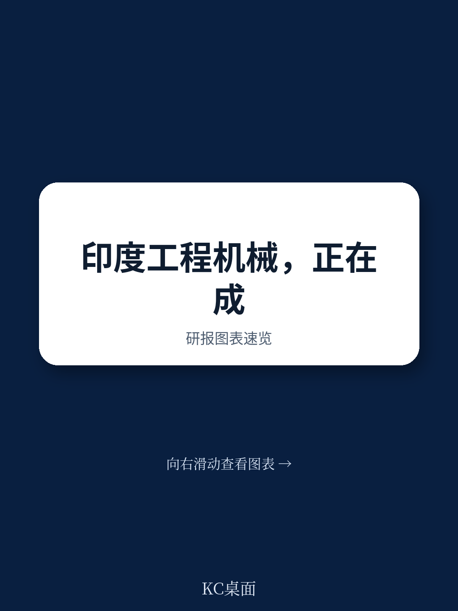
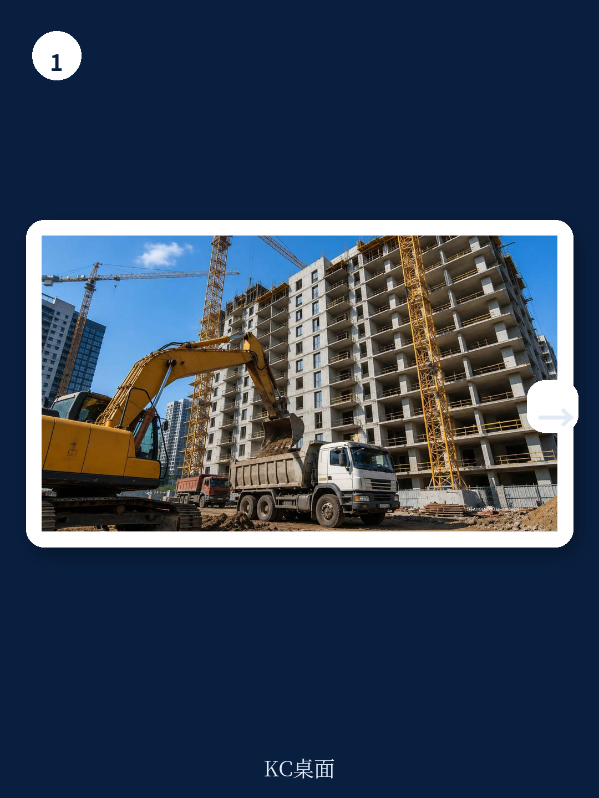
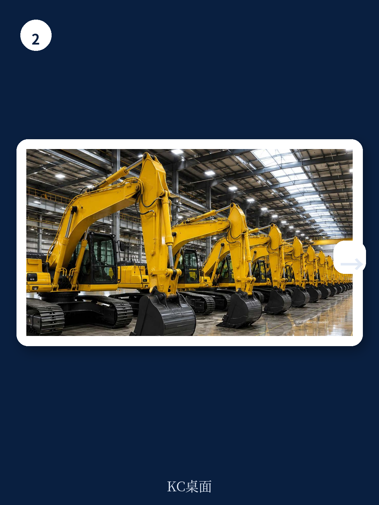

# 波士顿咨询：印度矿业与工程机械加速发展

印度矿业与工程机械（MCE）行业正在经历一个从“追赶者”到“规则改写者”的身份转换。波士顿咨询与印度工业联合会联合发布的这份报告，核心判断是：印度已从一个依赖进口的小市场，转变为全球增长最快的MCE平台之一，并且正在成为净出口国。这个转变不是偶然的，它建立在四个结构性驱动力之上——基础设施研究、矿业扩张、本地化制造深化和出口能力的跃升。报告给出的时间窗口是明确的：未来五年，印度在全球MCE市场的份额将从4%升至约6.5%，而到2047年，其出口目标可能达到750亿美元以上。

这个判断之所以值得关注，不仅因为印度市场的规模（2025年国内需求超过170亿美元），更因为全球MCE行业本身正在经历六重技术变革——从清洁动力总成、数字化车队、自动化，到地下采矿机械化、新的所有权和融资模式。印度企业能否在这一轮技术迭代中同步升级，将决定其全球竞争力的上限。

## 1. 印度MCE的增长不是周期性的，而是结构性的

报告明确指出，印度MCE的增长建立在四个长期驱动力上，而非短期政策刺激。首先是基础设施研究的持续扩大：国家高速公路网从2014年的9.1万公里扩展到2025年的约14.6万公里；地铁运营里程从248公里增至超过1000公里；运营机场数量翻倍至约160个。这些项目直接拉动了土方机械、混凝土设备、起重和隧道施工装备的需求。

其次是矿业增长。印度煤炭产量十年间从6.09亿吨跃升至10亿吨，铁矿石从1.55亿吨增至3亿吨，石灰石从3.2亿吨增至4.5亿吨。这些增长背后是下游钢铁、水泥和电力行业的持续消耗，而矿业本身也在向更深层次、更高机械化程度演进。

> **KC评论：** 报告强调的“结构性”意味着，即便全球宏观环境出现波动，印度国内的基础设施和矿业研究仍将维持一定增速。这是印度MCE市场区别于其他新兴市场的关键——需求的内生性更强，受外部资本流动的影响相对较小。

## 2. 出口能力是检验竞争力的真正标尺

印度MCE出口在过去十年几乎增长了三倍，2025年达到约49亿美元，使印度成为该领域的净出口国。报告认为，北美、欧盟、澳大利亚和英国是长期机会所在，但这些市场对产品规格、合规性和海外售后服务网络的要求更高。

印度企业要抓住这些机会，需要做出更激进的布局：在重点区域设立海外子公司、分销网络和售后服务体系，同时针对出口市场需求设计产品。报告特别提到，印度企业不能只满足于在价格上竞争，而要在质量、可靠性和全生命周期服务上建立信任。

## 3. 技术变革正在重新定义“什么是好设备”

报告梳理了六项正在重塑全球MCE行业的技术趋势：清洁动力总成（电动化、替代燃料）、数字化连接与预测性维护、自动化与自主运行、地下采矿机械化、采矿作业的全面机械化，以及从“购买设备”到“按产出付费”的商业模式转变。

对于印度OEM而言，挑战在于：这些技术不是可选的附加功能，而是未来竞争力的核心。报告建议，印度企业应尽早研究于连接化、自动化和高效设备，同时通过公共招标和大型国企合同中的强制性采用要求，创造需求端拉动。

> **KC评论：** 报告隐含的一个判断是，如果印度企业只停留在现有产品线上，不主动拥抱这六项技术变革，那么即使国内需求增长，其全球竞争力也可能在五年后被拉开差距。技术迭代的速度，决定了印度MCE行业是“做大”还是“做强”。

## 4. 政府与行业需要共同完成的十项议程

报告提出了一份十点行动框架，涵盖政策、行业承诺和联合行动三个层面。政府方面，建议通过分级关税结构促进本地制造、加强反倾销执法、在公共采购中优先采购国产设备，并建立专门针对该行业的单一监管机构。行业方面，OEM需要深化二级供应商生态和产业集群，在重点市场建立海外网络，并将最先进的技术引入印度本土的采矿和施工现场。

双方可以共同推进的领域包括：扩大研发与创新中心、建立MCE专用的操作员和技术人员认证体系（通过政府所有、行业管理的ITI模式），以及推动公共招标中强制采用连接化、自动化设备。

这份报告的价值不在于给出一个简单的“看好”或“看空”结论，而在于提供了一套可检验的框架：印度MCE行业的未来，取决于它能否在技术迭代、出口扩张和本地生态建设三个维度上同步推进。对于关注全球制造业转移和新兴市场工业化的读者来说，这是一个值得持续跟踪的观察样本。

For informational purposes only. Portions may be generated,translated,summarized,or edited with AI assistance based on source materials and may contain omissions or errors. Please verify independently. This is not investment,legal,tax,accounting,or other professional advice.

