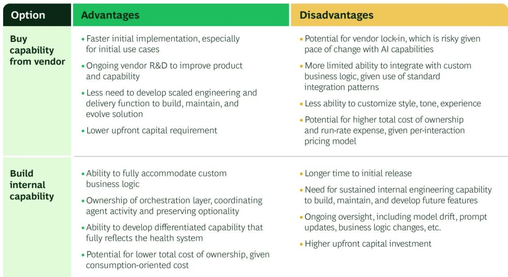

HEALTH CARE PAYERS, PROVIDERS, SYSTEMS & SERVICES

# Transforming the Patient Access Center with AI

By Natasha Taylor, Matthew Huddle, MD, Luke Purcell, Ryan Shain, Scott Wilder, Kevin Fleming, and Michael Bernstein

ARTICLE JULY 14, 2026

The access center is both the front door and the beating heart of a patient-centric health system. AI stands to transform how patient access centers function, but not in the way many executives imagine.

Consumers call, chat, and text with access center agents to schedule appointments; manage referrals; navigate authorization, billing, and insurance topics; and seek answers to a multitude of questions. Despite this heavy use, a substantial share of patient demands slips away at the

access channel. Thousands of calls go unanswered or are abandoned due to long wait times, failed transfers, and limited after-hours coverage. Up to 40% of scheduling-related interactions go unresolved on first contact. Missed annual visits and vaccines are not systematically and proactively addressed, and specialty referrals are not aggressively tracked and converted.

AI can perform many of these basic tasks and augment the work of human agents for more complex issues. Yet when system leaders consider deploying AI in access centers, they view it merely as a way to reduce costs and increase efficiency. This perspective overlooks a significant opportunity to use AI to reshape the access function from end to end—shifting it from a cost center to a revenue engine.

Many of our clients are deploying AI to automate lower-complexity processes while reorienting hardworking human staff to high-value, high-impact consumer engagement. They understand that the access center of the future should be an AI-enabled platform to drive growth, manage consumer relationships, enable value-based care, and generate organizational intelligence. They also see the access center as a “proof case” for their broader enterprise AI ambitions.

# Opportunities to Transform the Access Center

We see three key opportunities for systems to pursue when transforming access through AI. Automate routine scheduling and referral workflows. Augment human agents during complex interactions. Amplify access-related revenue generation strategies. (See Exhibit 1.) Systems that pursue these three complementary strategies in parallel will see the greatest return on their AI investment through improved consumer experience; easier access; improved navigation, quality, and outcomes; and financial upside. Let’s look closely at each of these actions.

# Three Key Opportunities to Transform Access Centers with Agentic AI

## Automate rote and routine scheduling processes

AI fully steers calls and chats from reaching a human agent, including routing to self-service channels (e.g., MyChart scheduling)

Example tasks:
Appointment scheduling,
confirmation, modification, and
cancellation

Status requests for referrals, prior authorizations, and waitlists

Pre-appointment preparation, including arrival time and dietary restrictions

General inquiries and wayfinding (hours, location, parking, and visiting hours)

## Augment human agents during complex interactions

AI enables a human agent before, during, and after a call to resolve a patient's issue in a complete and timely manner

Example tasks: Call intent identification and patient identity verification

Patient information gathering (e.g., relevant health and appointment history)

Call guidance, next-best-action recommendation, and agent assist

Post-call support, including QA and individual-level training and upskilling

## Amplify access-related revenue generation

AI extracts signals from large, unstructured datasets to create an intelligence layer and generate “segment of one” patient insights

Example tasks: Proactive outreach on common care gaps (e.g., overdue screenings and annual visits)

Referral management to stop patient leakage between front-door and specialty services

Automated follow-ups for dropped or unresolved calls to prevent lost demand

Business intelligence generation (e.g., emergent demand drivers and supply mismatches)

Source: BCG analysis.

# Automate and fully contain end-to-end access workflows.

Across health systems, the interactions that consistently demonstrate the highest potential for end-to-end automation are appointment information and confirmation, scheduling and rescheduling, and cancellation, as well as requests for referral and authorization status and general wayfinding. These intents are high frequency, heavily scripted, have clear resolution pathways, require no clinical judgment—and they typically represent more than half of total inbound volume at large health systems. These are good targets for containment, in which AI manages the interactions independently, without human involvement.

No single vendor currently provides a full, end-to-end solution virtual agent, and no single “best” approach will work for every health system: each has distinct benefits and limitations. (See Exhibit 2.) Options include vendor solutions such as Hyro, Sierra, Decagon, and Avaamo—or building a custom product with in-house tech talent.

Buying vs. Building an AI-enabled Virtual Agent  

Selecting the right implementation approach for a virtual agent is one of the most consequential decisions a health system will make. Leaders must weigh several factors, including speed to value, long-term flexibility, ability to integrate with custom business logic, total cost of ownership, and any potential trade-offs. This analysis requires a granular understanding of access center interactions and consumer intents, clarity on the enterprise's overall level of AI ambition and long-term strategic roadmap, and detailed modeling of financial implications, including potentially uncertain variables like future token cost. The right solution depends on a health system's priorities, existing technology infrastructure, the complexity of its scheduling business logic, its tolerance for vendor dependency, and its internal product and engineering depth.

## Augment and enable human agent efficiency and effectiveness.

While many patient access interactions can be automated, some will need escalation to a professional and well-trained human agent. Whether due to scheduling complexity, coordination of referrals and authorizations, sensitive topics, or consumer preference, about 40% to 50% of calls will still require human interaction in the near-term. For these calls, health systems should pursue agent-assist capabilities that augment the legacy tools that human agents have at their fingertips. Deploying AI tools that make every agent better, smarter, and faster at their jobs can drive meaningful enterprise value while maximizing job satisfaction for human agents.

Among our clients, up to 60% of human agent time is currently spent on tasks that could be augmented by AI. Agent-assist tools can drive reductions in average handle time (AHT) by 30% to 40% and dramatically improve patient experience by freeing the agent to focus on empathic

listening and creative problem solving rather than basic knowledge retrieval. Agent-assist tools deliver value across all steps of a consumer interaction, including:

\- Intent detection and identity verification. With or without a standalone virtual agent, a “narrow” agent-assist tool can confirm a patient’s reason for calling and conduct identity verification, handing off relevant context to the human agent.

\- Patient information gathering. Patient history, prior call reasons, open care gaps, and suggested next best actions are identified and displayed by the AI tool before the agent speaks a word, eliminating the need for manual electronic health record (EHR) lookup.

\- Call guidance and next best action. As the conversation unfolds, AI guidance surfaces relevant policy information, scheduling availability, and next-best-action recommendations, providing agents with real-time prompts to address queries instantly rather than placing callers on hold.

\- Handoff. When a call must be transferred, AI summarizes the full interaction history so the receiving agent or clinic is fully briefed, eliminating the need for patients to repeat information and reducing the AHT premium that transferred calls typically carry.

After a call, AI auto-generates call summaries, in-basket messages, e-mails, and any required downstream tickets, reducing after-call work by up to 2 minutes per interaction. AI can also support QA and training by analyzing calls to identify systemic and individual-level performance hotspots, such as workflow inconsistencies and off-script messaging, and develop personalized training for agents. (See “Spotlight on Access Center Quality Assurance and Training.”)

## - Spotlight on Access Center Quality Assurance and Training

One of the most underutilized levers in access center management is quality assurance. Most health systems sample fewer than 5% of interactions for manual review, meaning most agent behavior—including compliance gaps, patient safety escalations, and coaching opportunities—goes unobserved.

AI fundamentally changes this paradigm. Automated QA capabilities can evaluate significantly more interactions and provide real-time data on quality, compliance, resolution, and consumer satisfaction to both agents and their managers. Importantly, the architecture used to automate human-agent QA can be used to evaluate virtual agents, enabling access center leaders to compare outcomes across channels and prioritize areas for improvement.

A robust AI-driven QA capability can feed directly into personalized training tools that human agents can use to improve performance. Rather than generic group training sessions, the AI identifies the specific call types and interaction phases where each individual agent underperforms and generates targeted learning plans with constructive feedback. With new “synthetic” calling capabilities, these learning plans can be used to develop mock calls that human agents can have with virtual, but highly realistic, callers, reinforcing training with real-world, human-to-AI conversations.

Together, automated QA and personalized training co-pilots create a continuous improvement loop that compounds over time: better data on agent performance drives more targeted coaching, which in turn lifts performance and generates better outcomes.

To get the most from AI augmentation, systems must have a detailed understanding of how agents spend their time and adopt a human-centered design approach to developing agent-assist tools. Introducing another tool or interface to an agent's workflow is only valuable if it addresses existing pain points, enables agents to better address patients' needs, and improves the overall consumer experience.

# Amplify access-related revenue generation strategies.

Reconceptualizing the patient access function as a dynamic growth engine means treating each call not as a low-value interaction to resolve quickly and inexpensively but as a demand signal to convert, a relationship to deepen, and a care gap to close. Key growth levers include:

\- Demand capture. AI-powered 24/7 coverage and automated follow-up on unanswered and unresolved calls converts demand currently lost to staffing limits, after-hours gaps, and failed callbacks.

\- Ancillary attachment. AI surfaces relevant imaging, lab, pharmacy, and preventive care opportunities in real time during every interaction, enabling agents to offer appropriate ancillary services, providing new opportunities to meet patient needs and helping patients access required services.

\- Referral management. AI tracks referral status and triggers follow-up, reducing leakage within the network and improving closed-loop visibility for care teams (especially critical for high-margin commercial patients and specialty procedures).

\- Proactive outreach. AI-powered outbound agents can engage patients who have known care gaps, overdue screenings, or post-discharge needs, converting latent demand into scheduled visits.

\- “Segments of one”. AI can analyze a vast array of data to develop personalized, 360-degree patient profiles and create differentiated pathways for high-need and high-value patients, enabling systems to better guide patients to the appropriate level of care and provide enhanced service levels in strategically important service lines.

For our clients, incorporating growth-related strategies into their roadmap increases the projected margin uplift of AI-driven access center optimization by 3–5x versus focusing on cost alone. It also provides consumers with a seamless access experience, supports providers in seeing more patients, and improves the timeliness and responsiveness of care.

# The Critical Enabler: Clinical Operations and Change Management

Technology models, vendors, architecture, and infrastructure represent only about 30% of an AI transformation. People and change management account for 70%—but are often overlooked and underinvested.

Attempting to transform the access function with AI will fail without active partnership from the clinical and operational teams who control the inputs that the technology needs to perform. At most health systems, the scheduling rules, booking constraints, visit type configurations, and provider-level directives that govern access are neither centrally managed, consistently documented, nor designed for scale. At the same time, health systems often have unique provider-and clinic-specific business logic that is not codified in any system of record—from shared Excel trackers to unwritten knowledge that agents learn over time.

Because AI will only be as good as the foundation upon which it is built, systems must codify the formal and informal business logic that sits with human agents, MAs, and providers into structured inputs for AI to consume. This is often one of the most challenging tasks we support our clients in undertaking. Executives and function leaders consistently underestimate the operational effort required to execute a successful AI-enabled access center transformation, including:

\- Expansion of agent booking authority. In many systems, contact center agents are prohibited from booking directly into a significant share of visit types—not because the interactions are clinically complex, but because practices have historically preferred to control their own schedules. Relaxing these restrictions is one of the highest-leverage operational fixes available, and one that AI alone cannot unlock.

\- Accessibility of practices. Even with expanded booking permissions, human agents will need to contact clinics in certain instances. While there is often a phone number, e-mail, or EHR message channel available, clinics do not always answer calls, respond to messages, or address the needs of access center agents. Improving the clinic–access center relationship and committing to increased responsiveness is critical.

\- Provider alert and exception management. Dynamic information, such as a provider on leave, a practice that has closed, or a change in insurance acceptance, is often currently communicated on an ad hoc basis. Operational teams must formalize how this information flows into the access center for new AI solutions to operate reliably.

\- Template and visit type rationalization. Visit type mappings between what agents see and what lives in the EHR are frequently misaligned or incomplete. Rationalizing templates and establishing clean EHR-to-access center linkages is a prerequisite for reliable automation.

\- Insurance rule documentation. Insurance acceptance rules are often missing, inconsistent, or buried in free text. Closing these gaps requires direct engagement with clinic managers and revenue cycle teams to ensure appropriate routing of patients to providers.

Health systems that underinvest in clinical and operational change management will see their AI capabilities and financial ROI underperform relative to its technical potential. The systems that succeed treat access center transformation as a cross-functional program of highest strategic importance, not an IT project akin to a vendor migration. Senior executive and clinical sponsorship, shoulder-to-shoulder engagement with practice leaders, and clear accountability for the operational changes that AI enablement require is critical.

## A Call to Act—Now.

The access function is the primary interface between the system and its patients, the key channel to capture demand, and an underappreciated platform for growth. In an age of rapidly advancing AI, systems that view the technology as merely a means to reduce labor cost will quickly fall behind those that recognize it as tool to supercharge a key strategic asset.

AI capabilities are changing at breathtaking speed and scale. Systems must be prepared. Clear sequencing, strong governance, discipline to build required technical and organizational capabilities, and buy-in from clinical operations leaders are critical. The organizations that capture this value will be those who fund their journey through quick-win automation plays but don’t stop there. Instead, leaders that set their sights on transforming the access center as a means of growing and reaching patients in new ways will realize outsized value.

## Authors

  
Natasha Taylor

Managing Director & Senior Partner
Denver

  
Luke Purcell

Managing Director & Partner
New York

  
Scott Wilder

Managing Director & Partner Dallas

  
Michael Bernstein

Principal New York

Managing Director & Partner
New York

Managing Director & Partner
Chicago

## Kevin Fleming

Partner
Denver

## ABOUT BOSTON CONSULTING GROUP

Boston Consulting Group bridges the gap between ambition and outcomes for the world's leading companies and organizations. We are built for this era of unprecedented change — bringing strategic clarity rooted in over 60 years of deep domain knowledge, combined with applied AI shaped by our practitioners. BCG works shoulder-to-shoulder with CEOs across industries and geographies to deliver transformative impact at scale: stronger returns, transferred capabilities, and change that sticks. For more information, visit bcg.com.