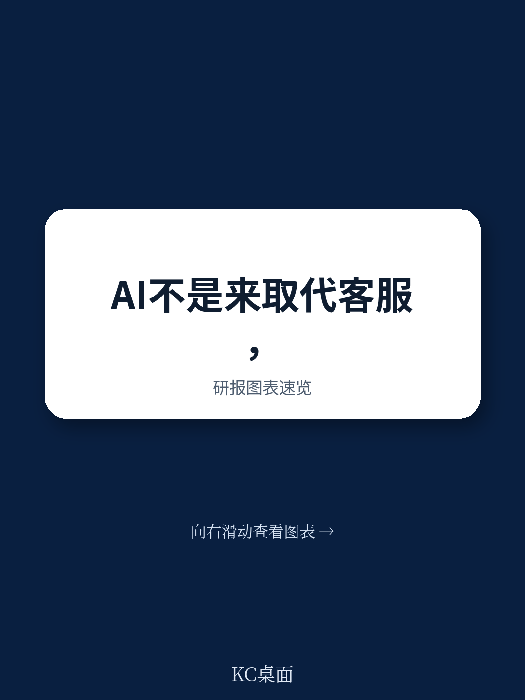
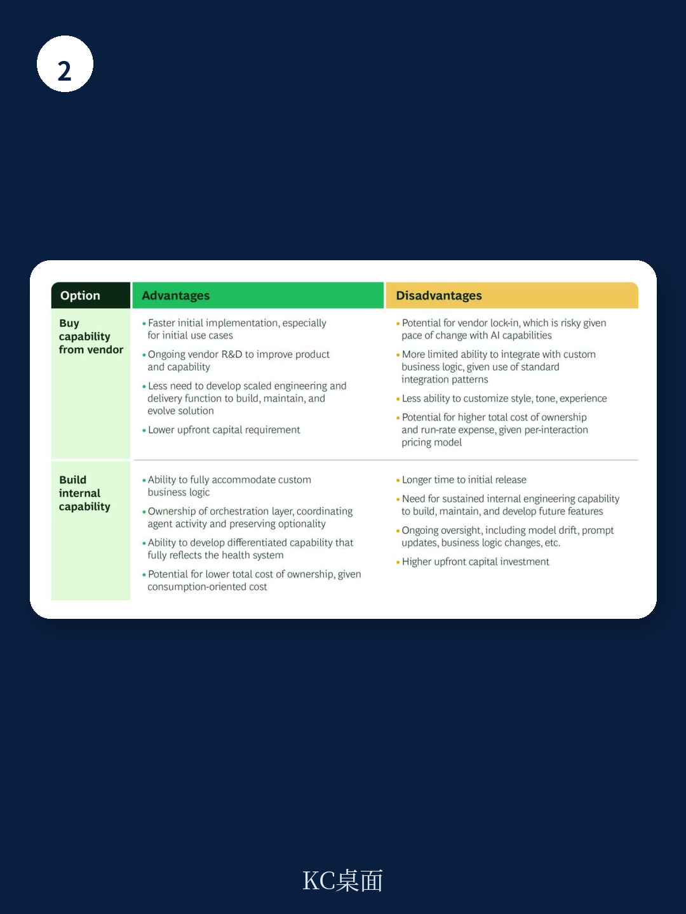

# 波士顿咨询：AI正在改变患者接入中心

多数医院管理者对AI在患者接入中心的应用，仍停留在“降低人工成本、提升接听效率”的认知上。波士顿咨询这份报告给出了一个截然不同的判断：如果只把AI当作省钱的工具，医院将错过一个3到5倍的利润提升机会。真正的价值不在于替代人工，而在于把每一次来电——无论是预约、转诊还是咨询——都转化为可捕捉的需求信号、可深化的患者关系和可关闭的照护缺口。

报告基于对多家大型医疗系统的调研，发现目前高达40%的预约相关交互在首次接触时未能解决，数千通电话因等待时间过长、转接失败或非工作时间无人值守而流失。AI有能力改变这一局面，但前提是医院必须重新定义接入中心的功能定位。

## 1. 超过一半的来电可以完全由AI自主处理，无需人工介入

报告识别出一批高频、高度脚本化、有明确解决路径且不涉及临床判断的交互类型：预约信息确认、日程安排与改期、取消、转诊和授权状态查询、以及基本的导诊问询。这些交互通常占大型医疗系统总来电量的50%以上，是AI“全自主处理”的理想目标。

波士顿咨询指出，目前没有单一厂商能提供完整的端到端虚拟座席解决方案，医院需要在购买成熟产品与自建系统之间做出选择。这一决策涉及对现有技术基础设施、日程管理业务逻辑复杂度、供应商依赖容忍度以及内部产品与工程能力的综合评估。报告特别提醒，未来token成本的变动是一个不确定变量，需要纳入财务模型。

> **KC评论：** 医院在评估AI方案时，容易被厂商的功能清单吸引，但真正决定成败的是内部业务逻辑的标准化程度。如果预约规则、保险验证逻辑、科室开放时间等基础数据本身就不一致或未文档化，再先进的AI也无法可靠运行。

## 2. 人工座席的效能提升空间同样巨大，AI可将平均处理时间缩短30%至40%

并非所有来电都能交给AI。报告估计，短期内仍有40%到50%的交互需要人工介入，原因包括日程复杂性、转诊与授权协调、敏感话题或患者偏好。对于这些来电，AI的角色不是替代，而是增强。

波士顿咨询发现，在部分客户中，高达60%的人工座席时间花在了可以被AI增强的任务上。AI可以在通话前自动完成患者身份验证和历史信息检索，通话中实时提供政策信息、日程可用性和下一步最佳行动建议，通话后自动生成摘要、消息和工单，将每次交互的后续工作时间减少最多2分钟。综合来看，这些工具可将平均处理时间降低30%到40%，让座席从信息检索中解放出来，专注于共情倾听和创造性解决问题。

报告还特别强调了一个被多数医院忽视的杠杆：质量保证。目前大多数医院对交互的人工抽检率不足5%，这意味着绝大多数座席行为——包括合规漏洞、患者安全升级和辅导机会——未被观察。AI驱动的自动化质量评估可以覆盖几乎全部交互，并生成个性化的培训计划，甚至通过合成语音技术创建逼真的模拟通话用于训练。

## 3. 将增长策略纳入AI路线图，利润提升幅度是单纯降本的3到5倍

这是报告最核心的财务洞察。波士顿咨询的客户数据显示，如果医院只在接入中心部署AI用于降本增效，利润提升幅度有限；但一旦将需求捕捉、辅助服务附加、转诊管理、主动外展和“一人一策”个性化患者画像等增长策略纳入路线图，预期的利润提升幅度会扩大3到5倍。

具体来看，AI可以实现24小时全天候覆盖，自动回拨未接来电和未解决请求，捕捉因人力限制和非工作时间流失的需求；在每次交互中实时识别相关的影像、检验、药房和预防性护理机会，帮助患者获得所需服务；跟踪转诊状态并触发跟进，减少网络内患者流失；主动联系存在照护缺口、逾期筛查或出院后需求的患者，将潜在需求转化为预约。报告还提到，AI可以分析大量数据，为高需求、高价值患者构建360度个性化档案，引导他们到适当的照护层级，并在战略重要的服务线提供差异化服务。

## 4. 技术只占转型的30%，临床运营与变革管理才是真正的瓶颈

波士顿咨询直言，技术模型、供应商、架构和基础设施只占AI转型的约30%，人和变革管理占70%，但后者往往被低估和投入不足。报告警告，如果没有临床和运营团队的积极参与，AI转型注定失败。

核心挑战在于：大多数医院的日程规则、预约约束、就诊类型配置和医生层面的指令，既不是集中管理的，也没有一致文档化，更不是为规模化设计的。许多业务逻辑存在于共享Excel表格甚至座席口口相传的非正式知识中。AI的性能上限取决于这些基础数据的质量。报告列举了五个关键运营变革：扩大座席的预约授权范围、提高诊所对座席需求的响应速度、建立医生请假和保险变更等动态信息的正式传递机制、清理就诊类型模板与电子健康记录之间的映射关系、以及保险规则的结构化文档化。

> **KC评论：** 报告反复强调一个容易被忽略的事实：AI只能运行在已经标准化的流程之上。医院在采购AI工具之前，最应该投入的是把那些藏在Excel和座席脑子里的业务规则，变成结构化的、可被机器消费的数据。这不是技术问题，是管理问题。

这份报告的核心启示是：AI在患者接入中心的真正价值，不在于让医院少雇几个人，而在于让每一次患者接触都产生更多价值。那些只把AI当作成本削减工具的医院，将很快被那些把它视为战略增长平台的竞争者甩在身后。

For informational purposes only. Portions may be generated,translated,summarized,or edited with AI assistance based on source materials and may contain omissions or errors. Please verify independently. This is not investment,legal,tax,accounting,or other professional advice.

