BUILT ON
SCALE,
TURNING
TO SCIENCE

INDIA'S PHARMA AND LIFE SCIENCES
INNOVATION OPPORTUNITY

JULY
2026

## About Boston Consulting Group

Boston Consulting Group bridges the gap between ambition and outcomes for the world's leading companies and organizations. We are built for this era of unprecedented change — bringing strategic clarity rooted in over 60 years of deep domain knowledge, combined with applied AI shaped by our practitioners. BCG works shoulder-to-shoulder with CEOs across industries and geographies to deliver transformative impact at scale: stronger returns, transferred capabilities, and change that sticks. For more information, visit bcg.com

## HEALTHKISIS

HealthKois (Fund III) is a \$300Mn India-focused healthcare innovation and impact fund. The fund is led by Charles Janssen, Ajay Mahipal, and Dr. Pinak Shrikhande, building on a strong track record of investing in highly innovative and scalable healthcare business models that deliver both superior financial returns and measurable social impact.

HealthKois focuses on high-growth, innovation-led companies across HealthTech, Biopharma, MedTech, Healthcare Delivery, and Climate Health, with a particular emphasis on AI-enabled healthcare models. The fund targets businesses operating at the intersection of technology, clinical excellence, and scalable delivery, addressing critical gaps in access, affordability, and quality of care in India and the broader Global South.

Guided by a disciplined investment strategy focused on capital efficiency and risk-adjusted returns, HealthKois seeks to build a concentrated portfolio of high-impact companies, balancing growth-stage scalability with exposure to cutting-edge innovation.

## FOREWORD

Several indicators suggest that innovation activity in Indian pharma and life sciences is increasing, though the shift remains early and uneven. Across laboratories, startups, and boardrooms, ambitions are shifting: from replication to origination, from process excellence to scientific discovery, and from serving global supply chains to building globally relevant pipelines. The early signs are clear. Over the past decade, India has seen a more than 4x increase in patent filings, \~1.5x growth in innovation pipeline assets, a \~1.6x rise in biotech startups, and a sharp increase in private capital directed toward healthcare innovation. These are not incremental changes — they signal the emergence of a new innovation trajectory.

This momentum is being supported by a convergence of enablers: increasing government funding, a more deliberate role for academia, evolving regulatory frameworks, and the build-out of shared research and manufacturing infrastructure. Together, these are beginning to create the foundations of a full-stack innovation ecosystem.

Yet, India's innovation story remains early and uneven. Much of the current momentum is concentrated in late-stage translation, while gaps persist in early-stage research, clinical execution, regulatory consistency, and access to patient capital. The challenge is no longer whether India can innovate — but whether it can do so at scale.

This report, developed jointly by BCG and HealthKois, maps India's pharma and life sciences innovation landscape with both rigor and realism. It highlights where India's structural advantages are strongest, where constraints remain, and what will be required to translate potential into global leadership.

India's innovation activity is gaining momentum, but its evolution into a sustained innovation engine is not assured. Realizing this potential will require focused execution, patient capital, and coordinated action across the ecosystem.

  
Priyanka Aggarwal
Managing Director and Senior Partner, BCG
India and South East Asia Leader,
Healthcare Practice

  
Charles Janssen
Managing Partner,
HealthKois

## APPROACH

## We have collated inputs from a wide range of sources

## Primary sources

30+ in-depth interviews with biotech founders, pharma executives, investors, and ecosystem enablers across India and global markets

Insights from global experts across India, US, Europe, and emerging biotech hubs (China, Singapore)

Founder perspectives on capital, translation, regulatory, and infrastructure challenges captured through primary interviews

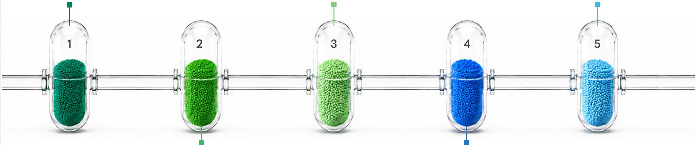

Cross-section of stakeholders including startups (precision medicine, CGT, AI drug discovery), large pharma, CROs, incubators, and VCs

Detailed case studies of Indian innovation leaders (e.g., ImmunoACT, Glenmark, Zydus)

## Secondary sources

S&P Capital IQ

Clarivate

Citeline

Evaluate

Derwent Innovation

Inven

Crunchbase

Web of Science

PubMed

## |

## Green shoots of innovation are emerging in Indian pharma and the momentum is building

India's pharma and life sciences sector is at an important turning point. Over the past decade, more than 10 novel drug assets have originated from India — spanning first-in-class NCEs, indigenous CAR-T therapies, and AI-discovered molecules. PE/VC investment has grown \~2.1x over the last five years to \$731Mn in FY26, while biotech startups have increased \~1.6x (from \~1,500 to \~2,400). Patent filings have risen more than 4x, and the innovation pipeline has expanded \~1.5x.

This shift is qualitative, not just quantitative: Indian companies are moving beyond generics and biosimilars to originate, license, and compete globally.

Yet India's scale in innovation remains limited. R&D spend stands at \~\$2–3Bn — a fraction of US (\~\$70–75Bn). Despite carrying \~15% of the global disease burden, India conducts just \~4% of global clinical trials. The opportunity ahead is significant, but so is the gap to be bridged.

## ||

## A full-stack innovation engine is beginning to take shape

This momentum is being enabled by four converging forces: \~\$5.0Bn in government funding, strengthening academia-industry linkages, an evolving regulatory framework, and the build-out of shared R&D and manufacturing infrastructure.

Early proof points of lab-to-market translation, including ImmunoACT's NexCAR19 and BIRSA 101 demonstrate that a full-stack innovation engine is beginning to take shape.

## 三

## Companies are pursuing multiple pathways to build competitive advantage

Indian companies are pursuing this opportunity through multiple innovation pathways: late-stage in-licensing, India-first validation before global expansion, global-first innovation monetized through out-licensing, academic spin-outs, and pure-play biotech platforms.

Landmark deals such as Glenmark's \$700Mn upfront licensing agreement with AbbVie and ImmunoACT's partnership with Cipla for Africa, signal growing global credibility.

## IV

## India's right to win is concentrated in three arenas

India's right to win is concentrated rather than broad. The strongest structural advantages lie in three arenas: cost-disruptive innovation that re-engineers advanced therapies for affordability at scale; India-specific biology and data that enable non-replicable precision medicine solutions; and science-driven platform innovation that leverages talent and cost efficiency. India's edge lies in combining cost, data, and talent — not in competing on frontier science alone.

## V

## Solving structural gaps will determine whether Indian pharma can realize full innovation potential

Structural constraints, however, remain significant. Access to early-stage, patient capital is limited with only \~10-15% VCs in India having deep pharma / biotech expertise, compared to \~60% in the US. Bench-to-bedside translation from academia remains weak. And execution gaps in clinical trial infrastructure, regulatory capacity, and domestic supply chains continue to slow innovation scale-up.

The next five years will determine whether India evolves into a global innovation originator or remains a sophisticated development hub. The conditions are in place — but the outcome is not guaranteed.

## TABLE OF CONTENTS →

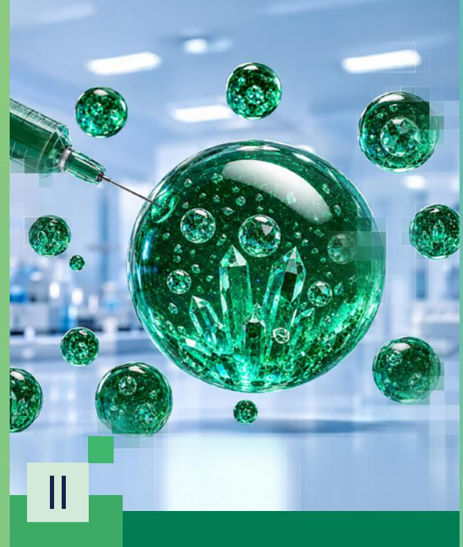

## Green Shoots of Innovation Emerging in Indian Pharma

12-23 →

## Full-Stack Innovation Engine Coming Together

24-33 →

| |

## Multiple Pathways to Build Competitive Advantage

IV

34-41 →

India's Right to Win

42-49 →

## Structural Gaps and What Needs to Change

50-57 →

## Green Shoots of Innovation Emerging in Indian Pharma

## India's pharma journey: Established in scale, emerging in science

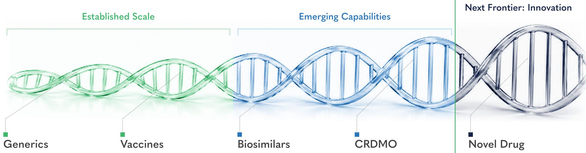

Next Frontier: Innovation

## Generics

$3^{rd}$ largest pharma producer (by volume)

\~40% of US generics demand served

\~20% of global generic supply (by volume)

Vaccines

\~60% of global vaccines produced

\~60% of UNICEF's vaccine demand

\~4Bn doses supplied globally \~\$0.8Bn exports; projected \~\$4.2Bn by 2030

\~15% of US biosimilars volume \~\$8Bn Indian CRDMO market (2024)

Growing at $\sim 13\%$ CAGR (vs $\sim 9\%$ global)

China+1 opportunity \$700Mn - \$1Bn annually

Source: Company annual reports; Analyst reports, BCG analysis

## Novel Drug Discovery

10+ novel assets originating from India in the last decade

Early global validation through out-licensing:

Peptris licensed to Revio

Ichnos / Glenmark licensed assets to AbbVie and Almirall

Funding momentum, policy push, and R&D incentives are accelerating the shift

Focus of this report

## India's pharma R&D spend remains nascent relative to global peers, leaving significant room for expansion

Total annual spend on Pharma R&D  
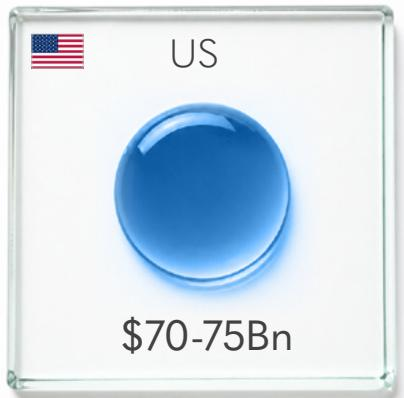

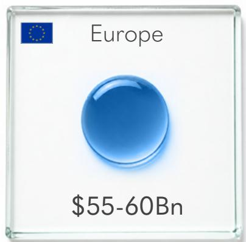  
Europe  
\$55-60Bn

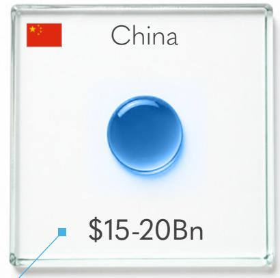  
China  
\$15-20Bn

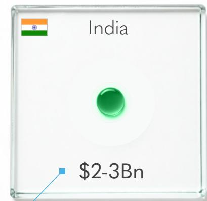

China has lower R&D expenditure than Europe and USA but accounts for 15-20% of the global novel drug pipeline, due to inherent advantages: Fully integrated pharma supply chain, relatively low labour costs vs. US, EU and government investments into R&D

Historically, pharma R&D investment in India has remained modest, reflecting limited support for early-stage and translational research and an industry mix skewed toward generics — both of which are now beginning to change

Source: EFPIA, The Pharmaceutical Industry in Figures 2025 (2023 pharma R&D spend; underlying sources: EFPIA member associations, PhRMA, JPMA, and China Statistical Yearbook); Federal Reserve Board, G.5A Annual (2023 average exchange rates used to convert EUR and RMB into USD). India estimate based on publicly disclosed R&D spend of listed Indian pharma / biopharma companies and public early-stage / translational research support

Innovation is increasingly happening ground-up in India — across CGT, mRNA, and immuno-oncology

## India remains significantly under-indexed vs global peers; \~1.6x growth in pharma / biotech startups over the last decade

India is significantly under-indexed in startups per capita vs peers

#pharma / biotech startups per capita

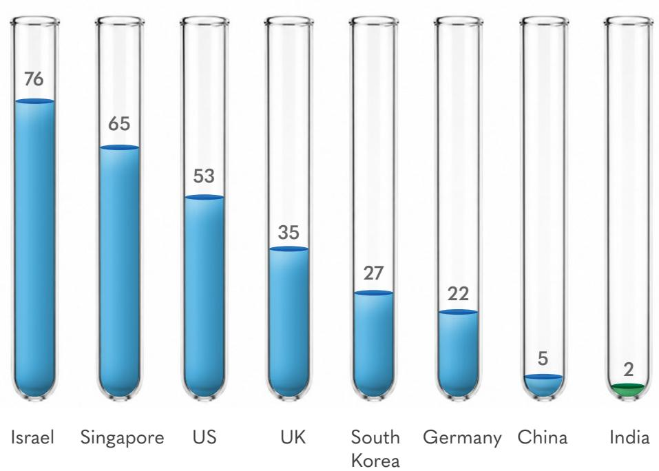  
1. Includes active startups, operating in the pharma and biotechnology segment, excluding hospitals, diagnostics, agriculture, digital apps, allied health sectors etc.
Source: Evaluate Pharma, Citeline, Quid, BCG analysis  
\~1.6x growth in number of pharma startups $^{1}$ in India from 2015–25...
# of biotech startups

## #

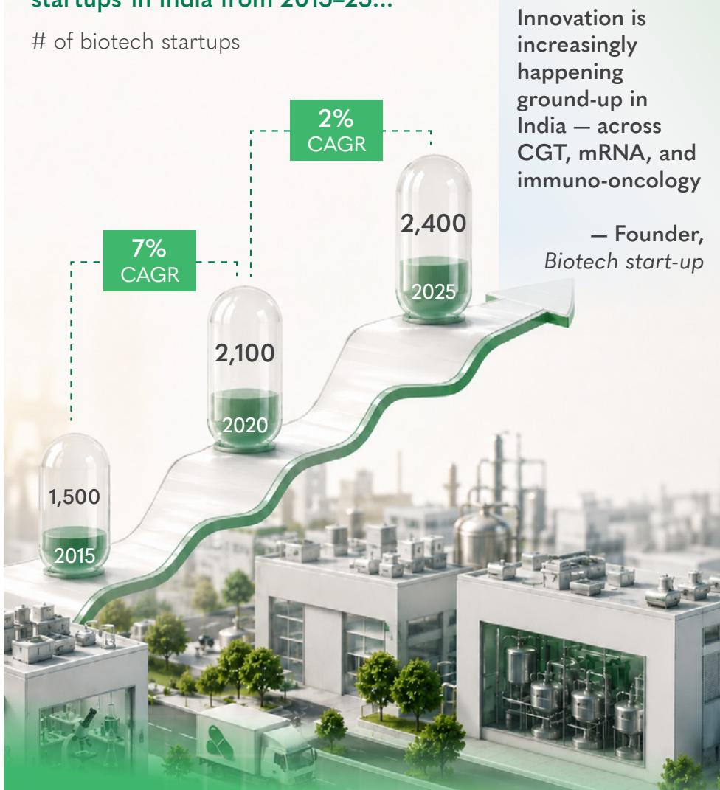

## \$731Mn investment by PE/VC in pharma in FY26; >2x increase in last 5 years

## \~2.1x investment increase in pharma over last 5 years

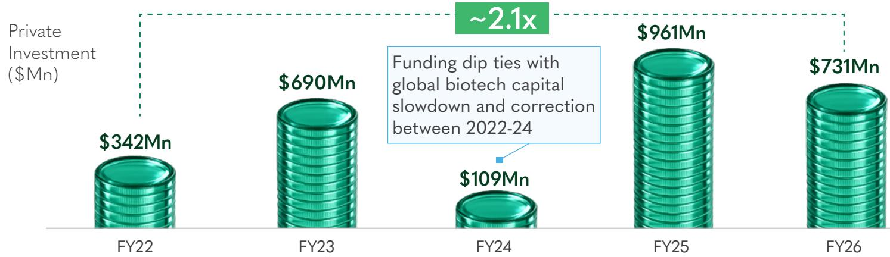

## Notable PE/VC deals focused on R&D (FY22–FY26)

<table><tr><td>Funding year</td><td>Company</td><td>Investors</td><td>Purpose of seeking investment</td><td>Latest deal size</td><td>Total funding raised</td></tr><tr><td>2026</td><td>Pandorum Technologies</td><td>Protons Corporate</td><td>Advance clinical development and scale manufacturing for regenerative medicine pipeline</td><td>$18Mn</td><td>$50Mn</td></tr><tr><td>2024</td><td>Immuneel Therapeutics</td><td>Taiba Middle East FZ, Eight Roads, True North, F-Prime</td><td>Advance clinical development of CAR-T product pipeline</td><td>$12Mn</td><td>$40Mn</td></tr><tr><td>2022</td><td>Bugworks</td><td>Lightrock, 3one4 Capital, UTEC</td><td>Clinical development of novel antibiotic BWC0977 + preclinical development for immuno-onco asset</td><td>$18Mn</td><td>$40Mn</td></tr></table>

Private capital inflow will serve as a great accelerator and will fill the gap of government funding in India

— CEO,
Life-sciences focused
investment firm

For every 100 VCs in the USA almost 60 of them will have experience in investing in biotech vs. 10 or 15 in India

— Founder, Biotech start-up

Note: \~2,900 companies related to 'pharma / life science / biotech' founded since 2000 were considered for the analysis. Companies were allowed to cluster based on (Business Descriptions) i.e., similar products, technology, customers, service offerings etc. Data based on disclosed investment amounts (USD) only. Last 5 Years data (01-Apr-2021 to 01-Apr-2026)
Source: Quid, Inc24, BCG analysis

\# of pharma patents originating from India $^{1}$

Patent grant rate of $\sim 40\%$ lags global peers

## >4x increase in pharma patents filed in India over the last decade, but grant rates and quality lag global peers

## Surge in patent applications in India

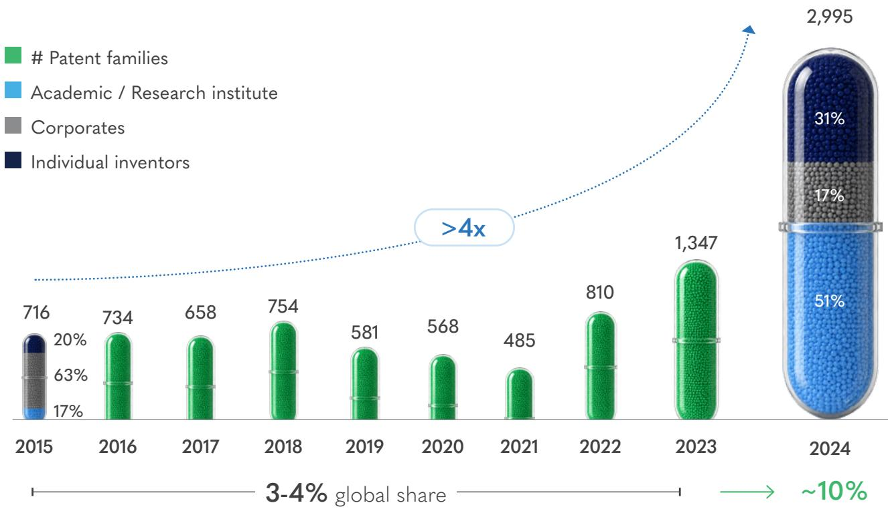  
Source: Derwent Innovation, Times of India, IP5 Statistics Report 2024, BCG analysis  
Note: Analysis based on \~12,800 patent families filed since 2015 in the "pharma / life science / biotech" domain by India (as priority country); patent family is a collection of individual patent records covering the same invention in multiple geographies

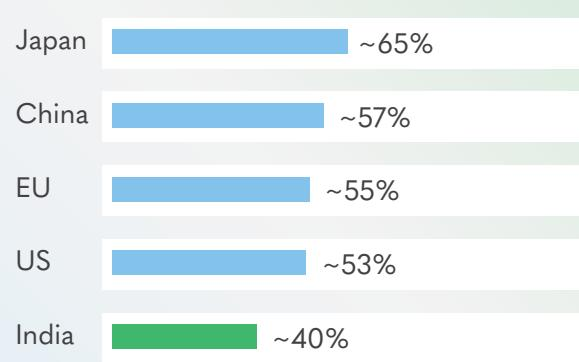  
indicating gap in novelty and industrial use of the patents filed $^{2}$  
Stark contrast in grant rate across academia:

## \~60%+

## vs. 1-10%

Premier institutes like IITs, IISC

Private universities
like Galgotias,
Amity etc.

## India's pipeline is scaling and maturing, with clinical assets concentrated in oncology

\~1.5x growth in innovation pipeline of Indian firms in last 10 years

#pipeline assets

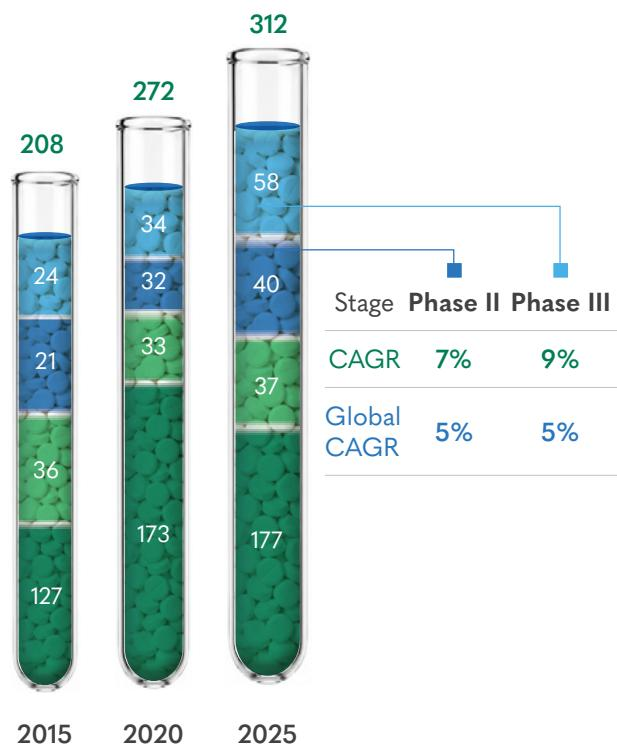  
Majority of clinical pipeline concentrated in Oncology
Clinical assets of Indian companies, by TA

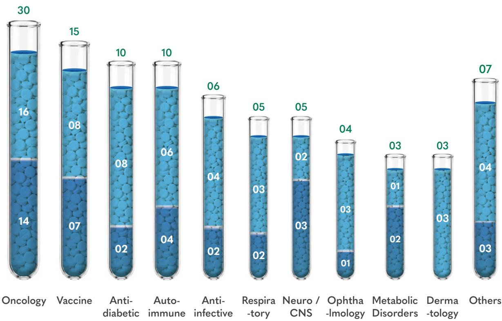

India's life sciences sector has emerged as a diversified life sciences innovation hub, with over 1,095 drug discovery programs across 195 companies, with nearly $86\%$ of programs focused on major diseases like oncology, infectious diseases etc. $^{1}$

— Managing Director, Differding Consulting

1. https://chemistry-europe.onlinelibrary.wiley.com/doi/10.1002/cmdc.70304
Source: Evaluate Pharma, Citeline, Quid, BCG analysis

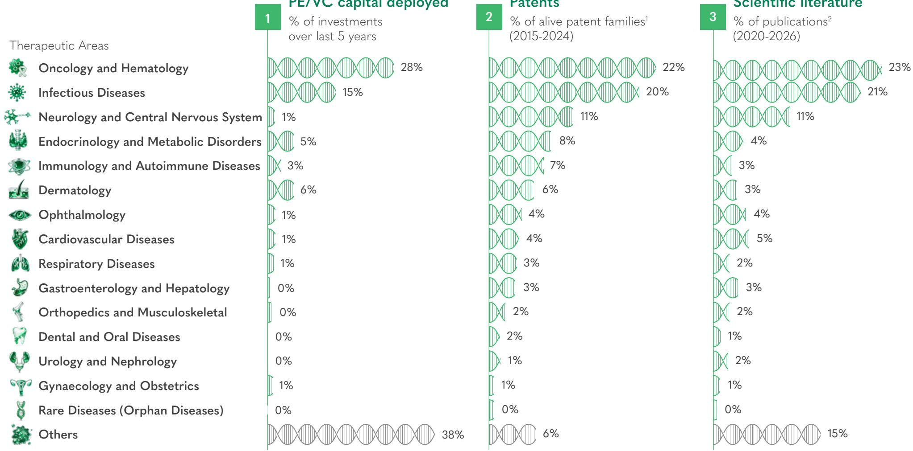

## India's innovation bets are concentrated in oncology and infectious diseases

## PE/VC capital deployed

% of investments
over last 5 years

2

## Patents

% of alive patent families $^{1}$ (2015-2024)

## Scientific literature

% of publications $^{2}$ (2020-2026)

1. Analysis based on \~4,300 patent families classified "Alive" of total \~12,800 patent families filed since 2015 in the "pharma / life science / biotech" domain by India (as priority country); patent family is a collection of individual patent records covering the same invention in multiple geographies; 2. Analysis based on \~8,600 publications with 10+ citations; Others includes: CROs, CDMOs, CRAMS companies etc. spanning across therapeutic areas
Source: Quid, Derwent Innovation, Inven; BCG analysis

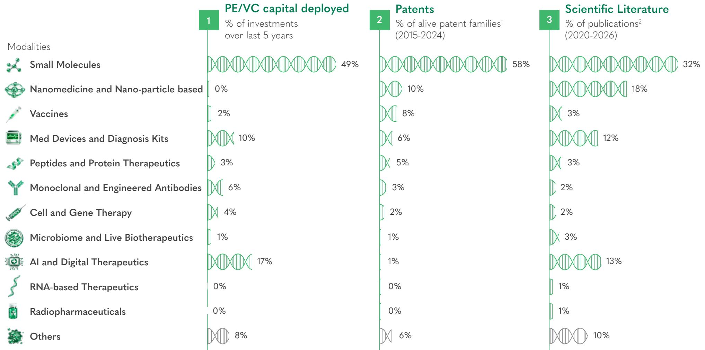

Small molecules dominate India's innovation across every signal — patents, capital, and science

% of publications $^{2}$ (2020-2026)

1. Analysis based on \~4,300 patent families classified "Alive" of total \~12,800 patent families filed since 2015 in the "pharma / life science / biotech" domain by India (as priority country); patent family is a collection of individual patent records covering the same invention in multiple geographies; 2. Analysis based on \~8,600 publications with 10+ citations; Others includes: CROs, CDMOs, CRAMS companies etc. spanning across therapeutic areas
Source: Quid, Derwent Innovation, Inven, BCG analysis

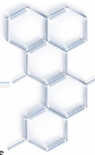

# A decade of Indian-origin innovation: 10+ novel drugs emerging from India, from first NCEs to CAR-T and AI-discovered drugs

## Commercially available

## Orchid Pharma Ltd.

## Zydus

Saroglitazar $^{1}$ 2013: First drug for NASH treatment in India; 2022: Phase II trials in US for PBC

Enmetazobactam
2024: First India-invented antibiotic to receive US FDA approval

## ImmunoACT

NexCAR19 de 2023: India's first indigenous CAR-T therapy, \~10x cheaper than imported CAR-Ts

Nafithromycin
2025: Novel macrolide antibiotic, granted QIDP designation by US FDA

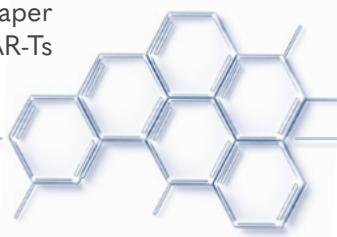

Itolizumab $^{2}$ 2017-2019: Novel anti-CD6 mAb for psoriasis; global trials ongoing for US, Canada etc.

## Wockhardt

## Biocon

## 2015

## 2020

## Wockhardt

## Zydus

## Peptris Technologies

2025: India's first AI-discovered drug candidate out-licensed to Revio Therapeutics, indicated for DMD

Zaynich
2026: Novel antibiotic (cefepime + zidebactam) approved by US FDA for cUTI $^{3}$ ; novel MoA against gram-ve pathogens approved after 40-50 yrs

## PEPR124

## Glenmark

ISB 2001, ISB 880 and ISB 830
2024-2025: Novel

onco and auto-immune mAbs out-licensed to global biotechs: AbbVie, Almirall etc.

Desidustat
2022: First-in-class drug for anemia associated with CKD

## Zumutor Biologics ZM008

2024: First-in-class novel anti-LLT1 mAb against locally advanced or metastatic solid tumors

## 2025

2026

## Bugworks

BWC0977
2024: Novel antibiotic targeting multi-drug resistant critical care infections (Phase I)

Fundamental shift in India over the last 20 years... Now I see a significantly greater risk appetite (in pharma companies) for plugging in innovation money

— CEO,
Life-sciences
focused
investment firm

## Early-stage development

1. Approved in India in 2013, subsequent approvals for Non-alcoholic steatohepatitis and NAFLD received in 2020; PBC: Primary Biliary Cholangitis; NASH: Non-alcoholic steatohepatitis; DMD: Duchenne Muscular Dystrophy; CKD: Chronic Kidney Disease; 2. Biocon out-licensed Itolizumab to Equilibrium in 2017 to commercialize in US, Canada, Australia;  
3. cUTI: Complicated Urinary Tract Infections  
Source: Citeline, BCG analysis

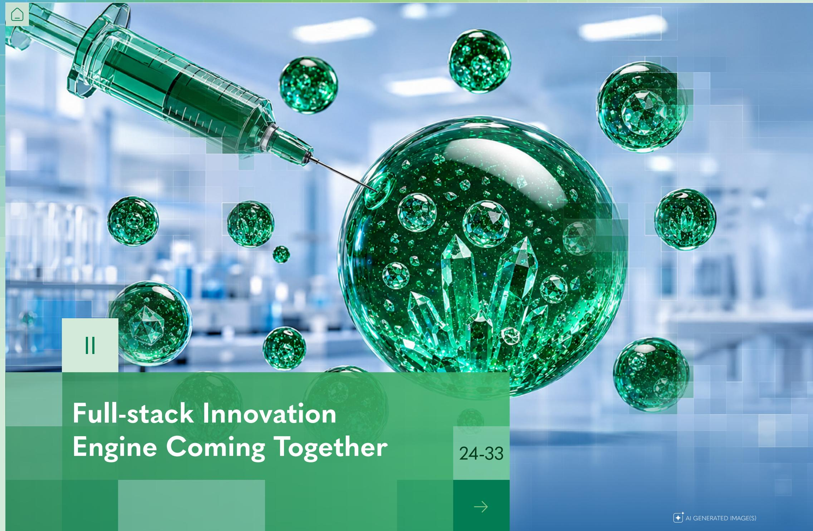

## Full-stack Innovation Engine Coming Together

Big ticket government funding

\~\$5.0Bn

## Strengthening role of academia

■ Industry partnerships

■ Tech transfer offices

## Innovation friendly regulatory reforms

■ Process simplification

\- Digitization and integration

■ Capacity and governance upgrade

■ Global harmonization

## Infrastructure enablement

## ■ R&D

■ Health data

■ Clinical trials network

■ Manufacturing

## \~\$5.0Bn of government funding allocated to early-stage research, talent and infrastructure development in pharma / biotech

Focus area

Total funds committed / allocated $^{1}$

Key programs and impact delivered

Early-stage innovation and entrepreneurship

\~\$199Mn

■ Biotechnology Ignition Grant: 1,000+ projects supported, 800+ IP facilitated, 200+ products developed

■ Small Business Innovation Research Initiative: 700+ jobs created, 300+ projects supported, 45+ IP filed, 80+ tech commercialized

■ Bioincubators Nurturing Entrepreneurship for Scaling Technologies: 3,500 jobs, 1,300+ IP, \~73 incubators, 800+ tech / products commercialized

Total outlay

1B

Translational research and commercialization

+

\~\$430Mn $^{1}$

■ Biotechnology Industry Research Assistance Council–Research, Development and Innovation Fund: supports Technology Readiness Level 4 to 9 translation

■ Biotechnology Industry Partnership Programme: \~240 projects, \~40 IP filings, \~95 products commercialized

■ National Biopharma Mission: \~100 incubation centres, 7 regional Technology Transfer Offices, \~120 industry tech transfers

■ Sustainable Entrepreneurship and Enterprise Development Fund and Launching Entrepreneurial Driven Affordable Products Fund: 200+ startups, \~10 exits

\~\$5.0Bn

1C

Infrastructure and ecosystem building

+

\~\$3.8Bn $^{2}$

+

■ 3 Bulk Drug Parks being set up across HP, Gujarat and AP; under the PLI scheme, 28 products commissioned with domestic manufacturing capacity of \~57,000 MT per annum

■ BioShakti Mission and Biotechnology for Economy, Environment and Employment recently announced biomanufacturing capacity setup

Talent and research funding

\~\$524Mn

■ Promotion of Research and Innovation in Pharma-MedTech: R&D scheme with three strategic focus areas: NCE / NBE, Biosimilars, Medical Devices

\- Fund projects across the full innovation lifecycle

\- Establish Centres of Excellence to Strengthen research capabilities and create skilled workforce

1. BIRAC-RDI is a \~\$210Mn fund announced recently, not committed yet; 2. Actual disbursed amount: \~\$524Mn Note: Total funds committed or allocated from the date of fund conception till latest available update Source: NBM, BIRAC, Press Information Bureau

## Strengthening role of academia

## Role of academia has been strengthened by facilitating collaboration with industry and enabling tech transfer from lab to market

## ■ Programs facilitating collaboration between industry and academia

Innovate in India (i3) – National Biopharma Mission

Large-scale funding (\~\$250Mn) and ecosystem support via BIRAC

Formal industry–academia collaborative mission to accelerate discovery → early development of biopharma products

## PRIP (Promotion of Research and Innovation in Pharma & MedTech)

Notable tech funded: Low-cost indigenous MRI scanner (VoxelGrid), DNA-based COVID-19 vaccine ZyCoV-D (Zydus), Chikungunya vaccine (Bharat Biotech) etc.

Funds end-to-end R&D (TRL 1–9) with explicit push for industry–academia collaboration via Centres of Excellence (e.g., NIPERs)

  
Focus areas include NCE / NBE, biosimilars, precision medicine

## ■ Enabling technology transfer from academia to industry

Technology Transfer Offices (TTOs)

Techex.in, i-TTO, C-CAMP etc. under BIRAC-RTTO Network manage IP, foster industry partnerships, facilitate tech transfer from lab to market

1. DBT: Department of Biotechnology
Source: Press Information Bureau, BIRAC, BCG analysis

## Institute of Genomics and Integrative Biology

Serum Institute of India

BIRSA 101: India's first indigenously developed CRISPR-based therapeutic successfully transitioning from Lab-to-Market via Public-Private Partnership

## Academic origin

Developed at CSIR–Institute of Genomics and Integrative Biology (IGIB);

Target gene discovery

Development of CRISPR-editing system enFnCas9

Proof-of-concept validation

## Lab → Market transfer

Formal tech transfer done with Serum Institute of India for clinical development and commercialization

## Innovation friendly regulatory reforms

## Regulatory reforms implemented to accelerate approvals, reduce drug development timelines and strengthen quality of homegrown products

## Regulatory reforms to fast-track approvals

## Process simplification

■ Drug development timelines shortened from 180-270 to 60-120 days via online prior-intimation; license required for non-commercial manufacturing waived

■ Quicker initiation of BA / BE studies via online intimation for low-risk drugs, prior permission requirement waived off

■ Introduction of time-bound approvals for test license, reducing timeline from 90 to 45 days

■ Institutional Biosafety Committee (IBSC) clearances to replace licensing requirement for recombinant DNA products

3B

## Regulatory digitization and integration

CDSCO has digitized \~97% operations, cutting inefficiencies by \~25%

■ Dashboard for real-time tracking of applications

■ Automated deficiency alerts

State Health Regulatory Excellence Index (SHRESTH), launched by CDSCO to benchmark and strengthen state drug regulatory systems on parameters such as HR, lab capacity, surveillance

3C

## Capacity and governance upgrade

Plan to create \~1,500-member scientific cadre to strengthen internal subject matter expertise and shift towards in-house scientific evaluation vs. external dependence

New Drugs, Medical Devices and Cosmetics Act 2025 in development:

■ Provisions for fast-tracking breakthrough therapies

■ Statutory authority to CDSCO for faster enforcement actions

## Global harmonization

Alignment with global regulatory standards (WHO / PIC-S / ICH)

■ Progressing towards Pharmaceutical Inspection Co-operation Scheme (PIC / S) compliance

■ Adoption of ICH guidelines across quality, safety and efficacy of drugs

■ Revised Schedule M requirements to align with WHO-GMP standards

# India is building shared infrastructure to enable end-to-end pharma innovation – from discovery to manufacturing

## ■ Shared infrastructure across the value chain

## Research and Development

■ Biotech parks and clusters: e.g., IKP Knowledge Park, Genome Valley, TICEL Bio Park; plug-and-play labs, pilot mfg. facility, co-location with pharma / biotech

■ Incubation centers: e.g., BioNEST, Venture Center Pune, C-CAMP; shared equipment access, mentorship, IP and grant support

■ Translational research hubs e.g., THSTI: shared infra for genomics testing, preclinical, and early human studies

■ CSIR plug-and-play labs, shared facilities in IITs etc: access to advanced instrumentation and scientific expertise ■ National scale health data stack: ABDM digital sandbox for EHRs; \~92Cr $^{1}$ ABHA IDs issued (\~60% population), \~102Cr health records linked and \~5.3L health facilities registered

Data and Digital

\- Genome India: Population scale genomic database (\~10,000+ genomes)

■ Indian Cancer Genome Atlas (ICGA) cancer research

4B

■ Reduced CAPEX barrier for startups and academia

1. ABDM dashboard, as on 14th June'26
Source: MoHFW, DoP, BIRAC, NBM

Clinical Development

■ Early mentorship support to startups for IP, funding, commercialization etc.

■ 1,000 accredited clinical trial sites to be developed under BioShakti Mission

■ Dedicated Phase I clinical trial network, established across 4 institutes by ICMR

## Impact

■ BioShakti Mission, BioE3, National Biofoundry Network launched at 8 institutes

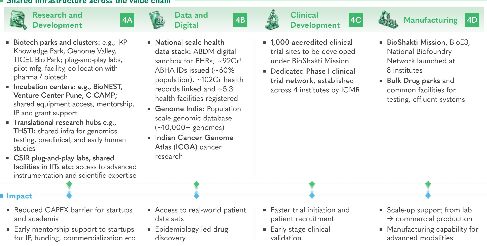

■ Bulk Drug parks and common facilities for testing, effluent systems

■ Access to real-world patient data sets

■ Epidemiology-led drug discovery

■ Faster trial initiation and patient recruitment

■ Early-stage clinical validation

■ Scale-up support from lab → commercial production

■ Manufacturing capability for advanced modalities

## Genome Valley | India's largest integrated life sciences cluster; a replicable model for innovation-enabling infrastructure

## India's first and largest biotech cluster (\~2,000+ acres), established in Hyderabad (1999)...

## Shared manufacturing infrastructure

\- Pilot-scale and GMP manufacturing infrastructure

\- India's first single-use bioprocess design and scale-up facility

■ Advanced vaccine manufacturing capabilities (incl. high-titer viral vectors)

■ Vertically integrated Cell and Gene Therapy plant

## Shared research infrastructure

■ Preclinical and clinical research facilities

■ Plug-and-play R&D labs

■ Proximity to leading institutions such as IICT and CCMB

## ...developed as public-private partnership

■ State government led development, land allocation and policy support

■ Participation from global and Indian Pharma (Dr. Reddy's, Bharat Biotech) to establish manufacturing infrastructure

■ Private developers provided incubation and lab spaces

\- Cerestra Ventures: Launched Genome Valley Research Platform (GVRP) – CRO ecosystem

■ ICICI Bank helped set up the IKP Knowledge Park

## Impact Generated

200+
Companies

\~\$80Bn
Valuation of life sciences ecosystem

Responsible for manufacturing $\sim 1 / 3^{\mathrm{rd}}$ of global vaccine doses

Home to 4 innovation centers of Global Big Pharma: Novartis, BMS, Roche, Sanofi

## Select Companies

<table><tr><td>Bharat Biotech</td><td>Novartis</td></tr><tr><td>Biological E. Limited</td><td>Sanofi</td></tr><tr><td>GSK</td><td>FERRING</td></tr><tr><td>Sai</td><td></td></tr></table>

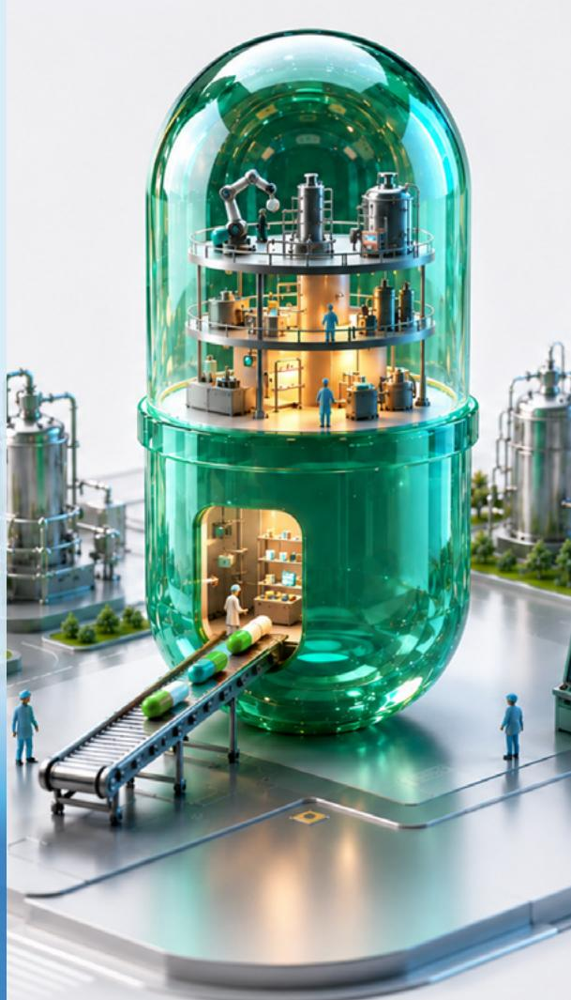

## C-CAMP | India's leading deep-tech life sciences incubator enabling early-stage innovation through shared infrastructure

## Life sciences startup incubator, established in Bengaluru (2009)...

## Shared research infrastructure

\- Lab space (up to \~750 sq ft) + office space, for up to 6 scientists

■ High-throughput and High-content Screening (HTS / HCS) facility

■ BSL-2 tissue culture and clean rooms

■ Dedicated biologics characterization facility

■ 800 and 600 MHz Nuclear Magnetic Resonance (NMR) spectrometers

Incubation support: mentorship, grants (e.g., BIRAC), and industry connects

## ...developed as a public-private partnership

■ Funded & supported by DBT / BIRAC

■ Partnerships with industry, VCs, and global organizations

■ Corporate collaborations for research:

\- Thermo Fisher (CoE in flow cytometry & molecular biology)

\- ICAR (AMR funding & technical expertise)

## Impact Generated

100+
Startups /
spin-offs supported

Enabled lab-to-proof-of-concept translation

Helped startups secure significant follow-on funding and global partnerships

## Select Incubates

<table><tr><td>Achira Labs</td><td>Zumutor Biologics</td></tr><tr><td>Sea6 Energy</td><td>Strand Life Sciences</td></tr><tr><td>Peptris</td><td></td></tr></table>

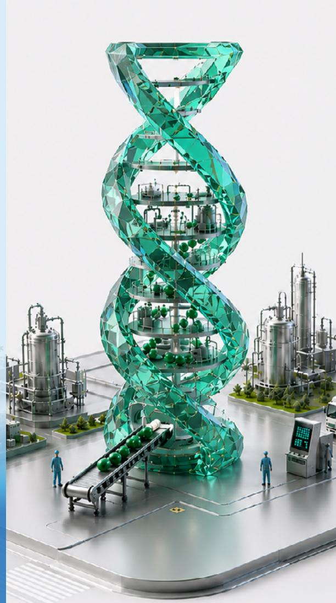

## Voice of the Industry...

## Big ticket government funding

Historically, government funding in biotech research was stifled...the \~\$210Mn BIRAC-RDI fund is a positive step, and hopefully results will start coming out soon

## Strengthening role of academia

3–5 years back, academia in India was not focused on creating products but on publications... now a large number of organizations and biotech startups are emerging from academia, so the product focus has evolved

## Innovation friendly regulatory reforms

The regulatory ecosystem is maturing, but it is still at a very nascent stage...they are open to discussions for novel therapies, but nowhere close to a very mature environment

— Founder, Precision Medicines Startup

— Founder,
Drug Delivery
Startup

— Founder,
Gene Therapy
Startup

## Infrastructure enablement

\~60 incubators across the country...C-CAMP, IKP Knowledge Park, etc., have made it easier for companies to get formed and have created an ecosystem of shared infrastructure, good equipment, and investor connects

— Founder,
AMR
Startup

## Pathways to Build Competitive Advantage

Companies are taking different pathways to build innovation-led competitive advantage

Archetypes

shaping India's innovation landscape

Late stage acquisition / in-licensing to build specialty portfolio

Sun Pharma

Key companies acquired to build portfolio / capabilities:

■ Taro

■ Dusa

■ Biosintez

■ Concert Pharma

\~7 products acquired / in-licensed in last 5 years

India-first clinical / commercial proof, before global expansion

Zydus

Saroglitazar Desidustat

ImmunoACT

NexCAR19

Global-first innovation, monetized via partnering

Glenmark

Ichnos Glenmark Innovation

Monetized 3 early-stage assets to AbbVie, Almirall and Astria Therapeutics

Translation from academia to industry

ImmunoACT

Conceptualized and Incubated at IIT-Bombay

First CAR-T to be developed globally, outside of US, China ecosystem

Available at 1/10th of the cost of CAR-T in US

Biotech innovation

Immuneel, Helex

Cell and Gene Therapy

Peptris, Boltzmann
Al-led drug discovery

4baseCare, Leucine Rich Bio Genomics and Precision Medicine

Bugworks, Ahammune, Avammune
Small molecule drug discovery

Zumutor

Biologics / mRNA Tx

## Sun Pharma has built out their global specialty portfolio inorganically via acquisition of commercial / late-stage assets

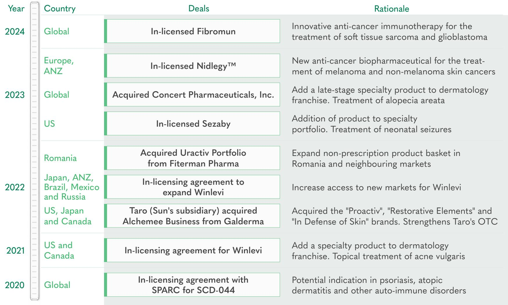  
Source: Sun Pharma Annual Report 2025

# Zydus and ImmunoACT have built-out India first clinical / commercial proof before expanding globally

## Zydus: Saroglitazar and Desidustat developed entirely in-house and one of India's first indigenous NCEs

## Saroglitazar

■ Discovered and developed entirely in India, one of India's first indigenous NCEs

■ Approved and launched in India in 2013 for diabetic dyslipidemia

■ US Phase I/III trials ongoing and has received FDA Fast Track Designation and Orphan Drug Designation for PBC and NASH in 2021

## Desidustat

\- Second NCE to be exclusively developed in India, differentiated best-in-class HIF-PH inhibitor – oral tablet alternative to injectable erythropoietin-stimulating agents for Anemia associated with CKD

■ Approved and launched in India in 2022; Approval in China followed in 2026

■ US Orphan Drug Designation granted in 2026 for treatment of Sickle Cell Disease

Source: Zydus Annual Report 2025; ImmunoAct Press Release

## ImmunoACT: India's first CAR-T therapy originating out of academia

■ Approved in India in 2023

\- Among the first CAR-T therapies to be developed globally outside the US / China ecosystems

■ Partnered with Cipla to commercialize in South Africa, Algeria, and Morocco

## India

## Developed India's first indigenous CAR-T cell therapy for cancer

## \$15Mn

Total Funding

## 1/10 $^{th}$ Cost

\~\$50,000 vs \$0.5Mn for CAR-T abroad

## \$10Mn

Laurus Labs 34% stake purchase

## 500

Patients already treated

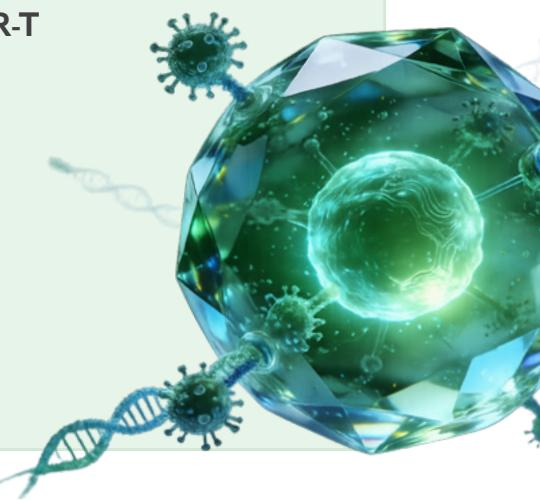

# Glenmark has targeted global first innovations and monetized 3 early-stage assets via global out-licensing deals

## Glenmark (via Ichnos Glenmark Innovation)

Developed ISB 2001 (trispecific antibody, oncology), first-in-class targeting BCMA / CD38 / CD3

\- Licensed to AbbVie in a \$700Mn upfront + \$1.2Bn milestones deal, AbbVie gets global rights for US, EU, Japan and China, Glenmark retains emerging market rights

■ Ichnos invested \~\$70Mn a year for development

Developed IL-1RAP antagonist ISB 880 for auto-immune disorders

\- Out-licensed to Almirall SA for an upfront payment of \~\$25Mn, currently in phase 1 development

Licensing agreement for ISB 830 (telazorlimab), indicated for atopic dermatitis and rheumatoid arthritis, with Astria Therapeutics

  
Source: Glenmark Annual Report 2025

# ImmunoACT is a notable example of first full-stack translation of academic science into a globally competitive, commercial CAR-T therapy

## Academic discovery and translational research

■ Work initiated by Prof. Rahul Purwar (IIT Bombay) with PhD researchers, focusing on CD19-targeting CAR-T cell therapy

■ Collaboration formed with Tata Memorial Center for clinical expertise

■ 2017-2018 program funded by Wadhwani Research Centre for Bioengineering (WRCB) and the Tata Centre for Technology and Design (TCTD)

## Spin-out and industrialization

■ ImmunoACT spun-off and incubated at Society of Innovation and Entrepreneurship (SINE) at IIT Bombay

■ Support received from BioNest initiative of BIRAC including funding and mentorship

■ BioE3 policy funded setup of 200L GMP lentiviral vector and plasmid production platform

## Industry partnership and scale-up

■ CDSCO approval in 2023 for NexCAR19 as the first indigenously developed CAR-T cell therapy in India

\- Launched at 1/10th cost of therapy in US (\~\$50,000 for NexCAR19 vs. \$0.5Mn for CAR-T in US)

■ Partnership with Cipla announced in 2026 for global commercialization in Africa

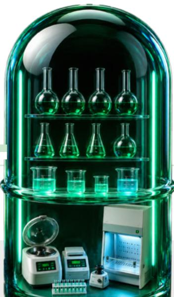

## India's biotech startups clustering around 5 high-impact innovation segments

Cell and Gene Therapy

AI-led Drug Discovery

Genomics and Precision Medicine

Immuneel Therapeutics, ImmunoACT

Cancer CAR-T

Small Molecule Drug Discovery

## Helex

Gene-editing with non-viral delivery

## Regrow Biosciences

Stem cell-based regeneration

Biologics / mRNA Therapeutics

## Eyestem

Cell therapies for retinal diseases

## Peptris

Al-driven small molecule pipeline

## Boltzmann

AI + physics-based simulations for drug design

AI-enabled clinical data platforms

## Medvolt.AI

## 4baseCare

India-specific gene panel for precision cancer treatment

CRISPR-based molecular diagnostics

## CrisprBits

## Leucine Rich Bio

Microbiome diagnostics for personalized intervention

## Bugworks

Novel antibiotics for combatting AMR

## Ahammune Biosciences

SM drugs for autoimmune disorders

## Avammune Therapeutics

SM drugs
immune-modulating
drugs

## Zumutor Biologics

Novel
onco-immunotherapy
targeting NK cells

## PopVax

mRNA Vaccines and Immunotherapeutics

India's Right to Win

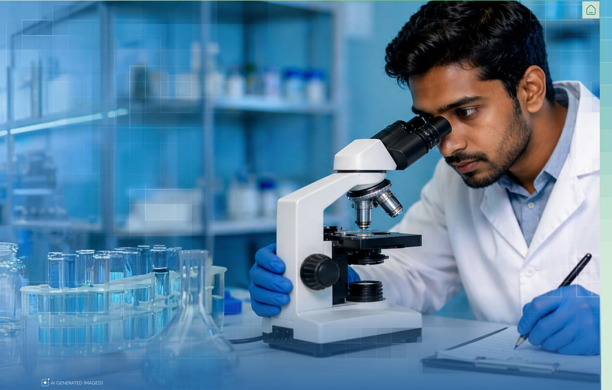

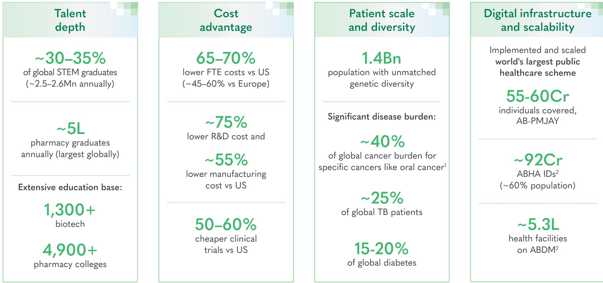

## India's structural advantages provide a strong foundation for innovation, but require effective translation

## Talent depth

\~30–35% of global STEM graduates (\~2.5–2.6Mn annually)

\~5L pharmacy graduates annually (largest globally)

Extensive education base:

1,300+
biotech

4,900+
pharmacy colleges

Cost advantage

65–70%
lower FTE costs vs US (\~45–60% vs Europe)

\~75% lower R&D cost and

\~55% lower manufacturing cost vs US

50–60%
cheaper clinical trials vs US

## Patient scale and diversity

1.4Bn population with unmatched genetic diversity

Significant disease burden:

\~40%
of global cancer burden for
specific cancers like oral cancer $^{1}$

\~25% of global TB patients

15-20% of global diabetes

## Digital infrastructure and scalability

Implemented and scaled world's largest public healthcare scheme

55-60Cr individuals covered, AB-PMJAY

\~92Cr
ABHA IDs $^{2}$ (\~60% population)

\~5.3L health facilities on ABDM²

## India's right to win is emerging, not universal

## #

Only 10–15% of Indian VCs have pharma / biotech experience versus \~60% in the US — making it harder to access the informed, patient capital deep biotech requires

## #

No other country offers India's combination of epidemiology and genetic variation at an affordable cost...critical for clinical trials and global standards

## #

...Impressed by the quality of CAR-T pipeline...significant cost reduction... innovation in India is also driving access impact

## Three arenas where India has a structural right to win

## Cost-disruptive innovation

Re-engineering advanced therapies for affordability at scale — for India and the Global South

## India-specific data-led innovation

Leveraging India's unique genetic and microbiome diversity to build non-replicable precision medicine solutions

## Science-driven platform innovation

Building next-gen drug discovery and delivery platforms (AI, CGT, biologics) leveraging India's talent and cost advantage

India's edge lies in combining cost, data, and talent—not in competing on frontier science alone

## Success stories of Indian companies | Cell and Gene Therapy (I)

## Indigenous stem cell therapy for India Regrow Biosciences

## Problem Statement

\- Orthopedic degenerative diseases lack curative therapies and depend on surgical interventions / implants with poor quality of life

■ Limited access to affordable regenerative therapies

## Solution

\- First Indian company to develop affordable and scalable commercial stem cell treatment

■ Room-temperature stable product allows ease of transportation and storage in Indian / low-resource areas

\- Strong IP moat: \~30+ patents filed; 8 granted in India and 3 in US along with robust clinical efficacy data (\~95%+)

■ Backward integrated to reduce China dependency and own GMP manufacturing facility

■ Also developing allogeneic cell therapy treatment for rheumatoid arthritis and psoriasis

## Founders speak

Developed one of the first bone cell therapies... no other product in the world to treat avascular necrosis

## Accessible, affordable gene therapy for rare diseases Helex

## Problem Statement

■ Limited access to gene therapy in India and lack of scalable manufacturing infrastructure

\- Lack of targeted treatments for kidney diseases

## Solution

■ Proprietary lipid nanoparticle (LNP) delivery platform for gene therapy

\- Non-viral delivery vector allows affordable, cost-effective and scalable manufacturing – fit for Indian market

■ Non-viral delivery vectors offer safety advantages such as no insertional mutagenesis over viral vectors and can be safely redosed

\- Lead candidate is a single dose, disease modifying LNP-gene editing therapy for ADPKD (Autosomal Dominant Polycystic Kidney Disease) patients

■ Commercialization plans across India, US, EU, and major geographies

We are pioneering delivery to the kidney to unlock multiple therapies for high unmet diseases that currently have very poor standard of care- mostly dialysis and transplantation

## Success stories of Indian companies | Precision Medicine (II)

## Precision Oncology for India 4baseCare

## Problem Statement

■ Western genomic tests miss India-specific mutations and are high-cost

\- Limited structured cancer data → poor treatment personalization

## Solution

■ Building India-specific genomic test panel through large-scale cancer genomic testing, 1,044 unique genes identified across 28 cancer types

■ Flagship test TARGT Indiegene offered at 1/4th price of equivalent Western-developed tests

■ Pharmaco-sponsored tests allow affordability for patients while generating data at scale

■ Collaboration with Memorial Sloan Kettering Cancer Center to develop OncoTwin to chart treatment journey for patients

## Founders speak

Vision of 4baseCare is that we should build the largest resource of relevant oncology data which helps us to give the right treatment to the right patient at the right time

## Gut Microbiome test, Built in India for the world Leucine Rich Bio

## Problem Statement

\- Lack of India-specific microbiome data and personalized interventions

■ Rising demand for preventative, personalized health insights

## Solution

■ Building largest Indian / South Asian microbiome dataset, B2B2C model via diagnostics, hospitals, wellness clinics

\- Hybrid sample collection: Own feet on the ground + partnership with wellness centers, diagnostic labs, hospitals etc.

\- \~95% market share in microbiome testing, cost reduced with scale from \~\$550 at launch in 2017 to \~\$105 now

■ Present in West and South-East Asia and plans to expand into South America

We have the largest Indian and South Asian data, with microbiome diversity...not very easy to replicate that kind of data and insights it generates is unparalleled

## Success stories of Indian companies | Small Molecules (III)

## First-in-class auto-immune therapies Ahammune Biosciences

## Problem Statement

■ Large unmet need in autoimmune skin diseases such as vitiligo, affecting 1-2% of global population

■ Lack of targeted disease-modifying therapies

## Solution

\- Lead asset AB1001: first-in-class topical drug targeting pathways that trigger auto-immunity; Phase 2-ready

■ Focus on localized delivery ensures high efficacy, minimal systemic exposure

■ Small-molecule based therapy convenient and cost-effective to manufacture at scale

■ Platform applicable across multiple autoimmune indications (vitiligo, atopic dermatitis)

■ Strong IP moat: 13+ patents granted across US, Europe, India etc., valid till 2040

## Founders speak

Vitiligo is the largest de-pigmentation disorder in the world...we identified a novel pathway that has never been tested before...

## Novel Antibiotics for Anti-Microbial Resistance Bugworks

## Problem Statement

\- Rising AMR burden with no new broad-spectrum antibiotics in \~50 years

■ Big Pharma has largely exited antibiotic R&D (low ROI, high risk)

## Solution

\- Lead asset BWC0977: Dual-target inhibitor (DNA gyrase + topo IV) → harder for bacteria to develop resistance; backed by CARB-X and GARDP

\- Broad-spectrum activity against Acinetobacter, Pseudomonas, Bacillus anthracis etc.

■ IV + Oral formulations promise wider clinical applicability

■ Two platforms for novel drug discovery: DYROX (AMR discovery) and DARE (immuno-onco pipeline)

BUGWORKS, we said, from India can we create a brand new antibiotic not done since the 1970s...and we have tested our asset on the worst pathogens in India

## Success stories of Indian companies | AI-led Drug Discovery (IV)

## AI-driven Antibody Discovery ImmunitoAI

## Problem Statement

■ Traditional antibody discovery is slow (4-5 years), expensive and has high failure rates (\~90%) in early discovery stage

■ Limited innovation originating from India

## Solution

\- AI-first "Antibody Design" platform to generate target-specific Ab with predefined drug characteristics, optimized for stability, binding strength and affinity

\- Increased R&D efficiency and success rate by building in drug-like properties upfront

■ Compresses development timeline from 4-5 years to less than a year

■ Integrated wet lab validation allows identification of licensable drug candidates

■ AI is capable of generating drug candidates for traditionally difficult and undruggable targets

## Founders speak

We have built an AI platform that has successfully created novel antibodies for drug purposes with very high efficiency

## Al-led small-molecule drug discovery Peptris

## Problem Statement

■ Drug development is slow, expensive, with high failure rates

■ Limited innovation emerging from India, predominantly generics-led businesses

## Solution

■ AI-driven drug discovery platform, leveraging machine learning and computational chemistry to:

\- Identify new drug targets

\- Generate and optimize molecules in silico

■ Platform has been deployed to discover NCEs, repurpose or reposition approved drugs or identify novel targets / indications for clinical candidates

■ Out-licensing deal with Revio Therapeutics for Phase-2 ready asset PEPR124, targeted for Duchenne Muscular Dystrophy (DMD)

\- Claimed as the first AI-discovered drug candidate from India to be out-licensed globally

## Structural Gaps and What Needs to Change

## India's scale advantages are clear; structural gaps in capital, translation, and execution limit innovation scale-up (I)

## Key constraints

## Access to grant funding (public capital)

Access to
VC funding
(private capital)

## Description

■ Public funding is often diffused and insufficient: maximum grant sizes in India (\~\$52K) vs \$2–3Mn in US / EU

■ Cumbersome application processes with heavy paperwork and fragmented requirements across schemes

■ Unpredictable timelines and limited clarity on evaluation stages

■ Schemes often lack transparency in execution post-announcement

■ Low risk appetite among Indian VCs for deep-tech and biotech investments

\- Lack of patient capital and early-stage (Series A) funding; limited specialist healthcare investors

\- Reliance on foreign capital for Series B/C (\$10–50Mn)

■ Restricted exit pathways due to SEBI norms limiting biotech IPOs

■ Reluctance among global VCs to invest in India-HQ companies (unless re-incorporated abroad)

Significant burden of paperwork that comes with every single grant

— Founder, AI-led biotech

In Europe, you get a million dollars in grants...That's the kind of money needed to fund biotech R&D — Founder, AI-led Biotech

Biotech and life sciences need patient money

— Founder, Precision Medicine startup

Indian VCs don't have appetite to invest in deep tech research

— Founder, Drug-delivery startup

## India's scale advantages are clear; structural gaps in capital, translation, and execution limit innovation scale-up (II)

## Key constraints

## Clinical trials

## Description

\- India accounts for \~4% of global trials vs \~15% of global disease burden
  - Historically used for scale recruitment, not innovation-stage development

■ Under-penetration in early-phase (Phase I/II) trials
- Dedicated Phase I units now being set up under ICMR ■ Insufficient resources at trial sites, especially government hospitals

\- Shortage of trained investigators and trial management professionals

■ Clinical trial approvals take \~90 days in India vs \~30 days in the US

\- Improving to \~45 days, but still slower for novel therapies ■ System remains under-resourced, relying on external experts - Leads to frequent delays and capability gaps for advanced modalities

## Regulatory Infrastructure

\- Plan for 1,500-member scientific cadre ■ No differentiated pathways for small molecules vs biologics / advanced modalities (mRNA, CAR-T)

■ Limited standardization vs US/EU guidelines for novel therapies

9–10 CAR-T clinical trials in India vs. \~600 in China

— Founder, Gene Therapy startup

Novel drug trials were a challenge — innovators waited 6–8 months for approvals

— Founder, CRO

Regulatory delays for novel products with no precedents to benchmark against

— Founder, Genomic medicine startup

It took us 2 years to get NABL accreditation for our lab

— Founder,
Preventive Health startup

## India's scale advantages are clear; structural gaps in capital, translation, and execution limit innovation scale-up (III)

## Key constraints

## Translational maturity inside academia

## Description

■ Weak bench-to-bedside translation:

\- Fewer products or startups originating from academia vs global benchmarks

\- Researcher mindset remains skewed toward publications over product development

\- No formal mechanisms to enable structured academia-industry collaboration, limiting startup access to high-end instruments

■ Institutes often mandate IP co-ownership for joint R&D, discouraging startup participation

## Lack of industry – academia partnership and access to R&D infrastructure

■ Few incubators offer advanced capabilities (e.g., biosafety labs), constraining deep-tech experimentation

■ Limited usability of high-end instruments due to access barriers, poor maintenance, or funding constraints

\- Mid-scale R&D infrastructure gap: limited access to 1–10L culture capacity required to bridge early-stage research and scale-up

NIRF rankings incentivize institutes to focus more on publications than inventions

— Founder, Drug Delivery Startup

It is difficult for startups to access high-end equipment at research institutes

— Founder, CRO

Advanced instrumentation exists, but is often underutilized or poorly maintained...IP-sharing issues also come up

— Founder, Formulation development startup

## India's scale advantages are clear; structural gaps in capital, translation, and execution limit innovation scale-up (IV)

## Key constraints

## Description

\- Lack of high-quality local suppliers for research-grade raw materials and reagents, particularly for advanced modalities (e.g., gene therapy), leading to heavy reliance on imports and 30–45 day lead times

## Domestic supply chain gaps

\- Limited access to domestic GLP / GMP-grade infrastructure for advanced manufacturing (e.g., non-viral vectors, gene therapy)

■ Limited insurance coverage for novel or deep-tech technologies (e.g., genomic testing, precision medicine), constraining adoption and scale-up

## Domestic market economics

■ Absence of insurer frameworks for outcomes-based reimbursement for advanced modalities

■ Health data remains fragmented across hospitals, labs, and state systems (public vs private silos) with limited integration

\- Low adoption of standardized electronic health records (EHRs) and interoperability protocols

## Health Data Infrastructure

\- India's structured datasets remain significantly smaller vs. global benchmarks despite population scale
  - e.g., Genome India (\~10,000 genomes) vs. UK Biobank (\~500,000)

90% of our materials are imported from US, Europe, China...with lead times of 30-45 days

— Founder, Gene Therapy startup

Limited access to cleanroom infrastructure for startups

— Founder, Drug-delivery startup

Important to have insurance coverage for precision diagnostics to ensure patient accessibility

— Founder, Precision Medicines startup

India has population - scale advantages ...but needs ecosystem support to build assets like an Indian Biobank

— Founder, AI-drug discovery startup

## Key initiatives that will determine India's innovation decade

## Build India's first generation of specialist biotech capital

\- Introduce targeted government schemes and tax incentives to catalyze industry investment in R&D

\- Increase direct public funding for early-stage and translational research

\- Expand funding for novel drug development programs

\- Harmonize grants across schemes and streamline application and disbursement processes

\- Ease access to external capital: single-window clearances, relaxed IPO / listing norms

• Strengthen investor confidence in the Indian biotech ecosystem

Without patient, specialist capital, deep biotech innovation will not scale

## Encourage academia – industry partnerships and collaboration

\- Prioritize 8–10 anchor institutions, revamp performance management, and deepen industry collaboration

\- Establish independent bodies to catalyze collaboration (e.g., A\*STAR, CTI)

\- Enable flexible IP ownership models to incentivize joint R&D

\- Expand research and incubation centers in universities with tech transfer and commercialization capabilities

\- Create aligned frameworks for academia-industry collaboration (objectives, timelines, success metrics)

Shift from publication-driven research → product-driven innovation

Source: BCG analysis, expert interviews, IPA-India Report: Catalyzing the Pharma innovation ecosystem in India

## Create fast-track regulatory pathways for novel therapies

\- Build dedicated project management capacity for new drug applications to accelerate review timelines

\- Implement application tracking with defined milestones and timelines; enforce performance management

\- Establish specialized review teams for advanced modalities (CGT, mRNA, precision medicine)

\- Align drug approval processes with global standards to enable faster approvals

Shift from risk-averse regulation → innovation-enabling regulation

## Build domestic supply chain and enable market access

\- Inclusion of innovator drugs in public health schemes at appropriate price to increase access

\- Invest in domestic manufacturing of research-grade materials to reduce lead times

\- Expand insurance coverage for genomics, precision medicine, CGT

\- Pilot outcomes-based reimbursement models

Innovation will not scale without viable supply chains and domestic demand

## Bridging talent quality gap in R&D and innovation

\- Offer return fellowships, fast-track grants, and leadership roles to attract global talent

\- Embed hands-on lab training, GMP exposure, and industry-oriented curriculum within universities

\- Create structured mobility programs for researchers across academia, startups, and industry

\- Promote industry-sponsored programs at Masters and PhD levels

High-quality talent critical to move from being a low-cost execution hub to an innovation powerhouse

## ABOUT THE AUTHORS

## BCG

Priyanka Aggarwal
Managing Director and Senior Partner
Aggarwal.Priyanka@bcg.com

Abhinav Anand
Partner
Anand.Abhinav@bcg.com

Ananya Mitra
Project Leader
Mitra.Ananya@bcg.com

Ayushi Shukla
Senior Analyst - BCG Vantage
Shukla.Ayushi@bcg.com

## HealthKois

Charles Janssen
Managing Partner
Charles.Janssen@healthkois.com

Ajay Mahipal
Partner
Ajay.Mahipal@healthkois.com

Dr. Pinak Shrikhande
Partner
Pinak.Shrikhande@healthkois.com

Shubham Jain
Vice President
Shubham.Jain@healthkois.com

Senior Associate
Kanika.Jain@healthkois.com

## ACKNOWLEDGMENTS

The authors thank and acknowledge the support provided by Mayank Kak from BCG in preparation of this report. Marketing Process: Nidhi Yadav, Bhumika Gupta, Simran Wadhwa. Design and Production: Saroj Singh, Ratna Soni, Subhradeep Basu, Abbasali Asamdi, Pavithran NS, Nitesh Tirkey, and Yashika M.

© Boston Consulting Group 2026. All rights reserved. 7/26

## BCG + HEALTHKOS