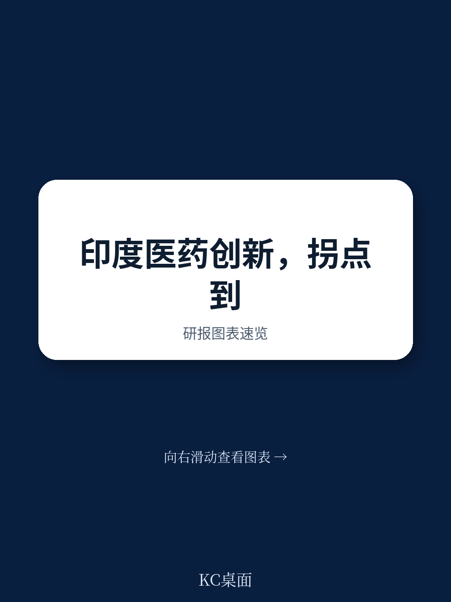
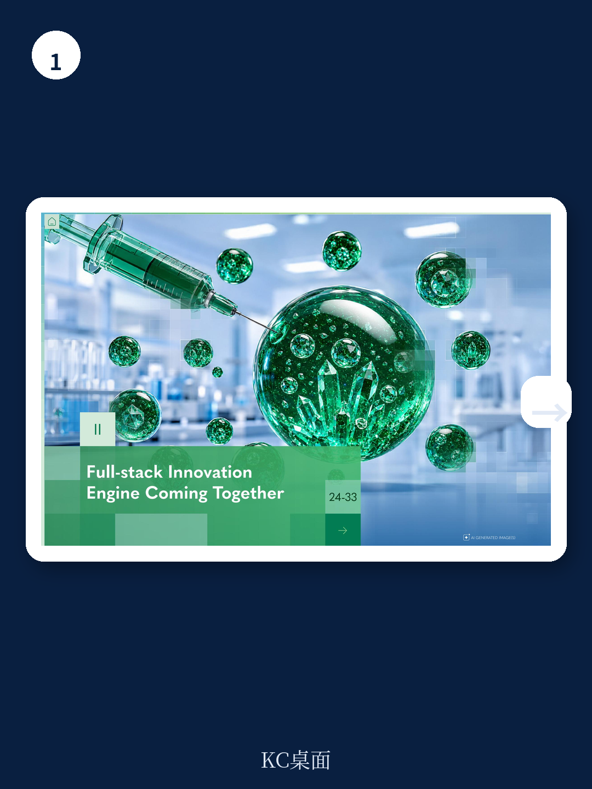
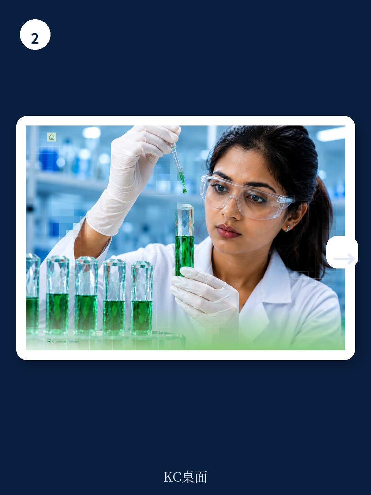

# 波士顿咨询：规模化转向科学

印度制药业正在经历一场从“仿制”到“原创”的深层转型。波士顿咨询与HealthKois联合发布的这份报告，用一组数据勾勒出变化的轮廓：过去十年，印度本土诞生的原创药物资产超过10个，涵盖首创新分子实体、本土CAR-T疗法和AI发现分子；专利提交量增长超过4倍，生物技术初创公司数量从约1500家增至约2400家，PE/VC研究在五年内增长约2.1倍，在2026财年达到7.31亿美元。

这些数字不是孤立的增量。报告认为，印度制药创新的质变信号已经出现——企业不再满足于做全球供应链上的低成本执行者，而是开始在全球范围内授权、竞争、定价。但报告同时指出，这一势头仍然“早期且不均衡”。真正的考验不在于印度能否创新，而在于它能否以规模化的方式持续创新。

## 1. 印度制药的“创新引擎”正在组装，但核心零件仍依赖进口

报告识别出四个正在汇聚的推动力：约50亿美元的政府资金投入、正在强化的产学研联系、逐步演进的监管框架，以及共享研发与制造基础设施的搭建。这些要素共同构成了一个“全栈创新引擎”的雏形。

但引擎的零件并不都在本地。报告引用了基因治疗初创公司创始人的原话：“我们90%的材料从美国、欧洲、中国进口……交货周期30到45天。”这意味着，即使印度在分子设计上取得突破，供应链的对外依赖仍可能成为规模化生产的瓶颈。此外，印度在健康数据基础设施上的积累也明显不足——印度基因组计划约1万个基因组的数据规模，与英国生物银行约50万个基因组相比，差距显著。

> **KC评论：** 供应链和数据的短板，往往被创新叙事掩盖。但报告提醒，没有本土化的材料供应和足够大的结构化数据集，印度在精准医学和先进疗法上的成本优势可能无法兑现。这一点对任何试图复制“印度模式”的新兴市场都有参考意义。

## 2. 印度的竞争优势集中在三个“战场”，而非全面开花

报告没有泛泛谈论印度制药的全球竞争力，而是明确划出了三个结构性优势领域：成本颠覆性创新——重新设计先进疗法以实现可负担的大规模应用；印度特有的生物学与数据——基于本地人群特征的不可复制的精准医学方案；以及科学驱动的平台创新——利用人才和成本效率构建技术平台。

这三个方向有一个共同逻辑：印度不试图在基础前沿科学上与欧美正面竞争，而是将成本、数据和人才三者组合，形成差异化的竞争位置。报告以ImmunoACT的CAR-T疗法NexCAR19为例，该疗法价格约为进口产品的十分之一，同时实现了本土临床验证和全球授权合作。这不是简单的“便宜”，而是基于重新设计生产工艺和临床路径的系统性成本创新。

## 3. 真正的瓶颈不是技术，而是资本结构和生态系统成熟度

报告最尖锐的判断出现在对资本生态的分析中。在印度，仅有约10%至15%的不确定性研究机构具备深厚的制药或生物技术专业背景，而在美国，这一比例约为60%。一位生物技术创始人直言：“每100个美国VC中，大约60个有生物技术研究经验；在印度，只有10到15个。”

这种资本结构的差异直接影响了创新的节奏和方向。缺乏“耐心资本”意味着早期、高不确定性、长周期的原创项目难以获得持续支持。报告还指出，印度虽然承担了全球约15%的疾病负担，但仅进行约4%的全球临床试验。临床执行能力的不足，加上监管审批节奏的不确定性，使得从实验室到病床的转化链条仍然脆弱。

报告没有给出“印度能否成功”的简单答案。它提供了一个更务实的观察框架：未来五年，印度制药创新的走向取决于五个关键行动——培育第一代专业生物技术资本、推动学术机构从论文驱动转向产品驱动、建立针对新型疗法的快速监管通道、建设本土供应链并打通市场准入、以及弥合研发人才的质量缺口。这些条件正在形成，但结果远未确定。
