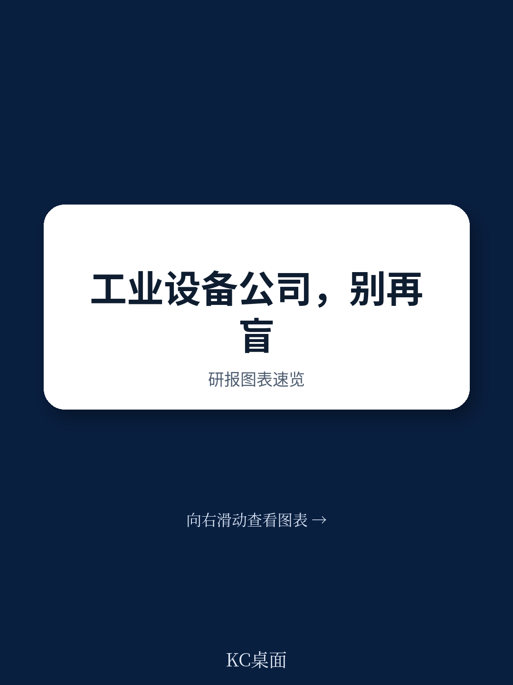
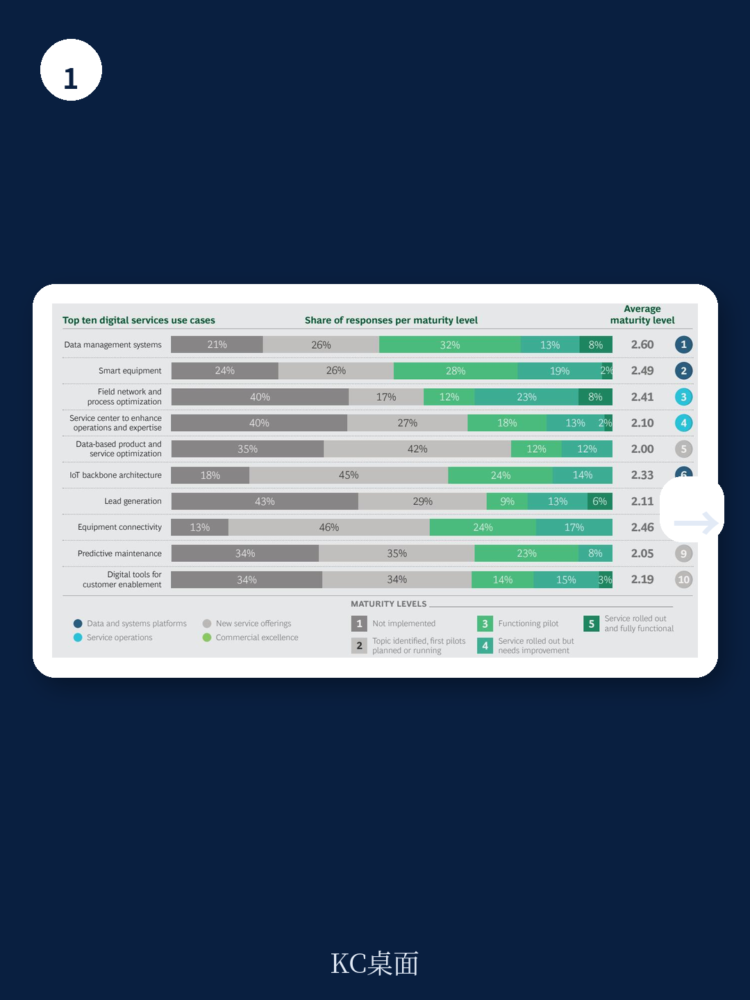
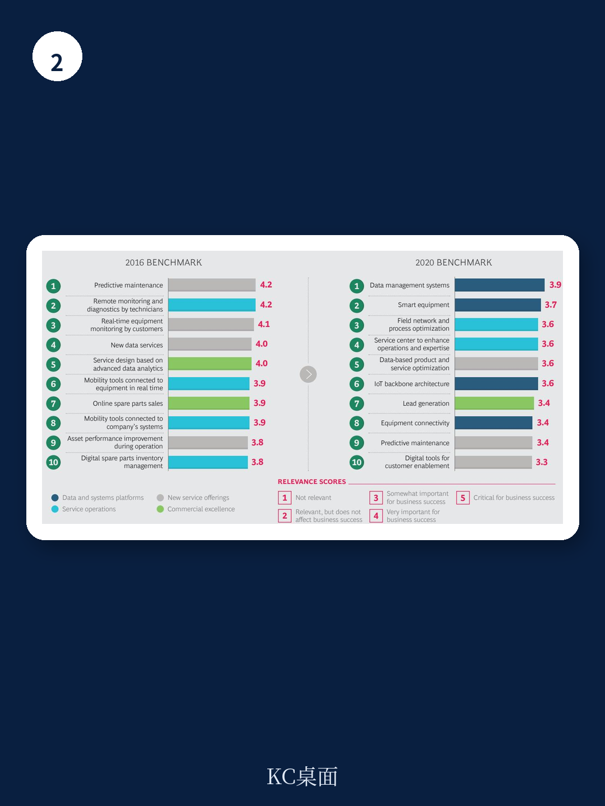

# 波士顿咨询：工业产品制造商数字化新路径-设备连接率仅13%

工业产品制造商最初对数字化的期待很直接：用新服务创造收入、让现场作业更高效、让销售更精准。但波士顿咨询（BCG）在2020年完成的一项基准调研揭示了一个反直觉的事实——这些公司真正卡住的地方，不是缺少炫酷的应用场景，而是连最基础的数据平台和系统都还没有搭好。

这份报告追踪了数十家全球工业设备制造商（平均年收入约30亿美元）的数字化进程。2016年，企业最关注的是预测性维护、远程监控这类“前台”应用。但到了2020年，排名前十的数字化优先级中，有四项变成了“使能技术”——数据管理系统、智能设备、物联网骨干架构和设备连接性。这个转变本身就是一个信号：行业对数字化的理解，正在从“做什么”转向“凭什么能做”。

## 1. 连接率只有13%，这才是数字化的真实起点

报告中最具冲击力的数字，是工业设备制造商与其已安装设备基础的连接率。78%的公司声称已与部分设备建立了某种连接，但平均穿透率仅为13%。新设备的情况稍好，连接穿透率达到31%，但仍有35%的公司连新设备都未能实现远程连接。

这个数字意味着什么？没有连接，就没有数据流。没有数据流，预测性维护的算法就缺少训练样本，远程诊断就无从谈起。报告明确指出，许多公司试图直接推出数字化服务，却忽略了“设备在线”这个前提条件。这不是技术问题，而是商业模式和客户信任的双重障碍——客户不愿意分享运营数据，除非企业能清晰量化“分享数据能带来什么好处”。

> **KC评论：** 13%的连接率说明，工业数字化的瓶颈不在软件层，而在物理层。企业必须先解决“设备是否在线”这个基础问题，否则所有上层应用都是空中楼阁。这份报告提醒决策者，不要被“AI预测”“数字孪生”等概念吸引，先检查自己的设备连接率是否超过了两位数。

## 2. 使能技术是“乘数器”，不是“印钞机”

报告将数据管理系统、智能设备、IoT骨干架构和设备连接性定义为“使能技术”。这些技术本身不直接创造价值，但它们为其他应用提供了可扩展的基础。BCG的调研显示，企业已经意识到这一点——数据管理系统和智能设备分别被列为2020年最相关的数字化要素前两位。

但进展依然缓慢。只有约一半的基准公司为这两项使能技术建立了功能原型或初步服务。更关键的是，没有一家公司实现了完全成熟的IoT骨干架构或设备连接性。这意味着整个行业仍处于数字化的“打地基”阶段，远未进入价值兑现期。

报告还发现一个典型问题：企业同时推进太多试点项目，资源分散，导致没有一个能真正跑通。这背后是“不确定性焦虑”——公司不确定哪个用例最有价值，于是选择广撒网，结果反而拖慢了进度。

## 3. 一个美国制造商的“连接策略”值得复制

报告提供了一个具体案例：一家美国重型机械制造商，用“两步走”策略解决了客户连接意愿问题。第一步，所有新设备出厂即预装传感器和远程信息处理系统，且不额外收费。第二步，对存量设备，提供免费的自装改造套件，或收取少量费用由公司代为安装。

但提供连接能力只是开始。这家公司随后与客户深入沟通，了解其业务痛点，并据此设计了一套应用套件。当客户发现连接设备能直接提升设备利用率和降低运营成本时，连接意愿大幅提升。三年内，该公司连接到数据平台的设备数量翻倍，达到100万台，约占其现场总资产的一半。

这个案例的核心启示是：连接不是目的，而是手段。企业必须围绕客户的实际价值来设计连接方案，而不是单纯追求连接率。报告强调，只有当客户清楚“分享数据能解决我的什么问题”时，他们才会愿意配合。

## 4. 从“MVP”思维到资源聚焦，是唯一可行的路径

报告为工业产品制造商提供了四条行动建议，其中最有操作性的两条是：采用最小可行产品（MVP）思维，以及集中资源。

MVP意味着不追求一次性建成完美平台，而是从最优先的用例出发，快速搭建基础使能技术，然后根据客户反馈迭代。报告特别警告“避免通用平台建设”——不要为了建平台而建平台，平台必须服务于具体的价值驱动因素。

资源聚焦则是对“广撒网”问题的直接回应。报告认为，企业必须限制同时推进的用例数量，并为每个试点项目配备足够的财务和人力资源。没有资源保障的试点，大概率会沦为“半成品”。

波士顿咨询的这份报告，本质上是在说：工业数字化的竞争，不是比谁的应用更酷，而是比谁的地基更扎实。当大多数公司还在为13%的连接率挣扎时，那些率先把使能技术从试点推向规模化运营的公司，将获得不可逆的先发优势。

For informational purposes only. Portions may be generated,translated,summarized,or edited with AI assistance based on source materials and may contain omissions or errors. Please verify independently. This is not investment,legal,tax,accounting,or other professional advice.

