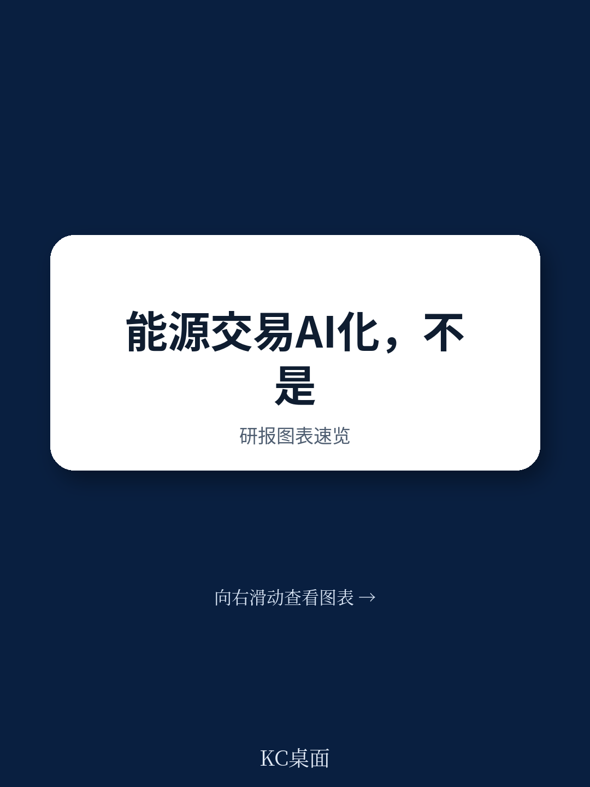
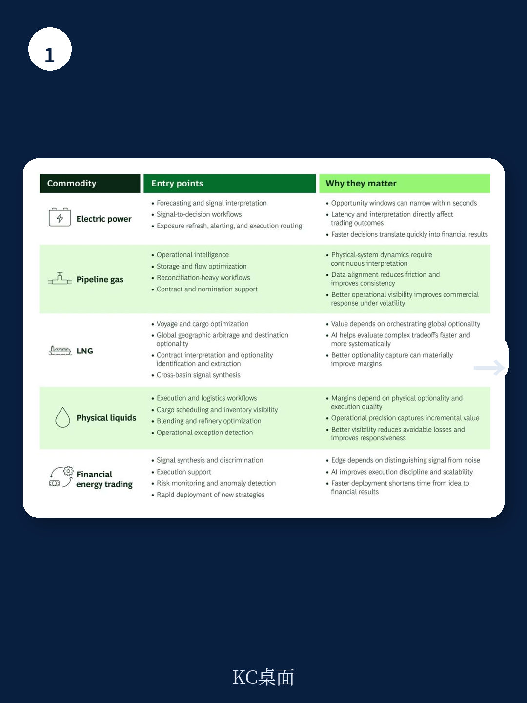
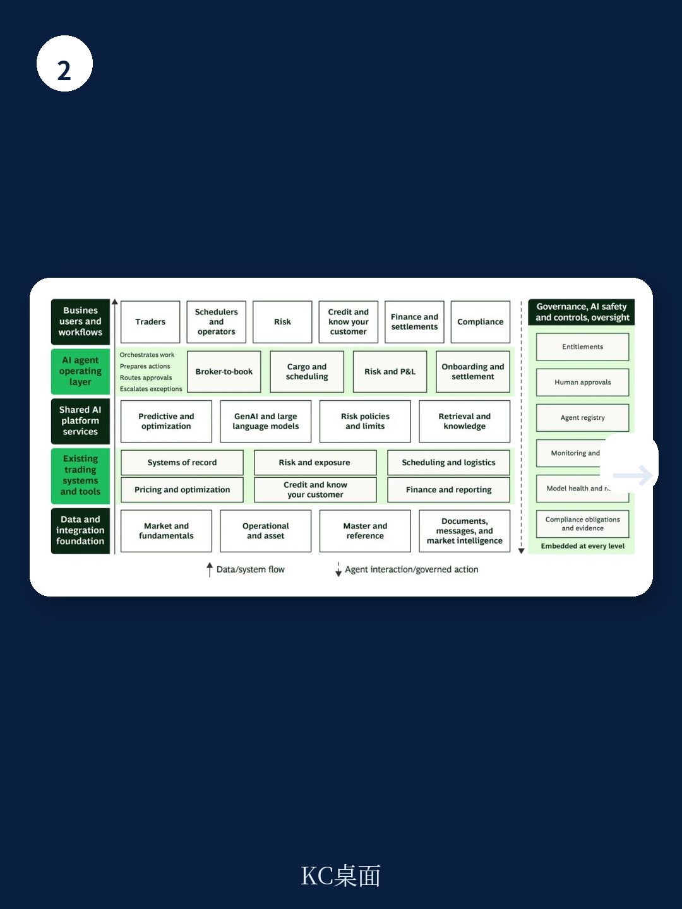

# 波士顿咨询：AI在能源交易中的应用

能源交易不会被单一AI解决方案所改变。这是波士顿咨询最新报告的核心判断。电力、管道天然气、液化天然气、实物液体和资金能源交易，各自运行在不同的节奏中，拥有不同的约束条件、数据结构、工作流程和优势来源。当AI从试点进入实际交易工作流时，这些差异变得比以往任何时候都更加重要。

报告估算，充分利用AI的油气公司，五年内可带来相当于EBIT 30%至70%的增量利润。但这一价值并非均匀分布。在电力和资金能源交易这类更偏量化的市场中，主要价值来自预测性AI、优化、自动化和不确定性分析。而在管道天然气、液化天然气和实物液体这类更偏物理和物流的市场中，更大的机会在于使用智能体AI，将运营、合同和审批密集型工作转化为结构化、可控的执行。

## 1. 智能体AI正在改变交易运营模式，而非替代交易员

报告提出的架构思路值得关注：不是用新系统替代现有交易平台，而是在现有系统之上构建一个智能体层。智能体可以读取经纪商的交易消息、提取关键条款、检查产品和对手方是否获批、准备交易录入、运行基本不确定性和信用检查、路由审批、起草确认函。在货运操作中，智能体可以在利润流失前发现缺失文件、码头调度冲突或滞期费上升。

这意味着交易员和操作人员花在多个系统间切换的时间将大幅减少，更多时间用于监督决策。企业需要明确规则：智能体可以自主完成什么，哪些只能准备动作，哪些必须由人类审批，以及每一步如何记录以保持问责。

> **KC评论：** 报告强调的不是AI有多聪明，而是它能否嵌入到“从信息到决策再到执行”的闭环中。一个更好的预测只有被交易台采纳才有价值，一份文档摘要只有加速了审批或减少了错误才有意义。智能体AI的价值在于执行，而非建议。

## 2. 电力与管道天然气在AI采用上领先，但领先优势是累积性的

波士顿咨询的调研显示，电力和管道天然气交易员在AI采用上领先于实物液体交易员。这反映了这些市场更偏量化的本质。但报告指出，采用模式并非简单的数字化成熟度或预算分配问题，还取决于使AI可规模化使用的数据和架构研究。

这些研究之所以重要，是因为AI在交易中的进步是累积性的。早期在数据模型、系统集成和工作流导向架构上投入的企业，可以更快部署用例、更安全地扩展，并在更多决策通过系统运行后持续改进。后来者很难快速追赶。除了技术研究，企业还必须统一数据定义、整合交易和运营平台、实施控制框架，使AI输出在实时商业决策中值得信赖。

## 3. 不同商品市场，AI创造优势的方式截然不同

报告详细拆解了五种商品市场，每种都有不同的AI应用逻辑

在电力市场，优势来自将预测、约束和不确定性信号转化为跨成百上千个交易、调度和组合观察决策的纪律性行动。这里主要应用预测性AI、数值优化和自动化，而非生成式AI和智能体。差异化在于将模型嵌入到实时工作流中。

在管道天然气市场，优势取决于读取变化中的物理系统的能力。核心用例是运营智能：预测模型和优化工具可以在价格充分反映之前，将物理系统变化转化为更好的存储、基差、运输和套期保值决策。

在液化天然气市场，利润取决于每批货物能去哪里、以什么条件、什么成本、以及如何对冲。预测模型和优化工具帮助交易员更快、更系统地评估货物选项。生成式AI和智能体尤其重要，因为液化天然气高度依赖合同和审批。

在实物液体市场，价值创造高度依赖识别选项并有效执行。货物时机、调和、库存、产品规格和合同条款往往与价格方向同等重要。优势来自将商业决策与运营、不确定性、信用和物流连接起来。

在资金能源交易市场，价值创造取决于快速、一致地将信息转化为不确定性调整后的头寸。最相关的AI应用是预测性AI、数值分析和优化。主要不确定性是虚假精度：资金数据量巨大，弱AI模型可能过拟合到不持续的模式。

## 4. 标准化基础，定制化优势：三个判断标准

报告最后给出了一个实用的选择框架：最有效的AI切入点在不同商品市场中各不相同，但共享三个特征——明确定义的价值池、足够频繁重复以持续改进的工作流、以及可以变得足够可靠以支持决策的数据。

一些AI能力正在成为入场门槛：编码助手、通用预测、文档摘要和基础自动化会提高生产力，但不会创造持续优势。持久的优势将来自更难构建和复制的能力：专有数据、商品特定模型、重新设计的工作流，以及允许AI安全地将洞察转化为行动的控制机制。

随着波动性和运营复杂性上升，AI正在成为能源交易组织竞争的核心。但优势不会来自在每个市场应用通用模型，也不会来自替换交易员今天使用的系统。它来自将正确的AI能力嵌入到将决策转化为行动的工作流中。

For informational purposes only. Portions may be generated,translated,summarized,or edited with AI assistance based on source materials and may contain omissions or errors. Please verify independently. This is not investment,legal,tax,accounting,or other professional advice.

