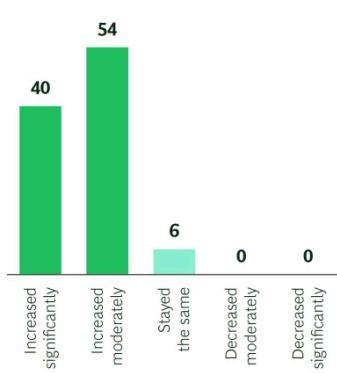
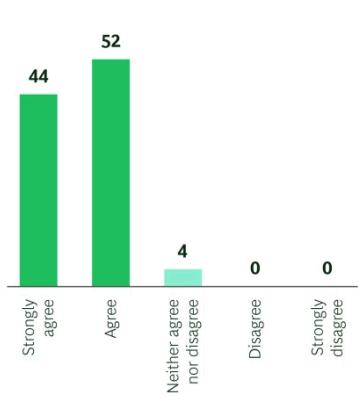
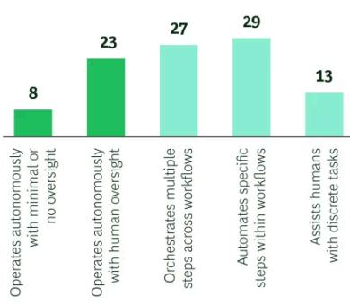
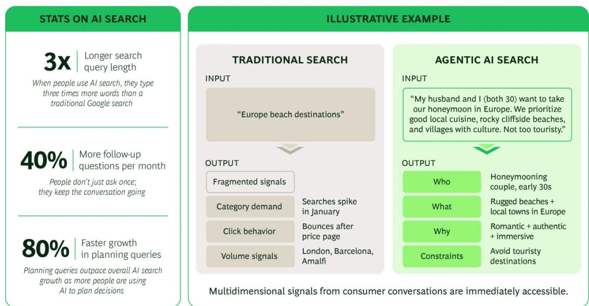
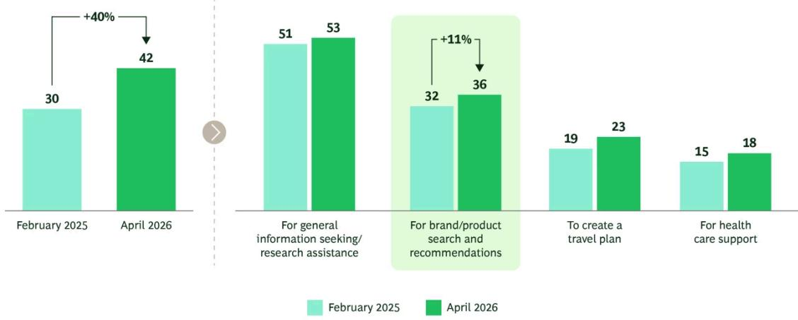

MARKETING AND SALES

# Agentic AI Will Make the CMO's Role More Consequential

By Ravi Dhar, Jon Iwata, Jennie Liu, Lauren Taylor, and Janet Balis

ARTICLE JULY 16, 2026 15 MIN READ

Customers are increasingly turning to AI to discover products, evaluate options, make purchasing decisions, and complete transactions. These applications of AI mark the beginning of agentic commerce, where traditional commerce shifts to a model in which AI agents become additional and active participants in customers' journey from intent to purchase.

As AI increasingly intermediates between brands and customers, companies must increasingly account for two decision makers: humans and the AI models and interfaces that influence their choices. Through their AI interactions, customers not only reveal intent as they would in a search query but also their underlying motivations, goals, and preferences. For marketers, this dynamic creates a new class of customer intelligence that extends beyond traditional data sources and can help companies sharpen their value proposition. It also creates a new imperative to market to both AI and humans.

Unquestionably, AI raises the bar for end-to-end brand stewardship. AI systems can instantly aggregate and evaluate reviews, complaints, service interactions, and other signals from across the web, making gaps between a brand's promise and customers' experiences far more visible. As AI increasingly mediates decisions, brands must ensure that what they say, what they do, and what customers experience remain consistently aligned at scale.

CMOs who ensure that the brand promise is aligned and accountable with brand performance will be well positioned to drive significant growth. However, few are prepared to seize this opportunity today. CEOs already question marketing's contribution to growth: only 14% of CEOs and CFOs consider their CMO highly effective at driving market growth, according to Gartner. Even so, with CMOs now investing heavily in AI, they have an opportunity to demonstrate marketing's strategic value. In BCG's annual survey of nearly 300 global CMOs, 96% say AI is driving end-to-end transformation of their function, though only about a third have moved beyond the basics. (See Exhibit 1.)

## EXHIBIT 1

Although $96\%$ of CMOs Believe AI Is Driving End-to-End Marketing Transformation, Only $31\%$ Have Made Agentic Execution a Reality

Pressure $(\%)$

94% of CMOs highlight increased expectations

  
Question: How have your CEO's/executive team's expectations changed over the past two years?  
Belief $(\%)$  
96% of CMOs agree GenAI is driving significant transformation

  
Question: To what extent do you agree with the following statement: "The adoption of generative AI in marketing is driving significant end-to-end transformation within our organization, including redesigning organization structures and re-engineering processes."  
Reality $(\%)$  
31% of CMOs have reached true agentic execution

  
Question: In the areas where generative AI is deployed today, how would you best describe its role?  
Source: BCG CMO Survey 2026, n = 283.

While much of today's AI investment is aimed at making marketing more efficient, the larger opportunity is to make AI-driven marketing a powerful growth engine. To capture that opportunity,

# Brand Stewardship: From Narrative to Promise—Performance Alignment

When CMOs think about AI-driven discovery, they often focus first on visibility. They publish fact-based content, structure product data, and expose APIs so agents can “see” the brand. But being visible to AI is different from being credibly recommended by AI. AI agents do more than find brands; they evaluate them. They assess brands’ trustworthiness, compare alternatives, and make recommendations to consumers based on observable performance, not just persuasive messaging.

Thus, AI's role goes far beyond just answering the question the user asks. According to research from Profound, nearly half of responses from major AI platforms contain unsolicited information, such as additional rationale, comparisons, and recommendations that were never requested by the user. The competition is not just for brands to be included in the answer, but to be the option the AI chooses to endorse.

For this reason, brand promise and brand performance must be fully aligned. The brand promise articulates emotional and functional benefits that distinguish a company from its competitors. Brand performance, by contrast, is how that promise is actually delivered through the product and the end-to-end customer experience across pricing, availability, fulfillment, service, and resolution. CMOs and marketers are typically responsible for defining and stewarding the brand promise, but they have historically not had full responsibility for brand performance. While narrative, storytelling, and positioning are important, they cannot bridge the gap between what customers expect and what the organization consistently delivers.

AI agents make these gaps far more visible. Agents can assess performance through data sources, such as service outcomes, product availability, pricing integrity, and customer reviews, then compare alternatives in real time. A financial services company may position itself on trust, for example, but if AI agents find a pattern of complaints about high claim rejection rates, slow

resolution times, or excessive documentation requirements, the brand's operational reality undermines its promise.

The same APIs and structured data feeds that make a brand findable will increasingly make its performance measurable—both within the company and against its competitors. This information may have a salutary effect on both brand promise and performance. The work of defining the brand promise becomes more rigorous, grounded in what the company can demonstrably deliver and where it is genuinely differentiated from competitors, rather than what it claims. Where gaps exist, CMOs will have stronger evidence to collaborate across product, operations, and service functions in order to successfully close these gaps. In this environment, brand stewardship becomes a discipline of ensuring that what the company says, what it does, and what customers experience remain consistently aligned at scale.

For CMOs, these are the implications:

\- Assess your brand the way AI agents will. Monitor how AI agents compare, rank, and recommend your offerings to identify where the brand promise breaks down and where competitors are gaining advantages.

\- Ensure your brand has a clearly differentiated and defensible brand promise. Clearly define what makes your brand superior and ensure the evidence supporting that claim is accessible to both customers and AI agents.

\- Integrate operational performance into marketing decisions. Systematically incorporate real-time signals, such as pricing integrity and customer satisfaction, into marketing decisions across paid media, owned media, and earned media teams.

\- Establish cross-enterprise governance to close promise-performance gaps. Establish shared metrics, joint accountability, regular reviews, and new incentives to ensure delivery fulfills the brand promise consistently over time.

# Market and Customer Intelligence: From Insight to Enterprise Value Creation

Theodore Levitt famously observed that customers don't want a quarter-inch drill; they want a quarter-inch hole. Despite that insight, the data most marketers use has remained stubbornly stuck at the drill level, tracking categories and clicks rather than the outcomes customers are trying to achieve.

Agents change that. When interacting with AI systems, people typically provide far richer context than they ever would in a search query. They express intent, needs, preferences, and tradeoffs. “Plan my ten-day anniversary celebration trip in Italy and remember I am pescatarian.” “Help me get a better deal on my utility payments since I am saving for retirement and my children are in college already.” These interactions reveal what customers are actually trying to accomplish by pinpointing their underlying needs rather than just product categories.

This creates two fundamental shifts. Because AI systems respond by combining products, services, and recommendations from multiple categories to address these expressed needs, they also reveal patterns of co-mingled demand that traditional research rarely uncovers. What appears as separate markets through the lens of products often emerges as a single customer outcome through the lens of intent. Competition now extends beyond traditional product silos as different technologies compete to meet the same underlying need.

What's more, consumers are using AI to help make decisions further upstream. Google's data on AI Mode shows that queries are now triple the length of traditional searches, and the fastest-growing query type contains decision-oriented language, such as “which one” and “which of.” (See Exhibit 2.) Consumers aren't just researching with AI; they're using AI to augment decision-making. The battle for influence is now won or lost across a fragmented decision journey that increasingly runs through channels the brand does not own or control.

## EXHIBIT 2

Agentic AI Prompts Unlock Richer Customer Intelligence than Traditional Keyword Search  
  
Source: Google AI Mode U.S. Insights (2026); BCG analysis.

What's new isn't simply more data. It's a fundamentally different type of customer intelligence that reveals both cross-category competitive dynamics and the contextual factors driving customer choices. When marketers can see the greater context around customer intent and decision making, they can identify where existing offerings fail to meet customer needs and where new value can be created. These insights inform not only positioning and go-to-market strategy but also product development, bundling, partnerships, and new business models. This new intelligence can directly influence what the company builds, not just how it markets what it already sells.

Yet many companies have a customer-shaped hole at the center of their strategy, not because of a lack of data but because they lack the organizational wiring to translate consumer intelligence into decisions. BCG research shows a familiar set of barriers: siloed data and teams, disconnected incentives, technology gaps, and intelligence that reaches decision makers too late to matter.

With agentic AI data, marketing can become the system through which customer intent directly informs enterprise decision-making. For perhaps the first time, the customer can have a true seat at the table through continuously updated signals that shape what the organization builds, delivers, and prioritizes.

For CMOs, these are the implications:

\- Build a new market intelligence capability around customer jobs-to-be-done. Broaden the focus of marketing to track customer queries and needs that can inform R&D and operations adjustments.

\- Translate customer intent into enterprise strategy. Use these insights to design offering bundles, forge cross-category partnerships, and participate in ecosystems that address broader customer outcomes.

\- Move marketing upstream. Leverage new intelligence to identify unmet needs, operational gaps, and adjacent opportunities that can shape new products, services, and business models aligned with the outcomes customers are seeking—both within the enterprise and through external partnerships.

\- Reinvent your intelligence-to-action process. Many organizations capture enterprise data but fail to act on it. Use AI tools to democratize access to customer intelligence, synthesize customer insights, and connect decision makers across the enterprise to a shared view of customer needs.

# Customer Experience: Rethinking the Architecture of the Attention Economy

For the past two decades, marketing has been built around the logic of the “attention economy.” In this setting, companies compete to appear at the top of search results, reach consumers through advertising as they consume or stream, and refine customer journeys and behavioral nudges to capture attention and drive action. These practices share a common assumption: a human is on the other end, with a short attention span, limited patience for complexity, and susceptibility to well-crafted framing.

That assumption no longer holds uniformly. The customer influence pathway is still nonlinear, but it is increasingly agent-mediated or agent-enhanced, and the dynamic between people and AI varies by customer, market, and moment of demand.

BCG research underscores the scale of this shift: 43% of consumer journeys are now research-led, meaning consumers enter without a predetermined brand choice and actively compare products across an expanding ecosystem of touchpoints, from social media to AI-generated responses. The average consumer now encounters more than 15 touchpoints before purchasing, up from roughly 5 a decade ago. And among consumers who use AI tools in their research, 85% rank them among their top five most influential touchpoints in the purchase decision, on par with social media and significantly ahead of traditional media. BCG’s Global Consumer Radar shows overall GenAI usage up 40% in just over a year, with shopping-related use—including research into and recommendations for brands, products, and services—among the fastest-growing applications. (See Exhibit 3.)

## Consumers Are Using GenAI to Make Brand Choices—and the Trend Is Accelerating

% of consumers who have used GenAI tools for specific purposes

  
Sources: BCG Global Consumer Radar Wave 6 (April 2026) n=12,117; markets covered are US, UK, India, China, Japan, France, Mexico, Brazil, and Germany. BCG Global Consumer Radar Wave 3 (February 2025) n=7,286; markets covered are US, UK, India, China, Japan, France, Brazil, and Germany. Questions used: T3. Which of the following statements apply to you regarding GenAI tools? T4. How have you personally used GenAI tools (e.g., ChatGPT, Microsoft Copilot, Google Gemini)?

As AI takes on a larger role in evaluating and recommending options, marketers face a new question: Who exactly are we designing for? When customers are making decisions on their own, traditional marketing strengths apply: clear value propositions, behavioral insights, and the trust that comes from a consistent brand experience. However, when decisions are heavily influenced by AI, evidence that the brand consistently delivers on its promise becomes increasingly important, with AI agents evaluating and comparing that evidence at a scale no human can match. In many cases, a customer and agent are working together, with the customer forming a view while the agent informs and tests it in real time. Each configuration demands different thinking.

In a world where AI increasingly mediates and expedites human decisions, many CMOs are also asking whether they should develop and deploy their own customer-facing agents. The temptation is real. A proprietary agent generates intelligence that belongs to the brand, not a third-party platform, and gives the brand control of the experience at the moment of interaction. But what makes an agent attractive to a brand does not necessarily make it attractive to a customer.

Customers making decisions across multiple categories will have more trust in agents that can compare options broadly rather than those tied to a single provider. Customers seeking neutral guidance may be skeptical of an agent with a stake in the outcome. Branded agents are most likely to earn genuine customer preference in categories where trust and privacy matter deeply, or long-term relationships create meaningful advantages. A bank that knows a customer's financial history, for example, may be well positioned to provide advice that a general-purpose agent cannot. For most companies, the strategic question is whether they have already earned the kind of relationship that would make customers want to start there.

For CMOs, these are the implications:

\- Map how your customers interact with AI agents. Build the analytical capability to understand what customers delegate, what they decide themselves, and what they do in collaboration—by product category, decision type, and customer segment.

\- Redesign customer influence pathways for agent mediation. Adapt the sequence, timing, and content of the customer journey, designing for human attention where customers are the decision makers and for machine evaluation where agents shape decisions. The two influence pathways—humans and agents—must always be considered in parallel.

\- Measure outcomes with agents. Track visibility, evaluation, and credibility with AI agents through monitoring share of mentions for relevant needs, share of citations, recommendation rates, and other emerging indicators of agent-mediated influence.

\- Consider whether and how to deploy a branded agent. The formidable technical, financial, and competitive implications, including the risk of disintermediating existing channels and relationships, make this a decision that warrants careful deliberation at the highest levels of the enterprise. Key contributions of the CMO include determining whether the brand has earned the trust and relationship depth that would make customers genuinely prefer a branded agent over a neutral alternative. Further, if an agent is deployed, CMOs can help determine how to best design it to reflect its role as a trusted decision maker or key influencer in augmented decision-making.

# Building the Marketing Operating Model for the Agentic Era

None of the opportunities discussed above can be executed effectively within the existing operating models for marketing, and none is an end in itself. Paid, owned, and earned often sit in different parts of the marketing structure and beg to be reimagined to capitalize on these new dynamics. The purpose of any redesign is to unlock the power of new data and turn it into growth. The larger opportunity lies in redesigning how the business operates: how work is organized, how people and AI share responsibility, how opportunities flow across functions, and how performance is defined and measured.

The marketing organizations best positioned to win in the agentic era are those that have deliberately redesigned their operating models to turn AI-enabled marketing intelligence into profitable growth. That means moving from channel-based structures optimized for campaign execution to intelligence-led operating models where insight flows seamlessly across functional areas to enable smart handoffs in decisions focused on the singular outcome of growth. The aim is to direct scarce resources—people and budget—toward the areas where value is created more effectively and efficiently.

## Imperative and Opportunity

Most CMOs, like most business leaders, are currently focused on applying AI to improve productivity. That goal is necessary and challenging in its own right, but it is not where the greatest opportunity lies.

The interaction between customers and AI will generate a new class of data that is richer and more revealing than anything traditional marketing analytics has produced. For CMOs who move quickly, this data becomes a strategic advantage that can be used to build stronger brands, identify where new value can be created, and design experiences that better serve customers.

In doing so, they can establish marketing as essential to enterprise strategy. It becomes not only the function that shapes how the company goes to market but also a critical source of insight into what the company brings to market and how it should compete. The CMOs who seize this opportunity will play a critical role in defining the agentic era.

The authors thank Katie Ioas and Rob Derow at BCG for their research, perspectives, and other work that went into producing this article.

## Authors

## Ravi Dhar

George Rogers Clark Professor of Management and Marketing; Director of the Yale Center for Customer Insights and Co-Faculty Leader, Yale Program on Stakeholder Innovation and Management

## Jennie Liu

Lecturer in the Practice of Management at the Yale School of Management; Executive Director, Yale Center for Customer Insights

## Janet Balis

Managing Director & Partner
New York

## Jon Iwata

Lecturer in the Practice of Management, Yale School of Management; Practice Leader, Yale Program on Stakeholder Innovation & Management; former IBM Senior Vice President and Chief Brand Officer

## Lauren Taylor

Managing Director & Senior Partner; Global Leader, Center for Customer Insight
Dallas

## ABOUT BOSTON CONSULTING GROUP

Boston Consulting Group bridges the gap between ambition and outcomes for the world's leading companies and organizations. We are built for this era of unprecedented change — bringing strategic clarity rooted in over 60 years of deep domain knowledge, combined with applied AI shaped by our practitioners. BCG works shoulder-to-shoulder with CEOs across industries and geographies to deliver transformative impact at scale: stronger returns, transferred capabilities, and change that sticks. For more information, visit bcg.com.