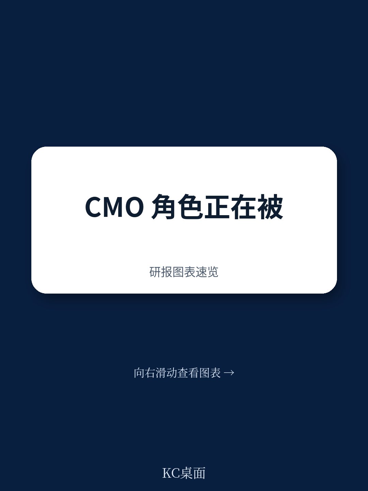
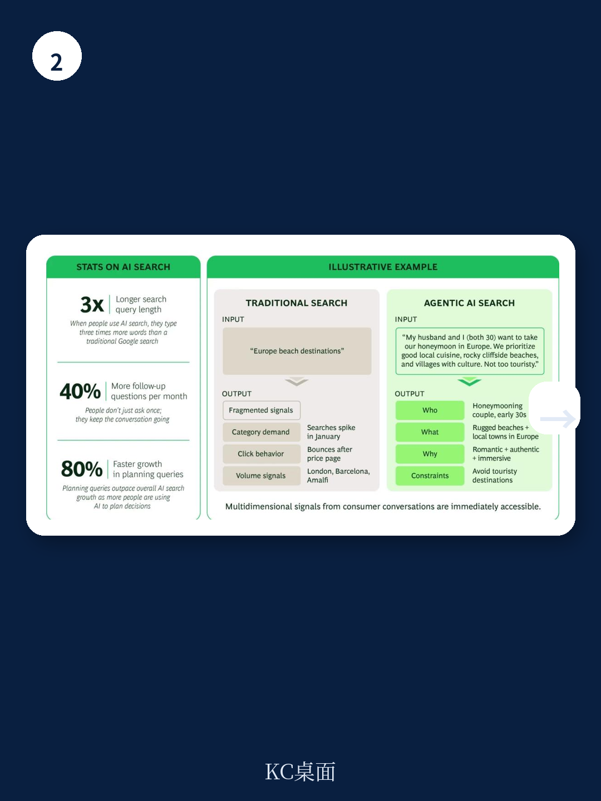

# 波士顿咨询：BCG与AI与CMO0001AgenticWillM

当AI开始替消费者做购买决策，品牌面对的就不再只是人类。波士顿咨询与耶鲁大学联合发布的最新研究指出，AI代理正在成为消费旅程中的主动参与者——从发现产品、评估选项到完成交易，AI的介入正在改变营销的基本逻辑。但报告同时揭示了一个令人不安的落差：96%的CMO相信AI正在推动营销职能的端到端转型，却只有31%真正进入了代理式执行的阶段。多数营销领导者仍在用旧地图寻找新大陆。

## 1. 品牌承诺与品牌表现之间的裂缝，正在被AI放大

AI代理不只是帮消费者找到品牌，它们会评估品牌。报告引用Profound的研究显示，主流AI平台近半数的回答包含用户未曾要求的额外信息——比较、提到、甚至主动提供的理由。这意味着品牌竞争的核心不再是“被找到”，而是“被AI选中”。

当AI可以实时抓取服务结果、产品可得性、定价一致性和客户评价，品牌承诺与运营现实之间的任何差距都会暴露。一家以“信任”定位的机构，如果AI发现其理赔拒赔率高、响应速度慢，品牌叙事就会在几秒内被事实推翻。波士顿咨询认为，CMO需要像AI那样审视自己的品牌：承诺是否可验证，表现是否可衡量。

> **KC评论：** 品牌部门过去可以靠广告和公关维持叙事，但AI代理不看广告，它看的是用户评价、退货率、客服响应时间这些硬指标。品牌团队需要和运营、产品、服务部门建立共享的KPI，否则AI会替消费者做出“不提到”的判断。

## 2. 消费者与AI的对话，正在产生一种全新的市场情报

传统营销数据追踪的是“点击”和“品类”，但AI交互揭示的是消费者的真实意图。报告引用Google AI Mode的数据指出，AI查询长度是传统搜索的三倍，增长最快的查询类型包含“哪个更好”“哪个更适合我”这类决策导向语言。消费者不只是用AI搜索，他们在用AI做决定。

这些对话透露的信息远超关键词：消费者会说明预算、偏好、限制条件，甚至人生阶段。当一位用户说“帮我规划十周年结婚纪念日的意大利行程，我是鱼素者”，AI需要跨品类组合产品和服务。这种“共现需求”揭示了传统市场研究无法捕捉的竞争格局——不同品类的产品可能在同一个消费者决策中被放在一起比较。

波士顿咨询认为，营销部门需要从追踪“产品”转向追踪“客户要完成的任务”。这种情报不仅能指导营销策略，还能直接影响产品开发、合作伙伴选择和商业模式设计。

## 3. 消费者决策路径正在被AI重构，平均触点数从5个增至15个

报告基于BCG全球消费者雷达调查发现，43%的消费旅程是“研究导向型”——消费者进入时没有预设品牌，在超过15个触点上主动比较。使用AI工具的消费者中，85%将AI列为购买决策中影响力最大的五个触点之一，与社交媒体并列，远超传统媒体。全球GenAI使用率在一年多内增长了40%，其中购物相关用途增速最快。

这意味着营销不能再只设计给人类看。当AI代理在中间评估和提到，品牌需要同时说服两个决策者：人类和AI。波士顿咨询建议CMO重新设计“客户影响路径”——在人类做决定的地方用注意力宏观环境逻辑，在AI做评估的地方用可验证的证据逻辑。

## 4. 自建品牌AI代理不是所有公司的正确选择

面对AI的崛起，许多CMO在考虑是否要开发自己的客户代理。报告给出了一个冷静的判断：对品牌有吸引力的代理，不一定对客户有吸引力。跨品类做决策的消费者更信任能广泛比较选项的代理，而不是绑定单一品牌的工具。

品牌代理只有在信任和隐私至关重要的领域——比如银行了解客户的财务历史——才可能赢得用户偏好。对大多数公司而言，战略问题不是“要不要建代理”，而是“我们是否已经赢得了那种让客户愿意从这里开始的关系”。这个判断需要CMO与CEO共同做出，因为它涉及渠道关系、技术投入和竞争定位的根本调整。

---

波士顿咨询这份报告的核心信号是：AI代理不是营销效率工具，它正在改变品牌与消费者之间的权力结构。CMO如果只把AI当作降本手段，就会错过它作为增长引擎的机会。但机会窗口不会永远敞开——当AI代理成为消费决策的默认入口，那些未能让品牌承诺与品牌表现对齐的公司，将不再只是失去一次点击，而是被系统性地排除在提到之外。

For informational purposes only. Portions may be generated,translated,summarized,or edited with AI assistance based on source materials and may contain omissions or errors. Please verify independently. This is not investment,legal,tax,accounting,or other professional advice.

