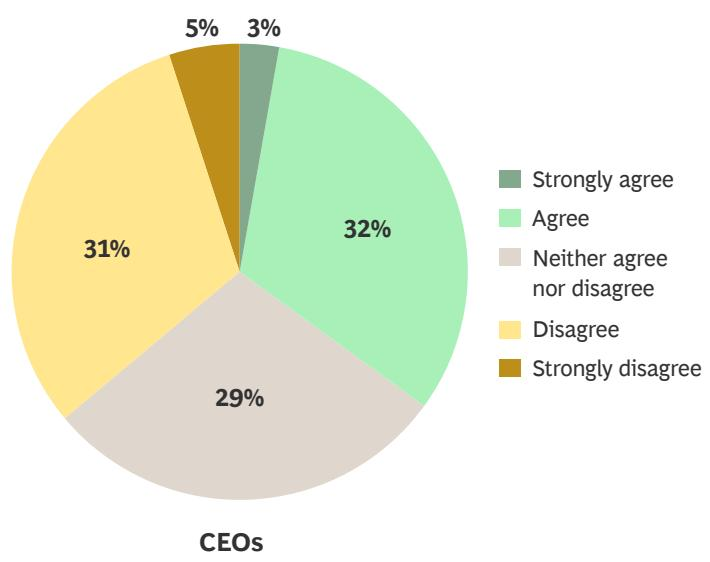
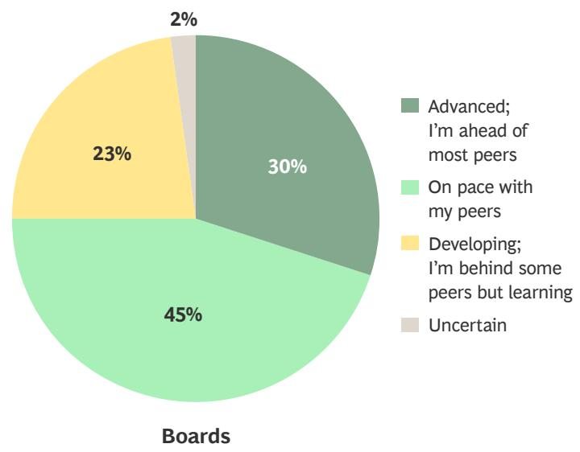
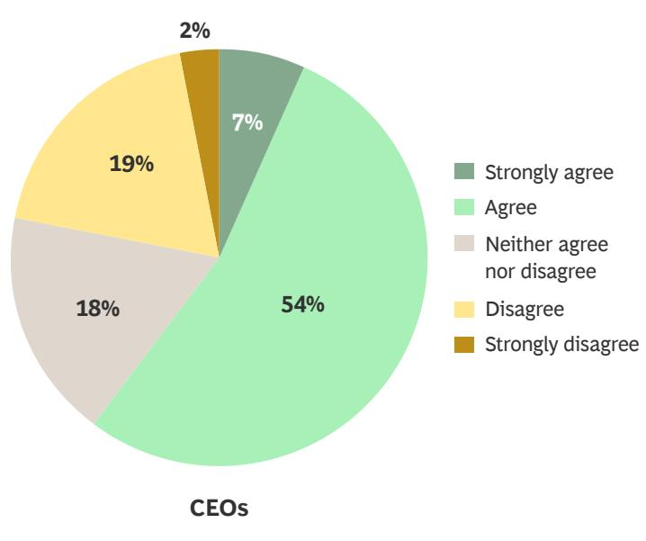
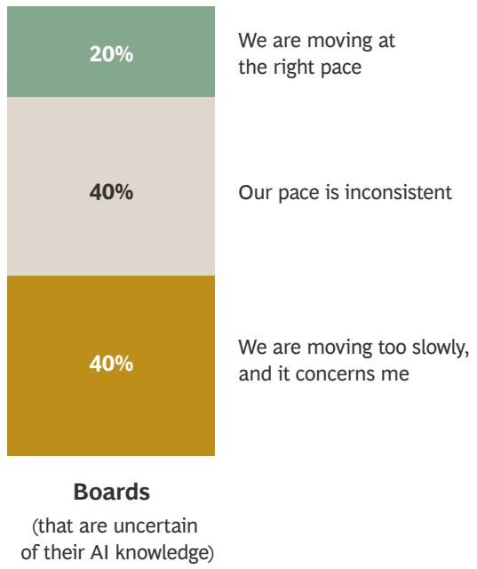
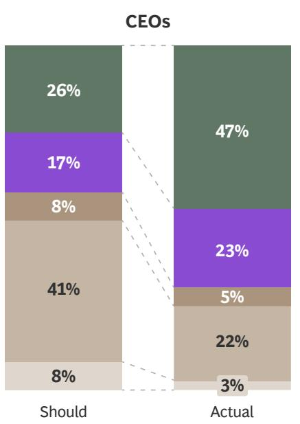
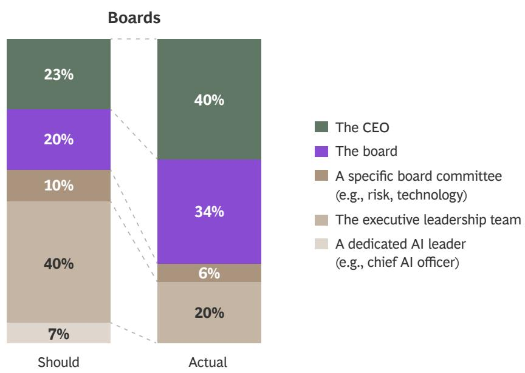
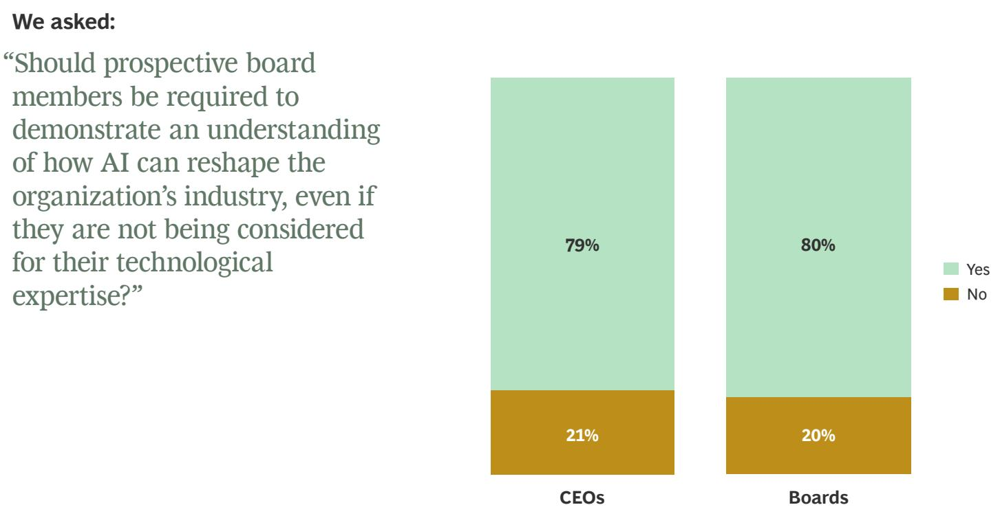
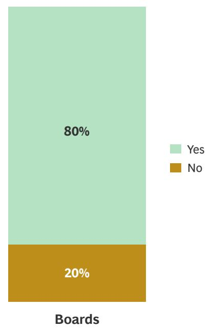

SPLIT DECISIONS: THE BCG CEOS AND BOARDS SURVEY

CEOs and Boards Are
Aligned on AI in Theory,
but Divided in Practice

May 2026

At first glance, CEOs and boards appear to agree on how AI should be governed, implemented, and valued. Look closer, however, and you'll see critical gaps that could hinder a successful AI transformation.

In this first edition of Split Decisions: The BCG CEOs and Boards Survey, responses from 625 leaders around the world reveal five areas where chief executives and their boards of directors diverge on AI:

\- CEOs worry that AI hype may be distorting boardroom judgment.

\- Boards are confident in their AI understanding, but CEOs are less convinced.

\- Boards favor faster AI implementation, while CEOs are more measured about the pace of change.

\- Both sides agree the executive team should lead on AI, yet CEOs appear to bear an outsize share of the responsibility.

\- CEOs see AI ROI as a bigger factor in their performance evaluation than boards do.

At a moment when clear, coordinated leadership is essential, these fault lines could create tension in the boardroom. Explore our findings in greater detail in the following pages.

## Methodology

The inaugural Split Decisions: The BCG CEOs and Boards Survey focused on AI and surveyed 351 CEOs and 274 board members of leading companies (with \$100 million or more in annual revenue). Of the respondents, 44% were US-based. Further, 76% of respondents represented private companies and 24% represented public companies.

## CEOs Say AI Hype Is Distorting Boardroom Judgment

## CEOS WISH BOARDS WOULD ...

“... stop watching the fake business news in the media on what AI can do and how quickly it can become reality.”

“... take an informed, realistic view opposed to a headline-driven understanding.”

“... become more educated on what is currently available versus the marketing hype.”

“... be more informed on the basics to have balanced opinions on the upside and potential downside of AI adoption.”

When asked what they wish their boards would do differently regarding AI, more than half of CEOs said boards need to better understand the gap between headline AI hype and reality. Simultaneously, boards felt that CEOs need to do a better job selling them on their AI strategy. In our survey, many write-in comments emphasized the need for more proactive communication regarding CEOs' vision for AI.

## BOARDS WISH CEOS WOULD ...

“... bring to the board more insights into the business cases for AI in our organization.”

“... be more bullish on the transformational potential.”

“... lay out a clearer vision for the executive board to relate to, one where the new technologies would feature more strongly as transformation enablers.”

“... use more imagination going forward. Do not only take into account what is possible today, but dream for the future and be ready to completely change the business model.”

## Boards Think They Know AI. CEOs Challenge That Self-Assessment.

While 75% of board members believe their AI knowledge is on par with or more advanced than that of their peers, CEOs have a different perspective. More than one-third of CEOs believe boards overestimate the human capabilities AI can replace, and nearly 40% say boards lack an informed view of how AI is reshaping growth strategy.

## We asked CEOs if they agree:

"My board overestimates what AI can replace rather than seeing where AI can realistically augment human expertise."

  
Source: Split Decisions: The BCG CEOs and Boards Survey, March 2026 (n = 625).

## We asked boards:

"How would you assess the level of AI understanding in your current board position?"

## CEOS WISH BOARDS WOULD ...

“... become literate fast and maintain an active interest in this space, which will allow board members to ask better questions of me and challenge me better, too.”

BOARDS WISH CEOS WOULD ...

“... look for opportunities to leverage AI to improve the efficiency of the organization.”

## Limited AI Understanding Leads to Board FOMO

Approximately $60\%$ of CEOs believe their boards are rushing AI transformation. What's more, our data suggests that lower levels of self-assessed AI understanding may be fueling board FOMO (fear of missing out). Board members with less confidence in their AI knowledge are more likely to believe their organizations are moving too slowly, indicating that uncertainty is translating into a heightened sense of urgency. At the same time, our research finds that frustration with the pace of adoption is highest in those who have a more permissive view on governance, underscoring a growing tension between the desire for speed and the need for oversight.

We asked CEOs if they agree: "My board is rushing AI transformation."

  
Source: Split Decisions: The BCG CEOs and Boards Survey, March 2026 (n = 625).

CEOS WISH BOARDS WOULD ...

“... be more cautious and deliberate.”

## We asked boards:

“What is your attitude about the pace of AI adoption in your organization?”

## BOARDS WISH CEOS WOULD ...

“... push the organization to be more aggressive in looking for opportunities.”

## AI Should Be Led by the Executive Leadership Team, Boards and CEOs Say. But CEOs Do the Heavy Lifting.

The majority of board members and chief executives agree that AI strategy should belong with the executive leadership team, but in practice CEOs still take the lead. According to 47% of CEOs, they are heading up AI implementation, with 39% of board members reporting the same. What's more, fewer than 10% of both boards and CEOs believe that AI strategy should be led by a chief AI officer, reinforcing the position that all C-suite roles—such as the chief marketing officer, chief people officer, and chief transformation officer—have a role to play in AI implementation.

## We asked:

“Who should be ultimately accountable vs. who actually sets your organization’s AI-related strategic business decisions?”

  
Source: Split Decisions: The BCG CEOs and Boards Survey, March 2026 (n = 625).

## CEOs Put More Weight on AI in Their Performance Reviews Than Boards Do

## We asked:

“What percentage of a CEO’s performance evaluation depends on consistently hitting AI ROI goals?”

Source: Split Decisions: The BCG CEOs and Boards Survey, March 2026 (n = 625).

Despite growing pressure to deliver on AI, boards think that only about a quarter of a CEO's performance review pivots on meeting AI ROI goals. CEOs, however, believe that more than a third of their performance is tied to AI outcomes. This suggests a gap between perceived expectations and formal accountability.

## CEOS WISH BOARDS WOULD ...

“... recognize the time and effort required for transformation.”

## BOARDS WISH CEOS WOULD ...

“... maintain focus on the business, customers, and partners. Don’t get pressured into the perception that you’re falling behind and make rash decisions or apply pressure that incentivizes your team to make rash decisions.”

## AI Literacy Is Now a Must-Have Skill for Board Membership

## We asked:

“Should prospective board members be required to demonstrate an understanding of how AI can reshape the organization’s industry, even if they are not being considered for their technological expertise?”

Source: Split Decisions: The BCG CEOs and Boards Survey, March 2026 (n = 625).

CEOS WISH BOARDS WOULD ...

“... give up one board seat or add one with experience in transformative AI.”

Given the apparent disconnect between CEOs and boards on crucial AI issues, it’s no surprise that AI literacy is rapidly becoming a baseline expectation for board membership, not a differentiator. We found that 79% of CEOs and 80% of board members believe that prospective members should be required to demonstrate a measurable understanding of how AI can reshape their industry.

BOARDS WISH CEOS WOULD ...

“... dedicate more board member resources while running the day-to-day business.”

## BCG

Boston Consulting Group partners with leaders in business and society to tackle their most important challenges and capture their greatest opportunities. BCG was the pioneer in business strategy when it was founded in 1963. Today, we work closely with clients to embrace a transformational approach aimed at benefiting all stakeholders—empowering organizations to grow, build sustainable competitive advantage, and drive positive societal impact.

Our diverse, global teams bring deep industry and functional expertise and a range of perspectives that question the status quo and spark change. BCG delivers solutions through leading-edge management consulting, technology and design, and corporate and digital ventures. We work in a uniquely collaborative model across the firm and throughout all levels of the client organization, fueled by the goal of helping our clients thrive and enabling them to make the world a better place.

For information or permission to reprint, please contact BCG at permissions@bcg.com. To find the latest BCG content and register to receive e-alerts on this topic or others, please visit bcg.com. Follow Boston Consulting Group on LinkedIn, Facebook, and X.