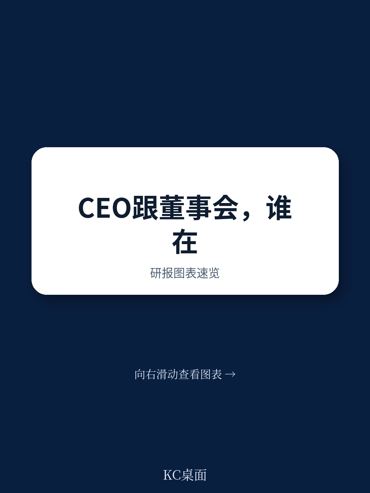
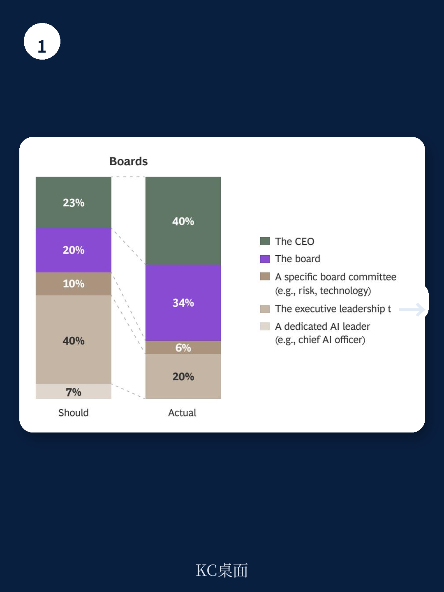
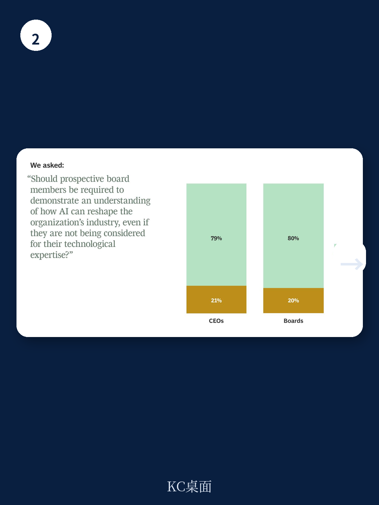

# 波士顿咨询：BCG，CEO与董事会在AI上理论一致实践分裂

波士顿咨询（BCG）最新发布的《Split Decisions》报告，基于对全球625位CEO和董事会成员的调研，揭示了一个看似矛盾却极具警示意义的结论：CEO与董事会在AI战略方向上高度一致，但在执行节奏、能力评估和问责机制上存在系统性分歧。这些分歧不是沟通问题，而是治理结构在新技术冲击下的深层裂缝。

报告的核心发现是：75%的董事会成员认为自己的AI知识“与同行相当或更先进”，但超过三分之一的CEO认为董事会高估了AI替代人类的能力，近40%的CEO表示董事会缺乏对AI如何重塑增长战略的知情判断。这种认知错位，正在成为企业AI转型中最隐蔽的阻力。

## 1. 董事会“FOMO”正在扭曲AI落地节奏

大约60%的CEO认为董事会正在“催促AI转型”。BCG的数据进一步揭示了一个反直觉的机制：对AI理解越不自信的董事会成员，反而越倾向于认为公司行动太慢。这种由不确定性驱动的“FOMO”，正在将治理层的焦虑转化为对执行层的非理性不确定性。

报告中的原始引语很有说服力：CEO希望董事会“停止观看媒体上关于AI能做什么的虚假商业新闻”，而董事会则希望CEO“对变革潜力更加乐观”。两边的诉求看似都有道理，但放在一起就构成了一个典型的“速度-质量”困境——董事会因缺乏深度理解而要求加速，CEO因直面落地复杂性而要求谨慎。

> **KC评论：** 这张图的关键不是“谁对谁错”，而是“谁在承担后果”。CEO是AI落地的直接责任人，而董事会是问责方。当问责方对技术本身的理解低于被问责方时，考核标准就容易偏离实际。

## 2. CEO承担了不成比例的AI落地责任，但考核标准却由董事会定义

报告显示，47%的CEO表示自己正在“亲自领导AI实施”，而董事会成员中只有39%持同样看法。双方都同意AI战略应由执行团队主导，但在实践中，CEO几乎独自承担了从战略制定到落地执行的全部责任。

更值得关注的是绩效评估的认知差距：CEO认为超过三分之一的绩效评估取决于AI ROI目标的达成，而董事会认为这个比例只有四分之一。这意味着CEO在承受更大的个人不确定性——他们被要求对AI结果负责，但考核标准却由对AI理解有限的董事会设定。这种结构性错位，可能导致CEO在AI投入上要么过度冒险（为满足董事会预期），要么过于保守（为保护个人绩效）。

## 3. AI素养正在从“加分项”变为董事会准入条件

面对上述分歧，报告给出了一个明确的信号：AI素养正在成为董事会成员的基础门槛。79%的CEO和80%的董事会成员认为，未来的董事会候选人必须“展示对AI如何重塑行业的可衡量理解”，即使他们并非因技术专长而被提名。

这一共识本身就是一个重要判断：当双方在具体问题上存在分歧时，他们至少在“需要更好的AI理解”这一点上达成了共识。但报告没有完全展开的是，这种“可衡量的理解”具体指什么——是能够读懂AI技术路线图，还是能够判断AI研究的宏观环境回报？不同定义将导向完全不同的董事会构成和治理风格。

## 4. 一个可复用的观察框架：从“谁在推动”到“谁在考核”

BCG这份报告的价值不仅在于揭示分歧，更在于提供了一个诊断企业AI治理健康度的框架。读者可以问自己三个问题

第一，董事会中是否有成员能够独立评估CEO的AI战略，而不是依赖外部顾问或媒体叙事？第二，CEO的AI相关绩效指标是否与董事会对其能力的评估一致？第三，当董事会要求“加速”时，他们是否清楚加速的具体含义——是增加投入、缩短周期，还是扩大应用范围？

这三个问题指向同一个核心：AI转型的成败，最终取决于治理层和执行层之间是否存在“可验证的共同语言”。没有这种语言，分歧就会从认知层面蔓延到决策层面，最终变成执行层面的内耗。

For informational purposes only. Portions may be generated,translated,summarized,or edited with AI assistance based on source materials and may contain omissions or errors. Please verify independently. This is not investment,legal,tax,accounting,or other professional advice.

