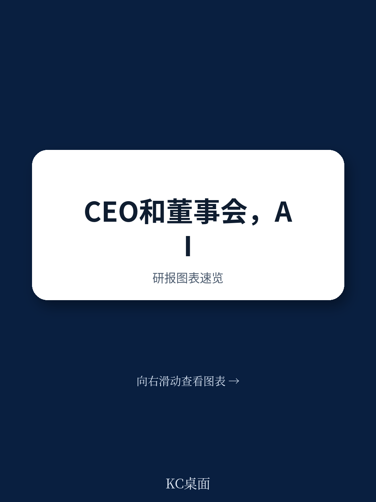

# 波士顿咨询：BCG与AI0003HowBoards和CEOs

董事会和CEO在AI这件事上，方向一致，但节奏往往错位。波士顿咨询（BCG）在2026年7月发布的这份报告中，点出了一个普遍但未被充分讨论的矛盾：董事会担心CEO推进AI不够果断，而CEO却觉得自己的AI雄心被董事会拖慢。双方都同意“动晚了是不确定性”，但分歧恰恰出在“多快、多大、多可量化”这三个执行层面。

报告的核心判断是，AI竞争格局正在快速分化，赢家已经开始拉开差距。董事会和CEO能否在AI愿景上真正对齐，已经不是治理议题，而是竞争议题。BCG为此提出了三个具体动作，指向同一个目标：让董事会从“监督者”变成CEO在AI转型中的“真正伙伴”。

## 1. 董事会需要亲自“动手”，而不是只听汇报

BCG观察到，许多董事会已经聘请了AI教练，部分董事甚至加入了高管的“个人生产力工作坊”，亲自试用最新AI工具。报告举了一个具体案例：一位参与者用现成工具搭建了一个“第二大脑”，能扫描收件箱、为复杂客户请求提供上下文，并让时间管理与优先事项对齐。她还设计了一个“虚拟老板”，模拟CEO可能提出的典型问题，用来准备汇报材料。

这些动作的目的，不是让董事成为技术专家，而是建立对技术速度的“共同感知”。BCG特别指出，这种联合学习机会的意义不在于直接影响AI战略，而在于让董事会和CEO对“技术变化有多快”以及“AI要求整个组织做出多大行为改变”形成一致判断。

## 2. 从“高空视角”下沉到一线，获取真实能力评估

报告认为，AI部署的日常挑战无法从30,000英尺的高空看清。越来越多的董事会不再只依赖CEO或CIO的演示汇报，而是安排沉浸式考察，让董事亲眼看到AI在公司内部如何部署，并直接听取一线员工的试错与成功经验。

更关键的是，董事会正在要求管理层进行“非常清醒的能力审查”。他们要求领导团队解释如何衡量已部署AI的影响，并详细说明弥补关键差距的优先级——包括网络安全和AI不确定性。BCG强调，对话的基调至关重要：董事会和CEO都不能指望所有AI项目都成功，但对公司当前状态的清晰认知是双方共同决策的基础。

> **KC评论：** 这里容易被忽略的是“竞争环境评估”环节。报告建议董事会追问：我们落后、持平还是领先？犯过什么错，是否在从中学习？这些问题的价值不在于得到标准答案，而在于迫使管理层把AI投入与竞争位置挂钩，而不是只谈技术本身。

## 3. 跨行业实践者的视角，比技术专家更有价值

BCG建议董事会拓宽信息来源，不要只邀请超大规模云厂商、技术大师或创业者。董事可以利用自身人脉，邀请来自不同行业的AI实践者分享经验——他们如何创造可衡量的竞争优势，哪些尝试失败了，以及如何为这一旅程培养合适的人才。

报告认为，这种跨行业交流的价值在于，它能让董事会看到AI在不同场景下的真实落地节奏和障碍，而不是停留在技术概念层面。对于董事会来说，理解“别人踩过的坑”往往比知道“最新的技术突破”更有助于形成判断力。

这份报告的最终落脚点很克制：AI技术正在快速演进，赌注越来越高，董事会和CEO之间“有意识地去建立共同愿景”从未如此重要。它不是一份操作手册，而是一份提醒——在AI竞争窗口期，治理结构本身也需要被重新设计。
