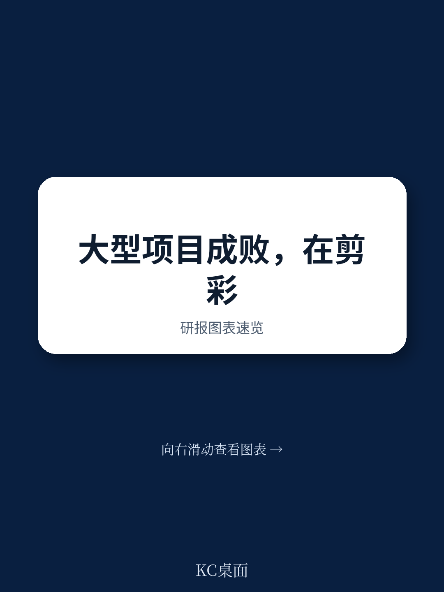

# 波士顿咨询：0004BCGLongBeforetheR

全球资本项目正以前所未有的规模推进。2026年，交通、能源、工业和住宅领域的资本研究预计将超过7万亿美元。波士顿咨询（BCG）最新的全球CAPEX调查显示，94%的大型项目业主计划维持或增加研究。然而，同一调查中，54%的受访者报告称，项目最终研究决策后的交付挑战在过去一年中加剧了。

规模扩大的同时，期望也在收紧。资产被要求从第一天起就产生回报，收入必须快速攀升。对政治、财务或声誉不确定性的容忍度已降至最低。但现实是，只有约十二分之一的大型项目能按时按预算交付，成本超支平均超过初始预算的60%，工期延误常达一到两年。

这些数字背后，波士顿咨询这份报告提出了一个关键判断：大型项目的运营不确定性并非在开业当天形成，而是在更早的阶段——战略定义、设计取舍和治理选择中——就已经被锁定。

## 1. 运营不确定性在剪彩前数年就已嵌入系统

报告的核心论点是，运营不确定性的形成路径是线性的。在战略定义阶段，关于需求、运营模式和绩效目标的早期假设被设定。进入设计和施工阶段后，这些假设被转化为固定的布局、容量和系统接口，灵活性急剧收窄。等到测试和交付阶段，预算和工期不确定性进一步压缩了准备活动。

一旦项目进入实际运营，累积的不确定性会迅速且大规模地显现。运营团队从执行转为应急，手动干预取代自动化，程序性变通替代系统可靠性。此时，纠正成本高昂，且高度暴露于监管、利益相关方和公众面前。

> **KC评论：** 这份报告的价值在于将“运营失败”归因于上游决策，而非下游执行。它提醒项目决策者，真正需要管理的不是开业前的冲刺，而是从概念阶段就开始的、对运营可行性的持续验证。

## 2. 卡塔尔世界杯：十年设计，而非一日之功

2022年卡塔尔世界杯是报告中最具说服力的正面案例。与以往依赖现有基础设施的世界杯不同，卡塔尔在赢得2010年主办权时，65%的国家基础设施尚不存在。

战略层面，世界杯被嵌入卡塔尔国家愿景2030。2012年成立的“最高委员会”作为一体化交付机构，在开赛前十年就开始协调基础设施、城市规划、交通和安全。设计层面，2015年已建成一个模拟高达350万人流量和每日80万人次移动的赛事需求模型。该模型模拟了完整的比赛日需求，包括航班、住宿、地铁、高速公路、球迷区和体育场。当阈值被突破时，容量和路线在数年前就被调整，而非赛后。

测试层面，每个新落成的体育场都举办了现场活动作为运营试验。2017年埃米尔杯决赛测试了入口闸机拥堵和赛后地铁高峰；2019年国际足联俱乐部世界杯测试了交通协调和认证的缺口；2021年阿拉伯杯则在全八个体育场模拟了紧凑赛程，暴露了离场高峰拥堵和球迷区溢出模式。这些测试驱动了修正：闸机序列被重新设计，地铁容量被扩展，疏散协议被收紧。

结果是，卡塔尔世界杯在开幕时已全面就绪。其宏观环境回报也反映了这种准备度：该届世界杯创造了75.68亿美元的收入，为历史最高，超过了巴西的48.26亿和俄罗斯的64.21亿。

## 3. 迪拜世博会：用运营架构吸收外部冲击

2020年迪拜世博会展示了另一种能力：当外部冲击（新冠疫情）彻底改变运营假设时，一个预先建立的运营架构如何吸收冲击。

早在2015年，组委会就制定了一份详细的端到端“运营概念”（ConOps）。这份文件定义了世博会在第一天、第100天和第180天如何运作。每条服务线（安保、场馆管理、餐饮、零售、交通等）都明确了所有权、服务水平、升级路径和成本参数。运营责任被集中在一个由首席运营官领导的治理模型下。ConOps成为所有范围决策、容量阈值和权衡取舍的参照标准。

当疫情来袭，国际到达量骤降，健康筛查成为强制要求，密度阈值被降低，劳动力可用性波动。但由于ConOps已经定义了从服务水平到升级路径的一切，系统不需要重新设计，只需重新校准。健康检查被插入现有入场流程，人群限制在既定阈值内调整，人员模型在预定义角色结构内重新调整。

最终，尽管全球旅行中断和容量限制波动，迪拜世博会仍接待了超过2400万次访问。报告认为，运营韧性必须被提前设计。当破坏性事件重塑需求和约束时，一个定义明确的运营架构能够弯曲而不会失控。

## 4. 伊斯坦布尔机场与枫丹白露酒店：不确定性在交付时暴露

两个反面案例进一步佐证了报告的核心论点。

伊斯坦布尔机场是一个117亿美元的大型项目，在施工、调试和系统集成仍在进行时就开始运营。2018年10月，第一阶段运营启动，但部分航站楼仍未完工，机场最初每天仅处理20-30个航班。结果可预见：乘客满意度骤降，行李处理、路线指引和设施准备均出现问题。2019年4月所有航班转移后，运营不确定性立即显现：航班抵达时行李未到，布局低效，基本服务滞后。谨慎媒体报道加剧了局面。

拉斯维加斯枫丹白露酒店则展示了多次战略重置的代价。该项目历经近二十年中断和三次所有权变更，最终在2023年12月以37亿美元开业。由于时间线被压缩，设计、施工和运营准备工作并行推进。开业前，团队仅有不到两个月时间完成超过6500名员工的入职和培训。开业后，酒店和博彩业务均未达目标，数月内便出现员工和主管离职，包括裁减数十名赌桌荷官。

两个案例的共同点是：运营不确定性在早期阶段累积，最终在公众视野中暴露。伊斯坦布尔机场的问题源于压缩的开发周期和未完成的运营演练；枫丹白露的问题源于多次战略重置后，新运营模型被强加于遗留基础设施之上。

---

这份报告的核心启示是：大型项目的运营可行性不能作为隐含结果，而应作为明确要求。从战略定义到施工完成的每个阶段，都需要对运营假设进行不确定性测试，在不确定性变得昂贵且难以逆转之前将其暴露。那些在剪彩时表现良好的项目，并非因为交付团队更优秀，而是因为运营思维被嵌入了最早的决策中。
