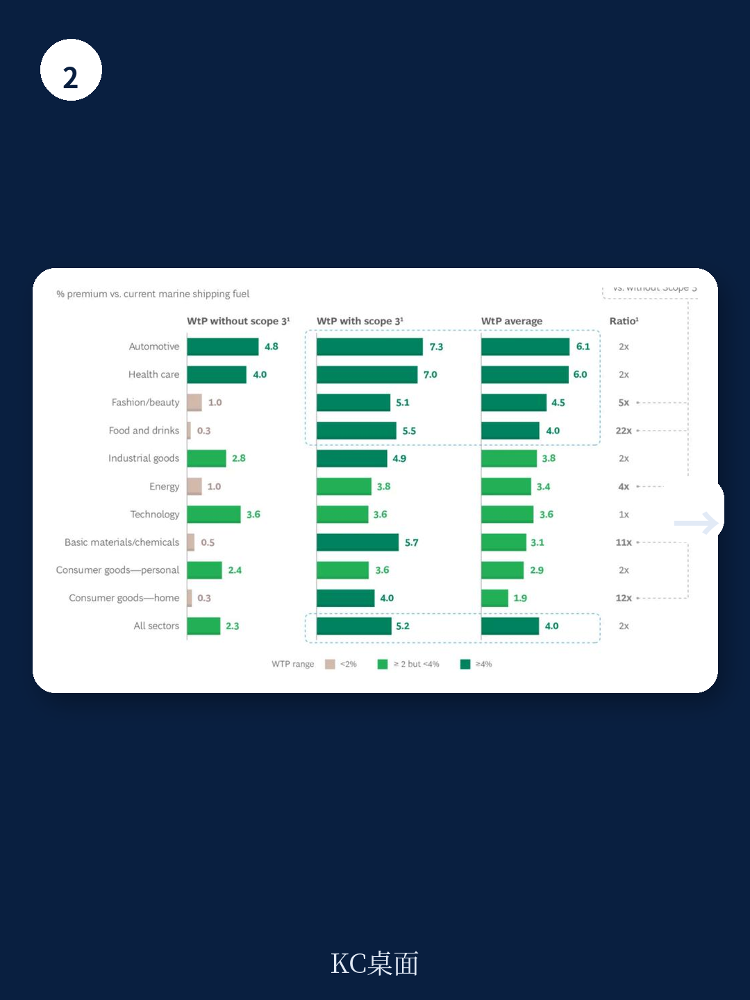

# 波士顿咨询：0005BCGTheRealCostofD

全球航运业每年排放约3%的全球二氧化碳。如果它是一个国家，排放量能排进前十。但波士顿咨询连续三年的调查发现，一个关键变量正在松动：货主愿意为绿色航运支付的溢价，正在以每年超过30%的速度上升。2023年，平均意愿支付溢价已达4%，是2021年的两倍。然而，这家咨询公司同时警告，这个数字离真正实现脱碳所需的10%到15%还有明显距离。问题不在于意愿，而在于意愿与行动之间的预算缺口。

## 1. 80%的客户说愿意，但只有不到一半准备好了预算

波士顿咨询在2023年对125位货主决策者的调查显示，超过80%的受访者表示愿意为绿色航运支付溢价。这个比例在过去两年保持稳定。但更深层的数字揭示了矛盾：超过60%的企业承诺要减少Scope 3排放，即供应链中由承运人间接产生的排放，但其中只有不到一半的企业为这个目标配备了足够的预算。报告认为，这种“承诺与资源之间的缺口”是当前航运脱碳面临的核心障碍之一。

> **KC评论：** 这里的关键不是客户不愿意，而是企业的脱碳预算往往被锁定在其他环节。航运公司如果只等客户主动出钱，可能会错过窗口期。波士顿咨询的数据暗示，真正有预算的客户群体其实非常集中。

## 2. 愿意多付10%以上的客户，集中在三个细分市场

波士顿咨询的调研进一步拆解了哪些客户群体最有可能成为早期付费者。数据显示，欧洲客户的平均意愿支付溢价为5.1%，远高于南美洲的1%。行业层面，汽车和医疗保健行业的溢价意愿最高，分别达到6.1%和6.0%。但最有价值的组合出现在“欧洲食品饮料行业且有Scope 3承诺的客户”这个群体，他们的平均意愿支付溢价高达11.3%，已经接近波士顿咨询认为的脱碳所需门槛。

报告还发现，那些将监管视为机遇而非威胁的客户，其溢价意愿比持谨慎看法的客户高出近一倍。这提示航运公司，与其等待所有客户都准备好，不如先锁定这些“监管乐观派”。

## 3. 只有35%的客户被提供过绿色选项，先动者有机会

波士顿咨询的调查揭示了一个反常现象：尽管大量客户表达了付费意愿，但只有约35%的受访者表示曾被提供过绿色航运选项。即使在有Scope 3承诺的客户中，这个比例也只上升到约40%。报告认为，这背后可能有两个原因：一是已经提供绿色服务的航运公司没有做好市场细分和推广策略；二是尚未提供绿色服务的公司根本不知道需求存在。

这种供需错配意味着，率先建立清晰的市场进入策略、主动向高意愿客户群体推广绿色产品的承运人，有机会在竞争对手反应过来之前锁定一批愿意付费的客户。波士顿咨询建议，航运公司不应等待监管完全明朗或客户主动上门，而应主动识别并服务那些“已经准备好研究”的细分市场。

## 4. 买家俱乐部和联合采购，可能是降低不确定性的杠杆

报告引用了波士顿咨询与WEF的联合研究，指出超过95%的替代燃料生产项目仍处于最终研究决策前的阶段。这意味着绿色燃料的供应规模尚未形成。对此，约70%的货主表示愿意加入“绿色燃料买家俱乐部”，其中31%明确愿意，41%表示会考虑，尤其是当竞争对手也参与时。这种联合采购模式可以帮助小型货主克服合同限制，通过长期承购协议锁定供应，同时降低燃料生产商的研究不确定性。报告提到的零排放海事买家联盟，正是这种思路的实践案例。

> **KC评论：** 买家俱乐部的逻辑是“用需求倒逼供给”。对于航运公司来说，与其独自承担绿色燃料的溢价成本，不如联合一批有承诺的客户共同分担。波士顿咨询的数据显示，这种模式对中小型货主尤其有吸引力，因为他们通常缺乏单独谈判长期合同的能力。

波士顿咨询的这份报告没有给出航运脱碳的终局答案，但它提供了一个务实的起点：与其等待所有条件成熟，不如先找到那些愿意付费、有预算、且把监管视为机遇的客户，从他们开始构建绿色航运的商业闭环。对于承运人而言，这既是环境责任，也是竞争策略。

For informational purposes only. Portions may be generated,translated,summarized,or edited with AI assistance based on source materials and may contain omissions or errors. Please verify independently. This is not investment,legal,tax,accounting,or other professional advice.

